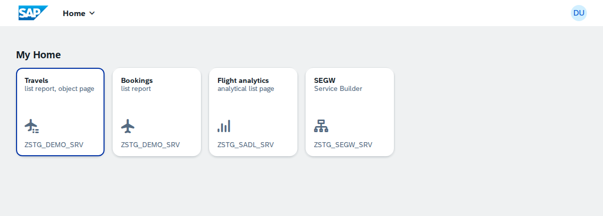
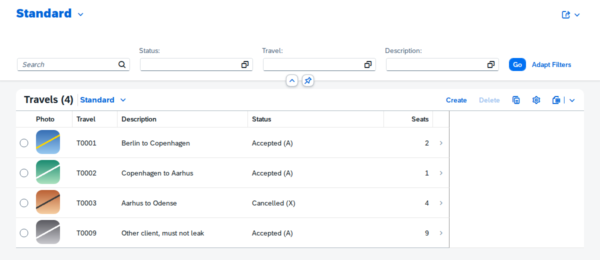

# open-steamgate

**Run real SAP `_MPC_EXT` / `_DPC_EXT` OData classes offline — no system attached.**

`open-steamgate` is a research project and integration harness for a **local
IWBEP / OData runtime**: cross-compile the actual ABAP Gateway model- and
data-provider classes, run their Open SQL against a local SQLite database seeded
once through a blessed export, and serve the result as a real OData v2 service
that a Fiori Elements / UI5 front end consumes — all without a live SAP system.
Deploy back through abapGit when you want to.

The name: `vsp` (vibing-steampunk) → `steamgate`. **Gate** = the SAP Gateway,
the `/IWBEP/` framework this project reimplements the runtime of.

> **Status: CRUD, `$batch`, navigation, `$expand`, deep insert, function
> imports, value helps (F4 by `Common.ValueList`, `search` → `iv_search_string`,
> text arrangement), an object page (bookings via navigation, Edit/Save as
> MERGE with Gateway semantics, Create below the parent as
> `POST TravelSet('..')/to_Bookings`), media entities (a picture served as a
> stream at `<entity>/$value`, shown by Fiori Elements), a launchpad sandbox
> with four apps and intent-based navigation between them, SEGW itself as one
> of those apps, a service described by one YAML
> file that consumes another service of the registry (SEGW's "external
> service", `src/demo_odc/`), and read-only SADL over CDS projections (with analytics
> annotations) work end to end, on SQLite or DuckDB (`STG_DB=duckdb`).** `npm test`
> serves a SEGW-shaped demo DPC, transpiled and running Open SQL over SQLite,
> as OData v2: `$metadata`, entity sets, keys, `$filter` delivered as
> SELECT-OPTIONS, `$top/$skip/$orderby/$inlinecount/$count`, POST/PUT/DELETE
> through the DPC's create/update/delete, `$batch` with changesets,
> navigation properties and `$expand`. A Fiori
> Elements list report in `webapp/` lists, filters and deletes through it
> (`npm run e2e`). **Try it without installing anything:**
> [oisee.github.io/open-steamgate/main/app/](https://oisee.github.io/open-steamgate/main/app/)
> runs the whole gateway in your browser (a service worker over sql.js, see
> [`docs/preview-deployments.md`](docs/preview-deployments.md)); every pull
> request gets its own copy.
> See `AGENDA.md`. This repo also holds the
> research that scopes the work — a verified prior-art matrix, a gap-list of the
> genuinely-novel pieces, and a phased build order. See
> [`docs/prior-art.md`](docs/prior-art.md). The layers we have already
> reverse-engineered in sibling projects (SAP compression, EXPORT data
> clusters, the ADT transport) are indexed in
> [`docs/layers-we-own.md`](docs/layers-we-own.md).

---

## What it looks like

Every pixel below is served by transpiled ABAP over SQLite. The apps are
SAPUI5 1.120 from SAP's CDN, unchanged, and the pictures come out of a media
entity through the DPC's `GET_STREAM`.

**The launchpad** (`app/flp.html`): four Fiori apps over three services,
`sap.ushell` resolving the intents between them.



**The Travels list report**: `$filter` from the filter bar arrives in the DPC
as SELECT-OPTIONS, the value help reads a search help, the Photo column is the
media resource of each travel (`PhotoSet('T0001')/$value`).



**The object page**: the header image comes from the same media entity, the
bookings below through the navigation property, Edit and Save send a MERGE
with the changed field only.


**SEGW as an application** (`app/segw/`): the Service Builder's project tree
over `ZSTG_SEGW_SRV`, every node a row of a `/IWBEP/I_SB*` table edited in
place, Import and Export of the abapGit IWPR, Generate through the ABAP
generator ([`docs/segw-editor.md`](docs/segw-editor.md)).


**Analytics** (`app/analytics/`): an Analytical List Page over a CDS cube,
`$select` turned into `GROUP BY` by the SADL runtime, on SQLite or DuckDB.


The pictures are taken from the running thing:
`node scripts/capture-docs-shots.mjs` while `npm start` is up.

---

## Run it

Node 22 or 24.

```sh
git clone https://github.com/oisee/open-steamgate && cd open-steamgate
npm ci
npm start                    # transpile + serve: http://localhost:3030/app/index.html
                             # the launchpad with both apps: http://localhost:3030/app/flp.html
npm test                     # abaplint + ABAP Unit + mocha over the wire
npm run e2e:install && npm run e2e         # Playwright against localhost:3030
npm run web:preview && npm run web:serve   # the browser-only build on :3031
npm run start:duckdb         # the same on DuckDB (STG_DB_PATH=x.duckdb persists)
npm run stg:compile -- src/demo/zstg_demo.stg.yaml --out gen/demo   # SEGW without the GUI
```

The first transpile clones `open-abap-core`, `express-icf-shim` and our fork of
`open-abap-odata` from GitHub unless `.local/` already holds them.

## What the demo is made of

Bottom up, every layer is real, nothing is mocked:

1. **DDIC and data** — `src/ddic/*.tabl.xml` (abapGit format), seed rows in
   `data/*.tabu.json` (`abapGit serialize` format for table contents),
   pictures included: `ZSTG_PHOTO` holds a PNG per travel in a `RSTR` column.
2. **SEGW registration objects** — `zstg_demo_srv ... 0001.iwsv.xml` (service
   → DPC class) and `zstg_demo_mdl ... 0001.iwmo.xml` (model → MPC class), as
   abapGit serializes them. `tools/segw-registry.mjs` reads them and generates
   the registry, so a cloned SEGW repository registers its own services
   (`npm run segw -- path/to/repo --list` shows what it would find).
3. **SEGW-shaped classes** — `src/demo/zcl_zstg_demo_mpc` defines the model
   through `/iwbep/if_mgw_odata_model` (entity types, sets, associations,
   function imports, a value-help set); `zcl_zstg_demo_dpc_ext` is the data
   provider: `it_filter_select_options` → Open SQL with ranges, paging, CRUD,
   deep insert, `get_expanded_entityset`, `iv_search_string`. This is the code
   that lives in a customer system.
4. **The `/IWBEP/` interfaces** — from `open-abap/open-abap-odata`, where the
   model, `$metadata`, annotations, RFC and search-help signatures, vocabulary
   annotations and media entities we needed went back upstream as small PRs
   (#40–#48, #56–#63).
5. **The Gateway** (`src/gateway/`) — URL parser, `$filter` → SELECT-OPTIONS,
   request context with every `io_tech_request_context` facet, dispatcher,
   OData v2 JSON, `$batch`, `$expand`, entry provider. The part that existed
   nowhere in open source.
6. **Runtime** — the abaplint transpiler turns all of it into JavaScript;
   Open SQL runs on SQLite (Node), sql.js (browser) or DuckDB.
7. **Front** — two Fiori Elements V2 apps with no JavaScript of their own:
   Travels (`webapp/manifest.json`; its annotations come from the model,
   `src/demo/zstg_demo.stg.yaml`: list report, object page, the booking's
   page below it) and Bookings (`webapp/booking/`). `UI.LineItem`, `UI.SelectionFields`,
   `Common.ValueList`, `Common.Text`, `UI.DataFieldForIntentBasedNavigation`
   and `UI.DataFieldWithIntentBasedNavigation` link them by intent;
   `webapp/flp.html` is the launchpad sandbox (`sap.ushell` from the same
   CDN) that resolves `Travel-manage` and `Booking-display`. The fourth tile
   is SEGW itself: `webapp/segw/`, the Service Builder's project tree over
   `ZSTG_SEGW_SRV`, every node edited in place, Import / Export of the
   abapGit IWPR, Generate through segw-gen (`docs/segw-editor.md`); the
   fourth is the Analytical List Page over the cube. `UI.IsImageURL` on a
   property whose value is a media resource's URL is what puts the pictures
   in the list and in the object page header
   ([`docs/media-entities.md`](docs/media-entities.md)). SAPUI5 1.120 from
   SAP's CDN: Fiori Elements, the smart controls and the launchpad are not
   part of OpenUI5, and the point is that real Fiori apps run unchanged.
   SAPUI5 is SAP's, not part of this project.
8. **Preview** — layers 1–6 in a service worker, layer 7 as static files, on
   GitHub Pages ([`docs/preview-deployments.md`](docs/preview-deployments.md)).

The row **T0009 "Other client, must not leak"** is on purpose: it is seeded
in client 001, a real system (client 123) would not show it. The transpiler
has no implicit MANDT yet (`ANORMALIES.md`), so it leaks through; the demo
keeps it visible as a live reminder, and a unit test pins the behaviour.

## Why

The classic way to test an ABAP OData service is to have SAP. That gates every
edit on a system round-trip, a transport, an activation. But the *substrate*
needed to run these classes off-platform already exists as mature MIT/Apache
open source — an ABAP→JS transpiler with an Open-SQL-over-SQLite runtime, a
DDIC→schema generator, a blessed table-data exporter, and a complete OData
v2/v4 serializer. **What is missing is the one piece that connects them: the
`/IWBEP/` Gateway runtime that turns an OData request into a call on a
transpiled DPC method.** That gap — and only that gap — is what this project
builds.

It is a clean-room reimplementation of the `/IWBEP/` *interfaces*: no SAP source
is bundled, no standard DDIC is shipped, and the agent building it touches no
SAP API. abapGit is the blessed last mile for code and for the one-time seed
data capture.

---

## The finding, in one line

> The **substrate** (transpile ABAP → run Open SQL over SQLite → serve UI5)
> exists, is MIT/Apache, and is reusable. The **Gateway** — everything at and
> above the `/IWBEP/` line — does not exist as working code anywhere, and is the
> novelty this project builds. The two mature halves have **no code connecting
> an OData request to a transpiled DPC method.**

That was the finding on 2026-09-11, before any code. It held: the connecting
piece is now `src/gateway/` + `src/http/`, ~4600 lines of ABAP, and everything
below it is reuse. What follows is the plan as written, with what each part
turned into.

## Prior-art matrix

Best single source per component. Full evidence, licenses and runner-ups in
[`docs/prior-art.md`](docs/prior-art.md).

| Component | Best source | Coverage | Verdict |
|---|---|---|---|
| **Open SQL → SQLite** execution | abaplint transpiler + `@abaplint/database-sqlite` | full | **REUSE AS-IS** |
| **DDIC → local schema** | transpiler `sqlite_database_schema.ts` | partial→full | **REUSE AS-IS** |
| **Table-data export** (blessed) | abapGit `src/data/` (TABU) + open-abap `load-table-contents` | full | **REUSE AS-IS** |
| **OData v2/v4 serializer** ($metadata, $batch) | `@sap-ux/fe-mockserver-core` | full | ~~REUSE / FORK~~ → **not used**, written in ABAP (`zcl_stg_json`, `zcl_stg_batch`) |
| **UI5 / Fiori Elements local serving** | `@sap-ux/ui5-middleware-fe-mockserver` | full | ~~REUSE AS-IS~~ → **not needed**: express serves `webapp/`, SAPUI5 comes from SAP's CDN |
| **MPC model-API** (`IF_MGW_ODATA_MODEL`) | `open-abap/open-abap-odata` | skeleton | **REUSED as the interface layer**, the gaps filled by PRs upstream (#40–#48, #56–#63) |
| **DPC dispatch** (`IF_MGW_APPL_SRV_RUNTIME`) | `open-abap/open-abap-odata` (`ZCL_OAO_HTTP_HANDLER`) | skeleton | **BUILT here** (`src/gateway/zcl_stg_dispatcher`) |
| **`$filter` → SELECT-OPTIONS** (`io_tech_request_context`) | fe-mockserver parser (parse only) | none for the bridge | **BUILT here** (`zcl_stg_filter`, day one) |
| **CDS / SADL / RAP → OData** | *(none viable for ABAP)* | none | **BUILT read-only** (`src/sadl/`, CDS projections + an analytics cube); BOPF/RAP still out |
| **Headless deploy-back** | abapGit deserialize | partial | **PIN + wrap** (stays SAP-side); the SEGW editor exports a ready abapGit repository |

## The gaps we built

The four gaps as stated on day one, and what each one is now. All of it is
ABAP: the gateway runs transpiled next to the DPC it serves, so the same
classes would run in a system's ICF.

1. **The `/IWBEP/` Gateway runtime.** `open-abap-odata` was a *validated
   skeleton, not a product*: the plug-in contract for one flat string-keyed
   entity, then `ASSERT 1='todo'` for associations, actions, nav-props and most
   EDM setters; `ZCL_OAO_HTTP_HANDLER` wired only `GET_ENTITYSET`, hardcoded to
   one entity set. **Built:** `zcl_stg_model_info` (the EDM registry, read out
   of a running MPC), `zcl_stg_dispatcher` (verb + path → GET_ENTITYSET /
   GET_ENTITY / CREATE / UPDATE / DELETE / deep insert / action / `$expand` /
   `$value`), `zcl_stg_url`, `zcl_stg_json`, `zcl_stg_batch`,
   `zcl_stg_entry_provider`. The model API's own gaps went back upstream as
   PRs instead of being forked around.
2. **`io_tech_request_context`: the `$filter` → SELECT-OPTIONS bridge** — the
   stated hard part and the single highest-risk piece. **Built on day one**
   (`zcl_stg_filter` + `zcl_stg_request_context`): `$filter` becomes
   `/iwbep/t_mgw_select_option` rows with SIGN/OPTION/LOW/HIGH, `startswith` /
   `substringof` become `CP` patterns, `ge`+`le` on one property collapse into
   `BT`, and what cannot be expressed as a range is reported instead of being
   silently dropped. The context implements every facet a DPC reads
   (`get_filter`, `get_filter_select_options`, paging, `$orderby`, keys,
   navigation path, source entity set).
3. **The seam.** Not a fe-mockserver plugin: the dispatcher *is* the seam and
   it calls the transpiled DPC directly. In front of it sits one ABAP
   `if_http_extension` (`src/http/zcl_stg_http_handler`) behind
   `cl_express_icf_shim` on Node, or the same class behind a service worker in
   the browser preview.
4. **Request-body deserializer** for CREATE/UPDATE: `zcl_stg_json` both ways,
   including deep insert, `__deferred` links, PATCH/MERGE semantics (only the
   fields that came in) and the binary body of a media resource.

## The sharpest risks, and how they turned out

- **"Dependency-closure of a real `_DPC_EXT` may be the true long pole, not
  `$filter`."** Measured first, before any architecture
  ([`docs/2026-09-11-closure-probe.md`](docs/2026-09-11-closure-probe.md)):
  eight public SEGW repositories through `npm run probe`. **The closure is
  DDIC, not code** — data elements, domains, tables and table types, with only
  a handful of standard classes on the DPC path (`CL_OO_OBJECT`,
  `CL_O2_API_PAGES`). abapGit serializes exactly those, and the transpiler
  consumes exactly that, so the answer is a capture script, not weeks of
  shims. The BAPI fan-out the critic expected appeared in one repo, and even
  there it was mostly types. **Still true:** a customer DPC with forty BAPI
  calls is not in the public sample.
- **"Many modern SEGW services are SADL-mapped."** Confirmed by the same probe
  (three of eight). v1 stayed classic code-based SEGW, and then a read-only
  SADL runtime was built anyway (`src/sadl/`: CDS projections, an analytics
  cube, `$select` → `GROUP BY`), because two corpus services needed it. BOPF
  and RAP remain out.
- **"Fixed client 123 / SysID ABC / no implicit MANDT."** Still open, still
  first-order, logged in [`ANORMALIES.md`](ANORMALIES.md). The demo keeps a row
  seeded in client 001 (`T0009`, "Other client, must not leak") visible on
  purpose, with a test pinning the behaviour, so the day the transpiler learns
  implicit MANDT the test flips instead of the bug hiding.
- **"`open-abap-odata` is effectively unlicensed."** Unchanged: `LICENSE` still
  reads `todo`, the `license` field is still empty. So the runtime here is a
  clean-room reimplementation under MIT and the upstream repository is used as
  the *interface* layer only, with every fix contributed back as a small PR
  (#40–#48, #56–#63) rather than forked. The question is with the maintainer.
- **"The accessor surface is not one method."** Right: the corpus DPCs read
  `it_filter_select_options` from the signature *and* call
  `io_tech_request_context->get_filter( )`; both are served.

## The build order, weeks-scale on paper

- **Phase 0 — substrate stand-up** (mostly reuse): transpile a real
  `MPC_EXT`/`DPC_EXT`, DDIC → SQLite schema, seed via abapGit TABU. **Done
  2026-09-11**, the same day the plan was written.
- **Phase 1 — Gateway model + dispatch.** **Done 2026-09-11**: model registry
  and a generic dispatcher, then grown through writes, `$batch`, navigation,
  `$expand`, deep insert, function imports and media entities.
- **Phase 2 — the crux, request-context.** **Done 2026-09-11**, one commit
  (`$filter -> SELECT-OPTIONS bridge (zcl_stg_filter)`). The "critical path"
  was half a day. The differential-test oracle was not needed: the DPC's own
  ranges, a corpus of real services and the Fiori client together pinned the
  behaviour.
- **Phase 3 — wire layer.** **Deviated on purpose.** fe-mockserver was never
  mounted: it is built around mock data files, and everything it would have
  provided (router, `$metadata`, `$batch`, deserialization) had to exist in
  ABAP anyway for the code to run on a system. The project has no runtime
  dependency on it; the whole request path is ABAP behind
  `cl_express_icf_shim`.
- **Phase 4 — Fiori serving.** **Done 2026-09-11** with the plain SAPUI5 CDN
  bootstrap instead of the middleware: four Fiori apps, a launchpad sandbox,
  and the same files deployable as a BSP (see AGENDA, "The Fiori apps").
- **Deferred:** CDS/SADL/RAP — the read-only half arrived on 2026-09-12; BOPF,
  RAP and drafts are still out. Push-back to SAP stays with the siblings.

**What the long pole actually was:** not the Gateway and not `$filter`, but
SEGW itself — reading and writing the project tree the way the transaction
does (`tools/segw-gen.mjs`, `tools/stg-compile.mjs`, `tools/segw-tree.mjs`,
byte-identical against 21 real projects), and then running it as an app
(`webapp/segw/`). That work is most of the commits since, and it is what turns
"the runtime works" into "a service can be built, generated and taken to a
system without opening SAP GUI".

**Where it stands:** 125 ABAP Unit tests, 80+ wire tests, 13 browser tests,
`abaplint` clean, a browser-only deployment of the whole thing on GitHub Pages.

---

## Family

open-steamgate is the OData/Gateway member of a family of SAP-protocol projects.
Public siblings:

- **[vsp / vibing-steampunk](https://github.com/oisee/vibing-steampunk)** — the
  Go-native MCP server + CLI for ABAP Development Tools (ADT). Owns the ADT
  transport, `pkg/sapcompress` (SAP-LZH / LZC **decode**), `pkg/datacluster`
  (EXPORT cluster parser) and the `ZADT_VSP` bridge. abapGit deploy-back — the
  last mile into a real system — is already its territory.
- **[open-rfc-go](https://github.com/oisee/open-rfc-go)** — pure-Go NI / RFC /
  CPIC transport, sniffer/proxy, RFC client and type-3 server.

Two further siblings (a DIAG-protocol project carrying the SAP-LZH **writer**,
and a shared SAP knowledge base) are private; the reusable protocol facts they
hold are summarized here in [`docs/layers-we-own.md`](docs/layers-we-own.md).

## Prior art we build on

MIT unless noted. Full source list with evidence in
[`docs/prior-art.md`](docs/prior-art.md).

- [abaplint/transpiler](https://github.com/abaplint/transpiler) — ABAP→JS
  transpiler + Open-SQL-over-SQLite runtime (Lars Hvam et al.)
- [open-abap/open-abap-odata](https://github.com/open-abap/open-abap-odata) —
  the `/IWBEP/` interface layer (⚠️ license still unclear; used as interfaces,
  reimplemented runtime, fixes contributed back)
- [abapGit](https://github.com/abapGit/abapGit) — Data Config (TABU) blessed
  data export; deserialize as the deploy-back path
- [SAP/open-ux-odata](https://github.com/SAP/open-ux-odata) — fe-mockserver
  OData v2/v4 serializer + FE serving (Apache-2.0). Studied as prior art and
  as the conformance reference; not a dependency, see the build order above.

## License

MIT — see [`LICENSE`](LICENSE). This project is a clean-room reimplementation of
the `/IWBEP/` *interfaces*; it bundles no SAP source and no standard DDIC.
