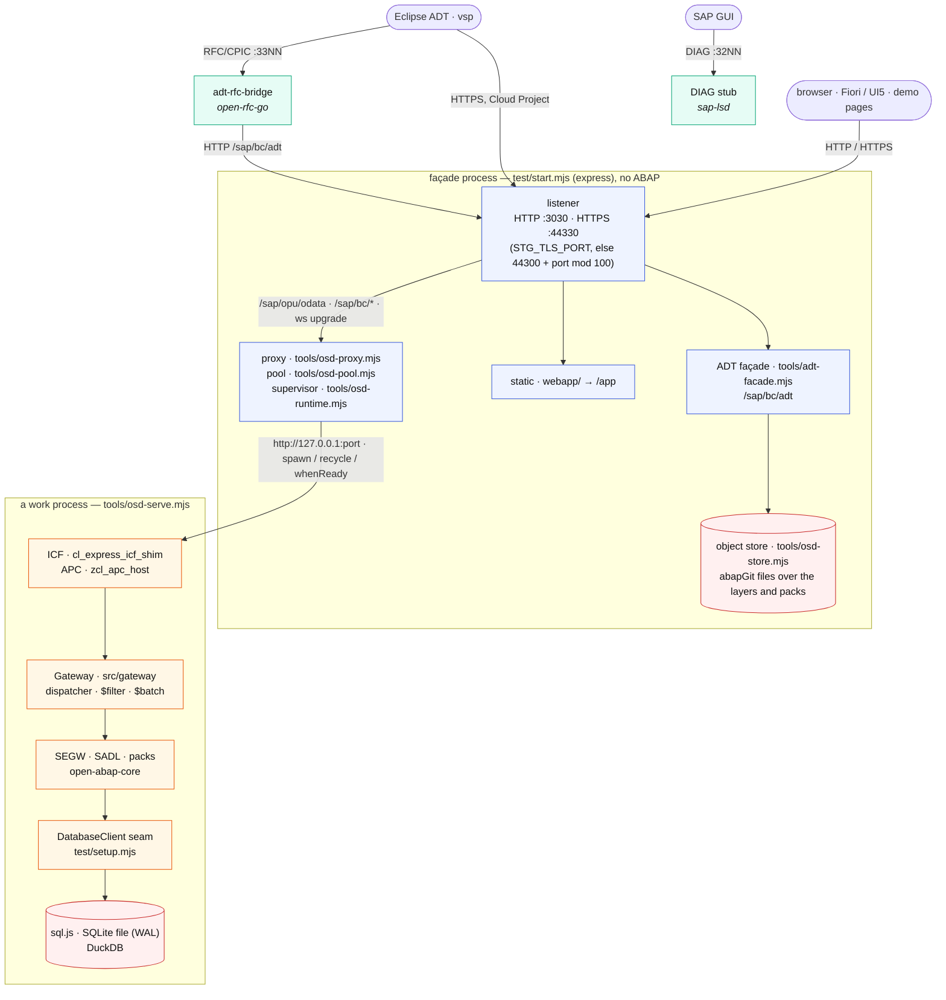
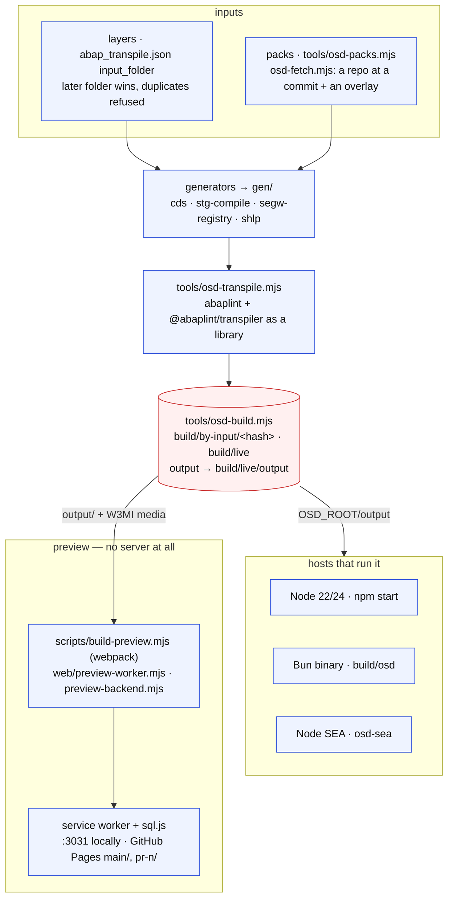
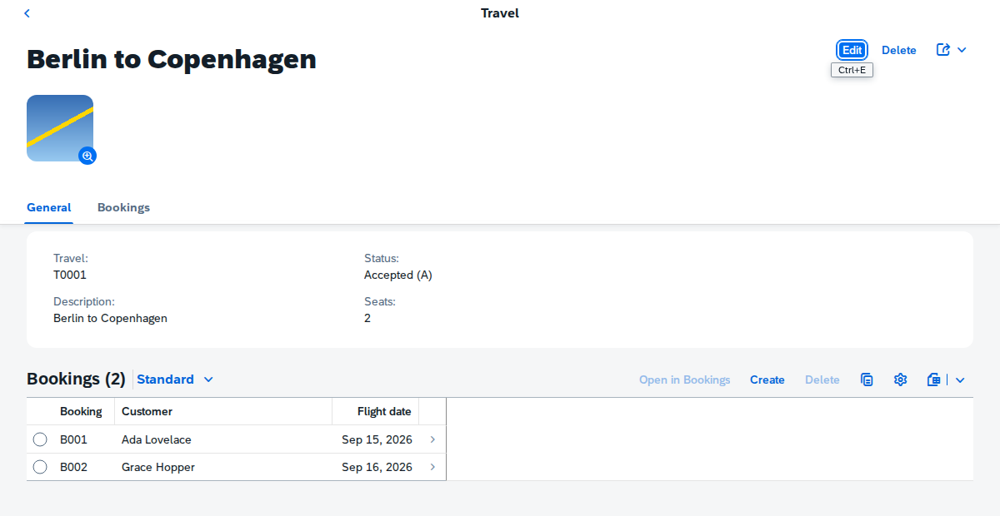
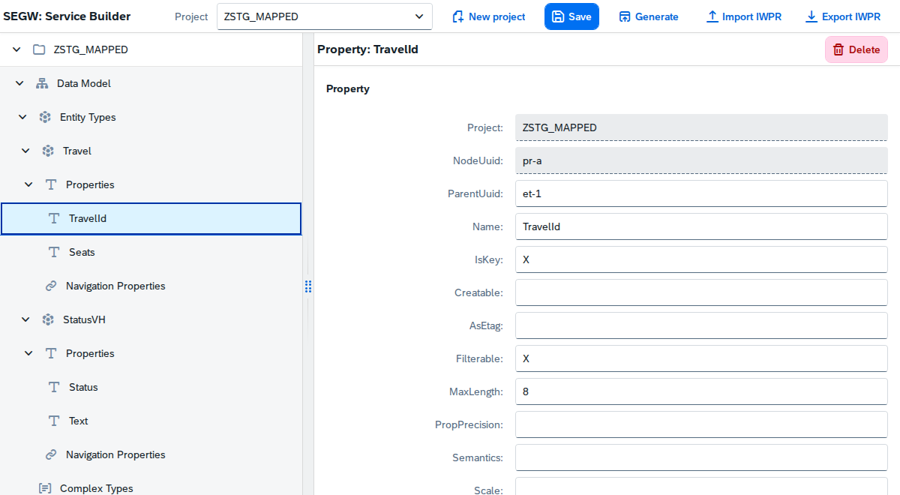
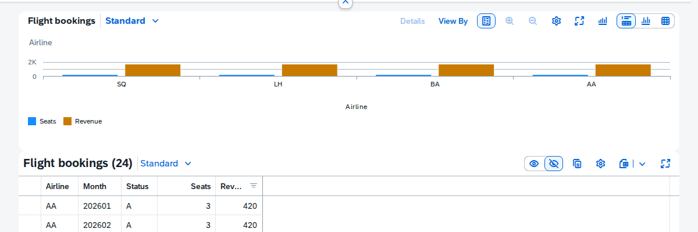

> ## 🧪 [Portable AMDP: live HANA oracle, DuckDB execution, and clean-room corpus](docs/amdp-portable-milestone-report.md)
>
> The `feat/amdp-portable-ir` branch now runs the original `SQUARES` and the
> clean-room `mix_rows` and `rank_rows` SQLScript through typed host control
> flow and ordinary relational SQL on both HANA and DuckDB. The portable
> branches of `transform` now run through host-side `IF / ELSEIF / ELSE` as
> well, and the two clean-room scalar functions execute without a database
> round trip. Typed `EXCEPT` now runs on HANA and DuckDB too. Explicit session
> identity and context make `CURRENT_USER`, `CURRENT_SCHEMA` and the final
> `transform` branch portable without borrowing the selected database's
> identity. Read the milestone report for the
> architecture, safety boundaries, ten-method synthetic corpus and next
> coverage steps.
>
> Run `npm run amdp:demo` for the live DuckDB ledger and a self-contained
> master-detail report at `.local/amdp-demo/index.html`; add `-- --serve 3037`
> to view that generated report from another machine on the local network.

> ## ▶ [Run a whole ABAP application server in a browser tab](https://oisee.github.io/open-steamgate/main/app/flp.html)
>
> **oisee.github.io/open-steamgate/main/app/flp.html** — nothing to install,
> no server to reach, no system to log on to. The transpiled ABAP, the OData
> runtime and the database are all in a service worker on your own machine,
> and every app on the launchpad is answered there.

## Try it yourself

[**Spin up your own OSD — locally, with Docker, or by pasting a Portainer Stack**](docs/spin.md).
SQLite, DuckDB, HANA Express and PostgreSQL options, HTTP/HTTPS, and built-in
RFC/DIAG stubs. The ARM64 SQLite image has also run on a 2 GB Raspberry Pi 4;
the [Pi quick start and upgrade notes](docs/spin.md#raspberry-pi-arm64) use the
separately tested `arm64-draft` tag.

# open-steamgate

**An ABAP application server you can clone.**

The layer under an ERP, not the ERP. What is here is that layer's list, and
it can be read off line by line: the language runtime, the dictionary, Open
SQL, the ICF service tree, the OData gateway, CDS, AMDP, the transactional
bracket, screens, abapGit as the transport, ADT from outside. What is not
here belongs in the same breath, because the line above is read as a claim
of compatibility and should be: no business application of any kind — no
finance, no logistics, not one application table beyond the demo flights —
and what runs is a subset in every direction, a subset of the language, a
subset of the dictionary, the `_DPC_EXT` classes of classic code-based SEGW
rather than everything that ships. That is not an apology for what is
missing. It is where the edges are.

`open-steamgate` (OSD) cross-compiles real ABAP — the actual `_MPC_EXT` /
`_DPC_EXT` Gateway classes, CDS views, AMDP methods — and runs it against a
local database, serving OData that a Fiori Elements front end consumes, that
Eclipse edits over ADT, and that SAP GUI knocks on. No system attached. That
much is a runtime, and *an offline IWBEP / OData runtime* is how this
repository described itself for its first weeks.

The sentence at the top turned out to be the more useful one, and the
difference is not a slogan. A runtime is a thing you point at your code. A
system you can clone is a thing you can copy, version, branch and throw away —
source, dictionary, seed data and all. Everything here is already a file: the
ABAP is a repository, the tables are abapGit TABU JSON, a build is an
immutable generation addressed by the hash of its inputs, and the database
sits behind a seam of eleven methods with four implementations behind it,
HANA among them. Not one of those decisions was taken in order to make a
system cloneable. Together they do, and the rest of this README is mostly
consequences.

The name: `vsp` (vibing-steampunk) → `steamgate`. **Gate** = the SAP Gateway,
the `/IWBEP/` framework this project reimplements the runtime of.

---

## ▶ Try it without installing anything

### **[oisee.github.io/open-steamgate/main/app/flp.html](https://oisee.github.io/open-steamgate/main/app/flp.html)**

A Fiori launchpad with nine tiles, and **no server behind any of them**. The
whole gateway — the transpiled ABAP, the OData runtime, SQLite as
[sql.js](https://github.com/sql-js/sql.js) — is in a service worker in your
own browser. Every request the apps make is answered there.

| tile | what it is |
| --- | --- |
| Travels, Bookings | Fiori Elements V2, list report and object page, over a SEGW-shaped `_MPC_EXT` / `_DPC_EXT` pair |
| Flight analytics | an analytical list page over a CDS cube, `$select` turned into `GROUP BY` |
| SEGW | the Service Builder itself, as an app, editing the project tree |
| Vivid Vibes | WebGL and audio driven from ABAP over an APC push channel |
| Zork | a Z-machine interpreter in ABAP, the story file loaded out of SMW0 |
| SAP LSD | a demoscene light-show recorded as composed SAP GUI screens, replayed over an APC channel onto a canvas |
| Source, and its QR code | this repository on GitHub (the second tile is the same link as a picture, for a phone pointed at a screen) |

Vivid Vibes, Zork and SAP LSD are not UI5 at all: they are pages an ABAP
class writes, served from the ICF path by the same runtime. That is the point
of them. The first two are not in this repository: [`packs/o4d`](packs/o4d)
and [`packs/zork`](packs/zork) name [vivid-vibes](https://github.com/oisee/vivid-vibes)
and [zork-abap](https://github.com/oisee/zork-abap) at a commit, and the
deployment fetches them the way you would fetch any pack of your own;
[`packs/lsd`](packs/lsd) carries its recording ([`docs/lsd-pack.md`](docs/lsd-pack.md)).
Applications supplied by a pack register their pages, availability and static,
dynamic or image tiles through `osd-pack.json`; see
[Applications and tiles in the launchpad](docs/launchpad-apps.md).

First visit installs the worker and takes a moment; after that it works
offline. It needs a browser that allows service workers — a private window
usually does not.

---

## ▶ A branch of a whole system

In a real SAP system, code branches through transports and **data does not
branch at all**. The database is one and it is shared, so "the same system
with different data" means a second system, installed by somebody, with
somebody's budget. That one fact is why *run the old version and the new one
side by side and compare what they answer* is not a thing an ABAP shop does,
however obviously useful it sounds.

Here the database is a file, the seed is an artifact in the repository, and a
generation is immutable and addressed by the hash of what went into it. So a
branch carries the state as well as the source, and two branches run at the
same time without knowing about each other: check one out, build it (usually
free — the hash is already in the cache), serve it on another port.

**Comparing them is three sieves, each strictly finer than the last.**
Responses first, normalised for order, timestamps and generated ids. Then the
SQL, which is cheap to capture because every statement in the system goes
through one object. Then the steps: each statement with the values it saw. The
most valuable outcome is the middle one — **the responses agree and the SQL
does not**. That is a right answer arrived at by a different route, which is
the kind that survives the test suite and breaks later on data volume or row
order. No ordinary test sees it.

**It also turns the oracle inside out.** Until now, checking ourselves meant
checking against a real system: expensive, by hand, and only when a sandbox is
up. Comparing two branches is checking against ourselves — free, and it runs
in ordinary CI. Most of the questions actually asked in a day are *did my
change break something*, and those do not need a real system at all. A real
system stays necessary for exactly one class of question: **how does it really
behave?** That is a much smaller bill than we had assumed.

Three uses, in increasing order of cheek:

1. **Regression of our own runtime** — one system, two transpiler versions.
   The release-bundle slowdown and an `$orderby` defect both cost a day each
   before this existed.
2. **A/B of somebody else's refactor** — *prove your refactor changed
   nothing.* There is no way to do this in the ABAP world today.
3. **A behavioural bisect** — generations are immutable and keyed by their
   inputs, so the comparison can be the predicate of a `git bisect`, and
   "which commit changed this response?" stops being an investigation.

**The discipline this needs, stated before it is skipped.** Tools like this
die of noise: if the difference is rarely empty, people stop reading it. So
the first target is a pair where there must be **no** difference at all — one
branch on two runtimes — and the instrument has to be made silent before it is
pointed at anything interesting. And a way to say *this difference is expected
and approved* is needed on day one, not after the first intentional change
paints everything red.

**One question that has to be answered out loud**, because it changes what a
comparison means: does the second branch start from the first branch's data,
or from its own seed? Both are useful and they are not the same test. A shared
seed is a clean A/B of code. Separate seeds check that a migration, or a
different seed, does not change behaviour.

A **differential debugger** is the second breath of the same idea: run both,
step both, stop at the first divergence. The frame recorder is its crude
ancestor and it found eight anomalies in two days.

And it makes its own demo. In a world where a branch of a whole system is not
a thing that exists, two systems side by side on one screen, answering the
same request, with the difference marked, is both the argument and the
instrument.

**Where this one stands, 2026-09-19.** All of it exists except the
differential debugger. `node tools/osd-branch.mjs add <name>` plants a
worktree with its own port and its own database file; `npm run replay`
compares two systems' **responses**, and every normaliser rule in it was put
there by a calibration run rather than predicted; `STG_SQL_TRACE=<file>`
records the **SQL** and `npm run sql:compare` compares two recordings --
calibrated the same way, 7075 statements twice, 34 differences, all of them
one session id, and identical with one narrow rule for exactly that. The
trace has a screen over it in ST05's shape. Literals are **not** masked by
default: two systems of ours hold the same data, so a different value is a
difference until somebody says otherwise.

The discipline above was kept, and it cost something to keep: the first
comparison against a fresh branch reported thirteen differences of "200
against 503", which is a true statement about nothing -- an unbuilt tree
still listens. It is checked and said out loud now. And the first run found
something real about ourselves: a generation's name was not a function of
the commit, because `gen/` was written by the build and fed its own hash.
That is fixed at the cause -- the hash now covers the generators instead of
their output.

---

## ▶ Eclipse connects to it. Over RFC.

**A stock Eclipse ABAP project logs on to this thing, expands the repository
tree and opens a source — and it does not know it is not a SAP system.**

There are two kinds of ABAP project. A *Cloud Project* opens HTTPS and talks to
the ICM, and this project has answered that since the façade was built
([`docs/adt-surface.md`](docs/adt-surface.md)). A **Custom Application Server**
project never opens an HTTP port at all: it logs on over **RFC**, on the
gateway port, and tunnels every ADT request inside a single RFC call. On a full
captured session, 579 KB crossed the gateway and not one byte crossed the ICM.
That path works end to end:

```
Eclipse ──RFC/CPIC──▶ gateway port ──▶ bridge ──HTTP──▶ open-steamgate
```

Logon, `core/discovery`, `compatibility/graph`, `discovery`, `feeds`, the
object-type list, `repository/typestructure`, five `repository/nodestructure`
calls that expand the tree, then `ddic/ddl/sources/<name>` and `/source/main`
that open a CDS view with its source — sixteen 200s and one 304, no errors.
Unit-test metadata and check runs answer too.

The bridge is Go and lives in the sibling
[open-rfc-go](https://github.com/oisee/open-rfc-go) (`cmd/adt-rfc-bridge`),
because that is where the NI / RFC / CPIC transport already was. What it took
is written down in [`docs/adt-over-rfc.md`](docs/adt-over-rfc.md), and the
short version is four things that each refuse in silence:

1. **A dictionary.** Eclipse will not call a function it has not been
   described, so `RFC_GET_FUNCTION_INTERFACE` and `DDIF_FIELDINFO_GET` have to
   be answered first — and in the *function's* parameter order, not the
   caller's.
2. **SAP Binary XML.** The request does not travel as the text xRFC the rest of
   the protocol uses. It travels in its own tag family, raw-DEFLATE compressed,
   as a token stream whose name references are index-plus-two and whose lengths
   are byte counts written as UTF-8 scalars.
3. **The right record header.** Responses wear one of two shapes, belonging to
   two *connection roles*. Send the other one and the client refuses the whole
   answer at the CPIC layer without reading it.
4. **The CSRF dance.** Over HTTPS Eclipse does it itself. Over RFC it cannot —
   there is no HTTP session on its side — so the bridge owns the session, its
   cookies and its token, or every read works and the first write is a 403.

One flag points it at this project or at a real system: against a real system
it proves the transport, against this project it proves the façade.

---

## Thanks

This is grown on **[Lars Hvam](https://github.com/larshp)**'s work, and would
not exist without it. [abaplint](https://github.com/abaplint/abaplint) and the
[transpiler](https://github.com/abaplint/transpiler) are what turn the ABAP
into something a browser can run; [open-abap](https://github.com/open-abap) is
the runtime library underneath it; [abapGit](https://github.com/abapGit/abapGit)
is how code gets in and out. The substrate was there, mature and MIT — this
project only builds the Gateway on top of it, which is the one part that did
not exist.

---

## Where it stands, 2026-09-19

Measured in the tree as it is. The narrative is [`AGENDA.md`](AGENDA.md), the
open list [`docs/backlog.md`](docs/backlog.md) (its track letters are in
parentheses), the last two days [`docs/retro-2026-09-18.md`](docs/retro-2026-09-18.md)
and [`docs/retro-2026-09-19.md`](docs/retro-2026-09-19.md).

| topic | what works | numbers and dates |
| --- | --- | --- |
| **Gateway, OData v2** | `src/gateway/` + `src/http/`: URL parser, `$filter` → SELECT-OPTIONS, a request context with every `io_tech_request_context` facet, dispatcher, JSON both ways, `$batch` with changesets, navigation, `$expand`, deep insert, function imports, value helps (`Common.ValueList`, `search`), MERGE with Gateway semantics, Create below a parent (`POST …/to_Bookings`), media entities (`<entity>/$value`), a service consuming another service of the registry (`src/demo_odc/`). Services register from the abapGit IWSV/IWMO objects. All of it ABAP behind one `if_http_extension`, on SQLite or DuckDB. | first served 2026-09-11; ~4600 lines of ABAP; `/IWBEP/` interfaces from open-abap-odata, gaps sent back as PRs #40–#48, #56–#63 |
| **SADL and CDS** | `src/sadl/`: CDS projections under `src/cds/`, `@OData.publish: true` makes a service, `@ObjectModel.writeEnabled` makes a projection writable — **a projection of a writable view too**, which also carries the associations it re-exposes, with the mapping composed once so `to_base` stays one hop, and each refusal naming which link broke — `@Analytics.dataCategory: #CUBE` turns `$select` into `GROUP BY`, virtual elements filled by an ABAP exit. BOPF, RAP and drafts stay out. | read-only half 2026-09-12, the write half through a chain 2026-09-19; a view with a `WHERE` is now **refused** rather than generated without it — it read every row and accepted writes it could never show |
| **SQLScript, the front end (B.19)** | Lexer, abaplint-shaped combinators, binder/typer, lowering to three dialects. The line drawn is a **property, not a percentage**: no body computes a different program silently. `npm run sqlscript:clauses` checks five invariants — a clause must change the statement, alternatives must differ, every column the plan names must appear, no keyword may come out as an identifier, no clause may become another — and each was verified by undoing the fix it stands for. HANA is used twice: as the oracle for engine differences, and **against itself** (`tools/sqlscript-vs-hana.mjs`) so a difference can only be our translation. | 2026-09-19: 78 of 364 corpus bodies reach an engine; 21 constructs agree with SAP's own compiler on one HANA; five silent corruptions found and refused (GROUP BY, HAVING, DISTINCT, EXCEPT/INTERSECT, qualified columns) |
| **The instruments (W, O)** | Three sieves over one question. Responses (`tools/osd-compare.mjs`), **SQL at the one seam** (`STG_SQL_TRACE`, `npm run sql:compare`, `npm run sql:summary`), and a branch of a whole system — `npm run branch -- add <name>` gives a worktree its own port and database, `state` prints the object count beside the library checkouts so a number cannot travel without the state it was taken in. An ST05-shaped screen at `/sap/bc/osd/st05/` reads the trace the host holds. | calibrated in **two processes**: 7075 statements identical after one narrow rule. The SQL sieve then measured the seeding: **6793 → 1711 statements, 1563 → 446 ms** across two passes |
| **SEGW, the long pole** | The project tree read and written the way the transaction does: `tools/segw-gen.mjs` (IWPR → `_MPC`/`_DPC`, RFC/BOR and search-help mappings), `stg-compile` (one YAML → IWPR, IWSV/IWMO, four classes, annotations), `segw-tree` (53 `/IWBEP/I_SB*`-shaped tables derived from real projects, byte-identical export), the generator again in ABAP (`src/segw/`, byte-identical to the Node one by test), and the Service Builder as a Fiori app (`webapp/segw/`, [`docs/segw-editor.md`](docs/segw-editor.md)). | spec derived from 21 real SEGW projects; most commits between 09-12 and 09-15 |
| **A real system (D.9, new)** | The last mile of the loop, walked: one YAML becomes a SEGW project, a DDIC, seed rows, an activated service **and a Fiori application** on an A4H sandbox that has never seen this repository — carried as abapGit zips, imported by hand. `npm run segw:zip` builds the repository; `tools/osd-bsp-app.mjs` builds the UI5 app as a BSP application **and its ICF node**, which is the piece abapGit does not create and without which the app exists and nothing serves it. The mirror image works too: `tools/osd-remote-service.mjs` answers a service this system does not have out of a destination, so a page OSD serves reads a real Gateway — CSRF token and session cookie carried, `201 Created` measured through it. [`docs/a4h-deploy.md`](docs/a4h-deploy.md) | 2026-09-19, eight numbered attempts in one evening: `$metadata` **8 of 8 kinds identical** with the system's, `TravelSet` and the search help answering there, the page served at `/sap/bc/ui5_ui5/sap/<app>/`; thirteen defects found, seven of them in hand-written files no check compared with anything |
| **ADT façade (A)** | Eclipse ADT 3.60 and vsp treat OSD as a system: logon, package tree to any depth, open and edit every supported source kind, save, activate, ABAP Unit, F8 data preview on tables and CDS, create and delete — every change lands on the git tree as abapGit files. Over HTTPS as a Cloud Project and over **RFC** as a Custom Application Server through the sibling bridge; the metadata bootstrap proven with a plain RFC client. The contract for clients (abapGit #7880) is [`docs/adt-facade.md`](docs/adt-facade.md), the measured coverage [`docs/adt-surface.md`](docs/adt-surface.md). | milestone 2026-09-15; RFC path 2026-09-16 (sixteen 200s, one 304); every unanswered path is recorded, so the worklist writes itself |
| **The runtime underneath (B)** | One database seam ([`docs/db-backends.md`](docs/db-backends.md): sql.js, a SQLite file in WAL, DuckDB, HANA); generations named by content hash with a live pointer and rollback ([`docs/generations.md`](docs/generations.md)); a pool of work processes with a push channel pinned to one for the life of its socket; a base image named by schema and rows; media out of SMW0 through a host hook; APC channels; RFC destinations as local / replay / live / record / fallback. | pool 2026-09-16: 474 → 1646 frames/s on the workstation, 111 → 369 on a second machine, no change to ABAP or page; a 4 MB SMW0 object in 0.3 s |
| **HANA, and AMDP (B.19)** | `STG_DB=hana` is a fourth backend and a first-class one: the 148 ABAP unit tests and the 22 wire tests pass against a real HANA exactly as against SQLite. On top of it, **an AMDP method runs where it belongs** — the SQLScript body is cut out of the class, deployed and called, and ordinary ABAP calls the method without knowing. CDS table functions too, checked field for field against the method that implements them ([`docs/amdp-in-hana.md`](docs/amdp-in-hana.md)). The front end that reads those bodies has a row of its own below. | 2026-09-18; HANA Express in docker on the i7; nine obstacles to the backend and **eight were not about SQL** — one real dialect rewrite; per statement it costs 52x a single-row SELECT and 3.8x a 200-row one, so it is a mode and never a default |
| **The demo as an oracle** | The same ABAP on a real system answers the same frames, so a recording is an oracle and a diff is the test with sixty thousand assertions a scene ([`docs/frame-comparison.md`](docs/frame-comparison.md)). Every anomaly measured on the sandbox with a throwaway ABAP Unit probe before a line changed. | 2026-09-16/17: 8 anomalies in two days (5 runtime, 2 core, 1 transpiler design), 3 fixed and merged, 22 of 22 scenes attributed; what still differs everywhere is abaplint #4302 |
| **DIAG, the side quest (C)** | The oracle read ([`docs/diag-notes.md`](docs/diag-notes.md)): a setup frame travels uncompressed, so a stub needs no LZH writer. The sibling's dispatcher stub answers SAP GUI with one still screen, and F8 in Eclipse hands SAP GUI to it. The LSD pack replays a recorded light-show as composed SAP GUI screens over an APC channel ([`docs/lsd-pack.md`](docs/lsd-pack.md)). | stub 2026-09-16; LSD milestone 1 2026-09-17: 1278 screens, 118 s, 141 KB gzipped, from idea to a tile on Pages in one afternoon |
| **RFC gateway (D)** | The bridge terminates RFC for one function module today; exposing any transpiled module is a track with a plan (`/sap/bc/soap/rfc` first) and no code yet. | added 2026-09-16, not started |
| **Packs and layers (E)** | `input_folder` is the layer order and the later folder wins, overrides logged with both files, duplicates refused; a pack is a directory with `osd-pack.json` (ABAP, tables, rows, a page, tiles), found in `packs/` or `OSD_PACKS`, its objects a package of their own; a pack may fetch a repository at a commit and overlay the few files it changes. | E.1, E.2 2026-09-16; fetch 2026-09-17; 677 objects of unlisted folders left the tree that no build ever had |
| **Hosts and the binary (N, SP)** | The transpiler as a library call; `npm run binary` → `build/osd up\|serve\|build\|gen\|unit\|doctor`, one Bun binary that is the whole workbench; Node SEA and a plain bundle as control groups; `bun scripts/make-release.mjs` makes a directory that runs with neither Node 22 nor Bun installed ([`docs/bun-spike.md`](docs/bun-spike.md), [release assessment](docs/osd-release-assessment-astra.md)). webpack stays for the browser: Bun bundles 166× faster and the output cannot run in a classic worker. | N3, SP4 2026-09-16; Zork 33/33 on every host; the release measured on a second machine with a byte-identical frame stream |
| **Preview on GitHub Pages** | The gateway in a service worker over sql.js, `main/` and `pr-<n>/`, packs fetched by the workflow, media beside the bundle so a page pays for audio only if it plays it ([`docs/preview-deployments.md`](docs/preview-deployments.md)). | broken 2026-09-13 → green 2026-09-17, six causes; browser tests on the preview 4 → 11; 29 media objects, 11.4 MB beside the bundle |
| **What is running (status)** | Five DDIC tables, five CDS views with associations, one YAML service and a Fiori Elements app: the system, its work processes, its ports (HTTP, HTTPS, RFC, DIAG), every registered service and channel, the packs — refreshed when the service is read ([`docs/status-service.md`](docs/status-service.md)). | 2026-09-17; tile "System status" on the launchpad; no client is ever identified, sockets are counted |
| **The classic screens (G)** | Served by ABAP, on the paths the originals answer on, with no JavaScript in any of them. SAP Easy Access at `/sap/bc/gui/sap/its/webgui/` reads its tree out of the status tables, so the menu cannot disagree with the inventory; a **data browser** in SE16's shape (`/sap/bc/osd/se16/`) with a selection per field, a choice of columns, sortable headers and a key cell that opens the one row it names — through the same clause builder an OData `$filter` goes through, never around the application; an **SQL trace** in ST05's shape over the seam every statement passes; an **AMDP sandbox**, which the original cannot do at all; and an **editor** (`/sap/bc/osd/edit/`) that writes through the same object store the ADT façade writes through, so an edit here and an edit from Eclipse are the same edit in the same file. | G.1 2026-09-18; G.9, G.10 and the editor 2026-09-19; the editor found that a form posted to a screen arrives with **no** form fields (`ANORMALIES`, the shim fills them from the query string alone) |
| **The user's path (U)** | [`docs/using-osd.md`](docs/using-osd.md) is the guide: start it, a service from YAML, OData from CDS, a pack, a tile, another machine, what to do when it is wrong. | U.1 2026-09-17: a fresh agent with only the guide brought a pack (a YAML service and a published CDS view), served it, changed a line, broke it on purpose — 12 minutes, both services answered |
| **Docs (D.9)** | [`docs/adt-facade.md`](docs/adt-facade.md) rewritten for abapGit #7880 with the client contract kept; [`docs/upstream.md`](docs/upstream.md) is the dossier of every local fix; `ANORMALIES.md` holds every SAP-vs-runtime discrepancy before any workaround. | 696 → 542 lines; 44 anomalies, 4 debts and 1 note logged, every one of them before its workaround |
| **Upstream** | One small PR per fix, from a branch inside the repository so Regression runs — and that rule is read off the workflows rather than taken on trust, since a fork's PR shows CI green while the check that matters never fired. transpiler #1829–#1832, #1836, #1862 / #1864 / #1867 and #1874 merged; open-abap-core #1252 → **#1253 merged** (a form field that could be set and never got); abaplint **#4308 → PR #4311** open (`!VALUE(x)` unparsed, three sites, the second found by a test written before it was looked for) and **#4307** taken up, where a colon inside native SQL was read as chaining. Every draft passes a separate critic before it is sent; the first two it read came back DO NOT SEND with sixteen findings, two of which were also wrong in our own tree. | 14 transpiler PRs merged since 2026-09-12, 17 open-abap-odata PRs merged; 2026-09-19: one open-abap-core PR merged, one abaplint PR open, one abaplint fix on a branch with the whole core suite green |
| **Tests** | `npm test` = abaplint + transpile + ABAP Unit + mocha over the wire; Playwright for the apps and the preview. A unit run now compares the test classes the **tree** holds with the ones the **runtime** reported and fails naming any that did not run: "ran nothing" is a third value of a green run. | counted in the tree 2026-09-19: 159 ABAP Unit test methods, 943 wire tests in 74 suites, 30 browser tests |

---

## Architecture

The running system as the code has it, in two pictures: what answers a
request, and what makes the thing it answers from. Ports are the defaults
for `STG_PORT=3030`.

**The request path.** The façade is JavaScript and loads no ABAP; every
request that is not a static file or the ADT surface is proxied to a work
process, which is transpiled ABAP end to end down to an eleven-method
database seam. There are `OSD_WORKERS` of those children, and a socket —
an OData session, a push channel — is pinned to one for its life.



`tools/osd-tls-proxy.mjs` is the same door from outside: a TLS adapter on
:44300 in front of a target that speaks plain HTTP, for a client that
insists on HTTPS.

**The build.** A *generation* is one transpiled system named by the hash of
its inputs; `output/` is a symlink a work process follows, so moving the
pointer is a recycle, and a rollback is moving it back. The same `output/`
is what the browser build bundles.



More in [`docs/generations.md`](docs/generations.md),
[`docs/architecture-split.md`](docs/architecture-split.md) and
[`docs/adt-facade.md`](docs/adt-facade.md).

---

## What it looks like

Every pixel below is served by transpiled ABAP over SQLite. The apps are
SAPUI5 1.120 from SAP's CDN, unchanged, and the pictures come out of a media
entity through the DPC's `GET_STREAM`.

**Fiori Elements over the Gateway** — the Travels object page: the header
image is a media resource (`PhotoSet('T0001')/$value`), the bookings come
through the navigation property, Edit and Save send a MERGE with the changed
field only; the list report behind it delivers `$filter` as SELECT-OPTIONS.



**SEGW as an application** (`app/segw/`): the Service Builder's project tree
over `ZSTG_SEGW_SRV`, every node a row of a `/IWBEP/I_SB*`-shaped table edited
in place, Import and Export of the abapGit IWPR, Generate through the ABAP
generator ([`docs/segw-editor.md`](docs/segw-editor.md)).



**Analytics** (`app/analytics/`): an Analytical List Page over a CDS cube,
`$select` turned into `GROUP BY` by the SADL runtime, on SQLite or DuckDB.



The pictures are taken from the running thing:
`node scripts/capture-docs-shots.mjs` while `npm start` is up.

---

## Run it

Node 22 or 24.

```sh
git clone https://github.com/oisee/open-steamgate && cd open-steamgate
npm ci
npm start                    # transpile + serve: http://localhost:3030/ is the launchpad
npm run dev                  # the same, rebuilding and recycling as you edit ABAP
npm test                     # abaplint + ABAP Unit + mocha over the wire
npm run e2e:install && npm run e2e         # Playwright against localhost:3030
npm run web:preview && npm run web:serve   # the browser-only build on :3031
npm run start:duckdb         # the same on DuckDB (STG_DB_PATH=x.duckdb persists)
npm run unit:hana            # the same on a real HANA (see "ABAP in one database" below)
npm run stg:compile -- src/demo/zstg_demo.stg.yaml --out gen/demo   # SEGW without the GUI
npm run binary && build/osd up             # the same workbench as one Bun binary
```

The first transpile clones `open-abap-core`, `express-icf-shim` and our fork of
`open-abap-odata` from GitHub unless `.local/` already holds them.

## ABAP and SQLScript in one database

An **AMDP** method is ABAP on the outside and SQLScript inside: the body is
written in the database's own language and runs there. That is why every
transpiler stops at one — there is nothing to transpile, it is a different
language.

So we do not transpile it. We take the body out and let a real HANA run it:

```abap
CLASS zcl_osd_amdp_demo DEFINITION PUBLIC FINAL CREATE PUBLIC.
  PUBLIC SECTION.
    INTERFACES if_amdp_marker_hdb.
    CLASS-METHODS squares
      IMPORTING VALUE(iv_count)  TYPE i
      EXPORTING VALUE(et_square) TYPE tt_square.
ENDCLASS.

CLASS zcl_osd_amdp_demo IMPLEMENTATION.
  METHOD squares BY DATABASE PROCEDURE FOR HDB LANGUAGE SQLSCRIPT OPTIONS READ-ONLY.
    DECLARE lv_i INTEGER;
    ...
  ENDMETHOD.
ENDCLASS.
```

and calling it is calling a method:

```abap
zcl_osd_amdp_demo=>squares( EXPORTING iv_count = 4 IMPORTING et_square = lt ).
```

The caller does not know. `tools/amdp-gen.mjs` replaces the body with a routed
call before the transpiler sees the class and keeps the SQLScript aside;
`tools/amdp-destination.mjs` deploys it into HANA on first use and calls it.
**The source in `src/` is untouched** and still compiles on a real system as
the AMDP it is — only the copy handed to the transpiler is rewritten, the way
everything else in `gen/` is generated over `src/`.

A **CDS table function** works too, and its result is queryable like a view:

```
define table function ZTF_OSD_SQUARES
  with parameters p_count : abap.int4
  returns { id : abap.int4; label : abap.char(40); square : abap.int4; }
  implemented by method zcl_osd_amdp_demo=>squares_tf;
```

The `returns` list is the authority and the build **fails** if the implementing
method disagrees with it by a name, an order or a width — a table function
fills its columns by position, so a mismatch makes rows that look plausible
and are wrong.

### Running it

HANA Express in docker, on a machine with room for it:

```sh
docker pull saplabs/hanaexpress:latest
bash ~/hxe/run.sh                 # bind-mounted data, ports 39013 / 39017
STG_DB=hana npm run unit:hana     # the ABAP unit suite against it
```

`run.sh` passes `--agree-to-sap-license`, which the image's own help describes
as agreeing to the **SAP Developer Center Software Developer License
Agreement** — so running it is accepting that. The terms are SAP's to state
and are published with the image; read them before using it for more than a
laboratory. Ours is exactly that: one machine, no customer data, not reachable
from outside the host, and deliberately **not** the A4H sandbox, which is the
oracle other work compares against.

`STG_DB=hana` is a **mode, not a default**, and the reason is measured: the
cost is per statement, not per row — a 200-row `SELECT` is 3.8x the in-process
SQLite cost, a single-row one 52x, an `INSERT` 146x. ABAP written set-wise
ports nearly free; ABAP written row-at-a-time does not. What it buys is
fidelity nothing else gives: `sy-dbsys` says `HDB`, and an AMDP body reads the
same tables the rest of the ABAP does, so nothing has to be mirrored.

The whole thing, including the nine obstacles that were in the way and the
eight of them that had nothing to do with SQL, is
[`docs/amdp-in-hana.md`](docs/amdp-in-hana.md) and
[`docs/db-backends.md`](docs/db-backends.md).

## Build on it

**[`docs/using-osd.md`](docs/using-osd.md) is the working guide**: starting it,
adding a Gateway service, publishing OData from CDS, bringing content in as a
pack, and putting any of it on the launchpad. The short version:

**A service of your own** is one YAML file — SEGW without the GUI. It compiles
into the project tree (IWPR), the registration objects (IWSV, IWMO) and the
`_MPC` / `_DPC` classes SEGW would generate; the `_EXT` pair is yours. An
entity reads from a table, a CDS view, a function module, a search help,
another service, or a `GET_ENTITYSET` you write by hand. Or edit the tree in
the browser: `/app/segw/` is the Service Builder as an application.

**OData from CDS** is one annotation: `@OData.publish: true` on a view under
`src/cds/`. `@ObjectModel.writeEnabled` on a one-table projection makes it
writable; `@Analytics.dataCategory: #CUBE` turns `$select` into `GROUP BY`.

**Content arrives as a pack, which is a directory, not a rebuild.** A folder
with an `osd-pack.json` in it, holding ABAP, its tables, its seed rows, its
static files and its tiles — dropped into `packs/` or named by `OSD_PACKS`.
Its objects join the system in a package of their own and are editable from
Eclipse, its rows are seeded, its ICF nodes and push channels are mounted,
its CDS and services are generated like the tree's own, its tiles reach the
launchpad. Layers are ordered and a collision is reported with both files
rather than guessed. A pack may **fetch** instead of carrying: `sources` in
its manifest names a repository, a commit and a path, `node
tools/osd-fetch.mjs` copies that under the pack, the pack's own folder layers
over it, and a build refuses a pack that was not fetched.

**Take it to another machine** with `bun scripts/make-release.mjs`: a
directory with a single-file binary, a Node single executable, a private Node,
the content, the packs and one prebuilt generation. Measured on a second
machine with neither Node 22 nor Bun installed: it serves the same generation,
and the demo's frame stream is byte-identical.

**Measure it against a system.** The same ABAP on a real system answers the
same frames, and a diff between the two streams names the arithmetic that
differs ([`docs/frame-comparison.md`](docs/frame-comparison.md)).

---

## How it was built

The full research is [`docs/prior-art.md`](docs/prior-art.md) (the verified
reuse-vs-build matrix, licenses, the gap-list) and [`AGENDA.md`](AGENDA.md)
(every decision, dated). The short version:

**The finding, 2026-09-11, before any code.** The substrate (transpile ABAP →
run Open SQL over SQLite → serve UI5) existed, mature and MIT/Apache. The
Gateway — everything at and above the `/IWBEP/` line — existed nowhere as
working code: nothing connected an OData request to a transpiled DPC method.
So the rule became **build only the Gateway and the seam**, as a clean-room
reimplementation of the `/IWBEP/` *interfaces*, no SAP source and no standard
DDIC bundled. It held: `src/gateway/` + `src/http/` are the connecting piece,
and everything below is reuse.

**What was reused and what was not.** The transpiler and its SQLite runtime,
abapGit's formats, and `open-abap-odata` as the interface layer (its
`LICENSE` still reads `todo`, so it is a spec and every fix goes back as a PR
rather than a fork). `@sap-ux/fe-mockserver` was studied as the conformance
reference and then not mounted: everything it would have provided had to
exist in ABAP anyway for the same classes to run in a system's ICF, so the
whole request path is ABAP behind `cl_express_icf_shim`. No `@ui5/cli`
either: SAPUI5 comes from SAP's CDN and `webapp/` is plain files.

**The four gaps, as stated on day one.** The `/IWBEP/` runtime
(`zcl_stg_model_info`, `zcl_stg_dispatcher`, `zcl_stg_url`, `zcl_stg_json`,
`zcl_stg_batch`, `zcl_stg_entry_provider`); the `$filter` → SELECT-OPTIONS
bridge with every `io_tech_request_context` facet (`zcl_stg_filter`,
`zcl_stg_request_context`: `startswith`/`substringof` become `CP`, `ge`+`le`
collapse into `BT`, what cannot be a range is reported rather than dropped);
the seam, which is the dispatcher calling the transpiled DPC directly; and the
request-body deserializer for CREATE/UPDATE, deep insert and MERGE. All of it
landed on 2026-09-11, the day the plan was written; the declared critical
path was half a day.

**The risks, and how they turned out.** The dependency closure of a real
`_DPC_EXT` was measured first, over eight public SEGW repositories
([`docs/2026-09-11-closure-probe.md`](docs/2026-09-11-closure-probe.md)): it
is DDIC, not code, so the answer was a capture script, not weeks of shims.
Three of the eight were SADL-mapped, so a read-only SADL runtime followed the
next day. Fixed client 123, SysID ABC and **no implicit MANDT** are still
first-order and logged in [`ANORMALIES.md`](ANORMALIES.md): the demo seeds a
row in client 001 (`T0009`, "Other client, must not leak") and a test pins the
leak, so the day the transpiler learns MANDT the test flips instead of the bug
hiding.

**What the long pole actually was:** not the Gateway and not `$filter`, but
SEGW itself — reading and writing the project tree the way the transaction
does, generating from it, and running it as an app — and then, from
2026-09-14, the ADT façade that lets Eclipse treat the result as a system.
The demo itself is real bottom up: DDIC and seed rows in abapGit format,
SEGW registration objects, SEGW-shaped classes (`src/demo/`, the code that
lives in a customer system), the interfaces, the Gateway, the runtime, and
two Fiori Elements V2 apps with no JavaScript of their own
([`docs/media-entities.md`](docs/media-entities.md) for the pictures).

---

## Family

open-steamgate is the OData/Gateway member of a family of SAP-protocol projects.
Public siblings:

- **[vsp / vibing-steampunk](https://github.com/oisee/vibing-steampunk)** — the
  Go-native MCP server + CLI for ABAP Development Tools (ADT). Owns the ADT
  transport, `pkg/sapcompress` (SAP-LZH / LZC **decode**), `pkg/datacluster`
  (EXPORT cluster parser) and the `ZADT_VSP` bridge. abapGit deploy-back — the
  last mile into a real system — is already its territory.
- **[open-rfc-go](https://github.com/oisee/open-rfc-go)** — pure-Go NI / RFC /
  CPIC transport, sniffer/proxy, RFC client and type-3 server. Now also
  `cmd/adt-rfc-bridge`, the gateway that lets a Custom Application Server
  project in Eclipse reach this project over RFC
  ([`docs/adt-over-rfc.md`](docs/adt-over-rfc.md)).
- **[sap-lsd](https://github.com/oisee/sap-lsd)**, **[sap-tui](https://github.com/oisee/sap-tui)**
  — the rogue DIAG dispatcher that draws a light-show for a real SAP GUI, and
  the terminal viewer whose recorder feeds the LSD tile.

Two further siblings (a DIAG-protocol project carrying the SAP-LZH **writer**,
and a shared SAP knowledge base) are private; the reusable protocol facts they
hold are summarized here in [`docs/layers-we-own.md`](docs/layers-we-own.md).

## Prior art we build on

MIT unless noted. Full source list with evidence in
[`docs/prior-art.md`](docs/prior-art.md).

- [abaplint/transpiler](https://github.com/abaplint/transpiler) — ABAP→JS
  transpiler + Open-SQL-over-SQLite runtime (Lars Hvam et al.)
- [open-abap/open-abap-odata](https://github.com/open-abap/open-abap-odata) —
  the `/IWBEP/` interface layer (⚠️ license still unclear; used as interfaces,
  reimplemented runtime, fixes contributed back)
- [abapGit](https://github.com/abapGit/abapGit) — Data Config (TABU) blessed
  data export; deserialize as the deploy-back path
- [SAP/open-ux-odata](https://github.com/SAP/open-ux-odata) — fe-mockserver
  (Apache-2.0), studied as the conformance reference; not a dependency
- [larshp/hithub](https://github.com/larshp/hithub) — the browser preview's recipe

## License

MIT — see [`LICENSE`](LICENSE). This project is a clean-room reimplementation of
the `/IWBEP/` *interfaces*; it bundles no SAP source and no standard DDIC.
