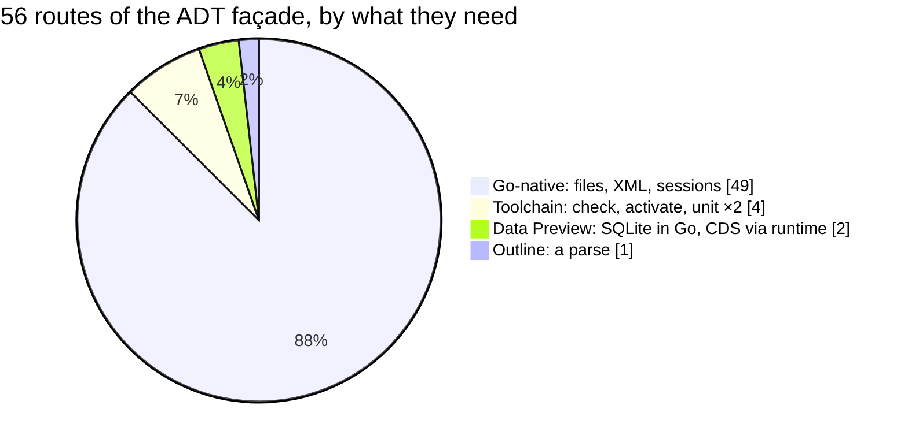
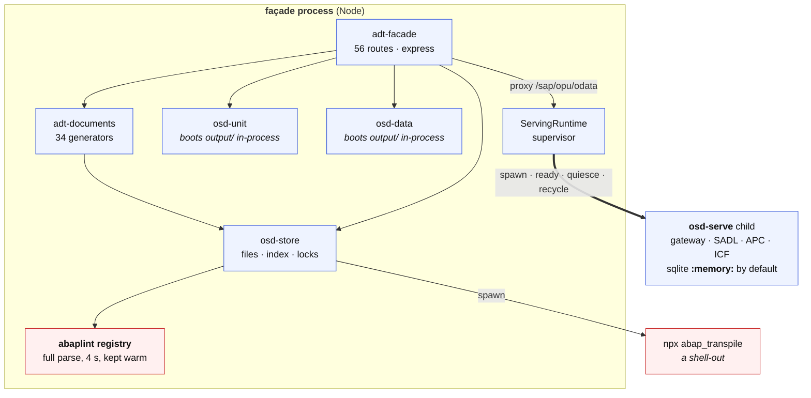
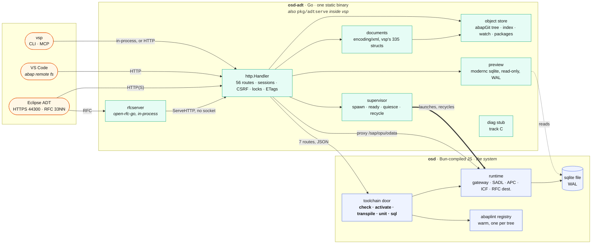
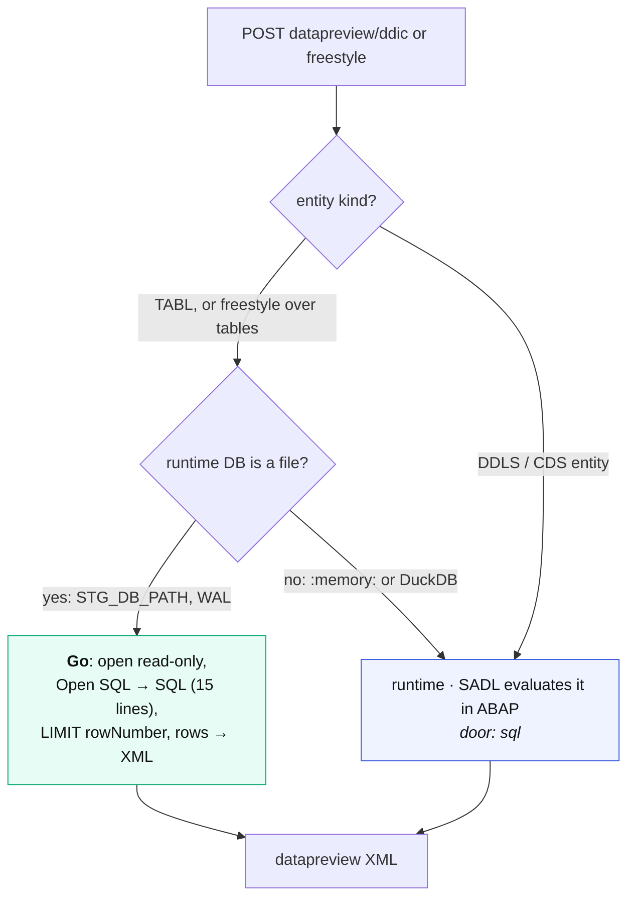
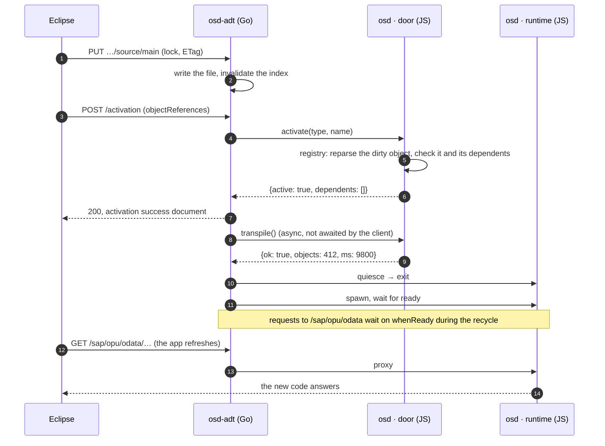
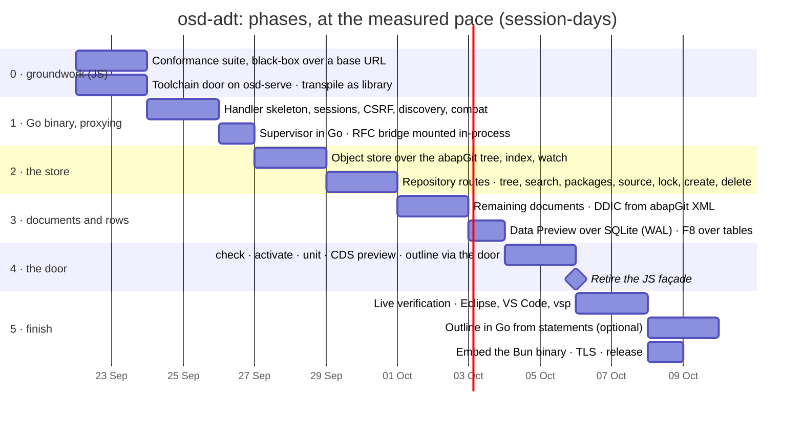

# Shift left: the ADT façade in Go, and what stays in JavaScript

The question, as asked: port the ADT façade "to the left" into Go — a
library when it sits inside vsp, a binary of its own for developers, one
that any ADT-speaking tool can use (Eclipse, VS Code, vsp itself) — and
leave only the real runtime as Bun-compiled JavaScript, spun up for unit
tests, perhaps activation, and F8. And can F8 over tables be done in Go?

This is the analysis and the estimate. It rests on measurements of the code
as it is on 2026-09-16, not on a memory of it, and it builds on
[`architecture-split.md`](architecture-split.md): the same pieces, the same
names, one box moved. The measurements are the first section so the
reasoning can be checked against them.

---

## The answer, short

**Yes, and the line falls in a different place than "façade versus runtime".**
The line that holds is **protocol versus ABAP semantics**:

- **Go takes the protocol**: the 56 routes' HTTP shape, discovery and the
  compatibility graph, sessions, CSRF and locks, the object store over the
  abapGit file tree, the XML documents, the DDIC documents from abapGit XML,
  the supervisor — and Data Preview over plain tables, read straight out of
  the runtime's SQLite file. That is **49 of the 56 routes**, and none of
  them parses a line of ABAP.
- **JavaScript keeps the semantics**: the syntax check, the activation
  verdict, the transpile, ABAP Unit, and Data Preview over CDS. All five are
  the abaplint parse or the transpiled system, and they stay in the `osd`
  Bun binary behind **one small internal API** — five calls, all of which
  already exist as methods of the store.
- **F8 over a table: yes, in Go.** The rows come from the SQLite file the
  runtime writes, through the pure-Go driver vsp already depends on. It
  needs the runtime to run file-backed in WAL mode when supervised, which is
  one environment variable away from today's `:memory:` default. F8 over a
  CDS entity goes through the runtime, because the transpiler makes no SQL
  view of one: SADL evaluates it in ABAP.
- **abaplint does not move.** Not ported, not transpiled to Go, not run in an
  embedded engine — the numbers below say why, and Alice's own reading of
  the two old Go ports is right: they are a lexer and a statement matcher,
  not a parser with types.
- **The Go RFC bridge folds in.** The 4,249 lines that carry Eclipse over
  RFC today call the façade over HTTP; with the façade a Go library they
  call it in-process, and the RFC door and the HTTP door become one program.

**Estimate:** about 10,000 lines of Go including tests, some 1,000 lines of
JavaScript change, and **15–20 session-days at the pace measured in these
two repositories** — six phases, each of which ships something Eclipse can
use, in a strangler order that never breaks the working system. In
conventional-team terms, one engineer for a quarter.

---

## The measurements

What the façade is made of, and what each part reaches for:

| file | lines | reaches for |
| --- | ---: | --- |
| `tools/adt-facade.mjs` | 2,005 | express, the store, the documents; **no runtime import** |
| `tools/adt-documents.mjs` | 1,544 | one enum from `@abaplint/core` (`Visibility`), the registry for the outline |
| `tools/osd-store.mjs` | 1,084 | the file tree; **abaplint** in five methods (`registry`, `check`, `dependents`, `activate`, `#withSource`); `spawn("npx abap_transpile")` in one |
| `tools/osd-runtime.mjs` | 291 | `child_process`, nothing else |
| `tools/adt-session.mjs` + source properties | 228 | nothing |
| `tools/osd-data.mjs` | 147 | **boots `output/init.mjs` in-process** and reads the DEFAULT connection |
| `tools/osd-unit.mjs` | — | the same in-process boot |
| tests `test/adt-*.mjs` | 4,081 | in-process: they import the router and `fetch` against it (47 requests) |

Two things in that table correct the picture the split document drew:

1. **The façade is not runtime-free today.** It hosts the transpiled system
   *in its own process* twice — once for ABAP Unit and once for Data
   Preview — beside the serving child it supervises. `osd-data.mjs` says
   so in its own comment: "a second runtime beside it" is the thing it
   tries not to be, and cannot fully avoid. A Go façade cannot host a
   JavaScript module graph, so those two move into the runtime process,
   which is a cleaner shape than the one we have.
2. **abaplint is the only ABAP semantics the façade has, and it is not a
   small dependency.** `@abaplint/core` as built is **85,896 lines of
   JavaScript in 1,538 files**. The façade needs its full registry — a
   parse of every file, 4 seconds over this tree — because activation is
   defined here as "the object *and everything that names it* still
   compiles", which is the honest definition and the one that makes
   `#withSource` and `dependents` exist.

What vsp already has on the Go side, measured the same way:

| package | lines | what it is | reusable for |
| --- | ---: | --- | --- |
| `pkg/adt` | 60,485 | the ADT **client**: 335 structs, **916 `xml:` tags** | marshalling the same documents from the server side |
| `pkg/abaplint` | 3,364 | lexer + statement splitter + a combinator *matcher* ported from `combi.ts`; no AST, no types | a class **outline** (statement-level), not a check |
| `pkg/jseval` | — | a toy JavaScript evaluator written to be compiled *to ABAP* | nothing here |
| `pkg/ts2go` | 608 | TypeScript AST JSON → Go, with `TODO` fallbacks | nothing at abaplint's scale |
| `cmd/abapgit-pack` | — | knows the abapGit file layout (`.clas.abap`, `.clas.locals`, `.ddls.asddls`, `.devc.xml` …) | the object store |
| `modernc.org/sqlite` | dep | pure-Go SQLite, already in `go.mod` | Data Preview |
| `internal/mcp`, `debug_ui.go` | — | vsp already runs `net/http` servers | the library embedding |

And on the RFC side, `open-rfc-go`: the bridge is 4,249 lines across
`adt_handler`, `adt_ddic`, `adt_csrf`, `bxml`, `response_eclipse` and
`serve_conscious`, built 2026-09-14 → 09-16 in 13 commits, stdlib only.

### The routes, sorted by what they need

The façade serves 56 routes. Sorted by the one question that matters —
does answering it require parsing ABAP or running it:

| needs | routes | in Go |
| --- | --- | --- |
| **nothing but the file tree and the protocol** (49) | discovery and every `all ${BASE}/*` fallback, `core/http/*` (sessions, build, reentrance ticket, system information), `system/users`, logoff, feeds, error log, dumps, system messages, `packages/*`, `repository/informationsystem/*` (search, object types, release states, property values, virtual folders), `nodestructure`, `typestructure`, object GET/POST/PUT/DELETE and lock actions, `source/main` and class includes, `ddic/tables/*`, `ddic/dataelements/*`, `datapreview/ddic/*/metadata`, `checkruns/reporters`, `abapunit/metadata`, `activation/inactiveobjects`, `cts/transportchecks` | yes, now |
| **the abaplint parse or the transpiled system** (4) | `POST checkruns`, `POST activation`, `POST abapunit/testruns`, `POST abapunit/testruns/evaluation` | no — through the door |
| **the rows** (2) | `POST datapreview/ddic`, `POST datapreview/freestyle` | tables yes; CDS through the door |
| **the class structure** (1) | `GET …/objectstructure` | through the door first, statement-level Go later |

The 49 are not the easy half of the work by line count — they are most of
`adt-facade.mjs` and all of `adt-documents.mjs` — but they are the half with
**no research left in it**: every one of them has an oracle capture and a
test, and the `.local/adt-client-atlas` disassembly says what the client
checks. Porting them is transcription. The other seven are where the
semantics live, and the semantics are staying put.

---

## Today: what the façade process actually contains

Three of the boxes are what stops a mechanical port: the registry (the
parse), the shell-out (the transpiler), and the two in-process boots (the
system itself). Everything else is files and XML.

Note the `:memory:` on the child. It is the default of `osd-serve.mjs`
(`STG_DB_PATH ?? ":memory:"`), and it is the single fact that decides
whether a second process can read the rows at all.

---

## The parser: three ways to bring abaplint to Go, and why none is taken

Alice's question was whether the check and the activation could be a
"compile-time or release-time transpilation of JS/TS into Go". Three
mechanisms would put abaplint's semantics inside a Go binary. Each was
measured against the code that exists.

| route | what it would take | verdict |
| --- | --- | --- |
| **Port abaplint to Go** by hand | 85,896 lines of built JavaScript, 1,538 files, a moving upstream that ships weekly. `pkg/abaplint` is the honest measure of how far a mechanical port gets: 3,364 lines in, it matches statements and builds no tree. | No. It is a second abaplint, not a port, and it drifts from the first from the day it compiles. |
| **Transpile TypeScript → Go at release time** with `pkg/ts2go` | `ts2go` is 608 lines: a TypeScript-AST-as-JSON to Go emitter with `TODO` fallbacks. abaplint is generics, closures over maps, class hierarchies with interfaces, `Map`/`Set`, regular expressions, and a `Registry` that mutates in place. A TS→Go compiler that handles that is a project larger than the façade, and its output would still have to be re-verified per abaplint release. | No. The tool is a spike, and even a finished one would be a compiler for a dependency that is not ours. |
| **Embed a JavaScript engine** (goja in pure Go, or QuickJS under the wazero we already depend on) and run abaplint's bundle in it | Works in principle; both engines run ES2017-class code. Neither has a JIT: the measured 4-second full parse under V8 becomes on the order of a minute, and a check on every save is what the parse is *for*. The engine also has to be fed the 86k-line bundle and kept in step with it. | No for the check path. (It remains an option for something small and cold, which this is not.) |
| **A sidecar process that already has V8** | The `osd` Bun binary exists, already contains abaplint (the transpiler needs the same parse), already keeps a registry warm, and is supervised by the façade anyway. | **Yes.** The process is free; what is new is five routes on it. |

So the parser stays where V8 is. The consequence is not a compromise, it is
the design: **the Go binary owns what a workbench server does, and the
JavaScript binary owns what an ABAP system does**, and the seam between
them is the smallest API in the project.

---

## The target

Against the sidecar diagram in `architecture-split.md`, exactly one box has
moved: **B, the façade, leaves the JS binary and becomes the Go binary's
core.** The JS binary loses the façade and gains a door. Everything else in
that diagram — `orfc`, the RFC front door, the DIAG stub, content packs —
stands.

### Library and binary: the same package, two `main`s

- **`pkg/adtserve`** (in vsp, because that is where the SQLite dependency
  and the 335 document structs already are; `open-rfc-go` stays stdlib-only
  and is imported, not importing) exports three things: a `Store` over a
  tree, a `Toolchain` interface with the five calls, and
  `New(store, toolchain, options) http.Handler`.
- **`cmd/osd-adt`** is the developer binary: plain HTTP and TLS, the RFC
  gateway port through `open-rfc-go`'s `rfcserver` with the handler mounted
  in-process, the supervisor, and the `osd` Bun binary either beside it or
  embedded via `embed.FS` and unpacked on first run — the two shipping shapes
  the split document already chose.
- **`vsp osd serve <tree>`** is the same handler under vsp's cobra root, and
  vsp's own MCP tools and CLI call the `Store` **without HTTP** when they
  point at a local tree. That is what "vsp itself" gains: an offline
  workbench with no listener at all, for an assistant editing a repository.

A third client costs nothing: VS Code's ABAP remote filesystem extension
speaks the same routes Eclipse does (discovery, nodestructure, source,
lock, checkruns, activation), and the conformance suite below is what says
it works rather than a hope that it does.

### What the Go binary does with no JavaScript running

This is the row the split document underlined, and it gets stronger:
**browse, read, search, edit, lock, create, delete, packages, DDIC
documents, and Data Preview over any table** — from a static binary that
starts in milliseconds, over a tree and a persisted SQLite file, with the
runtime not started. The runtime spins up on first demand for a check, an
activation, a unit run, a CDS preview, or an OData request, and the
supervisor already knows how to wait for it.

---

## F8, precisely

"F8" is three different keys in Eclipse, and they land on three different
boxes:

| F8 on … | what Eclipse does | who answers |
| --- | --- | --- |
| a **table or CDS entity** | Data Preview: `POST datapreview/ddic` (or freestyle SQL) | **Go** for a table; the runtime for a CDS entity |
| a **program** | hands off to SAP GUI over DIAG on `32NN` (`_NAVIGATION=X;D_WB_ACTION=EXECUTE`) | the Go DIAG stub (track C), later a runtime run |
| a **class** with `if_oo_adt_classrun` | `oo/classrun` — not served today | the runtime, through the door, when it is added |

The first row is the one asked about. The decision, per request:

What makes the Go path real rather than hopeful:

- **The driver is already there.** `modernc.org/sqlite` is in vsp's
  `go.mod` and used by `pkg/cache`. No cgo, no new dependency.
- **The dialect translation is tiny.** `openSqlToSql` is the whole of what
  the façade does to Eclipse's query today — a comma-less 7.x field list and
  `UP TO n ROWS` — fifteen lines, ported as-is. The `~` is the database
  client's, and Go gets the same treatment.
- **WAL is what lets two processes share the file.** The runtime writes;
  Go opens read-only. A reader never blocks the writer under WAL and sees
  the last committed LUW, which is exactly the semantics a data preview
  should have.
- **The one change on the JS side** is a default: a *supervised* runtime
  gets a file under the instance's `.local/` and `journal_mode=WAL`, where
  today `osd-serve.mjs` defaults to `:memory:`. `osd-persist.mjs` already
  implements file-backed SQLite; this is choosing it.

What stays on the runtime, and why: **CDS**. The transpiler emits no
`CREATE VIEW` for a DDLS (checked across `node_modules/@abaplint`); a CDS
entity is evaluated by `src/sadl/` in ABAP at request time, joins and
annotations included. Reading its base tables from Go would be a different
query with a different answer. So a preview over a CDS entity is `sql`
through the door, and the door answers from the same SADL that OData uses —
which is also the honest oracle. DuckDB has no pure-Go driver and takes the
same path; it is the "point me at a process" mode already.

---

## The door: five calls, all of which exist

Every one of these is a method of `osd-store.mjs` today, called
in-process by the façade. The port turns them into routes on the runtime
child (it already listens for OData and already has an IPC channel for
`ready`/`quiesce`), JSON in and out, one process per tree so the registry
stays warm:

| call | today | answers |
| --- | --- | --- |
| `check(type, name, include?, source?)` | `store.check` | the issues of one object; with `source`, of unsaved text — the editor's check-on-save |
| `activate(type, name)` | `store.activate` | the verdict, and the dependents that would break |
| `transpile()` | `store.transpile` | `{ok, objects, ms}`; **as a library call**, no `npx` — a Bun binary has no `npx` |
| `unit(type, name)` | `store.unit()` | the `runResult` tree the façade renders |
| `sql(select, max)` | `store.data().query` | rows, for CDS and for memory-backed instances |
| `structure(type, name)` | `structureOf` | the class outline, until Go does it from statements |

Two lifecycle messages stay as they are: `ready` (with the port) and
`quiesce` (with a grace). The Go supervisor is `osd-runtime.mjs` line for
line; its comments about ordering (stop the old one first, because two
processes must not hold one database file) are the specification.

This API is worth having **before** any Go is written: it is what
"driven separately" in the split document promised for the toolchain, and
it is what vsp's MCP tools would call today to check a tree without
starting Eclipse. It is phase 0 for that reason.

### Activation, end to end, through the seam

Nothing in that sequence is new behaviour; it is `store.publish()` with a
process boundary drawn through it. The verdict is synchronous and the
recycle is not, which is what the store's own comment says a real system
does.

---

## The strangler order: every phase ships

The risk in a port is not the code, it is the weeks in which two
implementations disagree and nothing is usable. The order below avoids
those weeks: the Go binary starts as a **reverse proxy in front of the JS
façade** and takes routes over one group at a time. Eclipse works against
it from the first day, and the JS façade is retired at the end, not
switched off at the start.

| phase | delivers | Go lines | JS lines | sessions | what Eclipse sees |
| --- | --- | ---: | ---: | ---: | --- |
| **0** groundwork | the conformance suite (the 47 in-process requests re-expressed against a base URL, plus corpus replay); the door on the child; transpile as a library call; WAL default when supervised | 0 | ~900 | 2 | nothing changes; vsp can already check a tree without the façade |
| **1** proxy | `osd-adt` listens, owns sessions/CSRF/locks/discovery/compat, proxies the rest to the JS façade; the supervisor in Go; the RFC bridge calls `ServeHTTP` | ~1,600 | 0 | 3 | logon, discovery and the tree through the Go binary, over HTTP and over RFC |
| **2** store | the object store; the 30-odd repository routes | ~2,200 | 0 | 4 | read, search, edit, lock, create, delete with **no JS process running** |
| **3** documents | the remaining generators; DDIC tables and data elements; preview over SQLite | ~2,400 | ~20 | 3 | **F8 over a table answered by Go**; every read-only screen native |
| **4** the door | the seven semantic routes through the door; the JS façade goes | ~600 | ~100 | 2 | check, activate, unit, CDS preview — same answers, one process fewer |
| **5** finish | live runs against Eclipse, VS Code, vsp; outline in Go (optional); embedding and release | ~800 (+~600 optional) | 0 | 3–5 | one file to install |
| | **total** | **~7,600 + ~3,000 tests** | **~1,000** | **17–19** | |

### How the numbers were made

**Lines.** JavaScript to Go on this kind of code runs at 1.3–1.5×: Go's
`encoding/xml` is wordier than a template literal, error handling is
explicit, and a store has to say its types. The document generators are the
exception in the other direction — 916 XML-tagged fields in `pkg/adt` are
the same elements from the client side, so a good share of
`adt-documents.mjs` is marshalling structs that exist rather than writing
new ones.

**Pace.** Two measured points, both from this fortnight, both including
tests and the research that came with them:

| what | lines | sessions | per session |
| --- | ---: | ---: | ---: |
| the JS façade + store + documents + tests | 9,514 | 4 (2026-09-13 → 16, 84 commits) | ~2,400 |
| the Go RFC bridge, protocol reverse-engineered from a live oracle | 4,249 | 3 (2026-09-14 → 16, 13 commits) | ~1,400 |

The port has less research in it than either (every route has an oracle
capture in `.local/adt-corpus`, 4,246 files, and a test), so ~1,000–1,200
lines a session is the conservative figure used above, and it gives
**15–20 session-days** with slack. At the cadence these repositories have
run at, that is **five to seven weeks**.

**In conventional terms**, for anyone who has to put it in a plan next to
other work: multiply by three to four — roughly **45–80 person-days, one
engineer for a quarter**. The multiplier is the difference between a pair
that already holds the client atlas and the oracle corpus, and one that
would have to build them.

---

## Risks, and what pins each one

| risk | why it is real | what pins it |
| --- | --- | --- |
| **Byte-level fidelity.** The ADT client decides most failures on its own side and shows nothing in a capture. | Memory of the bridge work: a wrong `Content-Type` variant or a missing `ETag` is a silent grey menu. | Phase 0's suite compares the two implementations' responses on the same request, header by header, before Go answers a real client. The corpus is the oracle; the atlas says which bytes are checked. |
| **Two implementations for five weeks.** | Every port has this window. | The strangler order: unported routes are *proxied*, not reimplemented twice, and the JS façade is deleted in phase 4, not maintained alongside. |
| **The parse must stay warm.** A cold registry is 4 s, and a check on every save at 4 s is unusable. | The door moves the parse across a process boundary. | One `osd` process per tree, kept up by the supervisor between checks; the first check after a start pays the 4 s once, as today. |
| **The outline needs a parse.** | `structureOf` reads the abaplint registry. | Phase 4 serves it through the door; phase 5 may do it in Go from `pkg/abaplint`'s statement splitter, which is the one thing that old port is good for: `CLASS … DEFINITION`, sections, `METHODS`, `DATA`, `INTERFACES` are statement-level facts. |
| **SQLite sharing.** | Two processes, one file. | WAL, Go opens read-only, and the supervisor's ordering rule (stop before spawn) already prevents two *writers*. DuckDB and `:memory:` take the door. |
| **The Bun binary has no `npx`.** | `store.transpile` shells out today. | Already necessary for the Bun binary regardless of Go; phase 0 turns it into a library call to `@abaplint/transpiler`. |
| **`open-rfc-go` must stay stdlib-only.** | The bridge lives there; the façade wants SQLite and vsp's structs. | The dependency arrow already points the right way: vsp imports `open-rfc-go`. `pkg/adtserve` lives in vsp; the RFC server mounts the handler as an `http.Handler`, an interface from the standard library. |

---

## What is deliberately not proposed

- **No Go ABAP parser.** The temptation will return every time a check
  feels slow. The answer is a warm registry in the process that has V8,
  not a third parser in the family.
- **No second database beside the runtime's.** Go reads the runtime's
  file; it does not seed its own. One system, one set of rows, as
  `osd-data.mjs` insists.
- **No wire-level change for any client.** Eclipse, VS Code and vsp see the
  same routes, the same documents, the same session and CSRF behaviour.
  The port is invisible from the outside by construction, and the
  conformance suite is what makes "by construction" a measurement.

---

## See also

- [`architecture-split.md`](architecture-split.md) — the pieces and the
  sidecar this revises (B moves; nothing else does)
- [`adt-over-rfc.md`](adt-over-rfc.md) — the Go door that folds in
- [`diag-notes.md`](diag-notes.md) — F8 on a program, the other key
- [`bun-spike.md`](bun-spike.md) — the JS binary this leaves in place
- [`backlog.md`](backlog.md) — tracks A–D; this is a candidate track E
