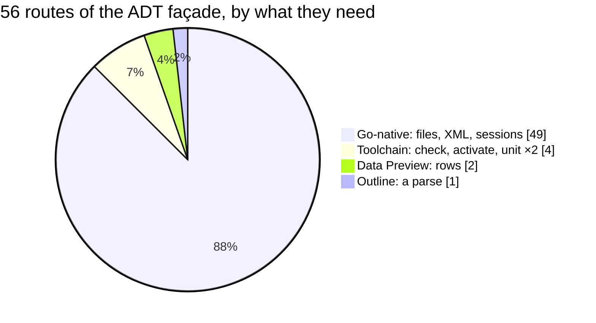
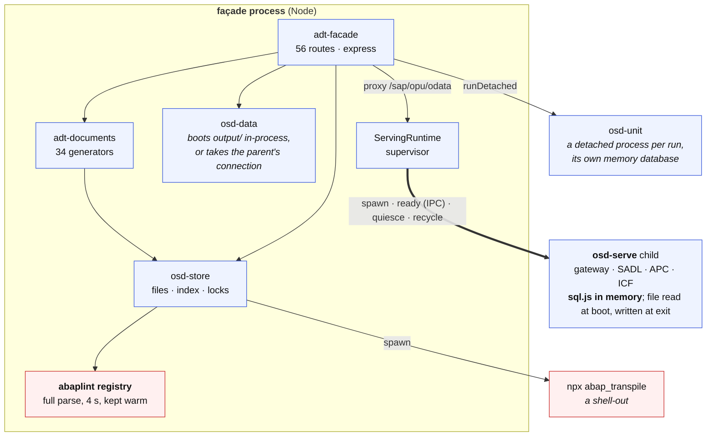
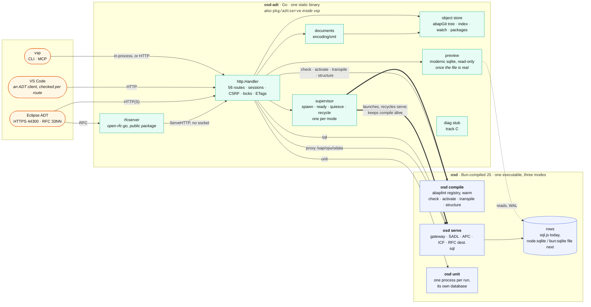
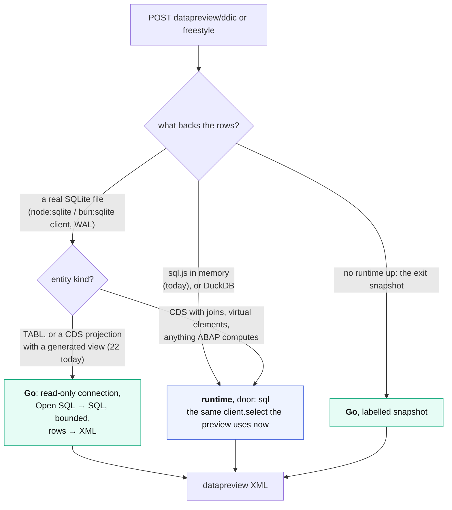
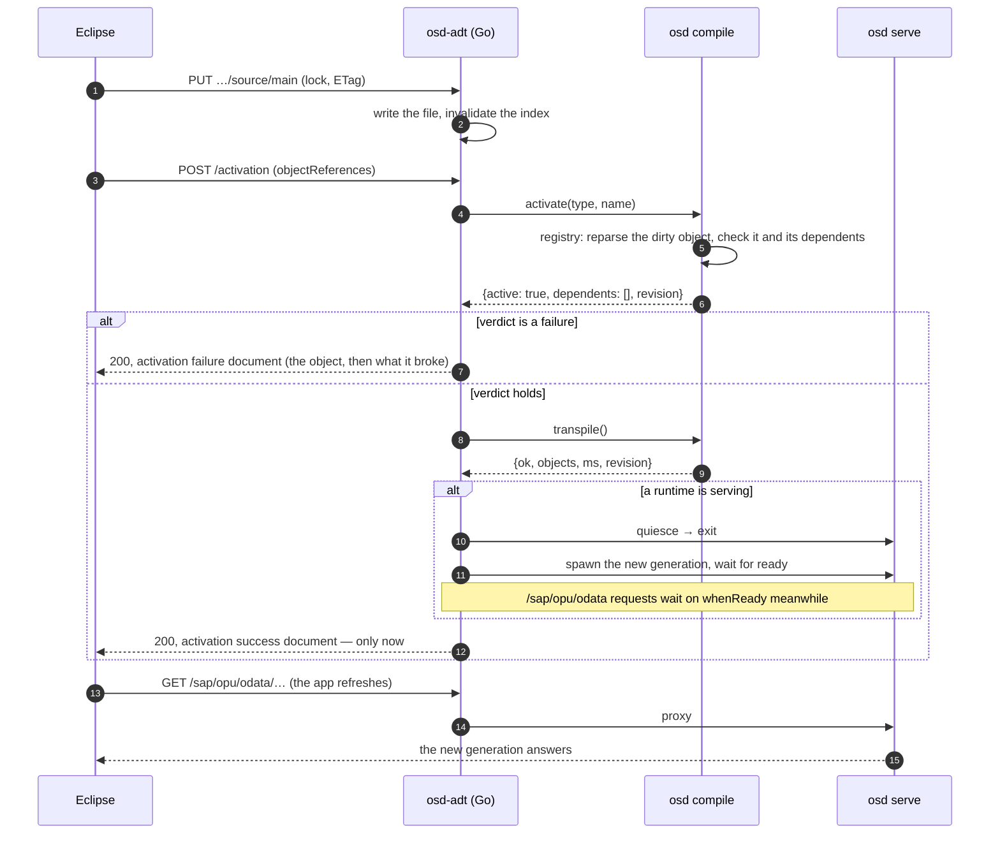
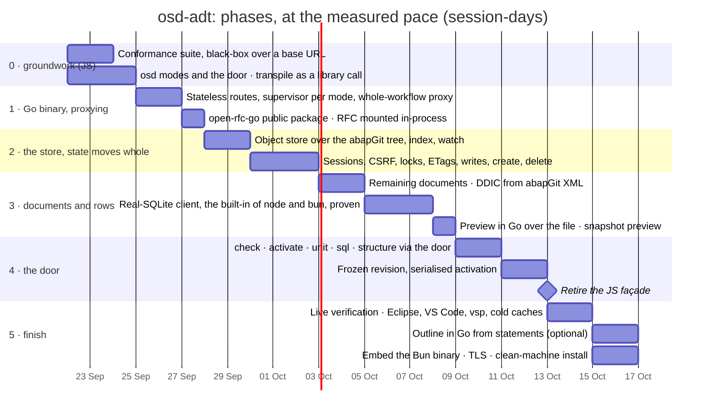

# Shift left: the ADT façade in Go, and what stays in JavaScript

The question, as asked: port the ADT façade "to the left" into Go — a
library when it sits inside vsp, a binary of its own for developers, one
that any ADT-speaking tool can use (Eclipse, VS Code, vsp itself) — and
leave only the real runtime as Bun-compiled JavaScript, spun up for unit
tests, perhaps activation, and F8. And can F8 over tables be done in Go?

This is the analysis and the estimate. It rests on measurements of the code
as it is on 2026-09-16, and it builds on
[`architecture-split.md`](architecture-split.md): the same pieces, the same
names, one box moved. A first version of this report was reviewed
independently (Astra, [`architecture-split-astra.md`](architecture-split-astra.md));
six of its findings contradicted the code and are corrected here, and each
correction is marked **(rev.)** where it changed a conclusion. The
measurements come first so the reasoning can be checked against them.

---

## The answer, short

**Yes, and the line falls in a different place than "façade versus runtime".**
The line that holds is **protocol versus ABAP semantics**:

- **Go takes the protocol**: the 56 routes' HTTP shape, discovery and the
  compatibility graph, sessions, CSRF and locks, the object store over the
  abapGit file tree, the XML documents, the DDIC documents from abapGit XML,
  the supervisor. That is **49 of the 56 routes**, and none of them parses
  a line of ABAP.
- **JavaScript keeps the semantics**: the syntax check, the activation
  verdict, the transpile, ABAP Unit, and the rows. They stay in the `osd`
  Bun binary behind **one small internal API of six calls**, all of which
  already exist as methods of the store. **(rev.)** The binary runs in
  three *modes*, not one process: a **compiler** (the warm abaplint
  registry: check, activate, transpile), the **runtime** (OData, SADL, ICF,
  APC, and the live rows), and a **unit** worker spawned per run with its
  own database — which is how unit tests are isolated today, and must stay.
- **F8 over a table: yes, in Go — but not by an environment variable.**
  **(rev.)** The runtime's SQLite is sql.js, a database in memory; the file
  `STG_DB_PATH` names is read at boot and written at exit. A Go process
  opening it would see the last exit, not the running system. So: first
  release, Go asks the owning runtime through the door; then a **real
  file-backed SQLite client** (`node:sqlite` and `bun:sqlite` both exist,
  no native module, a client over the eleven-method seam is ~200 lines by
  the DuckDB one's measure) makes the direct read true, with WAL doing what
  WAL does. CDS is two cases, not one: a **single-table projection already
  has a generated SQL view** (22 of them in today's `output/init.mjs`) and
  reads like a table; anything ABAP-calculated needs the runtime.
- **abaplint does not move.** Not ported, not transpiled to Go, not run in an
  embedded engine — the numbers below say why, and the two old Go ports are
  what Alice said they are: a lexer and a statement matcher, not a parser
  with types.
- **The Go RFC bridge folds in.** The 4,249 lines that carry Eclipse over
  RFC call the façade over HTTP today; with the façade a Go library they
  call it in-process. **(rev.)** That needs `open-rfc-go` to publish a
  public package for its RFC server, which lives under `internal/` now.

**Estimate:** about 11,000 lines of Go including tests, some 1,400 lines
of JavaScript change, **18–22 session-days at the pace measured in these
two repositories**, in six phases that each ship something Eclipse can use,
in a strangler order that never breaks the working system. **For planning
next to other work, use the conventional figure: 50–85 person-days, one
engineer for a quarter.** Astra's independent estimate is 46–72; the
ranges overlap, and the conventional one is the one to commit to.

---

## The measurements

What the façade is made of, and what each part reaches for:

| file | lines | reaches for |
| --- | ---: | --- |
| `tools/adt-facade.mjs` | 2,005 | express, the store, the documents; **no runtime import** |
| `tools/adt-documents.mjs` | 1,544 | one enum from `@abaplint/core` (`Visibility`), the registry for the outline |
| `tools/osd-store.mjs` | 1,084 | the file tree; **abaplint** in five methods (`registry`, `check`, `dependents`, `activate`, `#withSource`); `spawn("npx abap_transpile")` in one |
| `tools/osd-runtime.mjs` | 291 | `child_process`, nothing else |
| `tools/adt-session.mjs` + source properties | 228 | nothing |
| `tools/osd-data.mjs` | 147 | **boots `output/init.mjs` in-process** unless a connection is injected; `test/start.mjs` injects the parent's |
| `tools/osd-unit.mjs` | 440 | **spawns a detached process per run** (`runDetached`), which is what both ADT unit routes call |
| tests `test/adt-*.mjs` | 2,134 | in-process: they import the router and `fetch` against it (47 requests); `test/osd-*.mjs` add 1,947 for the store, data, runtime |

Two things in that table sharpen the picture the split document drew:

1. **The façade process is not runtime-free today, but it is close.** The
   data preview boots the transpiled system *in the façade's process* when
   nobody injects a connection, and `test/start.mjs` — the entry point
   that actually runs — initialises ABAP at top level and hands its
   connection to the router. The unit runner, by contrast, already spawns
   a separate process with its own in-memory database per run. A Go façade
   cannot host a JavaScript module graph, so the preview's boot goes where
   the unit runner's already is: another process.
2. **abaplint is the only ABAP semantics the façade has, and it is not a
   small dependency.** `@abaplint/core` as built is **85,896 lines of
   JavaScript in 1,538 files**. The façade needs its full registry — a
   parse of every file, 4 seconds over this tree — because activation is
   defined here as "the object *and everything that names it* still
   compiles", which is the honest definition and the one that makes
   `#withSource` and `dependents` exist.

What vsp already has on the Go side, measured the same way:

| package | lines | what it is | reusable for |
| --- | ---: | --- | --- |
| `pkg/adt` | 60,485 | the ADT **client**: 335 structs, **916 `xml:` tags** | a starting point for marshalling the same documents server-side; each one is a candidate to be checked against the oracle, not a proof |
| `pkg/abaplint` | 3,364 | lexer + statement splitter + a combinator *matcher* ported from `combi.ts`; no AST, no types | a class **outline** (statement-level), not a check |
| `pkg/jseval` | — | a toy JavaScript evaluator written to be compiled *to ABAP* | nothing here |
| `pkg/ts2go` | 608 | TypeScript AST JSON → Go, with `TODO` fallbacks | nothing at abaplint's scale |
| `cmd/abapgit-pack` | — | knows the abapGit file layout (`.clas.abap`, `.clas.locals`, `.ddls.asddls`, `.devc.xml` …) | the object store |
| `modernc.org/sqlite` | dep | pure-Go SQLite, already in `go.mod` | Data Preview, once the runtime writes a real file |
| `internal/mcp`, `debug_ui.go` | — | vsp already runs `net/http` servers | the library embedding |

And on the RFC side, `open-rfc-go`: the bridge is 4,249 lines across
`adt_handler`, `adt_ddic`, `adt_csrf`, `bxml`, `response_eclipse` and
`serve_conscious`, built 2026-09-14 → 09-16 in 13 commits, stdlib only,
all of it under `internal/`.

### The routes, sorted by what they need

The façade serves 56 routes. Sorted by the one question that matters —
does answering it require parsing ABAP or running it:

| needs | routes | in Go |
| --- | --- | --- |
| **nothing but the file tree and the protocol** (49) | discovery and every `all ${BASE}/*` fallback, `core/http/*` (sessions, build, reentrance ticket, system information), `system/users`, logoff, feeds, error log, dumps, system messages, `packages/*`, `repository/informationsystem/*` (search, object types, release states, property values, virtual folders), `nodestructure`, `typestructure`, object GET/POST/PUT/DELETE and lock actions, `source/main` and class includes, `ddic/tables/*`, `ddic/dataelements/*`, `datapreview/ddic/*/metadata`, `checkruns/reporters`, `abapunit/metadata`, `activation/inactiveobjects`, `cts/transportchecks` | yes, now |
| **the abaplint parse or a test run** (4) | `POST checkruns`, `POST activation`, `POST abapunit/testruns`, `POST abapunit/testruns/evaluation` | no — through the door |
| **the rows** (2) | `POST datapreview/ddic`, `POST datapreview/freestyle` | through the door first; Go reads directly once the runtime writes a real SQLite file |
| **the class structure** (1) | `GET …/objectstructure` | through the door first, statement-level Go later |

The 49 are not the easy half by line count — they are most of
`adt-facade.mjs` and all of `adt-documents.mjs` — but they are the half with
**no research left in it**: every one has an oracle capture and a test,
and the `.local/adt-client-atlas` disassembly says what the client checks.
Porting them is transcription, with the caveat that what the client checks
is not the files but the *semantics on the wire*: inactive versions, ETags,
namespaces and MIME versions, stable node identities, include mapping,
source positions. Those are what the conformance suite compares.

---

## Today: what the façade process actually contains

Three of the boxes are what stops a mechanical port: the registry (the
parse), the shell-out (the transpiler), and the in-process boot for the
rows (the system itself). Everything else is files and XML.

Note the database on the child: **sql.js, in memory**. `osd-persist.mjs`
says it in its own comment — the file is read when a runtime boots and
written when it exits, "nothing is written while it runs". That is the
single fact that decides whether a second process can read the rows.

---

## The parser: three ways to bring abaplint to Go, and why none is taken

Alice asked whether the check and the activation could be a "compile-time
or release-time transpilation of JS/TS into Go". Three mechanisms would
put abaplint's semantics inside a Go binary. Each was measured against the
code that exists.

| route | what it would take | verdict |
| --- | --- | --- |
| **Port abaplint to Go** by hand | 85,896 lines of built JavaScript, 1,538 files, a moving upstream that ships weekly. `pkg/abaplint` is the honest measure of how far a mechanical port gets: 3,364 lines in, it matches statements and builds no tree. | No. It is a second abaplint, not a port, and it drifts from the first from the day it compiles. |
| **Transpile TypeScript → Go at release time** with `pkg/ts2go` | `ts2go` is 608 lines: a TypeScript-AST-as-JSON to Go emitter with `TODO` fallbacks. Stripping types leaves the JavaScript semantics — prototypes, closures over maps, exceptions, string coercion, async — and abaplint uses all of them, with a `Registry` that mutates in place. A TS→Go compiler that handles that is a project larger than the façade, and its output would still have to be re-verified per abaplint release. | No. The tool is a spike, and even a finished one would be a compiler for a dependency that is not ours. Release-time generation *is* right for the declarative material — route catalogues, MIME maps, compatibility edges — and the port should do that. |
| **Embed a JavaScript engine** (goja in pure Go, or QuickJS under the wazero we already depend on) and run abaplint's bundle in it | Works in principle; both run ES2017-class code. Neither has a JIT, and a parser over a whole tree is exactly the workload a JIT is for. Not measured here on abaplint — expect an order of magnitude against a JIT engine, and measure before believing a smaller number. The engine also has to be fed the 86k-line bundle and kept in step with it. | No for the check path. (It remains an option for something small and cold, which this is not.) |
| **A process that already has a JIT engine** | The `osd` Bun binary (JavaScriptCore; the Node checkout is V8) exists, already contains abaplint because the transpiler needs the same parse, and is supervised by the façade anyway. | **Yes.** The process is free; what is new is six routes on it, and a *mode* that keeps the registry alive across activations. |

So the parser stays where the JIT is. The consequence is not a compromise,
it is the design: **the Go binary owns what a workbench server does, and
the JavaScript binary owns what an ABAP system does**, and the seam between
them is the smallest API in the project.

---

## The target

Against the sidecar diagram in `architecture-split.md`, exactly one box has
moved: **B, the façade, leaves the JS binary and becomes the Go binary's
core.** The JS binary loses the façade and gains a door. Everything else in
that diagram — `orfc`, the RFC front door, the DIAG stub, content packs —
stands.

**(rev.) Why three modes and not one process.** The first draft put the
registry into the serving child. The serving child is what activation
*kills*: a recycle stops it and starts a new one, so the warm parse would
die on every activation, and a syntax check would start an application
and its database to answer. Astra's review caught it. The compiler mode
outlives recycles; the serve mode is the thing recycled; the unit mode is
one process per run with its own memory database, exactly as
`runDetached` does it today, so a test can never write into the rows the
application is serving. Same executable, three entry points.

### Library and binary: the same package, two `main`s

- **`pkg/adtserve`** exports three things: a `Store` over a tree, a
  `Toolchain` interface with the six calls, and
  `New(store, toolchain, options) http.Handler`. It installs no signal
  handlers, chooses no global ports, spawns nothing on import; one instance
  owns its locks, caches and children, and a host may run several. Where it
  lives is a choice between two goods: inside vsp, next to the 335 document
  structs and the SQLite dependency (pragmatic, and what the estimate
  assumes); or as its own module that vsp consumes (cleaner, one more repo,
  and the shared document types have to move with it). Start inside vsp;
  extract when a second consumer appears.
- **`cmd/osd-adt`** is the developer binary: plain HTTP and TLS, the RFC
  gateway port through `open-rfc-go`'s RFC server with the handler mounted
  in-process, the supervisor, and the `osd` Bun binary either beside it or
  embedded via `embed.FS` and unpacked on first run — the two shipping
  shapes the split document already chose. **(rev.)** The RFC server is
  under `internal/` in `open-rfc-go` today; mounting it from another
  module needs a public package with a small supported surface (the
  handler registration, the logon and record layer). Half a day, in phase 1.
- **`vsp osd serve <tree>`** is the same handler under vsp's cobra root, and
  vsp's own MCP tools and CLI call the `Store` **without HTTP** when they
  point at a local tree. That is what "vsp itself" gains: an offline
  workbench with no listener at all, for an assistant editing a repository.
  vsp's existing ADT client keeps HTTP as its contract; the in-process path
  is an addition, not a private dialect.

A third client is cheap but not free: an ADT server is not an LSP server,
and "VS Code" means a specific extension that speaks specific routes. The
one worth checking first is the ABAP remote filesystem extension, whose
routes overlap Eclipse's (discovery, nodestructure, source, lock,
checkruns, activation). The conformance suite is what says it works.

### What the Go binary does with no JavaScript running

This is the row the split document underlined, and it gets stronger:
**browse, read, search, edit, lock, create, delete, packages, DDIC
documents** — from a static binary that starts in milliseconds, over a
tree, with nothing else started. And **Data Preview over a snapshot**, the
file the last runtime wrote at exit, labelled as such. The compiler mode
comes up on the first check; the runtime on the first OData request, CDS
preview or live-row request; a unit worker per run. Discovery advertises
what is installed: a bare workbench must not claim a unit-test provider it
does not have, because the client decides on the graph before it ever
asks.

---

## F8, precisely

"F8" is three different keys in Eclipse, and they land on three different
boxes:

| F8 on … | what Eclipse does | who answers |
| --- | --- | --- |
| a **table or CDS entity** | Data Preview: `POST datapreview/ddic` (or freestyle SQL) | the runtime through the door first; **Go** once the rows are in a real file |
| a **program** | hands off to SAP GUI over DIAG on `32NN` (`_NAVIGATION=X;D_WB_ACTION=EXECUTE`) | the Go DIAG stub (track C), later a runtime run |
| a **class** with `if_oo_adt_classrun` | `oo/classrun` — served (Q6b, 2026-09-26): `tools/osd-classrun.mjs`, `docs/vscode-extension.md` | the runtime, in-process when it holds the connection, through a door (`/osd/classrun`, `tools/osd-serve.mjs`) when a served (child) runtime does |

The first row is the one asked about, and it is where the first draft was
wrong. **(rev.)** The runtime's SQLite is sql.js: a WebAssembly database
that lives in the process's memory. `STG_DB_PATH` does not make it a file
on disk; it makes `osd-persist.mjs` import that file at boot and export it
at exit, and nothing in between. A Go connection to that file, WAL or not,
reads the state at the last exit. So the honest decision flow is:

What makes the Go path real rather than hopeful, and what it costs:

- **A real file needs a third database client.** The eleven-method seam
  (`docs/db-backends.md`) is built for exactly this: "a third needs no
  change anywhere else". `node:sqlite` is in Node 26 and `bun:sqlite` in
  Bun 1.4, both verified present here, neither a native module. The DuckDB
  client is 205 lines; a real-SQLite one is the same shape with simpler
  transactions, because SQLite has savepoints and DuckDB's client replays
  them. Budget **3–5 session-days** including the proof: the whole unit
  suite green on it, the persistence tests, and one test that a runtime
  write is visible to a second read-only connection.
- **Then WAL does what it does.** The runtime writes; Go opens read-only
  and sees the last committed LUW, never an uncommitted one. A reader does
  not block the writer. The supervisor's ordering rule (stop before spawn)
  keeps the file to one writer.
- **The dialect translation is tiny, and its scope must be stated.**
  `openSqlToSql` is the whole of what the façade does to Eclipse's query
  today — a comma-less 7.x field list and `UP TO n ROWS` — fifteen lines.
  A leading `SELECT` is not a read-only policy; a read-only connection,
  a statement bound in rows and time, and a declared supported subset are.
- **CDS is two things.** `tools/cds2ddic.mjs` generates a DDIC view for
  every projection of one table or view (no joins yet), and the transpiler
  turns it into `CREATE VIEW` — 22 in today's `output/init.mjs`. Those
  read like tables, from Go. A view with joins, a virtual element
  (`docs/virtual-elements.md`), anything an exit computes, is the runtime's
  to answer — and note that today's preview does not go through SADL
  either: `Data.query` calls the database client directly, so "through the
  door" preserves exactly the semantics the preview has now.

**First release: the door.** It is what the preview does today, moved
across a process boundary. The direct read is a later, measured step, and
the snapshot preview with no runtime at all is a free by-product of the
same client.

---

## The door: six calls, all of which exist

Every one of these is a method of `osd-store.mjs` today. The port turns
them into routes on the `osd` executable, JSON in and out, with request
IDs and bounded messages, each answered by the mode that owns it:

| call | today | mode | answers |
| --- | --- | --- | --- |
| `check(type, name, include?, source?)` | `store.check` | compile | the issues of one object; with `source`, of unsaved text — the editor's check-on-save |
| `activate(type, name)` | `store.activate` | compile | the verdict, and the dependents that would break |
| `transpile()` | `store.transpile` | compile | `{ok, objects, ms}`; **as a library call**, no `npx` — a Bun binary has no `npx` |
| `structure(type, name)` | `structureOf` | compile | the class outline, until Go does it from statements |
| `unit(type, name)` | `runDetached` | unit | the `runResult` tree the façade renders; one process per run |
| `sql(select, max)` | `store.data().query` | serve | rows, bounded, from the live connection |

Q6b (2026-09-26, `tools/osd-classrun.mjs`) adds an unplanned seventh: `classrun(name)` — `store.classrun().run`, serve mode, console text, dialog-stepped, dump-recorded on failure. Not folded into the count above because this table is the *planned* Go door; classrun arrived on the JS side directly, the same way `sql` already had, and a future port inherits it as a seventh call rather than a redesign of these six.

Every result names the source revision and the generation it was computed
against; that is the one field the current calls lack, and the one that
lets a client be told the truth when a save races a build. Two lifecycle
messages stay: `ready` (with the port) and `quiesce` (with a grace). The
Go supervisor is `osd-runtime.mjs` line for line, run once per mode; its
comments about ordering (stop the old one first, because two processes
must not hold one database file) are the specification.

This API is worth having **before** any Go is written: it is what
"driven separately" in the split document promised for the toolchain, and
it is what vsp's MCP tools would call today to check a tree without
starting Eclipse. It is phase 0 for that reason.

### Activation, end to end, through the seam

**(rev.)** The first draft answered Eclipse before the transpile. The
handler does not, and for a reason it records: it awaits `store.publish()`
because an early success once exposed stale code and hid build failures.
`transpileOnActivate: false` is a test seam, not the contract. So:

Nothing in that sequence is new behaviour; it is `store.publish()` with a
process boundary drawn through it and the compiler kept alive across the
recycle. Two weaknesses of today's code are worth fixing while the boundary
is drawn, and Astra's review names them: the inactive mark is cleared
before the transpile has succeeded, and builds write into a mutable
`output/`. A revision frozen at the verdict and a build that publishes only
if it still belongs to that revision are the cure; a save during a build
must never silently become active because the older build finished.
Serialise activation per workspace. That is design work of a few days,
scheduled in phase 4 rather than smuggled into the port.

---

## The strangler order: every phase ships

The risk in a port is not the code, it is the weeks in which two
implementations disagree and nothing is usable. The order below avoids
those weeks: the Go binary starts as a **reverse proxy in front of the JS
façade** and takes routes over one group at a time. Eclipse works against
it from the first day, and the JS façade is retired at the end.

**(rev.)** One rule governs the order: **state moves whole.** Sessions,
CSRF tokens, locks and the inactive set are one body of state that every
write consults. The first draft had Go own sessions in phase 1 while the
JS façade still answered the writes — a Go-issued token or lock that the
JS side never heard of. So phase 1 owns nothing stateful: it proxies the
entire session-dependent workflow and owns only what is stateless
(discovery, the compatibility graph, the static documents) plus the
supervisor and the RFC door. Sessions, locks, ETags and writes transfer
together in phase 2, and from that moment there is exactly one lock table
over the tree.

| phase | delivers | Go lines | JS lines | sessions | what Eclipse sees |
| --- | --- | ---: | ---: | ---: | --- |
| **0** groundwork | the conformance suite (the 47 in-process requests re-expressed against a base URL, plus corpus replay); the three modes of `osd` and the six-call door; transpile as a library call; a workbench-only JS entry point with no top-level ABAP init | 0 | ~1,000 | 3 | nothing changes; vsp can already check a tree with no façade |
| **1** proxy | `osd-adt` listens; owns discovery, compat and static documents; proxies every stateful workflow whole; supervisor per mode; RFC server mounted in-process through a new public package | ~1,400 | 0 | 3 | logon, discovery and the tree through the Go binary, over HTTP and over RFC |
| **2** store and state | the object store; sessions, CSRF, locks, ETags, the inactive set and every write move together; the repository routes | ~2,600 | 0 | 5 | read, search, edit, lock, create, delete with **no JS process running** |
| **3** documents and rows | the remaining generators; DDIC tables and data elements; the real-SQLite client on the JS side, proven; preview over the file and over the exit snapshot | ~2,000 | ~350 | 5 | **F8 over a table and over 22 CDS projections answered by Go**; every read-only screen native |
| **4** the door | the seven semantic routes through the door; frozen revisions and serialised activation; the JS façade goes | ~900 | ~100 | 4 | check, activate, unit, CDS preview — same answers, one process fewer, no stale-build window |
| **5** finish | live runs against Eclipse, a VS Code client and vsp, cold and warm client caches; outline in Go (optional); embedding, TLS, a clean-machine install | ~800 (+~600 optional) | 0 | 4–6 | one file to install |
| | **total** | **~7,700 + ~3,300 tests** | **~1,450** | **24–26** raw, **18–22** with the overlap the gantt shows | |

### How the numbers were made

**Lines.** JavaScript to Go on this kind of code runs at 1.3–1.5×: Go's
`encoding/xml` is wordier than a template literal, error handling is
explicit, and a store has to say its types. The document generators may
run cheaper — 916 XML-tagged fields in `pkg/adt` describe the same elements
from the client side — but each struct is a candidate to be checked against
the oracle capture, not a document already written; the estimate does not
count on them.

**Pace.** Two measured points, both from this fortnight, both including
tests and the research that came with them:

| what | lines | sessions | per session |
| --- | ---: | ---: | ---: |
| the JS façade + store + documents + session, with their `adt-*` tests | 6,995 | 4 (2026-09-13 → 16, 84 commits) | ~1,750 |
| the Go RFC bridge, protocol reverse-engineered from a live oracle | 4,249 | 3 (2026-09-14 → 16, 13 commits) | ~1,400 |

The port has less research in it than either — every route has an oracle
capture in `.local/adt-corpus`, 4,246 files, and a test — but it has
cross-process state, a database client, and packaging, which neither
measured point had. So ~1,000 lines a session is the figure used, and it
gives **18–22 session-days** with the overlap the gantt shows. At the
cadence these repositories have run at, that is **six to eight weeks**.

**Which number to plan with.** Astra's review makes the right objection:
a line count at a daily rate is not how compatibility work, cross-process
state and packaging failures behave, and they dominate the uncertainty
here. So the session-day figure is the *pace-based forecast* — what this
pair has done on comparable work — and the number to put in a plan next
to other work is the conventional one: multiply by three to four,
**50–85 person-days, one engineer for a quarter**. Astra's independent
estimate on the same scope is 46–72 with contingency. The ranges overlap;
revise both after phase 0 and again after the first save → activate →
unit cycle crosses the seam.

---

## Risks, and what pins each one

| risk | why it is real | what pins it |
| --- | --- | --- |
| **Byte-level fidelity.** The ADT client decides most failures on its own side and shows nothing in a capture. | Memory of the bridge work: a wrong `Content-Type` variant or a missing `ETag` is a silent grey menu; a compatibility graph decides behaviour before the first request for the feature. | Phase 0's suite compares the two implementations' responses on the same request, header by header, before Go answers a real client. The corpus is the oracle; the atlas says which bytes are checked. Test cold and warm client caches. |
| **Two implementations for six weeks.** | Every port has this window. | The strangler order: unported routes are *proxied*, not reimplemented twice; the JS façade is deleted in phase 4, not maintained alongside. |
| **Split state during the strangler.** | A lock or token issued by one side and unknown to the other. | State moves whole, in phase 2; phase 1 proxies every stateful workflow entire. Never two lock tables over one tree. |
| **The parse must stay warm, across recycles.** | A cold registry is 4 s; a check on every save at 4 s is unusable; the serving child is the thing activation kills. | The compiler mode is its own process, kept up between checks and untouched by a recycle. The first check after a start pays the 4 s once, as today. |
| **Activation ordering.** | An early success once exposed stale code; the handler awaits publication for that reason. | The sequence above: success only after the build and, if serving, after the new generation is ready. Then freeze revisions and serialise, in phase 4. |
| **Unit isolation.** | Tests that write into the rows the application serves. | The unit mode is one process per run with its own database, which is what `runDetached` does today; the port keeps it. |
| **The rows.** | sql.js is in memory; a file is a snapshot at exit. | The door first, which is today's semantics across a boundary. Then a real-SQLite client over the eleven-method seam, proven by the existing suites plus one cross-process visibility test, before Go opens anything. DuckDB is out of scope here and stays on the door until someone needs it. |
| **The outline needs a parse.** | `structureOf` reads the abaplint registry. | Phase 4 serves it through the compiler mode; phase 5 may do it in Go from `pkg/abaplint`'s statement splitter, the one thing that old port is good for: `CLASS … DEFINITION`, sections, `METHODS`, `DATA`, `INTERFACES` are statement-level facts. |
| **The Bun binary has no `npx`, and has not loaded a later build.** | `store.transpile` shells out today; the spike compiled a runtime, not a compiler that loads a module generated after it was built. | Phase 0's packaging spike: the helper compiles, then loads a namespaced module generated after the build, on a machine without the checkout or Node. If it fails, keep a Node helper and do not promise a self-contained release yet. |
| **`open-rfc-go` must stay stdlib-only, and its server is `internal/`.** | The bridge lives there; the façade wants SQLite and vsp's structs; vsp cannot import `internal/`. | The dependency arrow already points the right way: vsp imports `open-rfc-go`. Phase 1 publishes a small public package for the RFC server; `pkg/adtserve` lives in vsp; the server mounts an `http.Handler`, an interface from the standard library. |

---

## What is deliberately not proposed

- **No Go ABAP parser.** The temptation will return every time a check
  feels slow. The answer is a warm compiler process, not a third parser in
  the family.
- **No second database beside the runtime's.** Go reads the runtime's
  file once there is one; it does not seed its own. One system, one set of
  rows, as `osd-data.mjs` insists. A snapshot preview says it is one.
- **No wire-level change for any client.** Eclipse, VS Code and vsp see the
  same routes, the same documents, the same session and CSRF behaviour.
  The port is invisible from the outside by construction, and the
  conformance suite is what makes "by construction" a measurement.
- **No performance claim.** Nothing here measures start-up, memory or
  throughput of the Go binary against the Node process. Measure
  source-only use and full execution separately when there is something
  to measure, or the benefit of not running a runtime is hidden by running
  one in every benchmark.

---

## See also

- [`architecture-split-astra.md`](architecture-split-astra.md) — the
  independent review; its six corrections are the **(rev.)** marks above
- [`architecture-split.md`](architecture-split.md) — the pieces and the
  sidecar this revises (B moves; nothing else does)
- [`adt-over-rfc.md`](adt-over-rfc.md) — the Go door that folds in
- [`db-backends.md`](db-backends.md) — the eleven-method seam a third client fits
- [`diag-notes.md`](diag-notes.md) — F8 on a program, the other key
- [`bun-spike.md`](bun-spike.md) — the JS binary this leaves in place
- [`shift-right-and-quick-wins.md`](shift-right-and-quick-wins.md) — the other two directions, and what to do before choosing one
- [`backlog.md`](backlog.md) — tracks A–D; this is a candidate track E
