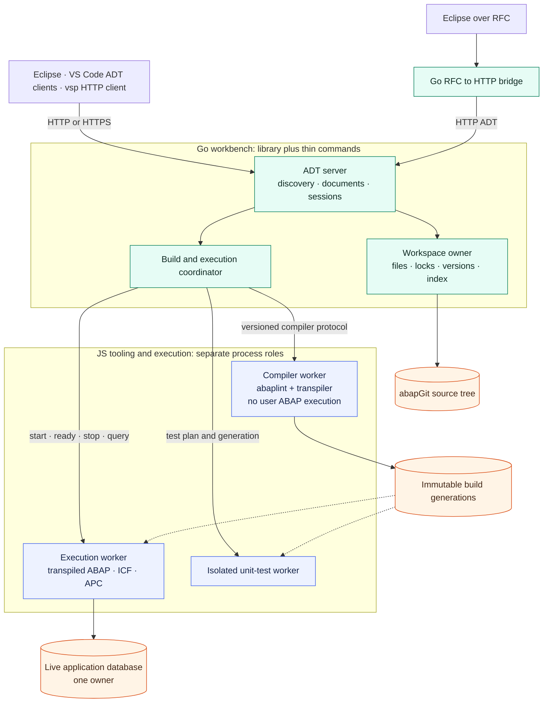
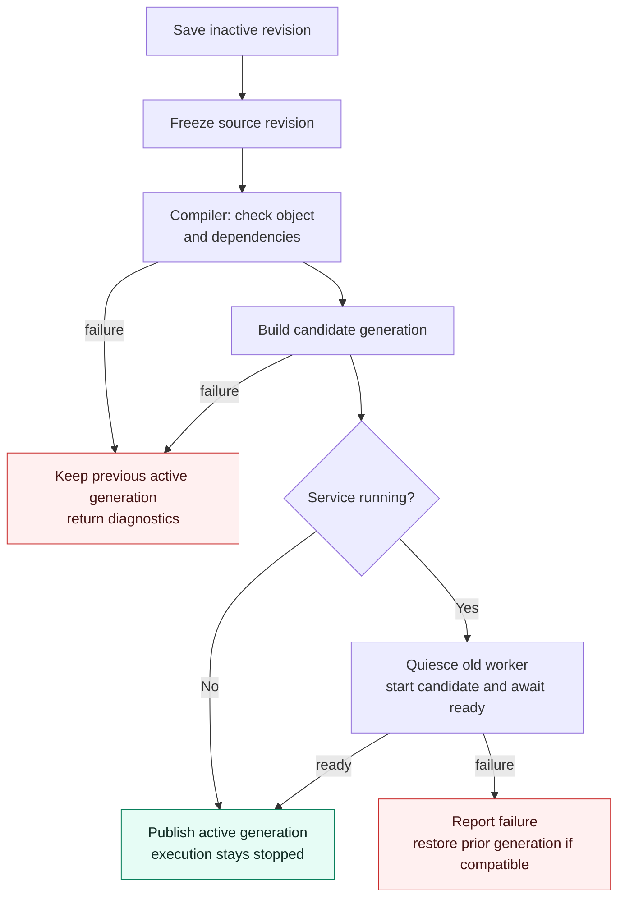
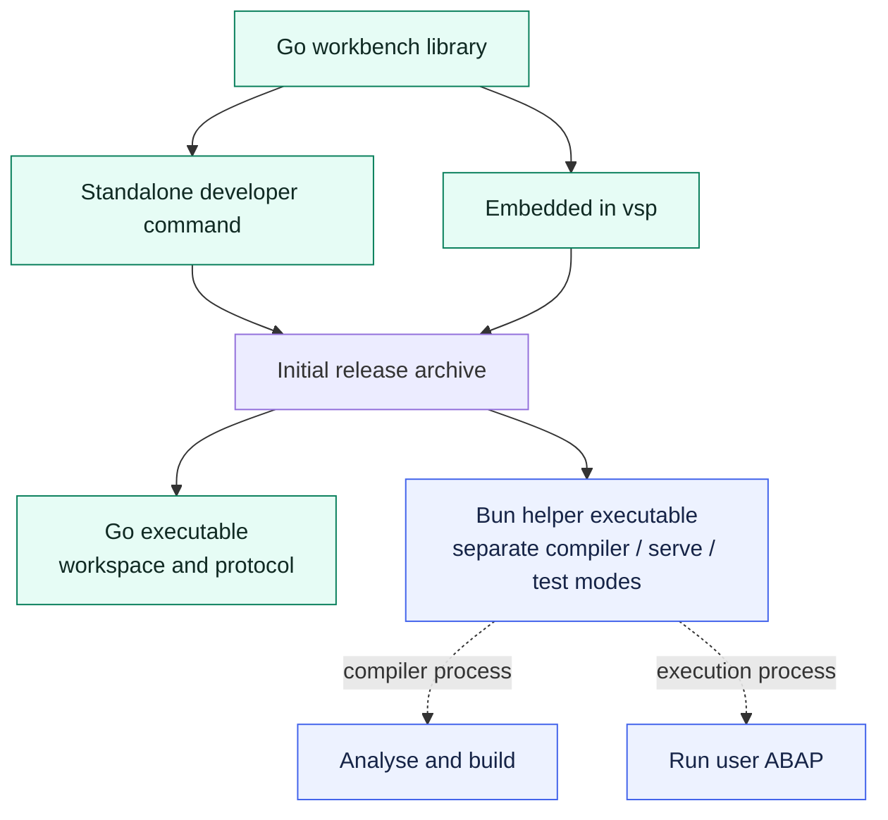

# Move the workbench to Go; keep the ABAP compiler intact

Independent architecture review · 2026-09-16 · Astra

Companion to [Where to cut](architecture-split.md), reviewed against the
working tree based on `a41a286`. This is a design and effort estimate, not an
implementation claim. Existing local runner changes were inspected as part
of that working tree. No runtime, service, or deployment was changed.

Document validation: all three diagrams parsed and rendered with Mermaid 11
in headless Chromium; relative links resolved and the repository's identifier
scanner found no matches in this report. No application tests were run for
this documentation-only change.

## Recommendation

**Yes: make the ADT workbench a Go library, with a standalone developer binary
and a vsp integration. Keep the existing ABAP semantic engine and transpiler
in JavaScript. Make ABAP execution a separately managed, optional process.**

This gives the useful part of the proposed “shift left”: a repository becomes
an IDE endpoint before it becomes a running ABAP system. Browsing and editing
do not require a database or executing user code. The same server package can
be used by a standalone command and by vsp, and reached by Eclipse, VS Code
clients implementing the supported ADT subset, and vsp's own HTTP client.

The important correction is that there are **three responsibilities**, even
if distribution eventually contains only two executables:

| Responsibility | Recommended owner | When needed |
| --- | --- | --- |
| Workspace and ADT protocol | Go | Throughout an IDE session |
| ABAP parsing, semantic checks, dependency analysis, transpilation | Existing JS tools, in a compiler worker | Outline, check, activation, build |
| Execution of transpiled ABAP and ownership of live application data | JS runtime, packaged with Bun after validation | Unit tests, application requests, supported program execution, live data preview |

**“No ABAP runtime” is achievable. “No JavaScript engine for a full workbench”
is a different and much larger project.** A compiler worker runs JavaScript
to analyse ABAP; it need not execute that ABAP or initialise its database.

## What the colleague's analysis gets right—and where the cut moves

The standalone-workbench product is the strongest idea in the original
report. Its ownership inversion is also useful: the workbench can control
execution lifetimes. But supervision and calling runtime services are not
mutually exclusive. It supervises the runtime **and** calls it for execution
results. The existing boundaries are less complete than the diagrams imply.

| Original claim | What the code establishes | Consequence |
| --- | --- | --- |
| Runtime touched only by unit tests | `ObjectStore` also imports `Data`; the router calls `data.query` for F8 | Separate data access explicitly |
| F8 uses the same child-runtime route | `Data.boot()` imports `output/init.mjs` in its own process, or accepts an injected database connection | F8 is not currently an RPC to `ServingRuntime` |
| Activation is pure source-tree work | ADT activation awaits `store.publish()` by default; that invokes `npx abap_transpile` and recycles a running child | Compilation remains required for today's activation semantics |
| The runtime already runs separately | Child mode is optional (`STG_SERVE=child`); `test/start.mjs` still initialises ABAP at top level and injects its DB into ADT | A true workbench-only entry point is still work |
| Runtime readiness is ADT discovery | `ServingRuntime` waits for a Node IPC `ready` message; the child exposes `/osd/serving`, not ADT discovery | Define a runtime readiness contract, distinct from workbench readiness |
| RFC bridge points at the runtime | ADT-over-RFC must terminate at the **ADT façade** | Route bridge → workbench; application traffic → execution runtime |
| One module graph makes Go integration trivial | vsp imports open-rfc-go, but bridge implementation uses that module's `internal` packages | Extract supported public entry points before embedding in vsp |
| Bun spike proves the complete distributable | The report proves runtime feasibility and a small compiled namespaced-import example | Dynamic user builds, compiler packaging, assets and lifecycle still need an end-to-end packaging spike |

Evidence: [ADT router](../tools/adt-facade.mjs),
[store](../tools/osd-store.mjs), [data access](../tools/osd-data.mjs),
[current entry point](../test/start.mjs),
[supervisor](../tools/osd-runtime.mjs), [child server](../tools/osd-serve.mjs),
and [Bun measurements](bun-spike.md). Function names are more durable than
line numbers: `adtRouter`, `ObjectStore.publish`, `Data.boot`,
`ServingRuntime.#spawn`.

### Size is useful for scope, not a conversion rate

At inspection, the four `adt-*.mjs` files total 3,777 lines and
`osd-store.mjs` adds 1,084: approximately **4.9k lines of primary façade and
store code**. Data, supervisor and serving entry point add 534. This excludes
the compiler, unit runner, cross references, persistence, proxies and assets.

The selected ADT/store/data/runtime test files total 2,929 lines. They are a
valuable specification, but several import JS implementation details and
cannot simply be pointed at a Go URL. Extract HTTP contract cases and port
store/session behaviour tests separately. Some activation tests deliberately
disable transpilation; they cannot establish execution-generation correctness.

## Target architecture

Solid arrows below are calls or ownership; dotted arrows are optional
integration or publication. All package and command names are proposals.

The ordinary ADT endpoint is the product. RFC is an optional adapter for
clients that need that connection mode. DIAG and general RFC function-module
execution remain separate projects; neither is a prerequisite for a Go ADT
workbench. The browser runtime remains JS and keeps its existing build path.

### Library first; two front doors

Use a separate Go module for the workbench, with public packages conceptually
named `workspace`, `adtserver`, `compiler`, and `execution`. Keep vsp as a
consumer, not a mandatory dependency of the workbench library.

- `adt-workbench serve --root <repo>`: standalone binary with an HTTP handler,
  configuration and explicit lifecycle management.
- `vsp workbench ...`: embeds the same packages and can register the same
  handler. Its existing ADT client can still use HTTP, preserving the client
  contract rather than inventing a private MCP-only variant.
- An optional distribution combines the workbench and RFC bridge. Cross-module
  `internal` imports must be replaced with a small supported API; copying a
  `main` into vsp is not the library design.

The library should return an `http.Handler` and expose explicit start/close
operations. It must not install process-global signal handlers, terminate the
host process, choose global ports, or silently spawn workers on import. One
workspace instance owns its locks, caches and children; vsp may host several.

This is an ADT server, not automatically an LSP server. VS Code support must
be checked against specific ADT clients and their exercised routes; generic
ABAP language extensions do not become compatible merely because HTTP exists.

## What can move to Go now?

| Capability | Go owns | JS dependency retained | ABAP execution needed? |
| --- | --- | --- | --- |
| Discovery, compatibility graph, system identity | Protocol and capability selection | None | No |
| Package tree, search by name, source read, ETag | Filesystem index and documents | None for basic lookup | No |
| Save, locks, create/delete | Workspace mutations and session state | None for raw persistence | No |
| Outline, references, test discovery | ADT rendering and source-version association | abaplint semantic results | No |
| Syntax check, including unsaved text | Request orchestration and diagnostics rendering | abaplint registry and dependencies | No |
| Activation with current behaviour | Coordinate validation, build and publication | abaplint and transpiler | Only recycle an already running service |
| ABAP Unit | Job lifecycle and result documents | Compiler/test plan; JS test execution | Yes, isolated process/database |
| F8 metadata | ADT response; consume DDIC metadata | Initially existing DDIC resolution where needed | No |
| F8 rows and freestyle SQL | Request limits and result documents | Initially current SQL/data provider | Depends on data provider |
| OData, ICF, APC, executed ABAP | Routing and process supervision | Transpiled program and ABAP runtime | Yes |

Raw file storage is not the difficult port. Client-visible semantics are:
inactive versions, ETags, XML namespaces and MIME versions, unique tree node
identities, include mapping, source positions, and errors the client actually
understands. Preserve the fixes already documented in [ADT surface](adt-surface.md).

### The old Go ports do not remove the compiler dependency

The user identifies `vsp/pkg/abaplint` and `vsp/pkg/jseval` as old ports.
Inspection supports treating them as references, not substitutes:
`pkg/abaplint` contains a lexer, statement matching and lint rules;
`pkg/jseval` contains a hand-built evaluator and selected JS feature tests.
Neither inspection establishes parity with the current whole-project
`@abaplint/core` registry, semantic dependency checks, or transpiler.

Do not budget their reuse as “compiler solved.” First prove identical
diagnostics, source locations, dependency failures and generated behaviour on
the actual supported corpus. Tokenisation or a passing lexer oracle is not
semantic activation parity. Useful parts may later accelerate basic indexing,
provided their scope is explicit.

### Could release-time JS/TS → Go remove JavaScript altogether?

It is a possible research direction, not a packaging step we have proved.
Removing TypeScript types does not resolve JavaScript's object/prototype,
closure, exception, string and asynchronous semantics. Translating abaplint
would create a compiler port to maintain alongside upstream, whether generated
code or handwritten code carries the burden.

Release-time generation **is** appropriate for declarative material: route
catalogues, MIME maps, compatibility edges, object-type metadata and fixture
schemas can become generated Go tables. Runtime checks of newly edited ABAP
cannot be precomputed at release time.

Bun's executable bundles code with a Bun runtime; it does not translate
abaplint into Go. This can meet “no Node/npm installation for users” while
retaining the existing compiler. See the [official executable documentation](https://bun.sh/docs/bundler/executables).

Keep a JS-to-Go experiment outside the delivery critical path. Give it a
bounded feasibility test against current abaplint, then decide from semantic
coverage and maintenance cost. No credible full-port delivery estimate follows
from the old lexer/evaluator ports alone.

## Activation: compilation is mandatory; execution can stay asleep

Today `store.activate()` checks the object and dependents and clears its
inactive mark; the HTTP handler subsequently awaits `publish()`. Publication
transpiles, then recycles a child if one is running. Therefore:

1. A source-only edit needs no compiler until semantic information is requested.
2. A syntax check needs the JS compiler worker, not the ABAP execution worker.
3. Activation preserving current semantics needs a successful build.
4. Activation need not start an execution worker that was stopped.
5. If a service was already running, activation must define when it switches
   to the new generation and what failure means.

The existing `transpileOnActivate: false` option is a useful separation seam,
not proof that skipping compilation preserves today's activation promise.
A lighter “validated source” mode could be offered explicitly later. Do not
report generation success while leaving an unbuildable program queued for its
first execution.

This diagram is a **target contract**, not a claim that the current code is
transactional. Clearing inactive state precedes transpile success today, and
builds write into mutable `output/`. A Go migration should first define a
source revision, a build generation and a publication result, rather than
replicate those ordering weaknesses across processes.

Compile immutable snapshots or lock the input revision while building. Publish
only if the result still belongs to the requested revision; a newer save must
not silently become active because an older build completed. Serialize
activation per workspace. Keep the previous artifact until publication is
settled. Rollback of code does not automatically roll back database schema or
data: schema-changing activation needs a separate policy.

## F8 in Go: feasible, with an explicit data owner

“F8” here means table/CDS data preview. Running a report, calling an ABAP class,
or executing a virtual element is a different operation and requires execution.

The cheap part is returning rows and ADT XML from a Go SQL provider. The hard
part is making those rows mean the same thing as the running application.

**Current persistence is not a shared live SQLite file.** The default uses
sql.js in memory; [osd-persist.mjs](../tools/osd-persist.mjs) imports a file at
startup and exports it on exit. A Go connection to that file sees persisted
state, not subsequent in-memory writes. Adding WAL to the Go connection does
not change this. The current split runner also injects the parent's connection
into ADT while optionally routing OData to a child; that path needs an explicit
consistency test before becoming the template for a second language.

| Data mode | Can Go serve without ABAP execution? | Recommendation |
| --- | --- | --- |
| DDIC columns/types | Yes, from metadata | Move early; reuse compiler-derived metadata where needed |
| Seed data or exported snapshot | Yes | Useful optional offline preview; label revision and snapshot status |
| Live rows in the current sql.js instance | Not by opening its saved file | Ask the owning runtime over a narrow query API |
| Shared file-backed SQLite after a backend migration | Yes for committed rows | Later option; test transactions, collation, busy handling and schema versions |
| Persisted SQL view implementing a supported CDS subset | Potentially | Consume compiler-produced schema; prove parity for that subset |
| ABAP-calculated values, exits, application behaviour | No | Execute in the ABAP runtime |

Separate SQLite connections ordinarily see committed state; a read transaction
can retain its snapshot. This must be distinguished from seeing another
connection's uncommitted work. See [SQLite isolation](https://www.sqlite.org/isolation.html).

Do not infer full Open SQL support from the [database seam](db-backends.md).
Transpiled ABAP has already lowered some constructs before they reach that
seam; an arbitrary ADT freestyle statement has not. The current
`openSqlToSql()` itself handles a narrow textual subset. A Go preview provider
must define supported grammar, client handling, decimal/CHAR/null/binary
representation and limits. A leading `SELECT` check is not a complete read-only
SQL policy; use a read-only connection and bounded statements/results.

**First release: retain the current SQL semantics behind a runtime query API.**
Add Go snapshot preview independently. Move live storage to Go only if the
measured benefit justifies migrating database ownership and transaction
semantics. vsp already depending on `modernc.org/sqlite` helps packaging; it
does not make a sql.js instance shareable.

## Process contracts and packaging

Prefer coarse semantic operations over exposing abaplint objects to Go.

| Boundary | Minimal contract | Key invariant |
| --- | --- | --- |
| Go → compiler | `initialize`, `outline`, `check`, `build`, `discoverTests` | Every result identifies source revision and compiler version |
| Build → execution | Manifest, artifact directory, schema fingerprint, runtime ABI | Runtime cannot load half-written output |
| Go → execution | `start`, `ready`, `query`, `runUnit`, `quiesce`, `stop` | Responses identify generation; tests get isolated data |

Use a versioned request/response protocol over child stdin/stdout for compiler
jobs, with request IDs, cancellation, bounded messages and stderr for logs.
For runtime data/control use a local HTTP API or another explicitly specified
local channel. Do not make Go emulate Node's private IPC protocol. The current
`/osd/serving` endpoint is a starting point, not the full control contract.

Keep the compiler worker warm after first semantic use: the store currently
caches a registry and records why incremental invalidation once missed broken
callers. Recreating it for every outline or keypress loses that advantage.
An idle timeout can release it; measure latency before choosing the timeout.

Two process roles can use the same helper executable in different modes. That
keeps the first distribution to two binaries without mixing compiler state
with user program execution. If “only real runtime in the Bun binary” is a
strict packaging requirement, ship a separate compiler helper: three binaries
are clearer than disguising the compiler as Go.

First ship an archive. Embedding and extracting the helper from the Go binary
can follow, with hashes, platform/version selection and cleanup. One downloadable
file is a distribution property; it does not imply one process or a pure-Go
compiler. Native `bun:sqlite` is supported in compiled executables according to
[Bun's documentation](https://bun.sh/docs/bundler/executables), but switching
OSD's database adapter remains implementation work.

The packaging spike must load newly generated external modules after the
helper was built, including namespaced filenames and assets. The local Bun
report's build-time resolver does not by itself prove runtime resolution of
future imports. It must also run the compiler without invoking an unshipped
`npx`, locate compiler libraries/configuration, retain source maps for unit-test
errors, and start a fresh worker for a new generation. Do this on a machine
without the developer checkout or Node installation.

## Migration: replace ownership in stages

1. **Extract the contract before changing language.** Build a workbench-only
   JS entry point with no top-level ABAP initialisation. Record its exercised
   HTTP behaviour and introduce compiler/data/execution adapters.
2. **Make Go the public front door.** Port discovery, sessions, repository
   identity and read-only browsing; proxy remaining routes to the existing
   façade. This intermediate product reduces risk but is not yet Go ownership.
3. **Transfer writes once.** Give Go exclusive ownership of locks, ETags,
   inactive state and file mutation. Replace legacy write handlers with calls
   through that owner; never allow two independent lock tables over one tree.
4. **Extract semantic work.** Route outline/check/build to the JS compiler
   worker and render ADT documents in Go. Preserve source-position conventions,
   includes and dependent-object checks.
5. **Make execution optional in practice.** Implement readiness/generation
   contracts, isolated unit runs, live queries and application proxying. Keep
   existing ICF/APC capabilities in scope: the current small `osd-serve.mjs`
   mounts OData only, while `test/start.mjs` mounts additional services/channels.
6. **Package and retire the legacy façade.** Run client acceptance and clean
   installation tests, then remove the temporary proxy dependency. Existing
   unsupported editors stay explicitly unsupported; the port is not a promise
   to finish every ADT feature.

Discovery and compatibility must reflect installed providers. A bare workbench
must not advertise an executable unit-test capability whose provider is absent.
Preserve stable identities and test cold/warm client caches: the earlier ADT
work showed that a compatibility graph can decide behaviour before any request
for the missing feature appears.

## Estimate and decision gates

Engineering estimate, **not a benchmark or a commitment**. One experienced
engineer familiar with the existing implementation; person-days include tests
and review. Scope: current supported ADT surface, existing semantic tooling,
one initial desktop platform, optional execution and a standalone/vsp entry
point. Excludes full Go ABAP compiler, new DIAG behaviour, general RFC execution,
new ADT editor families and a replacement database engine.

| Phase | Person-days | Acceptance evidence |
| --- | ---: | --- |
| 0. Contract extraction and packaging feasibility | 3–5 | Workbench starts without ABAP initialisation; helper compiles and loads a later-generated module |
| 1. Go library, listener, workspace index, discovery and read path | 5–8 | Same tree, identity and source results from HTTP clients |
| 2. Sessions, writes, create/delete and semantic-worker integration | 8–12 | Save/read/ETag and outline/check parity; one mutation owner |
| 3. Activation publication and build generations | 7–11 | Broken dependency/build stays inactive; successful activation binds to the right revision |
| 4. Execution lifecycle, unit tests, F8 and application forwarding | 6–9 | Correct generation, isolated unit DB, live preview agrees with application writes |
| 5. Full contract and live-client regression | 5–8 | Eclipse and selected VS Code/vsp flows, HTTP and RFC, including cold metadata cache |
| 6. Release packaging, vsp wiring and operational docs | 4–7 | Clean-machine installation and shutdown/restart behaviour |
| **Base total** | **38–60** | Current supported surface migrated |

Allow approximately 20% integration contingency: **46–72 person-days**, or
roughly **9–15 working weeks for one engineer**. Phase 0–2 is a useful
**16–25 day preview** with browsing/editing/checks; it is not activation and
runtime parity. These numbers should be revised after phase 0 and again after
one real save → activate → unit-test cycle crosses the proposed boundaries.

Optional additions, outside that total:

- Go preview of a compiler-produced snapshot and a bounded SQL subset: **3–6
  days**, assuming schema/seed export already exists.
- Migration to shared native SQLite with transaction and preview parity:
  **10–20 days**, lower confidence; database lifecycle is the risk.
- Additional Windows/macOS packaging and process-lifecycle hardening: **5–10
  days total** as an initial allowance, revised after the platform spike.
- Full semantic compiler port or automatic JS/TS→Go pipeline: separately scoped
  research; no defensible delivery date from the evidence inspected here.

Do not estimate this by translating 5k JS lines at a daily rate. Compatibility
work, cross-process state and packaging failures dominate the uncertainty.
Likewise, no startup/RAM/throughput improvement is measured by this report.

### Gates worth paying for first

| Gate | Pass condition | If it fails |
| --- | --- | --- |
| Product separation | Browse/save with no database, transpiled output or execution worker | Untangle the JS entry point before porting |
| Compiler bridge | A renamed method breaks the same dependent callers and produces matching positions | Retain JS semantic authority; fix revision/cache handling |
| Bun packaging | Compiler plus later-generated namespaced module works without Node/npm | Keep a Node helper temporarily; do not promise a self-contained release |
| Data ownership | Runtime write is visible to subsequent live F8, and unit writes are isolated | Keep queries inside the owning runtime |
| Activation concurrency | Save B during build A never silently activates B or executes stale artifacts | Freeze revisions and serialize publication before release |
| Lifecycle | Crash/recycle preserves the ADT session and reports the actual loaded generation | Keep the legacy runtime adapter until this is reliable |

Measure cold/warm discovery and outline latency, first check, activation,
first/warm F8, unit startup, idle and peak RSS, and shutdown/recovery on the
same source corpus and machine. Compare source-only use separately from full
execution: otherwise the benefit of avoiding a runtime is hidden by running it
in every benchmark.

## Decision

Proceed with **Go as the workbench owner**, beginning with a short contract
and packaging spike. Preserve the existing JS compiler as the semantic
authority and make ABAP execution lazy. This produces a standalone developer
tool and an embeddable vsp library without making a new ABAP compiler the
prerequisite for either.

The valuable shift is that **a repository can be a system for an IDE before
it is a running application**. Keep that promise precise: files and protocol
in Go; semantic compilation when needed; execution and live data when asked.
