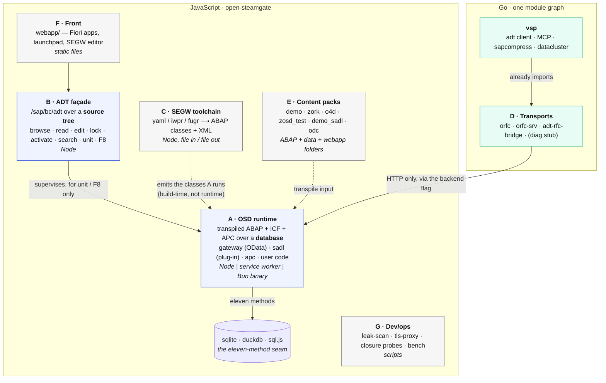
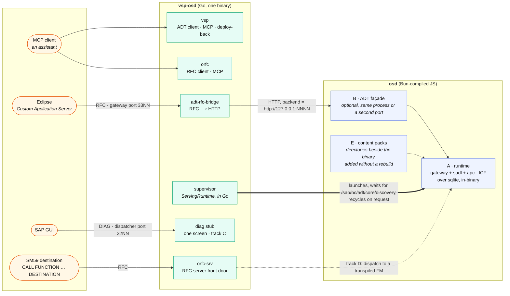

# Where to cut: the sub-projects of OSD, and the sidecar

An analysis of how this project divides, written 2026-09-16 against the code as
it stands. The claim throughout is that the lines are not a proposal — they
are seams that already exist and are already crossed by a process boundary, a
bundle boundary or a zero-reference boundary. Each one below names its
evidence. The second half is what that means for a `vsp-osd` sidecar binary.

---

## The measurements the whole thing rests on

Seven facts, each one cheap to re-check:

1. **The ABAP subsystems do not reference each other.** `src/gateway` → `src/segw`:
   0 references; `segw` → `gateway`: 0; `gateway` → `sadl`: 0. The only edges
   are `sadl` → `gateway` (1: SADL plugs into the dispatcher as a data provider)
   and `http` → `gateway` (1: the one ICF handler). By size: segw 5.9k lines,
   gateway 4.6k, sadl 1.6k, osd 0.7k, apc/http/icf under 100 each.
2. **The ADT façade does not import the OData runtime.** `tools/adt-facade.mjs`
   imports express, its own `adt-*.mjs` documents, and `osd-store.mjs`. The store
   imports `@abaplint/core` for parsing and a `ServingRuntime`. The runtime is
   touched in exactly one façade operation: `store.unit` (running ABAP Unit).
   Browse, read, edit, lock, activate and search are pure Node over a source
   tree plus abaplint.
3. **The runtime is already a separate process.** `tools/osd-runtime.mjs` is a
   supervisor: the serving runtime is a child (`osd-serve.mjs`), recycled on a
   successful transpile, and "every instance is (a source tree, a port, a
   database) and nothing here assumes there is one of them" — its own words.
   Two run side by side today.
4. **The browser build proves what the runtime is.** `scripts/build-preview.mjs`
   bundles `output/` (the transpiled ABAP), the ICF services and APC channels
   from `osd-icf.mjs`, and a seed — into a service worker, with no express and
   no ADT façade. That bundle serves every Fiori app on GitHub Pages. So the
   runtime is a self-contained unit that needs neither Node nor a server.
5. **The database is an eleven-method seam** (`docs/db-backends.md`) with three
   implementations — sqlite, DuckDB, sql.js — chosen by one environment variable.
6. **vsp already depends on open-rfc-go** (`go.mod`), and `open-rfc-go` holds
   the RFC client, the RFC server, the ADT bridge and the tap. They are one Go
   module graph today.
7. **OSD compiles to one binary.** `docs/bun-spike.md`, part two: `Bun.build({
   compile, plugins })` with a five-line resolver builds a binary that runs the
   whole thing; the `%23` defect is a bundler footnote, not a blocker.

Everything below is arranged so that no line is drawn where one of those seven
would have to be invented.

---

## The pieces

### A. The OSD runtime — "the system"

What it is: the transpiled ABAP (`src/gateway`, `src/sadl`, `src/http`,
`src/apc`, plus whatever user code is in the transpile unit), the open-abap
libraries underneath, the ICF/APC mounting from `osd-icf.mjs` / `osd-apc.mjs`,
a `DatabaseClient`, and a seed. It answers OData and ICF paths and speaks APC.

Why it is a unit: fact 4 — it is exactly what the service worker bundles, and
it runs there without a server. Fact 3 — on Node it is already a child process
keyed by (source tree, port, database).

Its interfaces are three and all are narrow: HTTP in (ICF paths), websocket in
(APC channels), and the eleven-method database seam out. It has no opinion
about ADT and no opinion about SEGW.

**Driven separately today:** `osd-serve.mjs` with a tree, a port and a database
file; or the service worker; or — per fact 7 — a Bun-compiled binary. Two
instances coexist. This is the one piece that belongs in the sidecar.

### B. The ADT façade — "the workbench server"

What it is: `adt-facade.mjs` (2.0k), `adt-documents.mjs` (1.5k), `osd-store.mjs`
(1.1k), `adt-session.mjs`, `adt-source-properties.mjs`: the `/sap/bc/adt`
surface documented in `adt-surface.md`.

Why it is a unit: fact 2. It parses with abaplint and serves a source tree; it
does not import the runtime. It **supervises** A (fact 3) and calls into it
for one thing: running unit tests, and by the same route F8. Everything an IDE
does to *code* — open, edit, lock, activate, search, the tree — works with no
runtime process at all.

That inversion matters for the split: B is not a client of A, it is A's
supervisor. The clean packaging is B as `@osd/adt-facade` that *optionally*
launches an A. A source tree with no runtime is still a workbench.

**Driven separately today:** `test/start.mjs` mounts `adtRouter` on express
beside the runtime, but nothing in the router requires that. `STG_PORT`
already lets two run side by side.

### C. The SEGW toolchain — "SEGW without the GUI"

What it is: `stg-compile.mjs` (1.0k), `segw-gen.mjs` (1.7k), `segw-gen-mapping`
(1.0k), `segw-tables`, `segw-tree`, `segw-registry`, `segw-shlp`, `cds2ddic`
(0.7k): abapGit XML and YAML in, ABAP classes and XML out, byte-identical to
21 real projects by test. Plus `src/segw/` (SEGW as an ABAP application over
53 tables) and `webapp/segw/` (the editor).

Why it is a unit: fact 1 — zero references between `segw` and `gateway`, in
either direction. It is a compiler with a GUI, and the OData runtime is one of
its *outputs*, not a dependency. The generators run with no database, no
server and no transpile.

**Driven separately today:** `npm run stg:compile -- x.stg.yaml --out dir`
and every `segw:*` script. It is the most independent piece here and the one
with the clearest external audience — anyone who wants SEGW without SAP.

### D. The transports — Go, and already one graph

What it is: in `open-rfc-go`, the client (`orfc`, with MCP), the server front
door (`orfc-srv`: type-T registered and type-3 "a system"), the ADT bridge
(`adt-rfc-bridge`), the tap, and — track C — a DIAG stub. In `vsp`, the ADT
HTTP client with CSRF and session affinity, the MCP server, `sapcompress`
(LZH/LZC decode), `datacluster`.

Why it is a unit: fact 6. vsp imports open-rfc-go already. Every one of these
is Go, standard library, and they share the same NI/CPIC packages. This is not
a split to make — it is the split that exists, and the question is only what
one binary exposes.

### E. Content packs — what makes it a demo

`src/demo` (Travels/Bookings, 1.9k), `src/demo_sadl`, `src/demo_odc`,
`src/zosd_test`, and the `local/` transpile inputs (`o4d`, `o4d-apc`, `zork`).
Each is a folder of ABAP, `data/*.tabu.json` seed rows, and a `webapp/`
entry. They are inputs to A's transpile unit (`abap_transpile.json`), not
part of A. Today they are all in one unit, which is why `objects are not
deduplicated across input folders and collisions are silent` is a listed
hazard (CLAUDE.md, backlog 1.5).

**The cut:** a content pack is (ABAP folder, seed, webapp, a manifest naming
it). The runtime takes a list of packs. The demo becomes one pack among
several rather than the default shape of the system.

### F. Front, G. Dev/ops

`webapp/` is plain files against SAP's CDN; it is static and separable
trivially. `tools/osd-leak-scan.mjs`, `osd-tls-proxy.mjs`, the closure probes
and benchmarks are scripts for people who develop this, and stay in the
monorepo as such.

---

## Where the lines go, and where they deliberately do not

| line | why here | what stays coupled, on purpose |
| --- | --- | --- |
| **A ∥ B** — runtime vs façade | fact 2, 3, 4: B does not import A and already supervises it as a child | B's `unit`/F8 need an A; the supervision contract (`ServingRuntime`: recycle, whenReady) is the interface, keep it |
| **A ∥ C** — runtime vs SEGW | fact 1: zero references | C emits the classes A runs; that is a build-time relation, not a runtime one |
| **A ∥ E** — runtime vs content | E is transpile *input* | the transpile unit is the seam; a pack manifest makes it explicit |
| **D ∥ everything JS** | language boundary, and D already talks to A over HTTP only (`--backend`) | nothing: HTTP is the whole contract, which is what makes the sidecar possible |
| **B and C share `src/segw` + `webapp/segw`** | SEGW-as-an-app is served by A and edited through B | leave it: it is one app that happens to be about the compiler |

Two lines that look tempting and should **not** be drawn:

- **Do not split `gateway` from `http`/`icf`.** The one `http → gateway`
  reference is the ICF handler that makes the classes run in a real system's
  ICF too. That is the project's whole thesis; the coupling is the feature.
- **Do not split `sadl` out of A.** It is a data-provider plug-in with one
  reference into the dispatcher. It is *excludable from the transpile unit*
  (a pack that some systems do not include), which is different from being a
  separate service.

---

## The sidecar: `vsp-osd`

The shape falls out of facts 6 and 7. Two binaries, one command:

**The Go binary** is already one module graph; `vsp-osd` is a `main` that
registers the existing commands and adds one: `vsp-osd up`, which launches
the OSD binary, waits for `/sap/bc/adt/core/discovery`, points
`adt-rfc-bridge` at it, and listens on `33NN` (RFC) and `32NN` (DIAG) — a
system on a laptop that Eclipse, SAP GUI, an SM59 destination and an MCP
client all reach. The supervision logic is `ServingRuntime` rewritten in Go,
which is short: spawn, wait for ready, recycle on request.

**The JS binary** is A (and B, if wanted) through `Bun.build({compile,
plugins})`, proven. sql.js goes in the bundle as the browser build already
does; DuckDB stays out of the binary (native module) and is a "point me at a
process" mode instead. Content packs are directories the binary reads, not
things compiled in — so a pack is added without a rebuild.

**Ship as:** one archive per platform with both binaries, or the Go binary
embedding the JS binary via `embed.FS` and unpacking it on first run. The
second is one file to distribute and the right default; the first is what to
build first, because it changes nothing about either binary.

**What is deliberately not in the sidecar:** C (the SEGW toolchain) and G.
C is a compiler people run in a repository, not a service, and it wants to
stay `npm run stg:compile`. Bundling it would be packaging a build step.

---

## What can be driven separately, concretely

Each of these works today or needs only the flag named:

| subsystem | drive it alone by | needs |
| --- | --- | --- |
| A. runtime | `osd-serve.mjs <tree> <port> <db>`, or the SW, or the Bun binary | a transpiled `output/`, a DB file |
| B. façade, read/edit/activate | mount `adtRouter` with no `ServingRuntime` | a source tree; **no runtime** |
| B. façade, unit/F8 | the same, with a runtime to supervise | an A |
| APC channels | `mountChannels` from `osd-apc.mjs`; `src/apc` references no gateway class | an A with the channel classes |
| SADL | include or exclude `src/sadl` from the transpile unit | nothing else changes |
| SEGW app | `src/segw` + `webapp/segw` as a pack | an A |
| database | `STG_DB=sqlite\|duckdb`, `STG_DB_PATH` | the eleven methods |
| RFC destinations | `.local/rfc-destinations.json`: local / replay / live / record / fallback | open-rfc for `live` |
| C. toolchain | every `segw:*` and `stg:compile` script | a file tree, nothing running |
| D. bridge | `adt-rfc-bridge --backend <url>` | any HTTP ADT façade — A+B here, or a real system |

The second row is the one to underline. A workbench over a source tree, with
no runtime at all, is a real product on its own: it is what an IDE needs to
edit ABAP offline, and it is already written.

---

## Order of operations

Not a plan to do all of it — a sequence in which each step is useful alone.

1. **Make the packs explicit** (E). A manifest per content folder; the
   transpile unit takes a list. This is the smallest change and it retires the
   "collisions are silent" hazard.
2. **Cut B from A at the package level.** `@osd/adt-facade` exporting
   `adtRouter` and `ServingRuntime`; `test/start.mjs` becomes a consumer.
   Nothing moves; an import path does. Then a source tree serves ADT with no
   runtime, which is the demo of the cut.
3. **`osd` as a Bun binary** — A first, then A+B. The spike proved it; this is
   the packaging.
4. **`vsp-osd up`** in Go: the supervisor, then the bridge pointed at it.
   Track C's DIAG stub lands here when it exists.
5. **C stays a toolchain.** Give it its own `package.json` inside the monorepo
   only when someone outside wants to `npm install` it — not before.

Steps 1 and 2 are refactors with tests already in place. Step 3 is the spike
made real. Step 4 is new code, but small, and it is where the whole family
becomes one command.

## See also

- [`db-backends.md`](db-backends.md) — the eleven-method seam
- [`bun-spike.md`](bun-spike.md) — the binary, measured
- [`adt-surface.md`](adt-surface.md), [`adt-over-rfc.md`](adt-over-rfc.md) — what B and D answer
- [`backlog.md`](backlog.md) — tracks A–D and the standing list
- [`layers-we-own.md`](layers-we-own.md) — what the Go siblings carry
