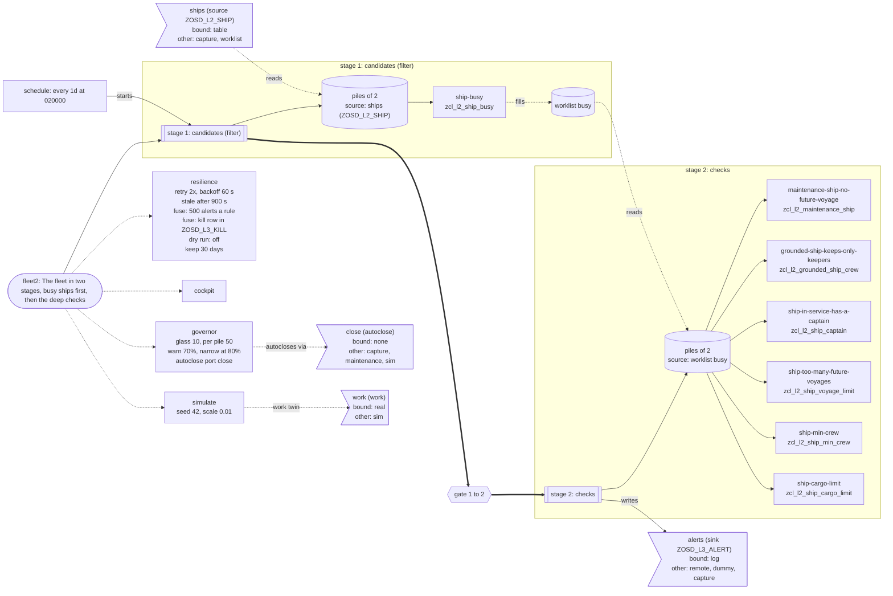

# DSL L3: a set of rules, run as one unit

Status: slice 1, 2026-10-01; ports and adapters; piles and set parameters (slice 3a), 2026-10-02; stages, filter stages with a worklist, and a schedule (slice 3b), 2026-10-02; resilience: retries, the doctor, fuses, a dry run and retention (slice 5a), 2026-10-02; a simulated twin of the work (slice 5d), 2026-10-02; chaos profiles and overrides for the twin (slice 6c), 2026-10-03; range set parameters, 2026-10-03. Built on L2 (`docs/dsl-l2.md`) and the background job facade
(`docs/job-standard-fms.md`, `docs/gui-reports.md`).

L2 compiles one rule into a check class, `check( iv_date ) RETURNING rt_alerts`. L3 is the layer
above it: a **rule set** that runs as one unit, a durable alert log, and a trace from every alert
to its rule line.

## The manifest

A set is one YAML file, `<set>.l3.yaml`, beside (or anywhere relative to) its rules:

```yaml
set: fleet                       # a-z, 0-9, _; at most 13 characters
title: Every fleet rule, checked for one date
date: $date                      # or `today`: $date, the current date when the caller passes none
class: zcl_l3_fleet              # optional; default ZCL_L3_<SET>
report: zl3_fleet                # optional; default ZL3_<SET>, at most 19 characters
rules:
  - rule: maintenance_ship.l2.yaml
  - rule: ship_max_cargo.l2.yaml
    enabled: false               # optional; default true
```

`node tools/dsl-l3.mjs build|check <set.l3.yaml> --out <dir>` compiles it. Every error names the
manifest file and line (`file:line: message`):

- unknown keys, a set name, class or report that does not fit, a `date` other than `$date` or
  `today` (other parameters are `params:`, see "Piles and set parameters");
- a rule file that does not exist; the same rule twice, whether as the same file by two paths,
  two files holding the same `rule:` name, or two rules generating the same class;
- a rule that does not compile: the message carries the L2 compiler's own `file:line: message`;
- a rule whose generated check class is missing or **stale**: the model hash the class's trace
  carries must equal the hash the rule compiles to now, so the runner never names a version the
  deployed class is not;
- every rule disabled, or a name too long for the log's columns.

A disabled rule is still compiled and checked; the runner does not call it and names it in a
comment that traces to its manifest line.

The YAML is read the way L2 reads a rule (js-yaml, FAILSAFE schema, `lineIndex` for the lines).

## What is generated

Through ZCL_OSD_TPL (`recipes/l3-set/template.tpl`, `recipes/l3-job/template.tpl`), each with a
trace sidecar (`.clas.trace.json`, `.prog.trace.json`): one entry per output line, `line` ->
`template_line` -> `node` -> `set_line`. A line about one rule (its constants, its entry in
`rules( )`, its branch of `run_rule`) traces to the rule's line in the manifest; the date handling
to `date:`; the rest to `set:`. The sidecar also lists each rule's file, class and model hash.

**`ZCL_L3_<SET>`**, 7.02 ABAP:

- `CONSTANTS c_rule_<n>` and `c_hash_<n>`: the rule's name and its L2 model hash, the
  `sha256:<hex>` the rule's own trace sidecars carry (`modelHash(renderModel(compiled))` in
  `tools/dsl-l2.mjs`, the function the L2 sidecars are written with);
- `run( iv_date, iv_mode ) RETURNING rs_result`: a run id (`CL_SYSTEM_UUID`), then per rule either
  `run_rule` in this step (mode `S`) or `submit` (mode `P`); `rs_result-rules` has a row per
  rule with its status and alert count;
- `run_rule( iv_rule, iv_date, iv_run )`: one rule by name, a static `CASE` over the rules (no
  dynamic call), its `check`, then `write`;
- `collect( is_result )`: mode P's second step (below);
- `rules( )`: the enabled rules, their hashes and job names.

**`ZL3_<SET>`**, a classic report with `P_RULE`, `P_DATE`, `P_RUN`, calling `run_rule`. It ends
with `MESSAGE ... TYPE 'E'` when the rule did not end `DONE`, which aborts its job.

## The alert log

`ZOSD_L3_ALERT` (`src/dsl/zosd_l3_alert.tabl.xml`):

| key | field |
|---|---|
| MANDT, SET_NAME (CHAR 16), MODEL_HASH (CHAR 71), CHECK_DATE, PILE_NO (INT4), ALERT_SEQ | RULE_NAME (CHAR 60), ALERT_TEXT (STRG), RUN_ID, RUN_TS, RULE_CLASS, RULE_FILE, RULE_LINE |

The rule is not part of the key: its model hash already names it. The hash is a SHA-256 of the
compiled rule, which holds the rule's name, and a set refuses two rules of one name, so one hash
is one rule of one set. A system refuses a key longer than 120 ("Key length > 120 (restricted
functions)"), and it counts the key as the sum of the key fields' DD03P `LENG`: a CHAR its
characters, an INT4 **10** (its LENG, not its four bytes), MANDT 3. Measured on A4H on
2026-10-02, when `ZOSD_L3_PILE` was refused at 121 by exactly that count; earlier text here
counted an INT4 as 4 and was wrong. Leaving the rule out keeps this key at 3 + 16 + 71 + 8 + 10
(ALERT_SEQ) = 108; with the rule in the key (and a 30-character set name) it was 176, and A4H said
so. Since the pile planner the key also holds `PILE_NO` (INT4) after `CHECK_DATE`: **118**
(3 + 16 + 71 + 8 + 10 + 10). That passes, and it is tight: one more key field of any width, or a
wider set name, does not fit. `tools/osd-ddic-reserved.mjs` now checks this count for every
customer table in the tree. A set without `piles:` writes pile 0.
The set name is 16 wide because a set name has at most 13 characters.

The column is `RULE_NAME`, not `RULE`: `RULE` is a reserved word in a system's dictionary, and
A4H refused to activate the table with it ("RULE is a reserved word (choose another field
name)", 2026-10-01). `tools/osd-ddic-reserved.mjs` now refuses such a field name before it
leaves the tree.

`ALERT_SEQ` is the position of the alert in the rule's `check` answer, which is ordered (L2's
`ORDER BY` plus `SORT`). `RULE_FILE` and `RULE_LINE` are the rule file and its `alert:` line.

**Writes are idempotent per (rule, model hash, check date)**, and per pile in a piled set.
`write` does a `MODIFY` per alert on the full key, then `DELETE`s the rows of the same (set, rule,
hash, date, and pile when the set has `piles:`) past the last alert of this run, all in the caller's LUW (one dialog step in mode S, the job's own step in mode P). A
rerun, or a retried job, leaves exactly that run's alerts under that rule version, each row naming
the latest run. A rerun that finds fewer alerts (the data changed) drops the rows it no longer
finds.

**Old versions are kept, not superseded.** A changed rule has a new model hash; its rows are a
new (rule, hash, date) group, and the rows under the old hash stay as they were (with the run
that wrote them). The log is a history per rule version. Nothing here deletes the rows of
another hash or date.

A sequence key rather than an alert hash: two identical alert lines of one rule stay two rows, and
`MODIFY` on the sequence plus the tail `DELETE` makes the group equal to the latest answer even
when its alerts changed. With a primary key, an `INSERT` in place of the `MODIFY` cannot create a
duplicate row; what it does instead is fail on the rerun (`sy-subrc` 4, counted in
`ty_rule-failed`, status `WRITE-FAILED`) and leave the first run's rows in place. The test
asserts both.

The rows carry no client: the kernel adds it on a system; this runtime is single-client by a
settled decision (ANORMALIES `no-implicit-mandt`).

## Mode P: one background job per rule

(With `piles:`, one job per rule and pile, `L3_<SET>_<nn>_<pppp>`, and `collect( )` reads the
plan: see "Piles and set parameters". This section is the set without piles.)

Only the public jobs API, as a caller (agreed with the jobs code's owner):

- per rule `JOB_OPEN` (job name `L3_<SET>_<nn>`), `SUBMIT ZL3_<SET> WITH p_rule ... WITH p_date
  ... WITH p_run ... VIA JOB ... NUMBER ... AND RETURN`, `JOB_CLOSE` with `STRTIMMED = 'X'`; the
  caller's step commits, and each job then runs in its own step and LUW;
- `collect( )` finds the run's jobs with `BP_JOB_SELECT` (`BTCSELECT-JOBNAME = 'L3_<SET>_*'`,
  `USERNAME = sy-uname`), matches them by name and count, reads each state with `SHOW_JOBSTATE`
  (`FINISHED`, `ABORTED`, `RUNNING`, `READY`, `SCHEDULED`, `PRELIMINARY`, `NO-JOB`), and for a
  finished rule counts the rows its job wrote under this run id. It is one read, not a wait loop:
  the caller calls it when the jobs have run. Nothing polls.
- The rules of a set do not depend on each other, so no job waits for another; an order between
  rules would be a predecessor (`PRED_JOBNAME` / `PRED_JOBCOUNT`) on `JOB_CLOSE`, not a poll.
  `BP_JOB_RELEASE` is not used.

**One generic report per set, with the rule as a parameter**, rather than a report per rule: the
dispatch from rule name to check class is the runner's static `CASE`, so mode S and mode P run the
same `run_rule`, the set adds one program instead of one per rule, and the job's input names the
rule in plain text. A fully generic report for all sets would need a dynamic call to a class named
at run time; the static form keeps everything visible to the syntax check and the trace.

This runtime executes jobs on a durable file database only (`STG_DB=file`); the in-memory,
DuckDB, HANA, PostgreSQL and browser modes refuse `JOB_CLOSE`. Mode S runs everywhere.

Building the runner found `ANOMALY-2026-10-01-submit-via-job-char-operands`: the SUBMIT lowering
passed a job name and count of SAP's own types (`TBTCJOB-JOBNAME`, `-JOBCOUNT`) by reference to
STRING parameters, a syntax error here and correct ABAP on a system. The lowering now converts
them, as it already did for selection values.

## Explain

```
node tools/dsl-l3.mjs explain <set>/<rule>/<model hash>/<check date>/<pile>/<seq> [--set <set.l3.yaml>]... [--db <sqlite file>]
```

prints alert -> set manifest line -> rule and version -> rule line -> the lines of the generated
check that trace to that line -> the alert's pile -> the runner lines that trace to the rule's
manifest line. The hash may be cut to eight or more hex digits. The pile is the alert row's
`PILE_NO`; the five-part key of before piles (`<set>/<rule>/<hash>/<date>/<seq>`) means pile 0.
The `pile` line says whether the rule is piled; with `--db` it adds the plan row's range and
status. `--db` reads the alert's text and run from a file
database. A hash that is not the current version's is looked up in git history (`git log -S` on
the check class's sidecar), and the rule and class are read at that commit; a hash no version
carried is an error.

## Proof

`test/dsl-l3.mjs` (registered in `test/suites.d/infra-misc.json`, 107 tests, the ports' and the piles' among them, see "Ports and adapters" and "Piles and set parameters"):

- the committed runner and report are a fresh build, and `check` notices a changed byte; the
  compiler names no domain word; each refusal above at its line;
- the trace: one entry per line, every line naming a rule traces to its manifest line;
- on a file database, rows that make six rules alert (seven alerts): mode S's log is exactly the
  union of the six `check` answers called directly; a rerun leaves it identical with every row on
  the new run; a rerun with fewer alerts drops the tail; mode P submits six jobs, `collect` sees
  them `READY`, the worker runs them as six steps, `collect` sees them `FINISHED` with the same
  counts, and the log equals mode S's; a second parallel run leaves it again;
- a changed rule (a copy of one rule with another alert text, so another hash) adds its rows under
  the new hash and keeps the old version's rows with their old run;
- `explain` resolves an alert to the rule's `alert:` line and the check lines tracing to it, from
  the API and from the command with `--db`; an unknown hash is refused; an older hash is found
  in git history (skipped in a clone without that history);
- mutants of the generated runner, each transpiled alone under another class name, with a control
  copy that passes the same check: `INSERT` for `MODIFY`, one rule dropped from `rules( )`, and a
  wrong model hash constant. Each makes the log check report a problem.

### The ABAP Unit proof, for this runtime and a system

`ZCL_L3_FLEET_PROOF` (`src/l3proof/`, its own folder and package so the deploy unit can name it
without the rest of `src/l2demo`) carries a local test class `ltcl_proof`, `RISK LEVEL DANGEROUS`
(it commits) and `DURATION MEDIUM`. Not `LONG`: vsp runs ABAP Unit with short and medium tests
only unless `include_long` is passed, and `tools/osd-prove-on-system.mjs` passes
`include_dangerous` alone, so a long class would not run on the system at all. The source is the
same on both sides; nothing in it asks which system it is on.

- `setup` inserts the mocha proof's fleet again under keys that start with `L30` (no generated L2
  test uses them) and commits; every run uses the check date `20991001`
  (`ZCL_L3_FLEET_PROOF=>C_CHECK_DATE`), which no other log group uses, so a run's `MODIFY` and
  tail `DELETE` touch only the proof's rows. `teardown` deletes the seed and every alert row of
  the runs the method made, by run id, and commits. Job logs and SM37 history stay.
- `mode_s`: the six rules' own `check` answers (the classes called directly) hold seven alerts
  about the seeded keys, from six rules; `run( 'S' )` reports six rules `DONE` and as many alerts,
  and the log of that run equals the union of the answers.
- `rerun`: a second run is a run of its own, every rule `DONE`, the log identical and still the
  union, and no row of the date naming another run.
- `rerun_fewer_piles`, `partial_keeps_old`: see "Piles and set parameters".
- `mode_p`: `run( 'P' )` reports six rules `SUBMITTED`; the caller commits; a bounded loop calls
  `collect( )`, then `WAIT UP TO 1 SECONDS`, until every job is `FINISHED` or `ABORTED`, and gives
  up after 180 s with each rule's job name, count and status in the failure. Then every rule is
  `FINISHED`, each counts the alerts mode S counted, and the log of the parallel run equals mode S's.

**Where its jobs run.** On a system the background work processes run the jobs while the test
session sits in `WAIT`. On this runtime three things stand in the way inside the ABAP Unit loop
(`output/index.mjs`, and `UnitRun` in `tools/osd-unit.mjs`): `JOB_OPEN` goes through the `JOBS`
destination, which needs a dialog step (`tools/osd-job-port.mjs`: "JOB_* requires a dialog step"),
and no test method runs in one; that destination also needs `STG_DB=file`, and `npm run unit`
runs in memory; and nothing executes a released job in that process, since the outbox drain and the
queue are worked by `osd-batch-runs worker` or by a test (`drainJobOutbox`, `workQueuedBatch`).
Making the unit loop give every method a step, a file and a worker would change every test's
LUW and is not small, so it is not done. Instead:

- `npm run unit` runs every method but `mode_p`, which it skips by configuration
  (`options.skip` in `abap_transpile.json`, printed as "skipped due to configuration");
- `test/dsl-l3.mjs` runs the whole class, `mode_p` included, on its file database: each method
  (setup, method, teardown) as one dialog step, with the worker's own loop (drain the outbox, work
  the queue) running beside it in the process. That loop takes the work process like any step, so a
  job runs only while the proof's `WAIT` has given it up. The suite checks that the six jobs ran,
  that the proof passed and that it left no seed and no log rows behind.

The same suite runs three mutants through the proof: a runner that drops a rule (`mode_s` fails,
six rules expected; `rerun` fails, the log is not the union), `INSERT` for `MODIFY` (`mode_s`
passes, `rerun` fails with the rules `WRITE-FAILED`), and a proof whose wait loop has no `WAIT`
(collect reads the jobs before they ran; it fails naming six jobs `READY`, and the released jobs
then run after the teardown, which is the case the next paragraph warns about).

If `mode_p` gives up on a system, the jobs it released may still be open at `teardown`. Since slice
5a `teardown` first waits for the open jobs of the method's runs (`settle( )`, bounded by the same
180 s), then deletes; a delete that fails all the same is rolled back and tried once more, and
`teardown` never raises, so one failing method does not stop the methods after it. `setup` also
deletes the proof date's locks and a kill switch row of the set, so no method depends on how the one
before it ended. Rows a job still writes after 180 s are the proof date's (`20991001`); delete them
by hand.

**On A4H.** The deploy unit `l3demo` (`deploy/manifest.json`) lists exactly what the proof needs:
the four L2 tables and `ZOSD_L2_WEIGHT`, the six enabled rule classes (with their own generated
tests, which the run will report too), `ZCL_L3_FLEET` with its ports (below), `ZL3_FLEET`, `ZOSD_L3_ALERT`,
`ZOSD_L3_PILE`, `ZOSD_L3_RUN` and the proof; since slice 3b also the two-stage set `ZCL_L3_FLEET2`
with its keys rule, report, ports and worklist variant, `ZOSD_L3_WORK` and `ZOSD_L3_STAGE` (see
"Stages, filters and a schedule"); since slice 5a also `ZOSD_L3_DOCTOR` and `ZOSD_L3_KILL` (see
"Resilience"); since slice 6 also `ZL3C_FLEET2_SRV`, its MPC/MPC_EXT/MPC_ANN and
DPC/DPC_EXT classes, model/service registration objects, BSP `ZOSD_FLEET2` and its ICF node.
The objects live in three folders and the tool takes one flat folder, so stage them first:

```
rm -rf .local/stage/l3demo && mkdir -p .local/stage/l3demo && cp \
  src/l2demo/zosd_l2_ship.tabl.xml src/l2demo/zosd_l2_voy.tabl.xml src/l2demo/zosd_l2_crew.tabl.xml \
  src/l2demo/zosd_l2_cargo.tabl.xml src/l2demo/zosd_l2_weight.dtel.xml src/dsl/zosd_l3_alert.tabl.xml src/dsl/zosd_l3_pile.tabl.xml src/dsl/zosd_l3_run.tabl.xml \
  src/l2demo/zcl_l2_maintenance_ship.clas.* src/l2demo/zcl_l2_grounded_ship_crew.clas.* \
  src/l2demo/zcl_l2_ship_captain.clas.* src/l2demo/zcl_l2_ship_voyage_limit.clas.* \
  src/l2demo/zcl_l2_ship_min_crew.clas.* src/l2demo/zcl_l2_ship_cargo_limit.clas.* \
  src/l2demo/zcl_l3_fleet.clas.* src/l2demo/zcl_l3_fleet_ports.clas.* src/l2demo/zcl_l3_fleet_ships_*.clas.* \
  src/l2demo/zcl_l3_fleet_alerts_*.clas.* src/l2demo/zif_l3_fleet_*.intf.* src/l2demo/zcx_l3_fleet_port.clas.* \
  src/l2demo/zl3_fleet.prog.* src/l3proof/zcl_l3_fleet_proof.clas.* \
  src/dsl/zosd_l3_work.tabl.xml src/dsl/zosd_l3_stage.tabl.xml src/l2demo/zcl_l2_ship_busy.clas.* \
  src/dsl/zosd_l3_doctor.tabl.xml src/dsl/zosd_l3_kill.tabl.xml src/dsl/zosd_l3_conf.tabl.xml src/dsl/zosd_l3_conf_log.tabl.xml src/dsl/zosd_l3_run_conf.tabl.xml \
  src/dsl/zosd_l3_budget.tabl.xml src/dsl/zosd_l3_object.tabl.xml src/dsl/zosd_l3_event.tabl.xml \
  src/l2demo/zcl_l3_fleet2.clas.* src/l2demo/zcl_l3_fleet2_*.clas.* src/l2demo/zif_l3_fleet2_*.intf.* \
  src/l2demo/zcx_l3_fleet2_port.clas.* src/l2demo/zl3_fleet2.prog.* src/l2demo/zl3_fleet2_conf.prog.* \
  src/l2demo/zcl_l3_fleet_seed.clas.* src/l2demo/zl3_fleet_seed.prog.* \
  .local/stage/l3demo/
node tools/stg-compile.mjs src/l2demo/zl3c_fleet2.stg.yaml --out .local/stage/l3demo
cp src/l2demo/zcl_zl3c_fleet2_dpc_ext.clas.* .local/stage/l3demo/
node tools/osd-bsp-app.mjs src/l2demo/cockpit/zosd_fleet2 --name ZOSD_FLEET2 --out .local/stage/l3demo --service ZL3C_FLEET2_SRV --only index.html,Component.js,manifest.json,Cockpit.controller.js,Cockpit.fragment.xml,List.controller.js,StartRun.fragment.xml,Series.js,Live.js,i18n/i18n.properties
node tools/osd-bsp-app.mjs src/l2demo/cockpit/zosd_fleet2_s --name ZOSD_FLEET2_S --out .local/stage/l3demo --service ZL3C_FLEET2_SRV --only index.html,Component.js,manifest.json,Set.view.xml,Set.controller.js,Live.js,i18n/i18n.properties
node tools/osd-prove-on-system.mjs .local/stage/l3demo --unit l3demo --manifest deploy/manifest.json
```

**The cockpit on a system needs three more things**, measured on the sandbox (2026-10-02):
- the hub registration of `ZL3C_FLEET2_SRV`, which abapGit carries as an IWSG (the registration,
  named in every `SRV_IDENTIFIER`) and an IWOM (its model, every `MODEL_IDENTIFIER` and `MODEL_ID`);
  the zip admits both since #507, read off a service registered by `/IWFND/MAINT_SERVICE`;
- one row of `/IWFND/C_MGDEAM` for the service, system alias `LOCAL` (customizing, not carried by
  abapGit; without it every request answers `/IWFND/CM_COS/064`, no system alias);
- `ZL3_FLEET_SEED` run once, so the twin has a fleet to plan piles over.

The trace sidecars are copied and left out of the zip like every sidecar; anything else in the
folder that the unit does not list refuses the zip. Keep `--osg` at its default, `count`: `--osg
run` runs the class through `UnitRun` in the tool's own process, where `mode_p` has neither step,
file nor worker and fails.

The first run (2026-10-01) stopped at the import: A4H refused to activate `ZOSD_L3_ALERT`, whose
rule column was then named `RULE`, a reserved word, and warned that its key was longer than 120.
Both are fixed above (the alert log section); nothing else had run.

The second run (2026-10-01, after the rename) passed end to end on A4H:
- the import of 15 objects;
- 109 ABAP Unit methods, all green: the six rule classes' own tests and the three proof methods, mode S, rerun and mode P;
- **mode P ran on the system's own job scheduler**: six background jobs, `L3_FLEET_01` to `L3_FLEET_06`, all with status F (finished), within about a second. The log equals mode S's. This is the first check of this runtime's job emulation against a real scheduler;
- cleanup by receipt removed every object and the package. The jobs stay in SM37's history, as a system keeps them.

**A fleet to watch.** The four tables hold a handful of rows; a run of a few piles ends before
anyone looks. `ZL3_FLEET_SEED` (`ZCL_L3_FLEET_SEED=>generate`) fills them with a synthetic fleet of
up to 999 ships drawn from a seed: one ship in ten in maintenance, zero to four voyages from ten
days back to thirty ahead, zero to five crew of whom the first is usually the captain and sometimes
signed on late, zero to three cargo items of up to 600.00. The same seed and date give the same
fleet; `p_wipe` empties the four tables of the client first. With 200 ships fleet2 plans about a
hundred piles in its first stage, enough to see the twin, the governor and the doctor at work.

## Ports and adapters

A **port** is a typed interface the runner talks to instead of a table: a `source` it reads rows
from, a `sink` it writes rows through. Each port has **variants**, classes that implement the
interface, and a **binding** says which variant a run uses. Real code of this shape writes each
port as an interface with several hand-written implementations (local, remote, dummy) and picks one
with a hard-coded `CREATE OBJECT`; the dummy and zero-footprint variants are copies. Here the
interface, the dummy and capture variants and the factory are generated, through the same engine
and with the same trace as the runner, and the choice is data.

### The YAML

In the set file (one file, so every port, variant and binding has its own line for the trace;
a set without `ports:` gets the implicit `alerts` sink with the `log` variant and behaves as before):

```yaml
ports:
  ships:
    kind: source
    table: ZOSD_L2_SHIP          # the row type: a DDIC table, checked against the DDIC given
    key: ship_id                 # the field a key range is over
    variants:
      table: generated           # reads the table the rules read
      capture: generated         # replays the rows it was given
  alerts:
    kind: sink
    table: ZOSD_L3_ALERT         # the alert log: the one table the runner knows how to fill
    group: [set_name, rule_name, model_hash, check_date]   # the key of one rule version and date
    seq: alert_seq
    variants:
      log: generated             # today's MODIFY plus tail DELETE
      dummy: generated           # takes the rows, counts them, writes nothing
      capture: generated         # keeps the rows in memory for a test
bindings:                        # the default variant of each port
  ships: table
  alerts: log
```

A variant is `generated` (a source: `table`, `dummy`, `capture`; a sink: `log`, `dummy`, `capture`)
or the name of a **hand-written class** (`remote: zcl_my_ships_remote`). The compiler finds the
class beside the set or under `src/` and reads it with abaplint: the named class itself must
declare `INTERFACES zif_l3_<set>_<port>` and implement the port's method in its own
IMPLEMENTATION (a source: `read`; a sink: `put`); a helper class in the same file counts for
nothing. It is refused at the class's own file and line otherwise. A generated name over 30
characters, a binding to a variant the port does not have, a port without a binding, a second sink
and a field the table lacks are each refused at their manifest line. The runner knows exactly one
sink (the alert log), so the set has exactly one.

**A hand-written class is never bound in a replay, and nothing scans it to decide so.** An earlier
draft let a class declare `replay_safe` and checked it for COMMIT and friends. That cannot be
made sound: `WAIT UP TO` commits, a helper the class calls can commit, and a static scan of one
file sees neither. So the rule is structural: a run whose source binding is a replay may bind only
generated variants on every port, and the factory refuses any hand-written variant in that run
before anything is created, read or swapped.

### What is generated

Per port `ZIF_L3_<SET>_<PORT>`:

- a source: `TYPES tt_rows` (the table's rows) and `tt_range` (a range over the key),
  `read( it_range ) RETURNING rt_rows`;
- a sink: `tt_rows`, `ty_group` (the group's key fields) and `put( it_rows, is_group ) RETURNING
  rv_count` (how many rows it took).

Per generated variant `ZCL_L3_<SET>_<PORT>_<VARIANT>`: `table` selects the key range; `log` is
exactly the old `write` (`MODIFY` per row, then `DELETE` of the group's rows past the last one),
moved out of the runner; `dummy` counts; `capture` appends to a class attribute, with static
`rows( )` and `reset( )` (a source's `dummy` and `capture` have `set_rows( )` and `reset( )`, the
capture also `reads( )`). Also `ZCL_L3_<SET>_PORTS`, the factory, and `ZCX_L3_<SET>_PORT`, its
exception (`CX_NO_CHECK`, with `port`, `variant` and `reason`, so a caller that never names
bindings needs no `RAISING`).

The factory has `get_<port>( iv_variant )`, which returns the implementation and refuses an unknown
name with the exception (no silent default); `variant( iv_port, iv_bind )`, which is the manifest's
binding unless the run's binding names the port; `swaps( iv_port, iv_bind )`; and `check( iv_bind,
iv_parallel, iv_allow_replay )`. **`check` is pure data and creates nothing.** The generator knows
each variant's kind and, for a generated one, whether it is volatile (keeps rows in this session:
`dummy`, `capture`) and whether it replays (a source variant other than `table`); the factory
holds that as plain comparisons on the variant name, and a hand-written class counts as live and
not volatile and is never asked. `check` first resolves and validates every port's binding by
name (unknown port, unknown variant), and only then refuses, in this order: a volatile variant
in mode P, a replay in mode P, a hand-written variant in a replay, and a replay without the
opt-in. No adapter has been created when any of them is raised. `swaps` is the same data: the
runner swaps a table only when the source is bound to a generated replaying variant. Each file has a `.trace.json`: a line of a port's interface traces to the port's
manifest line, a line of a variant class to the variant's line, the default `rv_variant = '...'`
to the binding's line, and the runner's lines about a port (the swap, the write) to the port's line.

### Bindings are data

`run( iv_date, iv_mode, iv_bind )` and `run_rule( ..., iv_bind )` take the binding as a string,
`'ships=capture,alerts=dummy'`; a port it does not name keeps the manifest's binding. The report
has a parameter `P_BIND` and `submit` passes the string on, so a run in jobs carries it too. The
same generated runner therefore runs against the log, in a test against a capture, or with a
hand-written remote variant, with no rebuild. The runner reaches the alert sink through the
factory (`write` builds the rows of one rule version and date and calls `put`), so the log
variant is the only code that touches `ZOSD_L3_ALERT` on a write; mode S and P and the log
behave as before under the default binding (the whole earlier proof is unchanged).

### The replay seam

**Never in production: it swaps table content in the caller's LUW.** It is a test and dev seam.
A run that binds a source that is not live is refused with the typed exception, naming the
source, before anything is read, written or swapped, unless the caller passes
`iv_allow_replay = abap_true` to `run( )`. Only tests pass it.

The L2 check classes read their tables themselves, in one joined `SELECT`, and a rule's rows cannot
be handed to it. So a source bound to a generated variant other than `table` works by **replacing the table's content for the
run**: the runner reads the table into a backup, asks the source for its rows (`read( )`), deletes
the table and inserts those rows (the client field set to the logon client), runs the rules, and
puts the backup back, all in the run's own LUW. The restore also happens when an exception
leaves the run: the swap is in a `TRY` whose `CATCH cx_root` restores and raises again (the
transpiler drops `CLEANUP`, `ANORMALIES.md`). What cannot be restored is a unit of work that was
ended or split inside the swap, so nothing in the window may, and that is checked rather than
promised: every generated check class is asserted by the compiler (with abaplint, on statements)
to hold no COMMIT, ROLLBACK, WAIT, SUBMIT, CALL TRANSACTION, RECEIVE RESULTS, MODIFY, INSERT,
UPDATE, DELETE, MERGE, update task, native SQL, or CALL FUNCTION with `IN UPDATE TASK`, `IN
BACKGROUND`, `DESTINATION`, `STARTING NEW TASK` or a commit/rollback module; the generated runner
and every generated variant are asserted to hold none of the unit-ending or splitting ones (the
log variant writes; the runner's one SUBMIT is in the mode P path, which a replay refuses).
Hand-written classes are not scanned, they are not bound (see above). The rules then see exactly the rows the source
gave, including ones the table does not hold (`test/dsl-l3.mjs` replays two ships, one of them
absent from the table, and finds that ship's alerts and none for the table's other ships), and the
table is as it was afterwards. It is for one session at a time: a run in jobs refuses it (and
refuses every volatile variant: a job of another session would not see in-memory rows). It
swaps only the source port's table; the other tables the rules read stay real, and a source bound
to `table` or to a hand-written class swaps nothing and reads nothing.

### Proof

In `test/dsl-l3.mjs`: explicit default bindings give the default log; `alerts=dummy` reports the
same counts and writes no row; `alerts=capture` holds the log variant's rows (but for the run and
its time) and the log stays empty; `ships=capture` with given rows replays them and the table
comes back; an unknown variant or port is the typed refusal before anything is read or written; a
run in jobs refuses `capture` and `dummy`; the compile-time refusals above, each at its line; the
trace of every generated line to a manifest line. Mutants, each transpiled alone and swapped in
by name, with a control copy that passes (the replay's own mutants: a runner that does not restore
on an exception, caught by a rule that raises mid-replay and a step that looks at the table before
it ends; a factory that ignores the opt-in): a factory that ignores the binding (always the
default) is caught by `alerts=dummy` writing seven rows; a dummy sink that writes is caught the
same way; a capture sink that drops a row is caught by the comparison with the log; a runner that
never swaps the source in is caught by the rows given not being seen; a runner that skips the
restore is caught by the table not being back; a factory that falls back to the default for an
unknown variant is caught by the missing refusal. The ABAP Unit proof (`src/l3proof`) is
unchanged.

### Not here yet

The pipeline around the ports (an audit sink and a provenance row; the pile planner, the stages and
the schedule are below), and remote adapters (a variant that calls another system is a
hand-written class today). A replay that does not touch the table needs the L2 check classes to take their rows from a port, a change in L2; a sink other than
the alert log is not done either.

The third run (2026-10-01, with ports and adapters, commit 65bd6731) passed the same way:
- 24 objects imported and activated on A4H: the two port interfaces, five generated variants, the factory and its exception, plus the regenerated runner;
- 109 tests green, the proof's mode P included, again on real background jobs;
- cleanup by receipt left nothing.

## Piles and set parameters

Slice 3a, 2026-10-02. Two properties a set gets from its YAML alone; nothing in the compiler or the
templates knows the fleet.

```yaml
params:
  active_status: {type: C, default: A}   # L2's type syntax; default optional
piles:
  source: ships                          # a source port of the set
  size: 2                                # keys per pile, an INT4 from 1
```

**Runtime requirement.** A pile's key range is a table of `I BT` rows, and a source port reads it with
`WHERE <key> IN <range>`. `@abaplint/runtime` before **2.13.93** expands only EQ, NE, GE, LE and CP and
raises `IN, I BT not supported` (abaplint/transpiler#1920 added BT, NB and the other options). So L3 piles
need `@abaplint/runtime` >= 2.13.93; `package.json` and the lockfile pin it. CI links the pinned fork's
runtime over npm's, which hides a too-old npm copy (`DEBT-2026-09-13-runtime-not-linked`).

### Set parameters

A rule receives the set parameters whose names match its own L2 parameters (`docs/dsl-l2.md`,
"Slice 7"). Refused, each at its line: a set parameter no enabled rule declares; one whose type is
not the type every rule declares for that name (written the same: the same data element, or the
same `<TABLE>-<field>`); a bare `C`, `N`, `P` or `X`, which has no length (L2 refuses it too,
below); a default that does not fit; a string-typed parameter (a job receives it through a
selection field, which has a fixed length); and, at the rule's manifest line, an L2 parameter of an
enabled rule that has neither a set parameter nor a default of its own.

Generated: `ty_params` with one component per set parameter, `run( iv_date, iv_mode, iv_bind,
is_params )`, `run_rule( ..., is_params )`, and in the report one `PARAMETERS` line per parameter,
named `P_` and the first six characters of the name, made unique with digits (`p_active`,
`p_activ1`) and never one of the report's own fields (`P_RULE`, `P_DATE`, `P_RUN`, `P_PILE`,
`P_BIND`); `submit` passes them `WITH`, the way it passes `P_DATE`. `run_rule` gives a component
that is **initial** its default: the set's, or, for a set parameter without one, the rule's own
L2 default. The limit this sets, stated: a caller cannot pass a parameter's initial value (`space`,
`0`) on purpose; it reads as "not given". The lines of `ty_params` and `is_params` trace to
`params:`, a component and its default to its own `params:` entry.

**A type with a length.** The demo's parameter was first `{type: C}`, which the compilers took
as CHAR 1 and emitted as `TYPE c`; A4H refused the report ("Lengths must be specified explicitly
when using types C, P, X, and N in the OO context", 2026-10-02, `ZL3_FLEET`), and the same text
in `ty_params` and the check's signature would have failed the same way. A bare `C`, `N`, `P` or
`X` is now refused at its line by both compilers. A parameter names a data element or the table
field it stands for, `<TABLE>-<field>` (L2's params gained that form for this, the smallest
extension that gives a length without a new DDIC object), and the ABAP names it as written:
`iv_active_status TYPE zosd_l2_ship-status`, `active_status TYPE zosd_l2_ship-status`,
`PARAMETERS p_active TYPE zosd_l2_ship-status`.

### Range set parameters

A set parameter is a range when it says so, and the rules that declare `$name` with `range: true`
(`docs/dsl-l2.md`, "Slice 8") receive a selection table:

```yaml
params:
  restricted: {type: ZOSD_L2_SHIP-STATUS, range: true, default: [M, D]}
settings:
  tunable: [params.restricted]
```

The default is a list of SELECT-OPTIONS rows (`{sign, option, low, high}`; sign `I` or `E`, option
`EQ` or `BT`) or of bare values (each `I EQ`). Refused at the parameter's line: a range the rules
declare as a scalar and a scalar the rules declare as a range, a default that does not fit or has
a bad row, **a default of more than 20 rows** (a job step carries 20 rows per selection field,
`docs/gui-reports.md`), a name of more than 24 characters, and **a range with no default over a
rule that has one** (the set would pass an empty table, which is every value, over the rule's own
default: state the default).

Generated, each line traced to the parameter's `params:` entry:

- `TYPES tt_p_<name> TYPE RANGE OF <type>` and the component of `ty_params`, a table. The runner
  hands it to the checks as `iv_<name> = ls_params-<name>`.
- **An initial table is not given**, as an initial scalar is not. `run( )` and `run_rule( )` give
  it the default: the operator's list when the parameter is tunable, else the set's rows from a
  generated private method `def_<name>( )`, one `APPEND` per row. The limit, stated: a caller cannot
  pass an empty table to mean every value (an `E`-only table can: every value but its own).
- The job report declares the parameter as `SELECT-OPTIONS s_<name> FOR gv_s_<name>` (the screen
  name is `s_` and the first six characters, made unique with digits) and reads it as
  `ls_params-<name> = s_<name>[]`; `submit` passes `WITH s_<name> IN is_params-<name>`. So an
  explicit table travels to every job of the run **as its own selection field**, up to 20 rows; the
  job step's 20 fields in all are shared with the report's own and the settings'. A table of more
  than 20 rows fails at the SUBMIT, as any selection field does. An empty table is submitted as the
  facade's empty `IN` (one row of sign `#`, kept apart from a scalar `WITH = ''`); the jobs'
  input check takes that row as it is (`tools/osd-job-input.mjs`; it refused it before, so a
  `SUBMIT VIA JOB ... WITH sel IN <empty table>` raised "Invalid job input range"), the report's
  runner takes it out, and the job reads an initial table and gives it the default itself.

**Tuning.** A range is tunable (`settings.tunable: [params.<name>]`) as **a list of values**, the
form a settings row (`PARAM_VAL`, CHAR 40) holds: `M,D`, each value an `I EQ` row. A default with a
`BT` or an `E` row, or more than 40 characters of list, is not tunable; one with a value that does not
round-trip through the list (a comma or a blank in it, or a blank value, which would come back as other rows)
is refused at the manifest line when it is listed in `tunable`, in words (the compiler says the name
is unavailable); the manifest's full rows stay the default and the API's (`is_params`). The value is
checked like every setting: elements of the type's length with no comma and no blank, `A,D` valid,
`M;D`, `MM`, `A, D`, `,A`, `A,` refused without a change; an empty list is valid and means every
value. The settings class holds `range_<name>( text )`, which splits the list into `I EQ` rows. The
setting is run-scoped like the scalar parameters: the run's snapshot (`ZOSD_L3_RUN_CONF`) holds the
list, a job that did not receive its selection fields reads it from there, and every change is
audited in `ZOSD_L3_CONF_LOG`. Precedence: the table given to `run( )`, then the setting, then the
set's default rows.

`src/l2demo/fleet3.l3.yaml` is the demo: a scalar and two range parameters side by side (`restricted`,
tunable as the list `M,D`, and `exempt`, whose default is one `BT` row and so stays the manifest's),
two rules, piles over the ships. `test/dsl-l3-range.mjs` runs it on a file database in mode S (the
default, a table of `EQ` rows, a `BT` row, a `BT` row with an `E` row cut out, an empty table, a table
for the second range) and mode P (the table through the job, the default applied in the job, a tuned
list through the job, a `BT` table through the job), and the setting's round trip (seed, tune, audit,
snapshot, refusals, reset). Six mutants of the templates were each run against it by hand (the table
not read from the job's SELECT-OPTIONS, not submitted, the list read as `E` rows, the default rows not
applied, the list not checked, the operator's list not applied) and each turned a named test red;
`SUBMIT ... VIA JOB ... WITH sel IN <empty table>` needed the one change to the jobs' input check
above. It stays out of `fleet` and `fleet2`, whose tests count their rules and alerts.

### The pile planner

A rule is **piled** when its L2 `range:` (`docs/dsl-l2.md`, "Optional driving-key range") is the
source port's `key` on the port's table. The other enabled rules run as one pile, number 0, over
every row; `plan( )` says so in a comment line that traces to the rule, and `explain` says so too.
`piles:` with no piled rule is refused at `piles:`, and so are a size that is not an INT4 from 1,
a source that is not a source port, and a key wider than 40 characters.

`plan( iv_run, iv_date, iv_bind, iv_size )` reads the keys **through the source port**, the
variant `iv_bind` selects, with an empty range (every row the variant gives, so a capture or
replay binding plans over the rows given), sorts them, drops repeats and cuts them into consecutive
chunks of `iv_size` (default `c_pile_size`, the manifest's `size`; a size below one is the
manifest's). A chunk is one pile, `I BT <first> <last>`, or `I EQ <key>` when it holds one key; no
key, no pile, and a piled rule with no pile is `DONE` with no alert. The plan is a function of the
key set and the size; the tests assert the exact plan.

**The plan is data.** `ZOSD_L3_PILE` (`src/dsl/zosd_l3_pile.tabl.xml`), generic for every set:

| key | field |
|---|---|
| MANDT, RUN_ID (CHAR 32), RULE_NAME (CHAR 60), PILE_NO (INT4) | SET_NAME (CHAR 16), MODEL_HASH, CHECK_DATE, RANGE_LOW, RANGE_HIGH (CHAR 40, the key as text), STATUS (CHAR 12: PLANNED, RUNNING, DONE, FAILED), JOB_NAME, JOB_COUNT, ALERTS (INT4), STARTED, ENDED (timestamps) |

The key is **105** (3 + 32 + 60 + 10), counted as a system counts it (the alert log section). It
had SET_NAME in it, 121, and A4H refused it; a run id is a UUID and unique on its own, so the set
name is a field, and every read of the table still names it beside the run.
`tools/osd-ddic-reserved.mjs` finds neither a reserved field name nor a key over 120.

### Running the piles

- `run( )` writes the plan (`PLANNED`) before any pile runs. Mode S then runs every pile of every
  rule in its step; mode P submits one job per (rule, pile), named `L3_<SET>_<nn>_<pppp>` (the
  compiler checks the 32 characters; `<pppp>` is the pile number's last four digits, and a job
  finds its plan row by number, not by name).
- The report has `P_PILE`. A job reads its range from the plan row (set, run, rule, pile): the
  range is data, not a selection field.
- `run_rule` sets the pile `RUNNING` (with `STARTED`) as it starts, and `DONE` or `FAILED` (with
  `ENDED` and its alert count) when the rule's write did or did not land, all in the step's own
  LUW. A pile that dumps leaves its row as it was; in a job the LUW rolls back, and `collect( )`
  reads the job.
- `collect( )` reads the run's plan rows and, for each pile neither `DONE` nor `FAILED`, its job's
  state (`SHOW_JOBSTATE` by the job name and count the plan row holds). A job that ended
  (finished or aborted) without its pile `DONE`, or a pile with no job at all, makes the pile
  `FAILED` (the row is read again first, so a job that finished between the two reads counts as
  done). This replaces matching the jobs by name and count alone.
- `rs_result-rules` has `piles` and `piles_done`. A rule is **`DONE`** when every pile is,
  **`PARTIAL`** when a pile failed, and otherwise shows the state of a job still open (`READY`,
  `RUNNING`, ...), as `collect( )` did before piles. Mode P's `run( )` reports `SUBMITTED`, or
  `PARTIAL` when a submit failed.

### The alert log, per pile, and finalise

The alert sink's group gains `PILE_NO`, so `MODIFY` plus the tail `DELETE` are idempotent per
(set, hash, date, pile): a rerun of one pile replaces that pile's rows only.

**Finalise.** Once every pile of a rule is `DONE` in this run, the rows of the same (set, rule,
model hash, date) whose `RUN_ID` is not this run go: they are an older plan's, whose piles may have
cut the keys elsewhere. Mode S finalises at the end of the rule, mode P in `collect( )`. Only
**the latest run** of the set and date finalises (next section): the alert key has no run id, every
run rewrites the same (set, hash, date, pile, seq) slots, so "another run's row" is not "an older
run's row", and a late `collect( )` of an older run would otherwise delete a newer run's rows. Only the
log keeps older runs, so a run bound to another variant of the sink (`alerts=dummy`,
`alerts=capture`, a hand-written sink) does not finalise and leaves the log as it is;
`ty_result-bind` carries the binding to `collect( )` for that.

**No finalise while a pile is not `DONE`.** The rule is `PARTIAL` and the older run's rows stay
next to the new run's: the log may then hold a row of each for one alert. That is the conservative
choice (an older answer is kept rather than a gap left); in a staged set with `resilience:` the
doctor runs the failed piles again (see "Resilience"), and a complete rerun finalises.

### One run at a time

A piled run takes a lock before it plans: the row of `ZOSD_L3_RUN` for its set and check date
(key MANDT, SET_NAME, CHECK_DATE: 3 + 16 + 8 = **27**; RUN_ID, STATUS `HELD` or `RELEASED`,
STARTED). `lock( )` is one statement either way, so of two runs at once one wins: an `INSERT` for
a set and date never run, or an `UPDATE ... WHERE status = 'RELEASED'` for one whose last run let
go. A run that finds the lock `HELD` answers **`BUSY`** in `rs_result-status` and plans, runs and
writes nothing. Mode S releases at its end (and when an exception leaves `run( )`); mode P holds
it until `collect( )` finds every pile of every rule final (`DONE` or `FAILED`), so a run of the
same set and date cannot start while jobs of another may still write. The row is kept after the
release and names the latest run, which is what finalise compares with.

The stance, stated: runs of one set and date are serialised, not merged. A run that is never
collected, or a holder that died (a dump after the commit of mode P, a caller that never calls
`collect( )`), keeps the lock: release it by hand (`UPDATE zosd_l3_run SET status = 'RELEASED'`
for the set and date). In a staged set with `resilience:` the doctor releases a stale lock of a run
that is final or never planned (see "Resilience"); a set without it has no stale-lock timeout.
Sets without `piles:` take no lock (and have no finalise), as before.

### Explain

`<set>/<rule>/<hash>/<date>/<pile>/<seq>`; the five-part key of before piles is pile 0. The `pile`
line says whether the rule is piled, the size and source, and with `--db` the plan row's range
and status.

### The demo and its proof

`fleet.l3.yaml` is piled, two keys per pile, and passes `active_status` to the captain rule (whose
`when:` was `ship.status = 'A'` and is now `ship.status = $active_status`, default `A`). Every
fleet rule whose `for:` is `ZOSD_L2_SHIP` has `range: ship.ship_id` and an example whose range
keeps one of three flagged ships (`range: [{sign: I, option: BT, low: S002, high: S003}]` over
S001, S002 and S004; the captain rule's uses `EQ`).

In `test/dsl-l3.mjs`, on the file database: mode S plans exactly `[1, S001, S002], [2, S003,
S004]` for every rule and each alert row names the pile of its ship; three keys per pile cut `I BT
S001 S003` and `I EQ S004`; a rerun with one pile (`iv_pile_size = 4`) leaves exactly the rerun's
rows; a source with no rows plans nothing and every rule is `DONE` without an alert; a run bound to
`alerts=dummy` leaves the log as it was; mode S takes the lock and releases it, a run while another
holds it answers `BUSY` and plans nothing, and a late `collect( )` of an older run (the critic's
input (a): run A, then run B completes, then A is collected) leaves B's rows and B's lock alone; a
submitted mode P run holds the lock while its piles are open, a run meanwhile is `BUSY`, and the
final `collect( )` releases it; a log whose pile 2 writes do not land leaves its rules
`PARTIAL`, pile 2 `FAILED` and the older run's pile 2 rows in place, and a complete rerun then
finalises; mode P runs twelve jobs, `collect` reads them `READY` before and `DONE` after; the set
parameter reaches the captain rule in a step and through a job's selection field; the refusals
above, each at its line; and a set without `piles:` or `params:` renders, through the live
templates, exactly what the templates render with every section of this slice taken out.

The ABAP Unit proof (`src/l3proof`) adds to `mode_s` (every rule cut into piles, each run, the log
the union of the rules' answers over all rows) and `mode_p` (more than one pile and job per rule;
24 jobs with the mocha seed beside the proof's):

- `mode_p` also runs the set again while the submitted run is open: `BUSY`, nothing planned; and
  after the final `collect( )` the lock row names the run and is `RELEASED`;
- `rerun_fewer_piles`: a run of two keys per pile, then one with `iv_pile_size = 1000000`, one
  pile per rule: the same alerts, and no row of the date names another run;
- `partial_keeps_old`: a complete run, then a second plan of the same keys whose pile holding the
  proof's `L301` fails for the first rule (its write bound to a sink variant the port does not
  have) while the rule's other piles run; `collect( )` finds that pile `FAILED`, the rule
  `PARTIAL` with one pile short, and the first run's rows in that pile still there.

**Mutation evidence**, each red against the test named:

| mutant | turns red |
|---|---|
| off-by-one in the cut (`lv_count > lv_size`) | the exact plan (`[1, S001, S003], [2, S004, S004]`) |
| finalise deleting this run's rows (`run_id = iv_run`) | the log check: the log is empty, not the union |
| finalise when a pile failed, mode S (`piles_done >= 0`) | the partial test: the older pile 2 row is gone |
| finalise when a pile failed, `collect( )` | the ABAP Unit proof `partial_keeps_old` |
| finalise never deleting | the rerun with fewer piles: the older run's pile 2 stays |
| finalise for any sink | `alerts=dummy` wipes the log |
| a pile reading another pile's range (`pile_no = 1`) | the log check: not the union |
| the range dropped from the WHERE (L2) | the example whose range keeps one of three flagged ships |
| a lock that is always taken | the lock test: the run while another holds it is not `BUSY` |
| mode S that never releases | the lock test: `HELD` after the run |
| finalise without the latest-run check | the lock test, input (a): the late collect empties the log |
| `collect( )` releasing before every pile is final | the lock is gone while the jobs have not run |
| a key over 120 (`ZOSD_L3_PILE` as it was) | `test/ddic-reserved.mjs`: 121, refused |
| a bare `C` parameter type | `test/dsl-l2.mjs`, `test/dsl-l3.mjs`: refused at its line |

**Deviations from the slice's design, with their reason.** `plan( )` takes `iv_date`, `iv_bind`
and `iv_size` beside `iv_run`, so it holds no class state and a caller (the proof, a doctor) can
plan a run of its own. `run( )` takes `iv_pile_size` (default the manifest's size): a rerun with
another pile size needs no second runner class. A rule whose piles are all still open shows its
job's state rather than `PARTIAL`, so `PARTIAL` means a pile failed. Finalise runs only when the
alerts port is bound to `log`.

**Known limits, stated** (the critic's P3s, not changed here):
- set parameters are not in the alert key: two runs of one set and date with different parameter
  values rewrite the same slots, and the latest run's finalise removes the other's rows. The log
  holds one answer per (set, rule version, date), the latest parameters' answer;
- a key inserted between `plan( )` and a pile's run that falls outside every pile's range is not
  checked by that run (a key inside a pile's BT range is); the next run plans it;
- job names carry the pile number's last four digits, so above pile 9999 two jobs of one rule
  share a name; the plan row, found by number, is what a job reads, and `collect( )` reads the job
  by name and count;
- piles cut by the database's order of the key (`SORT` in ABAP on the rows read): on a non-ASCII
  key a system's collation and this runtime's may cut at another key; the plan row records the
  bounds used;
- mode P commits before its jobs start (the caller's step commits the plan and the lock, then the
  jobs run in their own LUWs); a dump in that caller after `run( )` but before its commit leaves no
  plan, no lock and released jobs that find no plan row (`NO-PILE`);
- the alert sink's group carries `PILE_NO` in a piled set, so a hand-written sink sees it in
  `is_group`;
- "a pile that dumps rolls back" is true of mode P (the job's LUW); in mode S an exception leaves
  `run( )` and the caller's step decides, as before piles.

## Stages, filters and a schedule

Slice 3b, 2026-10-02. A set runs as an ordered list of stages: stage n+1 starts only when every
pile of stage n is `DONE`. A stage may be a **filter**: its rules select driving keys into a
**worklist** instead of raising alerts, and a later stage plans its piles over that worklist, not
over the whole source. A set may carry a **schedule**, a periodic background job. All of it comes
from the YAML; the compiler and the templates know no domain (preselect, then check deeply,
expressed on the fleet).

```yaml
stages:
  - stage: candidates            # a stage name: the set-name rules (a-z, 0-9, _; 13 at most)
    filter: true                 # its rules fill a worklist with keys( ), not the alert log
    worklist: busy               # the key set this stage fills
    piles: {source: ships, size: 2}           # optional: a stage may be piled itself
    rules:
      - rule: ship_busy.l2.yaml  # L2 keys: true (docs/dsl-l2.md, "The keys a rule flags")
  - stage: checks
    piles: {source: "worklist:busy", size: 2}  # the worklist's keys, read through the port of their key
    rules:
      - rule: maintenance_ship.l2.yaml
      - rule: ship_voyage_limit.l2.yaml
schedule: {every: 1d, at: "020000"}           # m minutes, h hours, d days, w weeks; never months
```

The demo is `src/l2demo/fleet2.l3.yaml`: the filter `ship_busy` (a ship that is not decommissioned
with a voyage ahead) fills `busy`, and six deep rules run over it. The one-stage `fleet.l3.yaml`
stays as it was (below, "Deviations").

### The manifest

`stages:` replaces `rules:` and `piles:` (both beside it are refused); a set without `stages:` is one
implicit stage and renders the bytes it rendered before (`test/dsl-l3-stages.mjs` renders the
one-stage fleet through the live templates and through the templates with every section of this
slice taken out, and compares; the committed one-stage runner, report and factory are those bytes).
Refused, each at its line (`file:line: message`): a filter stage whose rule has no `keys: true`
(at the rule's line); filter rules over different keys; a filter stage without `worklist:` and a
worklist on a stage that is not a filter; a worklist used before it is filled, or filled twice; a
worklist whose key has no source port of that table and key (it is read through that port); a key
wider than 40; a worklist key that does not sort as text (any type but CHAR, NUMC and DATS: an INT4
or DEC key would sort `10` before `5` in `KEY_VALUE`, and a pile's `BETWEEN` would miss keys the plan
put inside it); `piles.source: worklist:<w>` with a rule whose `range:` is not the worklist's key
field (over a worklist every rule is piled: one that is not would run over every row and pass the
filter by); an empty stage (no rule, or every rule disabled); more than 9 stages (the stage is one
digit of the job names `L3_<SET>_<s><nn>_<pppp>`); a stage name that does not fit; a schedule in
months or with another unit, a period wider than JOB_CLOSE's field (`PRDMINS` 2, `PRDHOURS` 2,
`PRDDAYS` 3, `PRDWEEKS` 2 digits), an `at` that is not `HHMMSS`, and a schedule on a set without
stages (below).

### What is generated

The runner `ZCL_L3_<SET>`, from the same template as before (new sections `staged`, `stages`,
`schedule`; the plan machinery a piled and a staged set share is `planned`):

- `CONSTANTS c_stage_<n>` (each stage's name) and `c_stages`; `ty_stage` (`stage_no`, `stage`,
  `status`, `piles`, `piles_done`) and `rs_result-stages`; `ty_rule` gains `stage_no`, `filter`
  and `keys` (a filter rule's `alerts` stay 0, its `keys` count what it selected); `rs_result`
  carries the set parameters, so `collect( )` can open a stage with them;
- `run( )`: the lock, a gate row per stage (all `WAITING`), then stage by stage: the gate opens
  (`WAITING` to `OPEN`), `plan( iv_stage )` plans it then (a later stage reads what an earlier one
  filled), and mode S runs its piles in the step; a stage that does not end `DONE` stops the run,
  and the later stages stay `WAITING` in `rs_result` and in the gate table. Mode P submits the piles
  of the first stage that has any (a stage with no pile is `DONE` at once and the next one opens);
- `plan( iv_run, iv_date, iv_stage, iv_bind )`: a piled stage reads its keys through its source
  port, the bound variant, or, over a worklist, through the port's `worklist` variant; cut as
  before; a rule that is not piled is pile 0; the plan rows carry `STAGE_NO`;
- `run_rule( )`: a check rule as before; a **filter** rule calls its `keys( )` with the pile's
  range and writes the keys with `fill( )` into `ZOSD_L3_WORK`, `MODIFY` on the full key, so a
  retried pile writes the same rows. Nothing of a filter goes to the alert log. A pile's `ALERTS`
  column holds, for a filter pile, the number of keys it selected;
- `range_<n>( is_pile )`: the range of a pile of stage n. Over a port it is `I BT low high` (or
  `I EQ`), as before. **Over a worklist it is the worklist's keys between the pile's bounds, each
  `I EQ`**: a key between them that the filter did not select stays out (the BT of the bounds would
  check it; `test/dsl-l3-stages.mjs` seeds such a ship between two busy ones);
- `advance( iv_run, iv_date, iv_stage, iv_bind, is_params ) RETURNING rv_opened`: the gate (next);
- `collect( )`: per stage (below); `schedule( )` and `unschedule( )` (below).

The job report `ZL3_<SET>`: a pile that ends `DONE` commits, then calls `advance( )`. With a
schedule it has `P_MODE` (default `R`, run one rule's pile, as before; `D`, the driver).

The source port of a worklist's key gets a generated variant `worklist`,
`ZCL_L3_<SET>_<PORT>_WORKLIST`: `use( iv_run, iv_worklist )`, then `read( it_range )` selects the
run's worklist keys from `ZOSD_L3_WORK` (`WHERE run_id = ... AND worklist = ...`), builds an `I EQ`
range of them and reads the port's table with `<key> IN` that range `AND <key> IN it_range`, on the
SQL path. An empty worklist is no row (an empty range would be every row). The planner is unchanged:
it plans over a port. Only the planner reads this variant: the factory refuses it as a run's
binding (`ships=worklist`), before anything is read.

### The worklist and the gate

`ZOSD_L3_WORK` (`src/dsl/zosd_l3_work.tabl.xml`), generic for every set:

| key | field |
|---|---|
| MANDT, RUN_ID (CHAR 32), WORKLIST (CHAR 16), KEY_VALUE (CHAR 40) | SET_NAME (CHAR 16), CHECK_DATE |

The key is **91** (3 + 32 + 16 + 40), counted as a system counts it (the alert log section).
`KEY_VALUE` is the key as text, the convention of `RANGE_LOW` and `RANGE_HIGH`. A worklist name has
the set-name rules, 13 characters at most, so 16 is enough. The worklist is kept per run, for audit;
nothing deletes it but `purge( )` of a set with `resilience:` (see "Resilience"), and only once the run is final.

`ZOSD_L3_STAGE` (`src/dsl/zosd_l3_stage.tabl.xml`), the gate:

| key | field |
|---|---|
| MANDT, RUN_ID (CHAR 32), STAGE_NO (INT4) | SET_NAME, CHECK_DATE, STAGE_NAME (CHAR 16), STATUS (CHAR 12: WAITING, OPEN, DONE, PARTIAL, NOT-RUN), OPENED, ENDED (timestamps) |

The key is **45** (3 + 32 + 10, the INT4 at its `LENG` 10). `ZOSD_L3_PILE` gains `STAGE_NO` (INT4) as
a field, not a key: its key stays 105. `tools/osd-ddic-reserved.mjs` finds neither a reserved word
nor a key over 120, and `test/ddic-reserved.mjs` asserts the three counts.

**The gate.** Each pile job of a staged set, once its pile is `DONE`, commits (so the pile's `DONE`
is visible to every other job) and calls `advance( )` for its stage. `advance( )` counts the stage's
piles that are not `DONE`; if there is one, it returns. Otherwise it marks the stage `DONE` and opens
the next one with **one statement**, `UPDATE zosd_l3_stage SET status = 'OPEN' ... WHERE run_id = ...
AND stage_no = n + 1 AND status = 'WAITING'`: of two jobs that end the stage at once, both may find
every pile `DONE`, but only the one that gets `sy-dbcnt = 1` plans stage n + 1 and submits its
piles; the other returns. A stage that plans no pile is `DONE` at once and the gate of the one after
it is tried in the same call. Past the last stage the run is complete: the job finalises every rule
(each is `DONE`) and releases the lock, so **a staged run in jobs completes itself**: nobody has to
call `collect( )` for the log to be final and the next run of the date to be let in (what the
schedule needs, below).

**`collect( )`** reads the plan and the gates. An open pile's job is read by `SHOW_JOBSTATE`; a job
that ended without its pile `DONE`, or a pile with no job, makes the pile `FAILED`. A gate still
`OPEN` whose piles are all `DONE` (the last job ended before it could advance) is advanced from
`collect( )`. Then, stage by stage: a stage with a `FAILED` pile, once every pile is final, is
`PARTIAL`, and every later stage becomes `NOT-RUN` in the gate table: its gate closes, so no late job
opens it. The run is final when every stage is `DONE`, or when a stage is `PARTIAL` and the rest are
`NOT-RUN`; only then is the lock released. A rule of a stage not opened reports the stage's state
(`WAITING`, `NOT-RUN`); a filter rule reports `keys`, a check rule `alerts`.

**A filter that selects no key**: the later stages plan no pile and are `DONE` with no alert; their
rules are `DONE` with zero piles and finalise, which clears the older run's rows of the date, as zero
keys did before stages.

### The schedule

`schedule: {every: <n><unit>, at: HHMMSS}` generates `schedule( ) RETURNING rv_jobcount`:
`GET TIME`, `JOB_OPEN` of the driver job `L3_<SET>_D`, `SUBMIT ZL3_<SET> WITH p_mode = 'D' VIA JOB
... AND RETURN`, and `JOB_CLOSE` with `SDLSTRTDT` and `SDLSTRTTM` and the one period field of the
unit (`PRDMINS`, `PRDHOURS`, `PRDDAYS`, `PRDWEEKS`). The first start is `at` today in **system
time**, `sy-datum` and `sy-uzeit` (UTC on the sandbox and here; the facade and a system both read
`SDLSTRTDT`/`SDLSTRTTM` as system time, `docs/job-standard-fms.md`, "Periodic jobs"), or tomorrow
when `at` has passed; without `at`, now. Months are refused: the facade refuses `PRDMONTHS`. A
second `schedule( )` while an instance waits answers that instance's count and opens nothing (two
chains would run the set twice); `scheduled( )` returns the waiting instance's count, or initial. A
`JOB_CLOSE` that fails or does not release deletes the job it opened (`BP_JOB_DELETE`) and answers
an initial count.
`unschedule( ) RETURNING rv_deleted` selects the set's driver jobs with `BP_JOB_SELECT` (`SCHEDUL`)
and deletes the one waiting for its start (status `S`) with `BP_JOB_DELETE`: a periodic job's
successor is made when an instance starts, so deleting the waiting instance ends the chain, as
measured on A4H. `scheduled( )` and `unschedule( )` select by `sy-uname`: a schedule is the
user's who made it, and another user's `unschedule( )` finds nothing to delete. The driver, `P_MODE = 'D'`, does `GET TIME` (the date of the moment the instance
starts) and calls `run( iv_date = sy-datum iv_mode = 'P' )`, passing nothing else: no rule, pile,
run, binding or parameter applies to it (the set parameters take their defaults).

A schedule needs `stages:`: it runs the set in jobs, and only a staged set completes in its jobs (the
gate's last job finalises and releases the run); a piled set's mode P waits for a `collect( )`
nobody would call, and would hold its lock for the date. That restriction is stated, not designed
round.

### Explain

The `stage` line names the stage of the alert's rule (its number and name, whether it is a filter and
what it is piled over, and its manifest line); the `pile` line names the stage's plan and, with
`--db`, the plan row's range (over a worklist: "the worklist's keys from <low> <high>").

### Proof

`test/dsl-l3-stages.mjs` (registered in `test/suites.d/infra-misc.json`):

- the manifest: the committed `fleet2` files are a fresh build; the model; a set without stages
  renders the bytes of the templates without this slice's sections; each refusal above at its line;
  the trace (every line of the runner, report, worklist variant and factory has a manifest line, a
  stage's lines trace to the stage, the worklist reads to the `worklist:<w>` line, the driver
  constant to `schedule:`); the runner ends no unit of work (its SUBMIT is in the jobs' path);
- on a file database, mode S: the worklist holds each busy ship once; the log is exactly what the
  check rules answer called directly with `it_range = ZCL_L2_SHIP_BUSY=>keys( )`; S003's cargo alert,
  a ship the filter leaves out, is not in it; the filter wrote no alert; stage 2 plans one pile over
  S001..S002; gates `DONE`, `DONE`; the lock released. With a third busy ship stage 2 has two piles
  per rule. With busy S001 and S004, one pile S001..S004, S003 (between them, not busy) is not
  checked. A filter that selects nothing: stage 2 `DONE` with no pile and the older rows finalised. A
  rerun after the data changed plans over its own worklist only. `ships=worklist` is refused;
- mode P: `run( )` submits stage 1's two piles only, stage 2 `WAITING` and unplanned; after one job
  the gate is still shut; the rest: stage 1's last job opens stage 2, whose six jobs run, and the
  last completes the run (lock released, nobody collected); the log equals mode S's; the gate called
  twice opens stage 2 once (the second call answers false and plans and submits nothing); a call
  while a pile of stage 1 is open opens nothing; a stage 1 pile whose job aborts keeps stage 2 shut,
  and `collect( )` makes the run final, stage 1 `PARTIAL`, stage 2 `NOT-RUN`, lock released, and a
  late gate call opens nothing;
- the schedule, on the facade's injectable clock (`tools/osd-job-scheduler.mjs`, `manualClock` and
  `installAbapClock`), with the user's own time five hours ahead in `sy-datlo`/`sy-timlo`: at 23:00
  UTC `schedule( )` makes one driver waiting for 02:00 UTC the next day; an hour on, a tick runs
  nothing; at 02:00 one driver runs, makes a run for that date whose jobs complete it (both stages
  `DONE`, lock released) and the next instance waits for 02:00 a day later; a second tick runs
  nothing; `unschedule( )` deletes one and a day later nothing runs.

The ABAP Unit proof (`src/l3proof`) gains three methods of `ltcl_proof` over `ZCL_L3_FLEET2`, on the
same seed and check date: `stages_mode_s` (two stages `DONE`, the worklist has each key `keys( )`
answers, the log equals the check rules over those keys called directly, no filter row in the log,
stage 2 has one pile per two worklist keys for each of its six rules and the worklist is smaller than
the fleet, lock released); `stages_mode_p` (stage 1 submitted, stage 2 `WAITING` and unplanned, then
a bounded wait on `collect( )`: the run `DONE`, stage 2 planned once with a job per pile (a job is the pair name and count: on A4H the six stage 2 jobs of a run share one `JOBCOUNT`, `ANOMALY-2026-10-02-jobcount-unique-per-name`), the log equal
to mode S's, lock released); `stages_partial` (a run as `run( )` leaves it with a stage 1 pile that
never gets a job: the gate stays shut, `collect( )` makes stage 1 `PARTIAL`, stage 2 `NOT-RUN`, the
run final and its lock released, a late gate call opens nothing). `npm run unit` skips
`stages_mode_p` by configuration, as `mode_p`; `test/dsl-l3.mjs` runs the whole class with a worker
beside it (ten jobs of the two stages, every one `COMPLETED`). The deploy unit `l3demo` lists the new
objects.

**Mutation evidence**, each red against the test named:

| mutant | turns red |
|---|---|
| the gate without `status = 'WAITING'` (a double submit) | the gate called twice: the second call opens stage 2 again |
| stage n+1 opening before every pile of stage n is DONE | the gate called while a pile of stage 1 is open answers true |
| the worklist variant ignoring the run id | the rerun plans over the first run's keys too (`["1 S001 S002"]`) |
| `keys( )` returning duplicates (no DISTINCT, no DELETE ADJACENT) | `test/dsl-l2.mjs`: the examples "several voyages one key" and "the range keeps the inner ship" |
| a filter stage writing alerts | mode S: "the filter stage wrote alerts" |
| `unschedule( )` not deleting the waiting instance | the schedule: the driver runs again the next day |
| a schedule computed in user time (`sy-datlo`, `sy-timlo`) | the schedule: the first start waits for 2026-10-03 02:00, not 2026-10-02 |

### Deviations from the slice's design, with their reason

- **The fleet demo stays one stage; the two-stage demo is a second set, `fleet2`.** 107 tests of
  `test/dsl-l3.mjs` and the A4H proof's five methods measure the one-stage piled set (its exact plans,
  its twelve and twenty-four jobs); making it two-staged would have replaced that evidence instead of
  adding to it. `fleet2` uses the same rules, ports and seed, and the proof runs both.
- **`keys: true` is refused on a `limit:` rule** (`docs/dsl-l2.md`): its threshold is decided in
  ABAP over the ordered rows, so its keys are not one `SELECT DISTINCT`. The demo's filter is a new
  `forbid:` rule, `ship_busy`, which the slice allowed.
- **A pile over a worklist is the worklist's keys between its bounds, each `I EQ`**, not `I BT`: the
  bounds alone would check keys the filter did not select (`range_<n>`, above).
- **A staged run in jobs completes itself**: the job that ends the last stage finalises and releases
  (`collect( )` still reports, and advances a gate a job missed). The schedule needs this, so a
  schedule is refused on a set without stages.
- **The job report commits a `DONE` pile before it calls the gate**: in one LUW, two jobs ending the
  stage at once would each see the other's pile not yet `DONE` and neither would open the next stage.
- **`GET TIME` before `sy-datum`** in `schedule( )` and in the driver: a job's step does not refresh
  `sy-datum` on this runtime (and a long dialog step on a system does not either); without it the
  driver ran for the day it was planned.
- The gate has `ENDED` beside `OPENED`; the plan's `STAGE_NO` is a field. Job names carry the stage,
  `L3_<SET>_<s><nn>`; rule numbers stay global.

**Known limits, stated:**
- the worklist variant reads the worklist into an `I EQ` range, so a worklist of many thousand keys
  makes a large `IN` list; a system limits the statement size. Then a join or `FOR ALL ENTRIES` is
  needed (a `KEY_VALUE` of CHAR 40 does not join a key of another type in 7.02 Open SQL); not here;
- without `resilience:` (slice 5a), a pile whose job dumps after its commit and before the gate, or
  that fails, leaves the run open until `collect( )`, and a stage left `OPEN` with no pile row (the
  gate's crash window: `advance( )` opens a stage, then plans it, in one LUW, so only a system that
  committed between them or a row deleted by hand leaves it) is taken as `DONE` by `collect( )`. With
  `resilience:` the doctor handles both, and retention keeps every row of an open run (see
  "Resilience");
- a driver instance whose date is still held by the previous instance's run (a run slower than the
  period) answers `BUSY` and plans nothing; that run is not retried;
- `unschedule( )` deletes the waiting instance only: an instance running at that moment completes;
  it is scoped to `sy-uname`, so only the user who scheduled can unschedule;
- mode S leaves the gates of the stages after a `PARTIAL` one `WAITING` (as the slice's design says);
  `collect( )`, if called, closes them as `NOT-RUN`.

## Resilience

Slice 5a, 2026-10-02. A staged run that heals itself and can be stopped: retries with a backoff, a
doctor that takes over what a dead job, a lost plan or a dead caller left, two fuses, a dry run and
retention. Every property comes from the set's YAML, is generated into the runner and its report,
and traces to its own manifest line; nothing in the compiler or the templates knows the fleet.

```yaml
resilience:
  retry: {max: 2, backoff: 60}      # a FAILED or vanished pile goes again up to 2 times, 60 s after it failed, doubled per attempt
  stale: 900                         # seconds after which a HELD lock, a pile without its job or an OPEN gate without piles is the doctor's
  fuses:
    max_alerts: 500                  # per rule and run; past it the rule stops writing and is FUSED
    kill: ZOSD_L3_KILL               # optional; a row of the set in this generic table stops new runs, piles and stages
  dry_run: false                     # the default of run( iv_dry_run )
  keep: {days: 30}                   # how long the plan, worklist, gate and doctor rows of a final run are kept
```

`tools/dsl-l3-resilience.mjs` reads it. Refused, each at its line (`file:line: message`): a
`resilience:` on a set without `stages:`; one whose alert sink has no generated `capture` variant
(a dry run binds it); unknown keys; no `stale:` or no `keep:`; `retry.max` outside 0 to 99,
`retry.backoff` outside 0 to 86400 s, `stale` outside 60 s to 99 h, `max_alerts` below 1 or past an
INT4, `keep.days` outside 1 to 9999; a `kill:` naming another table than `ZOSD_L3_KILL` (the runner
reads that generic table); `dry_run` other than true or false. `max_alerts` and `kill` are
optional: without them the runner has no fuse and no kill switch. A set without `resilience:`
renders the bytes it rendered before (`test/dsl-l3-resilience.mjs` renders a staged set through the
live templates and through the templates with every section of this slice taken out, and compares);
the trace sidecars of such a set name other template lines, since the templates grew.

### The tables

`ZOSD_L3_PILE` gains two fields, not keys: `ATTEMPT` (INT4, the pile's submits: the first is 1, each
retry one more) and `REASON` (CHAR 40, why the pile is as it is: `JOB-ENDED`, `JOB-GONE`, `NO-JOB`,
`RETRY`, `STALE-PLAN`, `KILLED`, `MAX-ALERTS`, `JOB-OPEN`, `JOB-CLOSE`, or the rule's status when its
write failed). Its key stays **105** (3 + 32 + 60 + 10).

`ZOSD_L3_DOCTOR` (`src/dsl/zosd_l3_doctor.tabl.xml`), the doctor's audit, generic for every set:

| key | field |
|---|---|
| MANDT, RUN_ID (CHAR 32), SEQ (INT4) | SET_NAME, CHECK_DATE, STAGE_NO, RULE_NAME, PILE_NO, DOC_ACTION (CHAR 12), REASON (CHAR 40), ACTED (time stamp) |

The key is **45** (3 + 32 + 10, the INT4 at its `LENG` 10). The column is `DOC_ACTION`, not
`ACTION`: `ACTION` is a reserved word of the public list `tools/osd-ddic-reserved.mjs` checks. `SEQ`
is the run's next number; an `INSERT` that clashes with a row another doctor inserted takes the
next.

`ZOSD_L3_KILL` (`src/dsl/zosd_l3_kill.tabl.xml`), the kill switch: key MANDT, SET_NAME (CHAR 16),
**19**; REASON (CHAR 80). `test/ddic-reserved.mjs` asserts the three counts, and the deploy unit
`l3demo` lists both new tables.

### What is generated

In `ZCL_L3_<SET>`: the constants `c_retry_max`, `c_backoff`, `c_stale`, `c_keep_days`,
`c_max_alerts` (with `max_alerts:`) and `c_doctor` (with `schedule:`), each on its manifest line;
`ty_doctor` and `tt_doctor`, the report (run, check date, stage, rule, pile, action, reason);
`ty_result-dry`; and:

- `run( ..., iv_dry_run )`, its default the YAML's `dry_run`; with the kill switch set, `run( )`
  answers `KILLED` and plans nothing;
- `resume( iv_run, iv_bind, is_params, iv_now ) RETURNING rt_report`: continues an open run, one whose
  lock still names it `HELD` (a run without it is final, and the answer is one row `NOT-OPEN`). It
  submits again, at once, every pile `PLANNED` without a job and every `FAILED` pile within the retry
  budget, and advances a gate whose stage is complete;
- `doctor( iv_now ) RETURNING rt_report`: the pass below;
- `purge( iv_now ) RETURNING rt_report`: retention, below;
- `killed( )`: true while `ZOSD_L3_KILL` holds a row of the set;
- private: `heal( )` (the doctor's work on one run; `resume( )` is `heal( )` without waiting),
  `due( )` (a failed pile's backoff), `ago( )`, `act( )` (a report row and an audit row), `dry( )`,
  and with a schedule `schedule_doctor( )` and `unschedule_doctor( )`.

`iv_now` is a time stamp in system time (UTC here and on the sandbox), initial for now. Pile and
gate times are `GET TIME STAMP` too, so the tests move one injectable clock
(`tools/osd-job-scheduler.mjs`, `manualClock` and `installAbapClock`) and everything reads it.

In the job report `ZL3_<SET>`: a pile the kill switch sent back, or one past the fuse, commits its
row and ends the job without `MESSAGE ... TYPE 'E'` (an abort would roll that row back); with a
schedule, `P_MODE = 'H'` is the doctor's job, one `doctor( )`.

### Retries and resume

Piles are the checkpoints, and a `DONE` pile is never run again. `submit( )` makes a pile's first
`ATTEMPT` 1. A `FAILED` pile is submitted again only when its `ATTEMPT` is at most
`c_retry_max`: the first submit and `retry.max` more. A `PLANNED` pile without a job can be
submitted regardless of `ATTEMPT`, including after `continue_glass( )`, `release_pile( )`, or a
kill switch. Every submit stays counted. A `FAILED` pile is due
`c_backoff` seconds after it failed (`ENDED`), doubled per attempt it has had (60, 120, 240 s ...,
at most a week); a `PLANNED` pile without a job once it is stale, counted from the later of its own
`ENDED` and its gate's `OPENED`. Mode S has no retry: its piles run in one step, and a pile that
fails leaves the run `PARTIAL` and its lock released, as before.

### The doctor

`doctor( )` is one read-mostly pass over the set's open runs, the rows of `ZOSD_L3_RUN` that are
`HELD`. For each run, in this order:

| what it finds | what it does | action, reason |
|---|---|---|
| a pile `RUNNING` or `PLANNED` whose job (the pair, name and count, read by `SHOW_JOBSTATE`) has finished or aborted, or is gone; a pile `RUNNING` with no job | the pile `FAILED`, `ENDED` now | `FAILED`, `JOB-ENDED` / `JOB-GONE` / `NO-JOB` |
| a pile `FAILED` with `ATTEMPT` at most `c_retry_max`, its backoff passed | `PLANNED` with the next `ATTEMPT`, then `submit( )` | `RESUBMIT`, `RETRY` |
| a pile `PLANNED` without a job, older than `stale`, within the budget | as above | `RESUBMIT`, `STALE-PLAN` |
| a gate `OPEN` with no pile of its stage, older than `stale` (slice 3b's crash window) | `plan( )` the stage again and submit its piles; a stage with no key advances | `REPLAN`, `OPEN-NO-PILES` |
| a gate `OPEN` whose piles are all `DONE` (the job that ended the stage dumped after its commit); not while the kill switch is set | the stage `DONE`, then `advance( )` | `ADVANCE`, `STAGE-DONE` |
| a gate `WAITING` after a stage `DONE` (an `advance( )` stopped in between, by a kill switch another session set after the check above) | `advance( )` of that stage, which opens the gate with its one `UPDATE` from `WAITING` | `ADVANCE`, `NEXT-WAITING` |
| a lock older than `stale` whose run has every pile final (`DONE`, `FUSED`, or `FAILED` past the budget), no gate `OPEN` whose piles are all `DONE` and no gate `WAITING` after a `DONE` one | released, then made final as `collect( )` makes it (a stage with a lost pile `PARTIAL`, the ones after it `NOT-RUN`, every `DONE` rule finalised) | `RELEASE`, `ALL-FINAL` |
| a lock older than `stale` whose run has no plan row and no gate at all | released | `RELEASE`, `NO-PLAN` |
| (after every run) | `purge( )` | `PURGE`, ... |

It answers a report row per action and writes an audit row of `ZOSD_L3_DOCTOR` per action on a run
(not for `PURGE`, whose rows would be purged with the run, nor for `KILLED`). With the kill switch
set it answers one row `KILLED` and does nothing else.

**Safe beside jobs and another doctor.** Every change is one conditional `UPDATE` on the state the
doctor read, and only the caller that gets `sy-dbcnt = 1` acts, in the style of the stage gate: a
pile goes `FAILED` only `WHERE status = <read> AND job_count = <read>`; the claim of a retry is
`UPDATE ... SET status = 'PLANNED' attempt = <read + 1> ... WHERE status = <read> AND attempt =
<read>`, and only its winner submits; the re-plan of a gate is `UPDATE ... SET opened = now WHERE
status = 'OPEN' AND opened = <read>`; the advance is `OPEN` to `DONE`; the release is `HELD` to
`RELEASED`. A job that finishes its pile while the doctor looks at it wins the same way. The doctor
and `resume( )` run in the caller's LUW and commit nothing themselves (the runner still holds no
COMMIT; its job report commits at the end of its step).

**Legacy job-only schedule.** With `doctor: {as: [job]}`, a set with `schedule:` also schedules the doctor: `schedule( )` opens a second
periodic job, `L3_<SET>_DOC`, the report with `P_MODE = 'H'`, from now, every `stale` seconds
rounded to minutes (`PRDMINS`; past 99 minutes, hours, `PRDHOURS`), unless an instance of it already
waits; `unschedule( )` deletes the waiting instance of both jobs and answers how many it deleted.

### Autonomous doctor (slice 5e)

A parallel run now arms its own watcher; it does not depend on the daily driver
having run `schedule( )`. The default is one daemon per set per creating user (the kernel list is user-scoped). Configure cooperating
mechanisms in the manifest:

```yaml
resilience:
  doctor: {as: [daemon], tick: 10, every: 15}
  # as: [event, job] is the fallback without daemon support
  retry: {max: 2, backoff: 60}
  stale: 900
  keep: {days: 30}
piles: {release: event, lanes: 3}  # optional set-wide policy on a staged set
settings:
  tunable: [doctor.tick, piles.lanes]
```

`as` is a nonempty list of distinct `daemon`, `event`, `job` values and must
include `daemon` or `job`: an event alone cannot catch a hung live job. `tick` is
1..3600 seconds (default 10); `every` is 1..99 minutes (default 15). Unknown keys,
duplicate mechanisms and invalid numbers are refused at their YAML lines.
`doctor.tick` is available to `settings.tunable`; it is loaded again at every arm,
not frozen in the run snapshot. `piles.lanes` can be tuned as well (see
"Release by event" for what it caps).

**Daemon support needs ABAP 7.52 or later.** The recipes still emit 7.02 syntax,
7-bit ASCII and lines shorter than 255 characters. On a 7.02 system choose
`[event, job]`; the generator then emits no daemon subclass or client-manager
calls. `[job]` with a daily schedule keeps the existing periodic-doctor and pile
report recipe bytes. With cooperating mechanisms, or without a daily schedule,
`run( )` also arms the periodic safety net, independently of the daily driver.

`ZCL_L3_<SET>_DMN` implements all nine daemon callbacks and
`IF_ABAP_TIMER_HANDLER`. `run( )` in mode P and `resume( )` call the runner's
`start_daemon( )`. The runner checks the kernel list by class and name before
starting; `ZOSD_L3_WATCH`, keyed by client and set, supplies the shared lock for
concurrent starts. The runner class pool owns **all** client-manager calls
(start, lookup, attach, stop), including those invoked from a pile report: P6's
creator-program restriction therefore does not depend on the report's program.
`DoctorSet` includes `DMN-START` and `DMN-STOP` rows. The daemon stops itself on its
next pass when the set has no HELD run. Manual `StartDaemon` and `StopDaemon`
service actions use the same entry points.

A timer or a PCP message queues a dispatcher step through the generated
`ZL3_<SET>_DOC` report. This is a deliberate extra background job per pass, with
one outstanding pass job per set: the measured daemon prohibition on `SUBMIT`
means a callback cannot run the existing runner's retry/advance path directly.
The callback uses `JOB_OPEN`, `JOB_SUBMIT` (no variant, the doctor report has no
parameters), and immediate `JOB_CLOSE`; the report calls `doctor( )`, releases
waiting pile events when configured, and commits at its normal step boundary.
**`JOB_SUBMIT` from a daemon callback has not been measured on the system.** The
lead must probe this specific call: if its standard implementation internally
executes the forbidden `SUBMIT`, dispatch must instead use the measured-allowed
`CALL FUNCTION ... STARTING NEW TASK` seam. Local tests enforce the prohibition
on a direct `SUBMIT` or `WAIT` in a callback; they do not prove SAP's FM internals.
A busy background pool can consequently delay a pass beyond its timer tick.

Kill stops the daemon and audits `DMN-KILL`; `clear_kill`, `resume` and
`release_pile` start it again. At GLASS the watcher retains its timer but
submits no pass job until `continue_glass` resumes the run. It queues a pass
only for an eligible HELD run; one outstanding pass covers all such runs.
`count_runs` scans all runs of the set and reads their piles, sorting DONE
durations for each median, on every doctor pass. Its cost grows with retained
runs and piles, rather than just the currently open work.

With `event`, a pile whose JOB_CLOSE fails, or whose job is deleted before
start, can leave an orphan SAP_END_OF_JOB watcher. No end event is guaranteed
for those cases. Automatic watcher cleanup at run end is deferred: the
current watcher jobs have no durable run association for safe deletion.

The shared doctor immediately marks an aborted/finished/gone job's unfinished
pile FAILED, without the stale timeout. A still-running job whose RUNNING pile
has been silent past `stale` is aborted through `BP_JOB_ABORT`, audited as
`JOB-ABORT`, then FAILED with `JOB-SILENT`. If abort fails it is left live and
not retried. Pile sink writes and the execution tail recheck the captured
job name/count and attempt under the pile lock; a superseded attempt writes
nothing, including filter worklist keys. Retries retain their
backoff, retry budget and conditional `UPDATE` claims; manual `Doctor` uses the
same path. Final autonomous runs are collected and released immediately, so
there is no stale-lock delay before self-stop. The pile report tail commits,
retains `advance( )` as a fallback when a new run finds an old daemon still
listed until ON_STOP (P11), then calls the runner's `pile_done( run, pile )`.
The doctor also advances gates and updates the counts. Returned HELD/FUSED/KILLED states
also commit and notify. A simulated dump never reaches the tail and is detected
by the timer (or the kernel job-end event).

**Event mechanism:** one doctor job waits for **each pile job** on
`SAP_END_OF_JOB`. Its `EVENTPARM` is the job name in the first 32 characters,
blank padded, followed by the eight-character job count. The watcher is armed
before the pile job is closed. The lead measured this event for both finished
and aborted jobs on 2026-10-02; the local job facade now emits it for both terminal
outcomes too. No `BP_EVENT_RAISE` is needed in the pile tail. This is the measured
system-event interpretation of `event`, rather than a custom success-tail event
that cannot run after a dump. It costs one waiting doctor job per pile job;
retries arm a new watcher for the new job count. Event-only sets arrange a
one-off wake job for pending retry backoff; `[event, job]` also has the periodic
safety net for lost plans or callers. Operators must account for this job count.

**Release by event:** default `release: submit` keeps immediate submission.
For `release: event`, every stage plans its jobs waiting on `ZOSD_L3_RELEASE`,
parameter `<jobname>/<jobcount>` (the name includes the set and pile; the count
isolates retries and overlapping runs). Define this customer event in SM64 on
the system before using it. The dispatcher conditionally claims `EVENT-WAIT`
piles as `EVENT-SENT` and calls `BP_EVENT_RAISE` at most up to the free lane count.
The shared watcher row serializes lane claims across runs of the same set. HELD
piles are not released; GLASS and the kill switch block releases; NARROW has at
most one active chain. Next-stage jobs use the same release path. The event's
local delivery is commit-bound through the existing job outbox. A committed
claim is never put back (see "Claim, commit, raise").

**Lanes in force.** A release pass counts the set's active piles (RUNNING, or
PLANNED and `EVENT-SENT`) against the lanes in force, computed in `lanes( )`:

- *computed*: three quarters, rounded down, of the background work processes
  the set may use, which are the idle ones from `TH_WPINFO` plus the ones the
  set's own RUNNING piles hold. Counting only the idle ones would shrink the
  lanes as the set's own piles start (4 idle give 3 lanes; once those 3 run, 1 is
  idle and would give 0); counting the own ones keeps the quarter for the rest
  of the system.
- *set*: `piles.lanes` in the manifest, or the setting `piles.lanes` when it is
  tunable, caps the computed value (the smaller of the two stands). The setting's
  0 means no cap. This is the operator's knob: it is read at every pass, not
  frozen in a run's snapshot.
- *floor*: never below one. A system whose background processes are all busy
  with other work still runs the set, one pile at a time, instead of waiting for
  a free process forever.

Measured on the sandbox (2026-10-03), `TH_WPINFO` answers one `WPLIST` row per
work process: background processes have `WP_TYP = 'BGD'`, an idle one
`WP_STATUS = 'Waiting'` (dialog `DIA`, update `UPD`/`UP2`, spool `SPO`). The
filter also accepts `BTC` and `Wait`, the values of older kernels; a filter on
`BTC`/`Wait` alone counted no lanes there. With the measured 15 processes (7 DIA,
1 UPD, 5 BGD of which 4 Waiting, 1 SPO, 1 UP2) and nothing of the set running,
the lanes in force are 3. The local `TH_WPINFO` subset answers the same shape:
one idle `DIA` row and `OSD_BG_WORKERS` (default 4) `BGD` rows, `Waiting` minus
the active local jobs, the rest `Running`.

Releases come from three places, each taking the watcher row first: the daemon
doctor's pass, the tail of every pile job (its lane is free; the tail commits the
next stage's plans and then releases, so the set does not wait for a pass), and
the first pass job a parallel run submits itself (a daemon that is stopping is
found by `start_daemon( )` and not started again; the run's first release must
not wait for it).

**Claim, commit, raise.** A release is two methods with a commit between them,
and the commit belongs to the job report that calls them (the runner class ends
no unit of work): `release_claim( )` takes the watcher row, counts and claims
(`EVENT-WAIT` to `EVENT-SENT`, the claim time in `STARTED`); the report commits;
`release_raise( )` raises one event per claim; the report commits again. The
order is forced by the measured contract of `BP_EVENT_RAISE`: it survives a
rollback, a claim does not. Raised before its claim is committed, a step that
dumps after the raise starts a job whose row still says `EVENT-WAIT`, and the
next pass counts that lane as free and releases more than the lanes. Committed
first, the claim is the reservation; the commit also ends the watcher row's lock,
after the claims, so the next releaser counts them. What a dump between the two
commits leaves is a claim without its raise: a pile `EVENT-SENT` whose job still
waits for the event. Every `release_raise( )` outside the kill switch looks for
those a minute after their claim and raises again when `SHOW_JOBSTATE` still says the job is
scheduled. A raise for a job that already left the wait matches no waiter (the
parameter is that job's name and count) and does nothing. A committed claim is never put back to `EVENT-WAIT`: not when
its raise fails, and not under the kill switch, where nothing is raised and the
claims stay. Another pass may already have raised that claim again, and a claim
put back would leave its released job outside the count, so the lanes could be
exceeded once the kill is cleared. The doctor report
(`ZL3_<SET>_DOC`, the daemon's pass and the run's first pass), the doctor's
`H` job and every pile's tail call the pair; the cockpit's `Doctor` action heals
in the service call and submits a pass job for the release (`watcher_pass( )`),
since a commit belongs to a job and not to an OData request.

Every `SELECT SINGLE FOR UPDATE` names the whole primary key of its table (the
ABAP documentation gives `sy-subrc = 8` for a partial key; not measured here): the run row is locked
by set and date, which the pile carries, and its run and status are checked on
the row read. `test/dsl-l3-autodoctor.mjs` checks every such statement of the
generated sources against the key fields of the table definitions.

**On a system, the event must exist first.** `ZOSD_L3_RELEASE` is a user event:
create it in SM64 (it is a row of BTCUEV) before the first run with
`release: event`. Without it the jobs are still planned, but `BP_EVENT_RAISE`
fails, the claims stay `EVENT-SENT` and hold their lanes, every pass raises them
again after the grace, and the run waits. On the sandbox
the event exists and `BP_EVENT_RAISE` answers 0. The fleet2 demo releases by
event (`piles: {release: event}`, `piles.lanes` tunable, 0 by default).
`ScheduleStatus` of the cockpit ends with the lanes in force:
`LANES <n> COMPUTED|SET|FLOOR RELEASED <active> WAITING <piles waiting for release>`.

`ZOSD_L3_RUNSTAT` has one row per client, set and run: DONE/FAILED (including
FUSED)/RUNNING/HELD pile counts, mean and median seconds of DONE piles, and
`UPDATED_AT`. Planned piles are outside those four counts. The median averages
the middle two durations for an even count. `RunStatSet` is read-only and scoped
to the set, as are the existing cockpit entities. The synchronous `Doctor`
action updates it too. `ScheduleStatus` adds watcher state, started time, last
pass, number of piles marked FAILED, and next armed tick from `ZOSD_L3_WATCH`.
No UI controls are added by this slice.

Exact calls for the lead's probe (the fleet2 names are public demo names):

```abap
cl_abap_daemon_client_manager=>get_daemon_info(
  i_class_name = 'ZCL_L3_FLEET2_DMN' ).
cl_abap_daemon_client_manager=>start(
  EXPORTING i_class_name = 'ZCL_L3_FLEET2_DMN'
            i_name = 'L3_FLEET2_DMN'
  IMPORTING e_setup_mode = lv_setup e_instance_id = lv_id ).
lo_handle = cl_abap_daemon_client_manager=>attach( ls_info-instance_id ).
lo_message = cl_ac_message_type_pcp=>create( ).
lo_message->set_field( i_name = 'cmd' i_value = 'pile done' ).
lo_message->set_field( i_name = 'run' i_value = iv_run ).
lo_message->set_field( i_name = 'pile' i_value = lv_pile ).
lo_handle->send( lo_message ).
lo_timer = cl_abap_timer_manager=>get_timer_manager( ).
lo_timer->start_timer( i_timer_handler = me i_timeout = lv_millis ).
mo_context->stop( ).
cl_abap_daemon_client_manager=>stop( ls_info-instance_id ).
```

The checkout at #489 contained the measurement documents but no daemon
client/base facade, and the pinned timer manager raised
`session_type_not_supported`. This slice adds a clean-room **subset** of those
contracts and a local host for the generated watcher. It serializes callbacks
as committing dialog steps, restricts lookup/attach to the creator program,
uses the injectable clock, and re-arms after errors. It is a single-process
host; daemon messages do not cross independently launched Node processes.
General daemon session statics, activation restart semantics and AMC delivery
are outside this subset. No SAP objects from `src/daemons` or `src/capacity`
are included in the deployment unit; the system supplies those contracts.

### Fuses

**max_alerts.** `write( )` adds up the `ALERTS` of the rule's `DONE` piles of this run (the plan,
so it holds for any variant of the sink) and this pile's alerts. Past `c_max_alerts` this pile
writes nothing at all, so the older rows of its group stay where a partial write's tail `DELETE`
would have removed them; the pile is `FUSED` (reason `MAX-ALERTS`), the rule `FUSED` in
`rs_result-rules` (mode S) and in `collect( )`, and it is never finalised in this run. A `FUSED`
pile is final: the doctor never submits it again, and like a `FAILED` one it keeps its stage from
being `DONE` (the stage is `PARTIAL` once final, and the stages after it `NOT-RUN`).

**The kill switch.** While `ZOSD_L3_KILL` holds a row of the set: `run( )` answers `KILLED`; a pile
job checks it before it works, puts its pile back to `PLANNED` without a job (its submit still counted,
reason `KILLED`) and ends without abort; `advance( )` opens no gate; the doctor and `resume( )`
answer `KILLED` and change nothing. Deleting the row lets `resume( )` (or the doctor, once the piles
are stale) submit those piles again, and the run goes on. `collect( )` is unchanged: it makes the run
final and takes a pile without a job as `FAILED`, so after a kill call `resume( )`, not `collect( )`.

### The dry run

`run( iv_dry_run = abap_true )`, or `dry_run: true` in the YAML, runs the set in this step whatever
`iv_mode` says, with the alert sink bound to its `capture` variant: every stage is planned and every
check runs, nothing reaches the log, and nothing is finalised (finalise runs for the `log` variant
only). The result is the data: `rs_result-status` is `DRY`, every rule that would be `DONE` says
`DRY`, and `rs_result-dry` holds the rows a real run would write. A dry run is a run: it takes and
releases the set's lock for the date, and its plan, gates and worklist are written like any run's
(and purged like any final run's).

### Retention

`purge( )` deletes, for every final run of the set whose gates were last touched (their latest
`OPENED` or `ENDED`) more than `keep.days` ago, its rows of `ZOSD_L3_PILE`, `ZOSD_L3_WORK`,
`ZOSD_L3_STAGE` and `ZOSD_L3_DOCTOR`; doctor rows older than that of any run that is not open; and
the `RELEASED` lock rows of `ZOSD_L3_RUN` older than that (the lock history: one row per set and
date). A run is open while its lock names it `HELD`, and nothing of an open run is deleted, so a
worklist a pile still reads stays. It never deletes an alert row: the log is history by design. The
doctor calls it at the end of every pass.

### Proof

`test/dsl-l3-resilience.mjs` (registered in `test/suites.d/infra-misc.json`, 35 tests), on a file
database with the jobs facade (`drainJobOutbox`, `workQueuedBatch`) and the injectable clock:

- the manifest: the committed `fleet2` is a fresh build and the one-stage `fleet` is too; the model;
  a staged set without `resilience:` renders the templates' bytes with this slice's sections taken
  out; each refusal above at its line; the doctor's period in minutes and in hours; the trace (each
  constant to its own line, the fuse's branch to `max_alerts:`, `killed( )` to `kill:`, the doctor's
  period to `stale:`, `P_MODE = 'H'` to `resilience:`); the runner ends no unit of work;
- a pile job that dumps (the min-crew check throws once, inside the job): the doctor marks the pile
  `FAILED` (`JOB-ENDED`), does nothing 1 s before its 60 s backoff, submits it again at 60 s, the job
  completes the run, and the log equals a clean run's; the audit holds `FAILED` and `RESUBMIT`;
- `retry.max` exceeded (the check always throws): three submits in all, each retry at its doubled
  backoff and never a second early, then nothing; once the lock is stale the doctor releases it,
  stage 2 is `PARTIAL`, the failing rule keeps no row of the run, and a released run is no longer
  the doctor's;
- two doctors at once: the second runs whole inside the first's pass, after the first has read the
  pile and before it claims it (the test wraps `due( )`); one `RESUBMIT` between them, one new job,
  one audit row, and two more passes find nothing to do;
- a `HELD` lock of a dead run with no plan row: a run meanwhile is `BUSY`; nothing at 899 s,
  `RELEASE NO-PLAN` at 900 s, and a new run starts; a stale lock whose run still has open jobs is
  left alone, and the jobs then complete the run;
- the kill switch set by another session during the doctor's pass (the test sets the row in the
  doctor's own step, through a seam on `killed( )` or `advance( )`): set right after the doctor's
  first check, the gate stays `OPEN` and the lock `HELD`; set between the `ADVANCE` and `advance( )`,
  stage 1 is `DONE`, stage 2 `WAITING` and the lock `HELD`. Once the row is gone the next pass
  answers `ADVANCE STAGE-DONE` or `ADVANCE NEXT-WAITING`, and the jobs complete the run with a clean
  run's log;
- a job that dumps after its commit, before the gate (`advance( )` throws twice): stage 1 `OPEN`
  with both piles `DONE`; the doctor answers `ADVANCE STAGE-DONE`, stage 2's jobs run, and the log
  equals a clean run's; an `OPEN` gate with no piles: nothing before stale, `REPLAN OPEN-NO-PILES`
  at stale, six jobs, a clean run's log;
- `max_alerts` (a copy of the runner with the limit at 1, and a third busy ship so ship-min-crew
  alerts in two piles): the rule `FUSED`, at most one row of it in the run, the fused pile's group
  still the older run's rows, the other rules `DONE` and stage 2 `PARTIAL`;
- the kill switch, set after mode P submitted stage 1: both jobs end without abort, their piles are
  `PLANNED` without a job and attempt 0, stage 2 waits, a run of another date is `KILLED`, the doctor
  answers `KILLED` and changes nothing; with the row deleted, `resume( )` submits both piles again and
  the run completes with a clean run's log;
- a dry run: on an empty log it writes nothing; after a real run it leaves that run's log exactly as
  it was (no write, no finalise), its `dry` rows are what the real run wrote, and every rule says
  `DRY`;
- `purge( )`: an old final run of another date and an open run; nothing at 29 days; at 31 days the
  old run's plan, worklist and gate rows and its released lock are gone, the open run's rows and lock
  are as they were, and the log is whole;
- the schedule: `schedule( )` also makes `L3_FLEET2_DOC`, waiting, every 15 minutes; it runs as its
  job when due; `unschedule( )` deletes 2, and a day later nothing runs.

**Mutation evidence**, each a copy of the committed runner with one edit, transpiled alone, red
against the test named:

| mutant | turns red |
|---|---|
| the doctor's claim without the conditional `UPDATE` (`AND status = ... AND attempt = ...` dropped) | two doctors at once: 2 resubmits |
| the backoff ignored (`due( )` not asked) | the dumping pile: the first pass already answers `RESUBMIT` |
| the retry budget ignored (no `ATTEMPT > c_retry_max` check) | `retry.max` exceeded: a fourth submit |
| a stale lock released while piles are open (no "every pile final" check) | the stale lock with open jobs: `RELEASED` |
| a fuse that keeps writing (the limit never reached) | `max_alerts`: 2 rows in the run, past 1 |
| the kill switch ignored by a pile job | the kill switch: stage 1's piles `DONE` while killed |
| a dry run that writes to the log (the capture binding dropped) | the dry run: it wrote rows to the log |
| `purge( )` touching an open run (no `HELD` check) | `purge( )`: the open run's plan rows are gone |
| `purge( )` deleting alerts | `purge( )`: the log lost rows |
| the doctor's `ADVANCE` without its kill check | the switch set before the `ADVANCE`: stage 1 `DONE`, stage 2 shut |
| the release ignoring an `OPEN` gate that could still advance | the switch set before the `ADVANCE`: the lock is released |
| the release ignoring a `WAITING` gate after a `DONE` one | the switch set between the `ADVANCE` and `advance( )`: the lock is released |
| a job that works a pile that is not `PLANNED` (the state before the A4H run 2 fix) | the late job: it made the pile `DONE` and filled the worklist |

**The ABAP Unit proof** (`src/l3proof`) gains two methods of `ltcl_proof` over `ZCL_L3_FLEET2`, on
the same seed and check date: `doctor_heals` (a run as mode P leaves it, its lock and stage 1 gate
from long ago, stage 1's piles run but the last, which is `FAILED` long ago after its first attempt;
one `doctor( )` answers one `RESUBMIT` for the run and submits it as a real job, a bounded wait on
`collect( )` sees the run `DONE`, that pile `DONE` at attempt 2, the log equal to mode S's, the lock
released and the audit row written) and `fuse_stops` (stage 2 of a run in which a `DONE` pile of the
voyage rule already holds `c_max_alerts` alerts: each of the rule's own piles with an alert is
`FUSED` and writes no row, `collect( )` reports the rule `FUSED`, and the older run's rows of it are
all still there). `npm run unit` skips `doctor_heals` by configuration (`abap_transpile.json`), as
`mode_p`; `test/dsl-l3.mjs` runs the whole class with a worker beside it (seventeen jobs of the two
stages, every one `COMPLETED`), and its teardown deletes the runs' doctor rows too. Its
`doctor( )` passes over every open run of the set and purges old final ones, as on any system.

**On A4H.** Run 1 (98db1792) passed, 10 of 10 proof methods on real jobs. Run 2 (fe4d4d5f) ran
`doctor_heals` alone: `'the healed run ends DONE'` failed, and a `CX_SY_OPEN_SQL_DB` stopped the
class. Read off the generated code (nothing could be run there), the cause was not the order of the
gate and the plan: in `advance( )`, `heal( )` and `resume( )` the conditional gate `UPDATE` comes
first and only its `sy-dbcnt = 1` plans and inserts, every `INSERT ... FROM TABLE` writes a plan of a
new run or of a stage that winner just opened, and the single-row inserts (`ZOSD_L3_RUN`,
`ZOSD_L3_DOCTOR`) check `sy-subrc`. It was the job: A4H has several background work processes, and
`JOB_CLOSE` with `STRTIMMED` lets a job start before the step that submitted it commits. The
resubmitted job read its pile as it was before the doctor's claim (`FAILED`, attempt 1, no job),
worked it and wrote that copy back, so `collect( )` in the proof's wait found a `RUNNING` pile
without a job, took it as `FAILED` and made the run `PARTIAL` (the assertion); the jobs still
running then met `teardown`'s deletes, and the database error there, in `teardown`, is what
stopped the class (the run-1 timing had the job start after the commit). The fix: a job reads its
pile `FOR UPDATE`, so on a system it waits for the submitter's commit, and it works only a pile that
is `PLANNED`; any other answers `NOT-PLANNED` and its job aborts without touching the row. One work
process here never starts a job inside a step, so the mocha test takes the pile of a submitted job
as `FAILED` before the job runs and checks that the job works nothing (red before the fix: the job
made the pile `DONE` and filled the worklist); the proof's `teardown` is made robust as above.

### Deviations from the slice's design, with their reason

- **`resilience:` needs `stages:`.** The doctor reads a run's gates and re-plans a stage, and only a
  staged run completes in its jobs; a piled set's mode P waits for a `collect( )` (the reason
  `schedule:` needs stages too).
- **It needs the sink's generated `capture` variant**, and **a dry run always runs in this step**:
  the capture keeps rows in the session, which a job of another session would not see, and the
  factory refuses a volatile variant in mode P.
- **A dry run is a run**: it takes the lock and writes its plan, gates and worklist (the planner and
  the piles read them); "writes nothing" is the log, which it never touches.
- **The fuse is per pile, all or nothing**: a pile whose alerts would pass the limit writes none, so
  the older rows of its group stay (a partial write's tail `DELETE` would remove them). It counts the
  plan's `DONE` piles, so it holds for any sink variant.
- **`max_alerts` and `kill` are optional**; without them nothing of the fuse or the switch is
  generated.
- **A killed pile job ends without abort**: an abort would roll back the pile's return to `PLANNED`;
  the submit remains in `ATTEMPT` history, so a killed pile has one failure retry fewer
  (killed at attempt 1 with `retry.max` 2, it gets attempts 2 and 3); the operator's resume itself is
  never refused by the cap, which guards only `FAILED` piles.
- **`resume( )` takes `iv_bind` and `is_params`**: neither is stored with a run; the doctor submits
  with the manifest's bindings and the set parameters' defaults (a limit, below). It resumes only a
  run that still holds its lock.
- **`ADVANCE` needs no stale wait**: the doctor's `OPEN` to `DONE` and the job's own gate are both
  conditional, so a job that is about to advance and the doctor never both open the next stage.
- **The doctor's `KILLED`, `PURGE` and `NOT-OPEN` rows are report-only**, no audit row: a kill means
  "change nothing", and a purge's audit row would be purged with the run.
- **The lock history** is `ZOSD_L3_RUN`'s `RELEASED` rows: the table holds one row per set and date,
  the latest run, so there is no other history to purge.

### Known limits, stated

- the doctor resubmits with the manifest's bindings and the set parameters' defaults: a run started
  with other parameters or a hand-written binding is healed as if started with the defaults
  (`resume( )` can be given them);
- the fuse checks each pile against the piles already `DONE`: piles of one rule that run at the same
  time each pass the check, so the log may hold up to a pile's alerts past the limit per pile running
  beside it (one work process here, so not here);
- a kill switch set during a mode S run sends the rest of its piles back to `PLANNED` and the run
  ends `PARTIAL` with its lock released; `resume( )` does not take up a released run;
- a run that `collect( )` made final (released) with failed piles is not retried: `collect( )` is
  the explicit end of a run;
- a scheduled driver instance whose date is still held by the previous run answers `BUSY`; the
  doctor heals the previous run, but that date's missed instance is not run again;
- the doctor's job, like the driver's, is the user's who scheduled it (`sy-uname`);
- `purge( )` keeps the log's old versions: the log is history, and its retention stays open;
- a dry run takes the set's lock row for its date and leaves it naming the dry run: a late
  `collect( )` of an older real run of that date then finds itself not the latest run and does not
  finalise (the latest real run of the date still does);
- the doctor's audit row takes the run's next `SEQ` and tries ten times; after ten clashes with rows
  other doctors inserted at once, the audit row of that action is dropped (the action itself and its
  report row stand).

## Settings

A set can opt individual DSL defaults into production tuning. The manifest uses
one list and optional bounds:

```yaml
settings:
  tunable: [retry.max, retry.backoff, stale, fuses.max_alerts, keep.days, piles.checks.size]
  bounds:
    fuses.max_alerts: {min: 1, max: 100000}
```

The available names are `retry.max`, `retry.backoff`, `stale`,
`fuses.max_alerts`, `keep.days`, `piles.size` (an unstaged set),
`piles.<stage>.size`, `schedule.every`, and `params.<name>` for a set parameter
with a DSL default (a range parameter as a list of values, "Range set parameters"). A name not in `settings.tunable` remains a compiled
constant. Bounds narrow the compiler range; they never enlarge it. A period
uses the schedule grammar (`1m`, `2h`, `1d`, `1w`, within the unit's JOB_CLOSE
width). `fuses.max_alerts` is tunable only with `bounds: {max: n}`: tunable up to
INT4, the fuse could be tuned off, so the compiler refuses it without a ceiling. Character, NUMC, date and time parameters keep their DDIC width and
format; integer parameters keep their exact DDIC ranges, including INT8.
Packed decimal and RAW parameters are excluded from `settings.tunable` for now:
the generated validator cannot prove their precision or byte encoding from
the CHAR 40 settings row. The compiler rejects those names rather than
accepting a value that could change on assignment to the typed parameter.

`ZOSD_L3_CONF` holds one row per set and parameter. It is delivery class A:
application data, maintained without a customizing or workbench transport.
`PARAM_VAL` is effective when valid, `ORIGIN` says `DSL` or `USER`, and
`DSL_VALUE` is the current compiled default. `CHANGED_BY`, `CHANGED_AT` and
`NOTE_TEXT` explain the edit. The names `PARAM_NAME`, `PARAM_VAL` and `ORIGIN`
avoid dictionary reserved words. The generated `settings_seed( )` is callable
directly; the first run, schedule or doctor pass also seeds. On a new build a
DSL row takes the new default; a USER row keeps its tuned value while
`DSL_VALUE` moves to the new default. The report displays their difference as
`DRIFT`. Every insert, tune, reset and default migration writes
`ZOSD_L3_CONF_LOG` with the old and new values, actor, time and note. That
history is audit data: `purge( )` never deletes it.

The runner loads the set's settings with one SELECT at the start of each run;
all later uses in that run use the in-memory structure. Values outside their
type or bounds fall back to the compiled default, appear in
`ty_result-settings_warnings`, and create an audit entry, once per stored value
rather than once per pass. A job receives the same effective values in its
selection fields because a submitted job can start before its submitter
commits. `ZOSD_L3_RUN_CONF` also stores those values per run, with origin, DSL
default, actor and time; a value that fell back is stored as the default with
`ORIGIN = FALLBACK` and no actor. `dsl-l3 explain` prints the snapshot after
the alert's run line, including the actor and time for USER values. `purge( )`
retains these snapshots so older alert traces remain explainable.

What a run was planned with belongs to the run: the fuse (`fuses.max_alerts`),
the pile sizes (`piles.size`, `piles.<stage>.size`) and the parameters
(`params.*`). Whoever works an open run again reads them from its snapshot
(`ZCL_L3_<SET>_CONF=>scope( )`), not from the table: `heal( )` (the doctor and
`resume( )`) for the jobs it submits again and the stages it plans, and
`collect( )` for a stage it advances. A pile submitted again after an operator
tuned the fuse therefore runs with the fuse its run started with, and a stage
the doctor plans is cut by the run's own size. The retry budget, the backoff,
staleness, retention and the schedule are the operator's policy of the moment:
the doctor reads them fresh once per pass. A run with no snapshot (planned
before 5b, or by hand in a test) and a snapshot value that is not valid read as
the compiled default, never as the table's value and never as zero. A job whose
selection fields did not arrive (all initial) reads the run's snapshot after
its `SELECT ... FOR UPDATE` of the plan row, which waits for the step that
wrote both to commit; a single field that arrived as zero where zero is out of
bounds is the compiled default (`sane( )`). A dry run reads the settings and
writes none: nothing seeded, logged or snapshot (`load( iv_write = abap_false )`).
Two first runs that seed at once write one seed each: the INSERT that finds the
row already there takes it and logs nothing. `reset_setting( )` of a value that
is already its DSL default changes and logs nothing; `reset_settings( )` resets
every setting of the set, which is what each proof method does in `setup` and
`teardown`, so no method inherits another's tuning in whatever order a system
runs them (alphabetically, ANORMALIES.md `ANOMALY-2026-10-02-abap-unit-method-order`).
The schedule and its doctor period use the values at the next `schedule( )`.

**On A4H (5b).** Two runs (e46f70f2, df332eac) each failed `DOCTOR_HEALS` alone, at
`'the healed run ends DONE'`, with no database exception, where 5a had passed. Read off the code,
settings could not have changed that run: nothing read `ZOSD_L3_RUN_CONF` at run time (it was
written only), `doctor_heals` runs first on a system and every run there starts from freshly
created tables, so no tuning of `settings_tune` (which runs later, and resets) could reach it,
and with the seed of the proof no rule writes more than one alert per pile, so even a fuse of 1
would not have fused it. Every reader saw the DSL defaults. The review's P2-1 (the doctor
re-reading the live table for an open run) is a real defect, fixed above and proven by
`doctor_keeps_run_values`, but not what failed there. The cause of the A4H failure is not
identified from the code; `doctor_heals` and `doctor_keeps_run_values` now name every pile's stage,
rule, number, state, reason and attempt when the run does not end `DONE`, so the next system run
says which pile ended how.

It did (516df864): stage 1 `DONE` (the doctor's pile at attempt 2), and all six stage 2 piles
`FAILED` at attempt 0 with no reason, the mark only `collect( )` writes (`heal( )` and `submit( )`
always set a reason or an attempt). The job the doctor submitted again ended stage 1 and planned
stage 2, and `collect( )` in the proof's wait took the piles for lost before they had jobs. On a
system the plan is committed before its jobs exist (by this evidence `JOB_OPEN` commits; inferred,
not measured with a probe of its own): the plan rows `advance( )` inserts are visible from the first
`JOB_OPEN` on, while all but the first pile still have no job, and `collect( )` read "PLANNED,
no job" as lost (`NO-JOB`) and wrote `FAILED` from its own read of the row, overwriting the job
the planner gave the pile meanwhile. `doctor_heals` meets that window every time and
`stages_mode_p` does not: there the wait polls once a second, while after the doctor's `COMMIT`
the wait's first `collect( )` starts at the very moment the resubmitted job, which was waiting
on the doctor's claim of its pile (`FOR UPDATE`), goes on, opens stage 2 and starts submitting.
Locally `JOB_OPEN` does not commit and no job runs inside a step, so the window never opens.
The fix, in a set with `resilience:`: `collect( )` leaves a `PLANNED` pile without a job alone
while its stage opened less than `stale` ago (the doctor resubmits it after that, `STALE-PLAN`),
and marks a pile `FAILED` with one conditional `UPDATE` on the row as read (status and job
count), so a job given to it meanwhile is never overwritten. `collect_waits_for_submit` is the
state on its own, with no job: red before the fix
(`'a pile its planner is still submitting is not lost'`), green after. Review round 2 added two more: `collect( )` fails a pile only for the job whose state it
read (job name and count in the conditional `UPDATE`), so a pile resubmitted between its
`SHOW_JOBSTATE` and its reread keeps its new job; and every assignment of the runner's settings
other than the run's own (`doctor`, `resume`, `schedule`, `purge`, the restore after `heal( )` and
`collect( )`) clears the cached run id, so a later `run_rule( )` of that run without selection
values reads the run's scope again instead of the live values the doctor left behind. Clearing
the cache was chosen over scoping on every call: a dry run has no snapshot, and its mode S
`run_rule( )` calls must keep the values `run( )` loaded.

`ZCL_L3_<SET>=>set_setting( iv_param, iv_value, iv_note )` validates with the
same type and bounds rule as reading, writes a USER row and audit row, and
returns false for an unknown or invalid setting. `reset_setting( iv_param )`
restores the current DSL default. The generated `ZL3_<SET>_CONF` report lists
value, source, DSL default and drift; its selection screen can tune one value
or reset it. The generated authority seam currently returns true. A deployment
must wire it to a role and an authorisation object chosen by that system's
security team; the generator does not invent an SAP object.

The key arithmetic follows the system's dictionary `LENG` convention, including
INT4 as 10: CONF is 3 + 16 + 30 = 49, CONF_LOG is 3 + 32 = 35, and RUN_CONF is
3 + 32 + 30 = 65. Each is below the 120 key limit.

## The graph

`node tools/dsl-l3.mjs graph <set.l3.yaml> [--mermaid|--json] [--out <file>]` prints a set as a diagram.
It is drawn from the compiled model (`compileSet`), never from a second parse of the YAML, so what it
shows is what the generators get. Mermaid is the default: a left-to-right flowchart with a subgraph per
stage (the stage, its piles with their source and size, its rules with their L2 check class, and the
worklist a filter stage fills), a gate between each pair of stages, the ports with their bound variant
and the other variants, and the schedule, resilience, governor and simulate settings when the set has
them. A set without stages draws one subgraph of its rules and a subgraph of its disabled rules.
Node ids are the model's `@id` made into a Mermaid name, in the order the model lists things (stages,
rules and ports as the manifest has them, never sorted by anything else), so the same model gives
byte-identical output. `--json` is the same graph as `nodes` and `edges`, each carrying the set line it
comes from (`line`), as the trace sidecars do. Unknown flags are refused. The model has no cockpit
yet; the node is drawn when it has one.

The diagram of `fleet2`, generated by the command and guarded by `graph <set> --docs docs/dsl-l3.md`
and by `test/dsl-l3-graph.mjs` (the way `dsl-l3 check` guards generated files). Regenerate it after a
manifest change with `node tools/dsl-l3.mjs graph src/l2demo/fleet2.l3.yaml --mermaid` and paste the
output between the markers.

<!-- dsl-l3 graph fleet2 begin: generated by node tools/dsl-l3.mjs graph, do not edit -->

<!-- dsl-l3 graph fleet2 end -->

## Not yet

Ordering between rules within a stage, a retention of the alert log's old versions (the log is
history by design; `purge( )` keeps every row of it), a monitor page over the log, and resilience
for a set without stages (a piled set's mode P waits for a `collect( )`; see "Resilience",
"Deviations"). A pile planner over more than one source port, or over a key other than a single
field, is not done either.

## Governor: the manual-handling budget

Slice 5c-1 adds an optional run governor to a staged set with resilience:

```yaml
governor:
  budget: {glass: 500, counts: open, warn: 0.7, narrow_at: 0.8, per_pile: 50}
  funnel: {group_by: object, autoclose: port:close} # or autoclose: none
ports:
  close:
    kind: autoclose
    variants:
      none: generated
      capture: generated
      maintenance: zcl_l3_fleet2_autoclose
bindings:
  close: none
settings:
  tunable: [budget.glass, budget.warn, budget.narrow_at, budget.per_pile]
```

The capacity belongs to people, so the funnel is **hits → distinct alerts →
auto-closed alerts → open alerts**. An alert for this budget is a distinct
`range:` driving key **per rule per run**. Multiple hits on a key reserve once,
and overlapping or retried piles cannot reserve that key again. The original
hit rows stay in `ZOSD_L3_ALERT` for diagnosis and for the unchanged 5a fuse;
the governor groups a representative row per key for the autoclose port.
The log carries `OBJECT_KEY` and `CLOSED`. The runner carries pile counts
`HITS`, `CLOSED`, `OPEN_ALERTS`, and rule counts `budget_alerts`, `closed`,
`open_alerts`. `counts: created` and cross-rule `group_by: object_all_rules`
are future options and are refused by this compiler. Cross-rule grouping
needs a shared object identity across rules, which this slice's different
`range:` declarations do not establish.

The compiler extracts the declared driving field from the rendered L2 row
using its DDIC width and literal prefix. It refuses a key preceded by another
variable field, a missing key, or a non-character key instead of guessing
from whitespace. This preserves the existing L2 API and covers the fleet's
forbid, require, and aggregate rules. General typed keyed L2 results are a
future extension. A set without a governor keeps all generated bytes,
including its trace sidecars: the old set template is unchanged. The opt-in
recipe overlay is `recipes/l3-governor/runner.patch.json`; its anchors are
checked and its composed template line numbers appear in the governed trace.
Every governor branch traces to the manifest's `governor:` line.

`ZOSD_L3_BUDGET` holds the run's GLASS, thresholds and per-pile cap from its
settings snapshot, and its state and counters. YAML ratios have at most four
decimal places. Application-data settings use exact **basis points**:
`budget.warn = 7000` means 0.7 and `budget.narrow_at = 8000` means 0.8.
Each is tunable within 1..10000; glass is an INT4 >= 1, and per-pile is an
INT4 >= 0 (0 disables the optional cap). All four values are run-scoped;
changing the default affects future runs, never an existing budget.

Accounting uses RESERVED for outstanding open alerts, CONSUMED for total
admitted distinct alerts, and REFUNDED for distinct alerts closed:

```text
RESERVED = CONSUMED - REFUNDED
0 <= RESERVED <= GLASS
```

This resolves an inconsistency in the initial sketch: subtracting a refund
from RESERVED and then defining CONSUMED as RESERVED minus REFUNDED would
subtract every closure twice. A reservation admits the worst-case new open
count before any log write. After the sink accepts the rows the autoclose
port returns closures, and one conditional UPDATE subtracts those keys from
RESERVED and adds them to REFUNDED. Duplicate closure answers, unrelated rows,
and already-closed keys refund nothing. A partial sink write raises a port
exception so the caller rolls back the whole LUW, including its reservation.

The admission predicate is the equivalent atomic UPDATE
`reserved <= lv_room`, where `lv_room = glass - n` comes from a plain read.
ABAP 7.02 Open SQL does not support arithmetic expressions in WHERE, so the
subtraction is computed before the UPDATE; it also avoids addition overflow.
GLASS only grows through an audited continuation, so a stale limit is
conservative. Admission is the single conditional UPDATE with
`state <> 'GLASS'`, the capacity predicate and the INT4 consumed guard;
`sy-dbcnt = 1` alone admits a write. Its row lock serializes the tail: sink,
autoclose, counters and commit. The expensive L2 check holds no budget lock.
Filter piles reserve nothing and access the budget only through the plain
early GLASS read. The real-session test releases two piles together against
one file DB; each fits alone and exactly one writes. The sequential
refund/key test is a sequence, not a race; the reserve mutant pins the
predicate and fails with overshoot. A separate two-session L2 pause test
models the budget row lock SQLite lacks and verifies B admits while A checks;
putting FOR UPDATE back into run_rule fails that test.

A WARN event records the first crossing without changing state. At
`RESERVED / GLASS >= narrow_at`, state becomes NARROW. This is a submission
cap: no new job is submitted while a RUNNING pile or a PLANNED pile with a
job or durable claim has taken the chain. Jobs submitted before the crossing
still run and can be refused by admission. There is no strict one-RUNNING
invariant at the crossing. Each finishing job conditionally claims the next
PLANNED pile of its stage, including when it ends HELD or FUSED. The doctor
retries a dumped chain and submits the next waiting pile after that chain
exhausts its retries. Waiting piles spend no attempts and get no RESUBMIT
audit while the slot is taken. Only a real job pair gets RESUBMIT. A refund
below the threshold restores RUNNING with its own RUNNING event and allows
pending submissions again. Claims prevent a gate and a finishing job from
submitting the same pile twice; jobs still use the pair (name, count).
Settings enforce `warn <= narrow_at <= 1` for edits of either threshold.

Lock order follows the LUW's purpose. A pile job locks its own plan row to
wait for the submitter, then takes the budget row only at admission. Collect
can update a finished job's pile row before advance/submission takes the
budget row. Submission and heal take budget before the next PLANNED row;
the pile job's flow uses that same order for subsequent rows. JOB_OPEN ends
the preceding LUW, and each later claim rechecks the budget. These are not a
single global lock order: a collector with stale job state and a submitting
or finishing session can contend in opposite orders. System deadlock victims
must roll back and be recovered by the doctor; the file DB concurrency tests
do not prove freedom from system deadlocks. No budget lock spans L2, but a
pile's own row lock remains until its LUW ends. The L2 pause seam defers that
one row's RUNNING write because SQLite instead locks the whole database for
any writer; the independent admission test uses the unmodified file client.

A reservation that does not fit sets GLASS and writes a GLASS event. No new
pile is submitted, jobs already submitted refuse before doing work, and the
run retains its lock and gates. `collect()` reports GLASS. The doctor reports
it and changes nothing in that run; `resume()` returns GLASS. Refunds do not
silently clear GLASS. A person calls
`continue_glass( iv_run, iv_new_glass, iv_reason )` with a strictly higher
run-only limit and a nonblank reason of at most 80 characters. It writes
CONTINUE with the user, time and numbers, restores RUNNING or NARROW,
replans refused piles and calls resume. GLASS-STAGE events record the OPEN
stages stopped by each GLASS episode; continuation reopens only those
PARTIAL stages, leaving unrelated PARTIAL and NOT-RUN stages alone. The
original settings snapshot stays as evidence of the initial limit; events show the human override.

The three limits serve different purposes:

| Limit | Count | Result when exceeded |
| --- | --- | --- |
| `budget.per_pile` | Distinct candidate open keys in one pile, before autoclose | HELD, reason PER-PILE; no write, no reservation |
| `resilience.fuses.max_alerts` | Original hit rows per rule and run (5a) | FUSED; unchanged |
| `budget.glass` | Outstanding distinct open keys per run | GLASS; a person must continue |

The per-pile guard conservatively checks candidate open keys before the
post-write autoclose port has run: even a pile the installation could close
entirely can be HELD for abnormal data. HELD is final for now, is not retried
by resume or the doctor, and makes the run PARTIAL. `release_pile( iv_run,
iv_rule, iv_pile, iv_reason, iv_per_pile )` audits RELEASE, sets only that pile
back to PLANNED, and optionally overrides only its cap. The caller then
resumes the run. A final run's lock can be reacquired for this same run only
if no other run holds the date. Every held pile needs its own release.

The autoclose interface is `apply( it_alerts ) RETURNING rt_closed`, a subset
of the grouped input rows. `none` returns none. Generated `capture` records
its input and returns its test-provided `closed` rows; it is session-local
and refused in jobs. A hand class implements the same interface and owns
marking matching log rows CLOSED. The fleet2 demonstration class closes
maintenance ships; run it with `iv_bind = 'close=maintenance'`. The default
binding is `none`, preserving the existing fleet proof's log expectations.
As with the existing settings seam, installation-specific authorization
belongs in the installation's role/authority boundary.

`ZOSD_L3_OBJECT` is the durable deduplication ledger. `ZOSD_L3_EVENT` is a
generic event history with a monotonic sequence per run, kind, counters,
amount, reason, user and timestamp. `events( iv_run )` exposes it; explain
reads the budget and events alongside the original settings snapshot.
Purge deletes the governor rows only when it deletes that run's stage plan;
a GLASS run keeps its lock, plan, ledger and audit.

DDIC key arithmetic, including client MANDT and the system's INT4 LENG 10:

| Table | Key fields | Total LENG |
| --- | --- | ---: |
| ZOSD_L3_BUDGET | MANDT 3 + RUN_ID 32 | 35 |
| ZOSD_L3_EVENT | MANDT 3 + RUN_ID 32 + SEQ 10 | 45 |
| ZOSD_L3_OBJECT | MANDT 3 + RUN_ID 32 + RULE_NO 10 + OBJECT_KEY 40 | 85 |
| ZOSD_L3_PILE (unchanged key) | MANDT 3 + RUN_ID 32 + RULE_NAME 60 + PILE_NO 10 | 105 |

`governor_glass` is the ABAP Unit real-job proof: exhaust a small run limit,
refuse resume, continue with a reason and then complete. Like the other job
proofs it is skipped in the memory-only unit loop and **run** by the file-DB
Mocha harness, in alphabetical method order. The lead runs the same proof on
A4H. `test/dsl-l3-governor.mjs` covers the funnel, competing sessions, refunds,
chains, WARN, GLASS, human continuation, snapshots, byte stability and holds.
Its nine copied-runner mutants remove the reservation predicate, refund,
narrow submission cap, glass submission guard, continue audit, distinct-key
counting or per-pile guard, spend waiting attempts under NARROW, or restore
the early budget FOR UPDATE. Every mutant uses the same oracle as the original, and
the original is re-run green after the copied class is restored.

## Simulated twin: the work as a port

Slice 5d, 2026-10-02. Test the orchestration without the real work: inside each pile job, instead
of the L2 check, a generator draws an outcome (it succeeds, dumps, hangs or runs slow), how long it
takes and how many hits it has, and acts that out for real. The gates, the doctor, the retries,
the governor (WARN, NARROW, GLASS, per-pile HELD), the schedule and the events stay the real
generated code; only the meat of a pile is replaced. A night's run is replayed in seconds on this
runtime's manual clock, and the same runner then runs the real one.

### The YAML

```yaml
simulate:
  seed: 42
  time_scale: 0.01          # wall seconds per simulated second on a system
  allow_sink: [log]         # the production sink variants a simulated run may write to
  default:
    duration: {dist: lognormal, median: 40, p95: 300}   # seconds; also uniform {min, max}, fixed {value}
    outcome: {ok: 0.93, dump: 0.03, hang: 0.01, slow: 0.03}
    slow_factor: 5
    hits: {dist: poisson, mean: 2}                       # also fixed {value}, uniform {min, max}
    autoclose: 0.4                                       # per alert, by the chance autoclose variant
    keep: 1.0                                            # a filter keeps each key with this probability
  stages: {candidates: {duration: {dist: uniform, min: 5, max: 20}, outcome: {ok: 0.5, dump: 0.5}, keep: 0.5}}
  rules: {ship-min-crew: {hits: {dist: fixed, value: 1}}}
```

`tools/dsl-l3-sim.mjs` compiles it. A field is the rule's own, else its stage's, else the
default's, else the built-in (`fixed 0` seconds, `ok: 1`, slow factor 1, `fixed 0` hits, no
autoclose, keep 1), field by field, and every generated line of a rule's configuration traces to
the line its value came from. Refused, each at its line (`file:line: message`): unknown keys at any
level; outcome probabilities that do not sum to 1 (they are compared in millionths); a probability
or `time_scale` outside 0 to 1 or with more than six decimals; a negative, non-integer or too large
number (durations up to a week, a median from 1 and a p95 not below it, hits up to 100000, a
Poisson mean above 0 and at most 100, a slow factor from 1 to 1000, a seed from 1 to 2^31 - 2); a
rule or stage the set does not have; `allow_sink` naming a variant the sink lacks; `simulate:` on a
set without stages and resilience (the outcomes exist to exercise the gates and the doctor); a
work port or a `sim` variant without `simulate:`; a hand-written work variant; a default binding of
`work: sim` beside a production sink variant (the log, or a hand-written class) that `allow_sink`
does not name; and a default binding of an autoclose port to `sim` without `work: sim`.

`simulate.seed` and `simulate.time_scale` (in millionths: 0.01 is 10000) are available to
`settings.tunable`, and are **run-scoped**: a run keeps the seed and scale it started with in its
snapshot, so a pile the doctor submits again draws from the same stream family.

### What is generated

The work of a pile is a port, `work`, of a new kind with two generated variants. A set with
`simulate:` gets it whether or not the manifest declares it (fleet2 declares it, for the trace),
bound to `real` unless bound otherwise:

- `ZIF_L3_<SET>_WORK`: `ty_pile` (run, rule, pile, attempt, seed, scale, stale) and `check( is_pile,
  it_keys ) RETURNING rt_alerts`, `keys( is_pile, it_keys ) RETURNING rt_keys`;
- `real` has no class: it is the runner's own static calls of the L2 classes, exactly as before
  (each rule's `check` and `keys` has its own signature, its own range type and parameters, which
  one interface could only hide behind a dynamic call); the factory's `get_work( 'real' )` returns
  no object and the runner calls the L2 class;
- `ZCL_L3_<SET>_WORK_SIM`, the twin: `config( rule )`, `draw( is_pile, it_keys, iv_filter )` (pure,
  no wait), `start( seed, text )` and `next( )` (the stream), `alert( )`, and the interface methods,
  which draw, act and answer;
- an autoclose port may have a generated `sim` variant, `ZCL_L3_<SET>_<PORT>_SIM`: each alert closes
  with its rule's `autoclose` probability, drawn from a stream of (seed, run, rule, object key), and
  marks its log rows `CLOSED` as an installation's class would.

The runner, its factory and nothing else change, through an opt-in overlay
(`recipes/l3-sim/runner.patch.json`, `runner-governed.patch.json` for a governed set,
`factory.patch.json`), applied after the governor's: `run_rule( )` asks the factory for the work
variant the binding names and, for `sim`, fills `ls_work`, reads the pile's keys
(`sim_keys_<n>( )`: the rows of the pile's range read through the stage's source port, keys only,
sorted and unique; none for pile 0) and calls the twin instead of the L2 class. A set without
`simulate:` renders the bytes it rendered before, sidecars included (`test/dsl-l3-sim.mjs` renders
fleet2 without it and compares with the commit before the slice). The sidecars of a set with it
name the overlays (`sim_overlay`), and every line the twin adds traces to `simulate:` (or a field of
it), the work port, or for the two tunables their `settings:` entry; the real calls the overlay
wraps in an `IF li_work IS BOUND` keep their rule's line.

### The outcomes, done for real inside the job

- **ok**: `WAIT UP TO n SECONDS`, n = round(duration * time_scale), then the hits.
- **slow**: the same with duration * `slow_factor`.
- **dump**: wait half the duration, then raise the port's exception (`CX_NO_CHECK`, nobody catches
  it): on a system an uncaught exception, a short dump and status A; here the job fails. The doctor
  marks the pile `FAILED` (`JOB-ENDED`) and submits it again within its retry budget.
- **hang**: wait `stale` * 1.5 simulated seconds (scaled like every wait), then end the same way.
  While it waits the doctor finds the pile `RUNNING` with a job that has not ended and leaves it
  alone; when it ends, it is retried. A hang is relative to the **scaled** stale: the doctor's own
  stale is wall time, so the hang crosses it only at `time_scale` 1, which is how the twin runs on
  this runtime's manual clock. At the demo's 0.01 on a system a hang of a 900 s stale waits 13.5 s
  and never reaches the doctor's 900; that is chosen, not scaled away: scaling `stale` itself would
  change the doctor's policy for the real runs of the same set.
- **hits**: k from the hits distribution; min(k, keys) distinct keys of the pile, a partial
  Fisher-Yates on the stream, sorted. The alert text is `SIM `, the rule's literal prefix, the key
  padded to its width, `: simulated hit, pile <p>, attempt <a>`; a governed rule's object key is read
  four characters further on (`lv_key_offset`), so the governor's funnel, its budget and the
  autoclose count the twin's keys as they count real ones.
- **a filter** keeps each of its pile's keys with probability `keep`; they go to the worklist as a
  real filter's do.

`WAIT UP TO` commits the database LUW, here and on a system: the pile's `RUNNING` is committed when
a simulated pile starts to wait. That is why a replay (which swaps table content in one LUW) refuses
the twin, and why the compiler's check that nothing generated ends the unit of work allows `WAIT`
in the sim class alone.

### Determinism

The draw of a pile is a pure function of (seed, run id, rule, pile, attempt). The generator is our
own, so this runtime and a system draw the same numbers: MINSTD (Park and Miller, x' = 16807 x mod
2^31 - 1) by Schrage's method, which never leaves INT4. The stream of a pile starts at the seed and
mixes in each character of `<run>|<rule>|<pile>|<attempt>` (its position in a fixed alphabet plus
one, added modulo 2^31 - 1, then a step); each draw is the next state modulo a million. The draws
come in a fixed order: the outcome, the duration, the hit count, then the keys. Outcomes are integer
thresholds in millionths (ok, slow, dump, hang, in that order). Durations are whole seconds:
`uniform` and `fixed` in integers, `lognormal` by fifteen quantile knots the compiler computes (at
0.1, 1, 5, 10, 20, ..., 90, 95, 99 and 99.9 percent; the 50 and 95 percent knots are the median and
the p95) and the run time interpolates between in integers. A Poisson's hits come from the
compiler's table of P(K <= k) in millionths. Every product the ABAP computes is a packed number
below 2^53, so a system's exact packed arithmetic and this runtime's agree. No floating point runs
in ABAP. `tools/dsl-l3-sim.mjs` is the twin: the same draws in JavaScript (with BigInt where a
product is large), and `predictPile( )`, what the orchestration makes of a pile's draws (attempts
until one ends normally, at most retry.max + 1).

No draw holds state outside its call: the stream's state is a local of `draw( )` (`start( )`
returns it, `next( )` steps it), and the chance autoclose reads the seed of the alert's own run
from that run's snapshot (`ZCL_L3_<SET>_CONF=>scope( )`; the compiled seed when the seed is not
tunable), never a class attribute a draw of another run may have set while this one waited.

One more thing made a replay reproducible: the jobs a step released in the same second were
imported in the order of their random intent ids. The outbox now carries its release order,
`ZOSD_JOB_OUTBOX-RELEASE_SEQ` (NUMC 16), which `JOB_CLOSE` writes as one more than any intent still
in the outbox, and the drain (`tools/osd-job-outbox.mjs`) sorts by it; a deleted job leaves a gap,
never a reordering. What is tested is the supported case: the jobs facade and the drain require a
SQLite file today (`STG_DB=file`), and there the order holds, including with jobs deleted between
(`test/dsl-l3-sim.mjs`). Two releases in the same second from two sessions at once can draw the same
number; they fall back to the order before (time, then intent id), which is not reproducible. A
SQLite file from before is migrated in place (`migrateJobReleaseFile` in `test/setup.mjs`), a
DuckDB file by `tools/osd-db-migrate.mjs` (with the gate's `RUN_BIND`); on both a pending intent
from before gets an empty sequence and drains first, in the order it drained before (time, then
intent id; `test/batch-runs.mjs`, `test/db-migrate.mjs`). A run on a manual clock then runs its jobs
in one order every time, also with other jobs released and deleted around it.

### Chaos profiles and overrides

Slice 6c, 2026-10-03. The outcome shares, the slow factor, the hits and the autoclose chance of the twin
are no longer only the manifest's: an operator chooses a weather for a run and changes it from the
cockpit, with no new code of the cockpit (its `SettingSet`, `SetSetting` and `ResetSetting` already do it).

```yaml
simulate:
  profiles:                 # named partial overrides of default:, at most 10, names a-z and _ (1 to 20)
    calm: {outcome: {ok: 0.99, dump: 0.005, hang: 0, slow: 0.005}}
    squall: {outcome: {ok: 0.85, dump: 0.08, hang: 0.02, slow: 0.05}}
    storm: {outcome: {ok: 0.6, dump: 0.2, hang: 0.1, slow: 0.1}, slow_factor: 10}
    flood: {hits: {dist: poisson, mean: 12}}          # alerts flood the governor: WARN, NARROW, GLASS
    stuck: {outcome: {ok: 0.7, hang: 0.3}}            # the doctor's STALE path
    random: {outcome: {ok: 0.25, dump: 0.25, hang: 0.25, slow: 0.25}}   # every outcome equally likely
settings:
  tunable: [..., simulate.profile, simulate.dump, simulate.hang, simulate.slow, simulate.hits_mean, simulate.autoclose]
```

A profile names any of `duration`, `outcome`, `slow_factor`, `hits`, `autoclose` (not `keep`, which is
a field of a stage or a rule), each checked as in `default:` (shares in 0 to 1 summing to 1 per
outcome block, known keys, each error at its line). `default` is not a profile name: it is what is chosen
when none is. A manifest that names profiles must list `simulate.profile` in `settings.tunable`, and the
setting exists only for a manifest that names them.

**The order, field by field: the rule's block, then its stage's, then the chosen profile, then
`default:`, then the built-in, and over all of them the explicit overrides.** A profile takes
`default:`'s place and nothing more: a field a stage or a rule names is that stage's or that rule's own
in every profile (fleet2's candidates stage keeps its 50 per cent dumps under calm, and `ship-min-crew`
keeps its one hit under flood). The compiler emits, per rule and profile, only the fields where the profile
changes what the rule would have had, each traced to the profile's line, and the generated `config( )` takes
the profile's name from the run.

The settings (run-scoped, so a run keeps what it started with and a pile the doctor submits again draws
from the same weather; the run's `ZOSD_L3_RUN_CONF` snapshot records the profile and every override):

| setting | values | meaning |
| --- | --- | --- |
| `simulate.profile` | `default` or a profile's name | the weather of the run |
| `simulate.dump`, `simulate.hang`, `simulate.slow` | -1, or 0 to 1000 (per mille) | the share of that outcome; -1 is not set |
| `simulate.hits_mean` | -1, or 0 to 100 | the mean of the hits of a pile (a Poisson, for every rule, over any `hits:`); 0 is no hits |
| `simulate.autoclose` | -1, or 0 to 1000 (per mille) | the chance an alert is closed by the chance autoclose |

The three outcome shares act together: if any of them is set, all three are the override's (a share not
set is 0) and `ok` is the rest, over the profile's and the manifest's. `set_setting( )` refuses a change
that makes the three set shares total more than 1000 (the cockpit answers `REFUSED: SetSetting: ...
simulate dump + hang + slow above 1000 ...`) and changes nothing. `simulate.profile` takes only the
values the manifest lists (an enum: the settings machinery takes a list of values for a character
setting, `pattern` in the compiled entry, checked in `valid( )` where a value is read as well as written).
The bounds of the manifest can narrow an override (`simulate.dump: {min: -1, max: 300}`: no more than 30
per cent dumps from the cockpit); a `min` of 0 is refused, since the default, -1, would lie outside it.

A mean of n overrides the hits to the sum of n draws of the compiler's table of a Poisson with mean 1
(the first draw is the hits draw of the pile, the others follow it in the stream), so the override needs no
table per mean and no floating point on a system; a profile's `poisson` mean is a table of its own as
before. The draw is still a pure function of (seed, run, rule, pile, attempt) and now also of the run's
profile and overrides: the same seed, profile and overrides give the same piles
(`test/dsl-l3-sim.mjs`, "chaos": 271 piles, calm against storm, each pile and alert exactly what
`tools/dsl-l3-sim.mjs` says, with `configOf( node, chaos )` and `chaosOf( settings )`).

None of the six takes a selection field of the pile job (a job step carries at most 20 values, and
fleet2 had 20): the runner reads them from its run's snapshot with `chaos_of_run( iv_run )` (and the
autoclose variant the same, as it reads the seed). A replay twin (`work=replay`) has no profile: it
draws the measured numbers.

### Safety

A simulated run is never mistaken for a real one:

- the run records the binding it starts with, on its own rows: `ZOSD_L3_STAGE` (the gate, one row
  per run and stage) gains `RUN_BIND` (CHAR 255, not a key; the key stays MANDT 3 + RUN_ID 32 +
  STAGE_NO 10 = **45**), written by `run( )` with the work variant it resolves to appended
  (`sim_record( )`: `alerts=log` becomes `alerts=log,work=real`). Not on the lock row: that row names
  only the latest run of a date, and a run the doctor or `release_pile( )` takes up again may not be
  it. Every path then takes the binding from there (`sim_bind( iv_run )`), never from a default or
  the binding of the moment, at the three places every path goes through: `submit( )` sends the run's
  binding to the job, whoever submits (`run( )`, a gate, the doctor, `resume( )`, `continue_glass( )`,
  `release_pile( )`, a NARROW chain); `run_rule( )` works the pile with the run's work variant and
  answers `WORK-BIND` (working nothing) when the binding it was given names another; and
  `finalise( )` takes both the model hash and the sink from it, so a doctor's `RELEASE ALL-FINAL` or
  a `collect( )` that passes no binding finalises a simulated run under `sim256:` and never deletes
  a real run's rows (the round-2 P1); `resume( )` with an `iv_bind` naming another work variant
  than the run's answers `REFUSED WORK-BIND` and changes nothing;
- every simulated alert text starts with `SIM`, and its row is written under the model hash with
  `sim256:` for `sha256:` (`sim_hash( )`): a simulated run never takes the slots of a real run's
  rows, and its finalise (which also compares the hash) deletes only simulated rows;
- the factory refuses, before anything is created: `work=sim` with a production sink variant (the
  log, or a hand-written class) that `allow_sink` does not name; `work=sim` in a replay; and a `sim`
  variant of another port without `work=sim`. The compiler refuses the same for default bindings.
  The same check runs wherever a simulated pile is submitted (`submit( )`: refused, the pile is
  `FAILED`, `BIND-REFUSED`) and worked (`run_rule( )`), not only when the run starts.

The demo, fleet2, names `allow_sink: [log]`: in jobs only the log can be the sink (dummy and capture
keep their rows in the session, which the factory refuses in mode P), and with the hash and the text
apart, its rows are the twin's own.

### Time on this runtime: WAIT follows the injected clock

`WAIT UP TO` inside a step waited on the wall clock while `sy-datum`, `sy-uzeit` and `GET TIME STAMP`
followed the jobs facade's injectable clock (`ANORMALIES.md`,
`ANOMALY-2026-10-02-wait-off-the-injected-clock`). `installAbapClock( )` now installs its clock for
WAIT too (`setWaitClock( )` in `tools/osd-dialog-step.mjs`): the deadline is that clock's now plus
the seconds, and the step sleeps on that clock's timer, which a `manualClock` fires when a test
advances it. Nothing special-cases the twin: any WAIT in a step follows an injected clock. The
deadline of a WAIT without a condition starts once its commit is done, as it always did.

Two more things make that clock safe to drive. `manualClock.advance( )` fires the due timers in
time order and awaits each callback, except one it can prove waits on this clock: the scheduler's
pass awaits its job, the job waits in WAIT on the clock, and an advance that awaited the pass never
reached the WAIT's timer (one advance of 3660 s stalled at +60 s with a WAIT due at +79 s). The proof
is explicit dependency tracking, not a guess: a WAIT sets its timer with `{wait: true}`, and the
clock records which of its callbacks it was set under (the callback's async context, an
`AsyncLocalStorage`, which follows the scheduler's pass into its job and the job's WAIT). A
callback that owns a pending WAIT timer is blocked: the timers due meanwhile fire in order, and the
callback is awaited again once its WAIT has passed; every other callback is awaited to its end,
however long its ordinary asynchronous work takes. Round 2 guessed instead (a callback "quiet" for
two milliseconds with some timer set since it started counted as blocked), and codex showed the
guess wrong: a callback awaiting 20 ms of ordinary work, beside another that set an unrelated
future timer, was left behind, and its child fired at 105 instead of 15. Dependency tracking was
chosen over not awaiting the scheduler's callback: tests that await an advance and then read what
its jobs did keep working. And a WAIT on an injected clock nobody moves would
hold its request for ever (the work process is given up, so nothing deadlocks): it has a wall-clock
ceiling, `OSD_WAIT_CLOCK_CEILING_MS` (default 120000), past which it ends as if its time had passed
and says so on stderr, loudly. Without an injected clock nothing changes.

### The long twin, on this runtime and on a system

On this runtime (`test/dsl-l3-sim.mjs`): a file database, the jobs facade, a manual clock, the
settings `simulate.time_scale = 1000000` (a simulated second is a second of the manual clock),
`retry.max = 20`, `retry.backoff = 30`, `budget.glass = 100000`, 110 ships, and
`run( iv_mode = 'P', iv_bind = 'work=sim,close=sim' )`. The driver works every queued job on virtual
time (a WAIT's timer that stays pending is fired by moving the clock to it) and between them calls
the doctor every 15 simulated minutes, the period of its scheduled job. Measured: 217 piles over two
stages (and 258 attempts, 41 of them resubmitted by the doctor) in about 6 s of wall time while the
clock moved about 6 hours. The run ends final, its lock released; every pile, its attempt, its
alert count and its duration (`ENDED - STARTED`) are what the twin predicts, the log is the twin's
texts and chance closures row by row. The outcome frequencies over every attempt made are within
four standard deviations (plus one draw) of the configured probabilities; that is a smoke check
(about 20 points wide on a few dozen attempts), and the exact comparison with the twin is the oracle.

On a system: tune `simulate.time_scale` (0.01 is the demo's default: 40 simulated seconds are 0.4 s,
rounded to whole seconds), choose a check date no real run uses (the lock is per set and date), and
call `run( iv_date = ... iv_mode = 'P' iv_bind = 'work=sim' )`; the doctor's scheduled job retries
what dumps. The ABAP Unit proof does this (`sim_twin`, below).

### Proof

`test/dsl-l3-sim.mjs` (registered in `test/suites.d/infra-misc.json`):

- the manifest: fleet2 and fleet are fresh builds; a set without `simulate:` renders the bytes of
  the commit before the slice; the model's precedence, field by field, and each field's line;
  `precedence( )`; each refusal above at its line; the trace; nothing generated ends a unit of work
  but the sim class's WAIT; seed and time scale are run-scoped settings;
- the generator: the ABAP `draw( )` equals the JavaScript twin on a table of 224 inputs (every rule,
  two runs, four piles, four attempts, three seeds, four scales, three stales, four key sets), the
  stream and an alert text too; the ABAP Unit proof's golden draws are the twin's;
- WAIT on the injected clock: an hour of WAIT ends when the manual clock moves an hour, not before,
  in milliseconds of wall time;
- the long twin above;
- determinism: two runs with the same seed and run id (the uuid seam) have the same pile table
  (times included), doctor audit, log and governor events; another seed does not;
- the chaos matrix, each a variant of the configuration rendered and its sim class swapped in by
  name: (a) 20% dumps: the doctor retries them and the run completes exactly as the twin says; (b) a
  pile that hangs twice (the seed found with the twin): at stale + 1 s the doctor leaves it alone and
  it is `RUNNING`, it fails when it ends, and it is `DONE` at its third attempt; (c) hits over WARN,
  NARROW and GLASS: never past the glass after any job, every claim under NARROW with no other chain
  active, no job after GLASS (the doctor answers `GLASS`, `resume( )` refuses), and `continue_glass( )`
  with a reason completes the run; (d) a per-pile cap of 1 with two hits: the piles of two keys are
  `HELD` (`PER-PILE`) and write nothing, the others `DONE`; (e) the kill switch after fourteen jobs:
  the rest go back to `PLANNED`, the doctor answers `KILLED` and changes nothing, and once the row is
  gone `resume( )` completes the run exactly as the uninterrupted twin says (the killed submits stay counted);
- the factory's refusals at run time (a production sink not allowed, a replay, a sim autoclose
  without `work=sim`), and a real run of the same runner under the real hash;
- round 2: a real run's alerts survive the doctor's `RELEASE ALL-FINAL`, a `collect( )` with no
  binding, `resume( )` and `purge( )` of a simulated run of the same date, and a real run of the date
  leaves the twin's rows; `resume( iv_bind = 'work=sim' )` on a real run answers `REFUSED WORK-BIND`
  and the run heals as real; a factory whose default is `sim` does not make the doctor resubmit a run
  that started real as a simulated one; two simulated runs drawing at once in their own steps
  (seeds 42 and 43) each match the twin; one advance of 3660 s with the real `JobScheduler` and a job
  that waits 79 s on the same clock completes the job; a WAIT on a clock nobody moves ends at its
  ceiling and says so; the outbox imports a second's jobs in release order, a deleted one leaving a
  gap; and the determinism holds with other jobs released and one deleted around the twin's;
- round 3: `manualClock.advance( )` waits for a callback's ordinary async work (codex's repro: the
  child at 15, before B at 20) and lets a callback blocked in a WAIT on the clock pass the later
  timers; with the twin's recorded binding gone its `RELEASE ALL-FINAL` still leaves the real rows,
  and a run from before the record stays real under a factory whose default is `sim`; a DuckDB file
  from before gains `RELEASE_SEQ` and `RUN_BIND` and the readers run on it (`test/db-migrate.mjs`);
  old outbox rows drain first, in their old order (`test/batch-runs.mjs`).

**Mutation evidence**, each red against the test named:

| mutant | turns red |
|---|---|
| the generator ignores the seed (the clock instead) | the draw table: ABAP and twin differ |
| a dump that returns normally | chaos (a): piles `DONE` at attempt 1 where the twin says a later attempt |
| a hang shorter than stale | chaos (b): the pile never hangs past stale |
| precedence with the stage before the rule (the compiler's `precedence( )`) | the precedence test |
| precedence broken in the generated class (a rule's own hits dropped) | the draw table |
| the compiler allowing sim with a production sink (`sinkSafety( )`) | the refusal |
| the factory allowing sim with a production sink | the factory's refusals: `work=sim` on the log allowed |
| finalise with the default hash, not the run's own | P1: the real run's rows are gone after the doctor's `RELEASE ALL-FINAL` |
| `resume( )` accepting a work override (no refusal, the caller's binding first) | P2-a: `resume( work=sim )` not refused, SIM rows in a real run |
| the chance autoclose with a static seed (the first run's) | P2-b: the seed 43 run's closures differ from the twin's |
| round 2's quiet-time guess in `manualClock.advance( )` (taken from git) | round 3: A's child fires at 105, not 15 |
| an initial binding falls back to the factory's default | round 3: a run from before the record writes SIM rows under a sim default |
| finalise of a run with no recorded binding deletes as a real run's | round 3: the real run's rows are gone |

**The ABAP Unit proof** gains `sim_twin` (alphabetically after `settings_tune`): seven golden draws
of the generator against the values the twin computes (all four outcomes; the mocha suite checks
them against the twin), then sixteen more ships (L30A to L30P, ten piles in stage 1, so a dump
among their first attempts is all but certain: 1 in 1024 for none), `retry.max` 20, `retry.backoff`
0, `stale` 60, `budget.glass` 1000, `simulate.time_scale` 0, and `run( iv_bind = 'work=sim' )` in
mode P on real jobs, with `doctor( )` once a second until the lock is released. It asserts the
binding the run recorded, at least one resubmit, every pile `DONE` at the attempt the generator says (every
attempt before it a dump or a hang), and every log row a `SIM` row under `sim256:`. `npm run unit`
skips it by configuration, as `mode_p`; `test/dsl-l3.mjs` runs it with a worker beside it and checks
that its dumps aborted their jobs and the rest completed.

### Deviations from the slice's design, with their reason

- **`real` is the runner's own calls, not a class**: the L2 classes' `check` and `keys` differ per
  rule (range type, parameters), so one interface for them needs a dynamic call, which the static
  `CASE` was chosen to avoid. The factory knows `real` and returns no object for it.
- **`simulate:` needs stages and resilience**: dumps and hangs exist to exercise the gates and the
  doctor, which only a staged set with `resilience:` has.
- **A simulated run writes under `sim256:`** beside the `SIM` text: the alert key has no run id, so
  without it a simulated run of a date would rewrite a real run's slots and its finalise delete a
  real run's rows.
- **A run with no recorded binding** (one from before the record, or one made by hand) is a real
  run for its work, never the factory's default, and its finalise deletes nothing: it cannot show
  which rows it supersedes, and taking it for real there would delete a real run's rows if it was a
  simulated one whose record is gone (codex round 3). Its older rows are kept, the conservative
  choice of a `PARTIAL` rule.
- **The run records the whole binding (`ZOSD_L3_STAGE-RUN_BIND`)**, with its work variant made
  explicit, not the work variant alone, and every pile of the run is submitted, worked and
  finalised with it: a resubmitted pile must stay what it was, and the chance autoclose binding with
  it. In a set with `simulate:` this holds for its real runs too (round 2: a factory default must not
  turn a real run into a simulated one), which is a change from 5a's "the doctor heals with the
  manifest's bindings" for those sets; a set without `simulate:` is unchanged.
- **The default demo binds the log for the twin, by `allow_sink: [log]`**, not dummy or capture:
  those keep rows in the session and the factory refuses them in jobs.
- **The chance autoclose is a binding of its own (`close=sim`)**, not implied by `work=sim`: bindings
  stay data; the factory refuses it without `work=sim`.
- **A hang ends abnormally** after 1.5 * stale: a hang that ended normally would never be retried,
  and "a pile that hangs twice" needs the retry.
- **The jobs facade imports a second's jobs in release order** (`RELEASE_SEQ` on the outbox, written
  by `JOB_CLOSE`, with a migration): with the random intent id as the order, the same seed gave the
  same piles but another event log, and the slice asks for the same log.
- **The lognormal and the Poisson are tables the compiler computes**, interpolated in integers at run
  time, so a system needs no floating point to draw what this runtime draws.

### Known limits, stated

- a pile 0 (a rule of an unpiled stage) has no keys in the twin, so it simulates no hits;
- a simulated run takes the set's lock for its date like any run: run the twin on a date no real
  run uses;
- the hits of a check pile are distinct keys, at most one per key, so the governor's "several hits on
  one key reserve once" is not exercised by the twin;
- `time_scale` rounds each wait to whole seconds: at 0.01 on a system most simulated piles wait 0 s;
- outcome draws do not depend on the keys, so a pile's outcome is the same whatever data it covers.

### Generator hardening: pile claims, write scope and unschedule refusals

Every runner with a pile plan, including a set without `resilience:`, reads the
pile `FOR UPDATE` and works only `PLANNED` piles. A duplicate job of a `DONE`
pile answers `NOT-PLANNED` without calling a rule or changing any L3 row. Before
working a planned pile it also reads the set/date lock: the lock
must still name this run and be `HELD`. A released or superseded run answers
`STALE-RUN` and writes nothing. These claims stay in the caller's LUW.

Every generated runner `UPDATE` and `DELETE` of an L3 table that has `SET_NAME`
now has `set_name = c_set` in its condition, including stage gates, collect's
conditional failure update, doctor cleanup and purge. Whole-row pile updates
are replaced by `save_pile( )`, one scoped update of the mutable execution
fields under the pile key; the plan's identity and bounds stay in its plan row.

`unschedule( )` returns `ty_unschedule` with `deleted` and `refused` counts.
The doctor's waiting instance contributes to both counts. A selection error
also counts as a refusal, so failure to inspect jobs cannot look like an empty
schedule. The generated job report accepts `p_mode = 'U'` and prints both
counts. Callers that previously read the integer result now read `deleted`.

`test/dsl-l3-harden.mjs`, registered in `test/suites.d/infra-misc.json`, parses
both committed runners' ABAP statements against the tables' DDIC fields and
checks every relevant SQL write. On a file database it calls the job's
`run_rule( )` entry point for completed, released and superseded piles of both
sets, counts rule calls and compares all L3 rows before and after. It also
checks a staged model without resilience, and injects the jobs facade's
`FORBIDDEN` delete response (the selected job can start before deletion),
checking that both the driver's and doctor's refusals reach the result.
Mutants are compiled as renamed copies in scratch; committed generated files
are never changed by a mutant.

| mutant | oracle that turns red |
|---|---|
| accept a DONE pile (fleet and fleet2) | duplicate job calls a rule instead of doing nothing |
| omit the run refusal (fleet and fleet2) | superseded job calls a rule instead of doing nothing |
| drop collect's set condition | parsed UPDATE has no set condition |
| swallow delete refusals | unschedule reports zero refusals after two FORBIDDEN responses |

## Replay: a twin of one night

A replay takes the measured work of one settled run and answers a settings
question without running its L2 checks. The gates, jobs, doctor, retries and
GLASS remain the generated ABAP machinery.

```sh
node tools/dsl-l3.mjs profile src/l2demo/fleet2.l3.yaml \
  --run <run-id> --db <night.sqlite> --out profile.json
flock /tmp/osd-heavy.lock node tools/dsl-l3.mjs whatif src/l2demo/fleet2.l3.yaml \
  --profile profile.json --db <night.sqlite> --setting budget.glass=300
# Or derive the profile directly from the night:
flock /tmp/osd-heavy.lock node tools/dsl-l3.mjs whatif src/l2demo/fleet2.l3.yaml \
  --run <run-id> --db <night.sqlite> --setting retry.max=1
```

`profile` opens SQLite read-only and takes one read transaction. Its JSON is
deterministic: version, set, run, integer quantile knots at the sim twin's
15 percentiles, outcome counts and millionth frequencies, hits per pile,
autoclose share, the run settings snapshot, inferred attempt samples and
all source pile, doctor, event, gate, alert and worklist rows. Each observed
rule and stage has a distribution. An unobserved rule can use its observed
stage's distribution; compilation refuses a rule whose stage is unobserved
too. Profiling refuses an unknown run, another set's run, or a run with no
observed work. A paused or unfinished night's snapshot can be profiled:
unfinished work without a `WORK` audit contributes only its recorded earlier
attempts, without inventing an outcome for work that has not finished.

The pile row retains the final attempt only. The profiler includes earlier
retries from the doctor's `RESUBMIT RETRY` rows and the attempt count. For
older nights it treats vanished jobs as hangs, other failures as dumps, and
successful durations over twice the rule's median as slow. Missing earlier
durations and hit counts are **censored** (null in samples), excluded from
those quantile tables, and counted explicitly. A wholly unmeasured table is
null; replay uses the stage table if measured, otherwise compilation refuses it. These rows cannot reveal the
exact earlier durations or distinguish every dump from a hang. The profile
keeps that limitation beside its data rather than manufacturing observations.
New sim and replay work writes `WORK` audit rows containing the drawn outcome,
integer wait in clock seconds and number of selected keys, before its WAIT
commits them.
Those synthetic attempts have exact measurements even when the job dumps.

A manifest opts into the generated work variant with:

```yaml
simulate:
  profile: profile.json # relative to the set, or the version 1 mapping inline
  seed: 42
  time_scale: 1
  allow_sink: [log]
```

Build the set normally, then call `run( iv_bind = 'work=replay' )`. If the
set has a `close=sim` variant, compilation also adds `close=replay`; bind it
explicitly to use the profile's empirical autoclose share. `work=sim` keeps
the original distributions. `work=replay` compiles the profile's duration
and hit knots into integer constants, uses the same MINSTD stream and draw
order, and interpolates them with integer arithmetic. Empirical durations
already include slow and failed work: replay does not apply the sim twin's
slow factor or dump halving again. Filters sample the measured hit count
from the pile's keys. Outcome, duration and hits are independent marginals;
the profile does not claim to preserve their correlations or arrival order.

Replay rows say `RPL` and use `rpl256:` hashes, separate from both `sha256:`
and `sim256:`. The existing sink refusal covers replay at compile time and
in the factory, the submit path and the work path. WAIT still prevents
binding table-capture replay ports. `RUN_BIND` records the explicit work
variant, retries and finalisation use it, resume refuses a work override,
and an initial recorded binding continues to mean real.

`whatif` snapshots the file DB once, including committed WAL content, then
runs two replays on disposable copies with identical run IDs and a manual
clock. It applies the source run's settings through `set_setting`, followed
by the requested overrides for the second run. The manual clock uses scale 1:
profile durations already measure clock seconds, including a sim source's
scaled waits, and a real source never used the sim speed setting. An explicit
`simulate.time_scale` override applies to the second replay. Multiple `--setting` options
are allowed; unavailable or out-of-bounds settings are refused. It reports
end time, failed piles, open alerts and GLASS for each experiment and their
differences. GLASS is a terminal observation for this comparison: the clock
stops when continuation would require an operator. The source database is
never modified. The source tables are those still in that file: a historical
pile profile cannot recover keys already deleted from the source tables.

`test/dsl-l3-replay.mjs` takes a profile from an actual 5d sim night on a file
DB. At 10,000 draws per rule its tolerance is 2.5 percentage points per
outcome, 12.5 percentage points for the duration CDF (the largest knot gap
is 10 points), and 0.15 for mean hits. It also
runs identical replay experiments through the actual jobs facade and checks
that lowered glass triggers GLASS where the baseline did not. The mutants
remove doctor retries, draw sim distributions instead of the empirical
profile, and omit replay sink safety; each must be detected.

The proof night has 48 ships, 168 piles and 181 attempted work observations:
162 OK, 6 SLOW, 7 DUMP and 6 HANG. Keeping only final pile rows loses 13
earlier attempts. The generated ABAP draws also match the JavaScript twin
over rules, seeds, scales and retries, including the filter's hit knots.

| Mutant | Detection |
| --- | --- |
| Ignore doctor retries | Fewer samples and lost earlier dump outcomes |
| Draw sim distributions instead of the profile | Empirical frequency/CDF/hit tolerances fail |
| Remove replay sink refusal | A binding the runtime must refuse becomes allowed |

## The run cockpit

A staged set opts in with one block. The generator has no domain-specific
branches; fleet2 uses the same recipes any other set uses:

```yaml
cockpit: {app: zosd_fleet2, service: ZL3C_FLEET2_SRV, title: Fleet run cockpit}
```

`app` is a Z or Y BSP name of at most 15 characters. Customer prefixes
follow the deploy manifest's rule against replacing SAP-owned objects.
The optional `set_app` names the second app (the set's settings, schedule,
kill switch and doctor), `<app>_s` by default; it is required when `app`
is longer than 13 characters, and must differ from `app`.
Unknown keys, an invalid
service name and a cockpit without stages fail at the YAML line. A set
without this block retains its generated bytes and trace sidecars.

`dsl-l3 build` writes `<project>.stg.yaml` beside the runner, where project
is `ZL3C_<SET>`. Long set names use a shortened, hashed project name to keep
ABAP class names within 30 characters. `stg-compile` owns its IWPR, version 0001 IWSV/IWMO, MPC,
MPC_EXT, MPC_ANN and DPC. The generated DPC_EXT and its abapGit descriptor
live beside the runner in `src/`, so the service compiler preserves them.
The extension comes from `recipes/l3-cockpit/dpc.tpl`; it is generated code.
Every read applies a fixed `SET_NAME` predicate before paging. Client filters
can narrow that selection. Writes to every entity set are 405.

The read model exposes runs, stages and gates, piles (status, attempts,
reason, counts and timing), governor budgets and events when available,
doctor audits, settings, settings changes and run snapshots. Retained stage
plans also supply historical runs because the run table is a date lock,
not a run archive. RunId is the app's run identity. Stage, pile, budget,
event, doctor and snapshot facets navigate from that identity. The stage's
optional RUN_BIND field displays the real/sim work binding when 5d is present;
no twin implementation is imported. Historical runs disappear when their
stage plans are purged.

Two apps per set, both plain UI5 with no local annotation file and no build
step (slice 6a, after Alice found the first cockpit unreadable on a system):

- **Runs `<set>`** (`<output>/cockpit/<app>/`): a Fiori Elements list report
  and object page for what is about one run. The list is titled by its set,
  has no variant called Standard, starts at today's check date, offers the
  run status as a drop-down of fixed values, and reads a run as
  `2026-10-01 / In jobs / SIM` rather than its ID. **Start run** opens its own
  dialog (`StartRun.fragment.xml`): a date picker (today), *In jobs | Now* for
  P | S with a one-line hint, a *Twin (sim)* switch only when the set has
  `simulate:`, and a warning before the start when a run for that date still
  holds its lock. A started run opens its page with a toast and the answer in
  words (`Finished: every stage is done.`, `Submitted: ...`); a refusal is a
  message box with the runner's text. The run page is titled by set and check
  date, the run ID below, with header micro charts from annotations: the
  status in its criticality colour, a radial chart of piles final, a bullet of
  the budget reserved against the glass with the warn and narrow levels, and a
  stacked bar of the piles by status. *Continue past glass* and *Resume* are
  header actions shown only when the run's state allows them
  (`applicablePath` on `CanContinue` / `CanResume`); *Release held pile* is a
  pile-table action enabled only for a selected HELD pile (`CanRelease`). A
  *Needs attention* strip appears only for a run at the glass, with piles
  RUNNING in a job that is over or gone (*Run doctor*: the doctor of the set
  fails them and sends again what may be retried; the page itself never
  changes a pile, it reads the job state of this run's RUNNING piles with
  `SHOW_JOBSTATE` when the run is read), with held piles or with failed ones
  (*Resume*, its dialog naming the run and how many piles it retries), with
  the one emphasized action that moves it on. The header says whose state is
  which (*Run status*, *Piles done* of planned, the budget reserved of the
  glass); the bar's segments carry their status and count, and only FAILED is
  red in it. Answers are words: the doctor's and Resume's `CODE:REASON` lines
  are counted and said (`2 pile(s) sent again`, `1 pile(s) failed (their job
  ended)`, `Words.js`). A status in its criticality colour does not announce
  itself to a screen reader as an invalid entry. A section
  with no rows is hidden (`UI.Hidden` on its facet). The progress table and
  the pile durations (collapsible, growing) stay as the first section, the
  accessible fallback of the charts.
- **Set `<set>`** (`<output>/cockpit/<set_app>/`, `<app>_s` unless
  `cockpit.set_app` names it; required when `app` is longer than 13): an
  IconTabBar with the settings (current value, DSL default, bounds, Change and
  Reset with a required note, the change log), the schedule (status, Schedule
  and Unschedule jobs), the kill switch (its state from its last audited
  change, Set and Clear with a reason) and the doctor (Run doctor, its
  journal). Every setting says in one line what it means and in which unit
  (from the page generator), and one with a value list (the twin's chaos
  profile) is chosen from it. The start dialog's twin switch names the
  current profile and where it is changed.

**Live** (`Live.js`) is the one refresh of both apps: a Refresh button, and on
the run page a *Live* switch that reads the run, its tables and the progress
again every five seconds while it is on, skips while the tab is hidden, turns
itself off when the run no longer holds its lock, and says when it last read
(`updated hh:mm:ss`). It starts on for an open run.

What the pages show beyond the tables comes from the service:
`tools/dsl-l3-cockpit-ui.mjs` adds to the document the service generator
builds a `Common.Label` for every property (this runtime does not resolve the
MPC's text elements, a system does), computed fields on Run (`Title`,
`RunLabel`, `Mode`, `Twin`, `Open`, the pile counts, the budget and its warn
and narrow levels, `StatusCriticality`, `CanContinue`, `CanResume`, one
`Hide<Section>` per facet), on Stage, Pile and Budget (criticality,
`CanRelease`), the `TallySet` behind the pile bar and the `StatusVHSet` of the
fixed run statuses. Those four entities declare their own structure; the
DPC extension fills the fields (`enrich_run`, `criticality`). A run's filter is
applied to the rows the run shows (its status is derived from the stages), not
as SQL. A computed field is filled after the read, so it is
`sap:filterable` and `sap:sortable` false, and a `$filter` or `$orderby` on
it (as select options or not) is a 400 that says so before anything is
read, counted or paged (`refuse_computed`; names match as whole
identifiers). Fiori Elements V2 knows criticality 0 to 3 only, so RUNNING is
neutral, not blue.

Each app's generated `cockpit.json` registers its folder at `/app/<app>`,
names its files (the `--only` list of `osd-bsp-app`) and its launchpad tile:
*Runs `<set>`* is a dynamic tile counting the open runs
(`RunSet/$count` with the final statuses excluded), *Set `<set>`* a static
one. The BSP registry reads the same declaration.

Every action dialog requires an explicit confirmation. Audited operator
actions require a reason or note. All modifications go through function
imports and static runner calls; the apps have no entity-write path.

| Function import | Runner method | Inputs |
| --- | --- | --- |
| StartRun | run | CheckDate, Mode S/P; Work when simulation is compiled |
| ReleasePile | release_pile | RunId, RuleName, PileNo, PerPile, Reason |
| ContinueGlass | continue_glass | RunId, NewGlass, Reason |
| Resume | resume | RunId |
| SetKill | set_kill | Reason |
| ClearKill | clear_kill | Reason |
| Doctor | doctor | none |
| SetSetting | set_setting | Param, Value, Note |
| ResetSetting | cockpit_reset_setting → settings reset_setting | Param, Note |
| Schedule | schedule | none; includes the doctor chain |
| Unschedule | unschedule | none; ends both waiting chains |
| ScheduleStatus (GET) | cockpit_schedule_status | none |

Methods are generated only for capabilities the set declares. The opt-in
runner recipe adds set/clear kill methods because the earlier runner exposed
only `killed()`. Both write a doctor audit with run identity `SET`. The reset
wrapper preserves the operator's note in the settings log. The settings
report `ZL3_<SET>_CONF` requires `P_NOTE` when changing a cockpit setting and gives a specific message if it is empty. Existing reset
callers continue to use the default reset note. Bounds stay in the runner.
The schedule display contains SCHEDULED with the waiting job count or
UNSCHEDULED for each chain, scoped to the current user. A valid job count
can be 00000000 in the file-DB facade, so count alone cannot indicate presence.

`Series.js` computes planned and DONE piles at stage-open and pile-end times.
HELD, GLASS and FAILED piles contribute to the plan and never to DONE.
Capacity points come from event snapshots, ordered by their sequence, with
the latest budget row added as an observation: events do not record every
reservation. Without events, the reserved curve has only that known point.
Warn and narrow thresholds are glass times basis points / 10000.
The SVGs use linear time and quantity scales, axes and step lines (the
canvas of slice 6b replaces them on the page). A dialog's answer reads the
page again through Live.
`test/dsl-l3-cockpit.mjs` tests the plotted numbers against row fixtures,
the two generated apps (start dialog, Live, header and table actions, the
Set app's tabs, the tiles), the annotations (a label for every property,
criticality, fixed value lists, the micro chart facets) and that no
generated line reaches 255 characters, and tests the generated DPC against a
running file-DB gateway, real runners, jobs and a frozen ABAP clock,
including every computed field of the run page. Mutation checks remove the
set predicate, bypass the setting audit, invent an audited reason, remove the
dispatch catch (for both refusal paths), add one DONE pile, and break each
computed field (open, continue, hidden, release, criticality, tally, levels).
`test/e2e/dsl-l3-cockpit.spec.mjs` drives both apps in Chromium: the start
dialog lands on its run in words, Live turns PLANNED piles DONE without a
reload and switches itself off, Continue past glass appears only at GLASS,
Release only on a HELD row, empty sections are hidden, and the Set app
changes a setting with a note. Two of its tests watch background jobs and
start the job worker themselves, so they need a file database
(`STG_DB=file STG_DB_PATH=<tmp>/cockpit.sqlite npx playwright test
test/e2e/dsl-l3-cockpit.spec.mjs`); without one they are skipped.
The public fleet demo rows live in the optional pack `demo/cockpit-fleet`,
selected with `OSD_PACKS=demo/cockpit-fleet`. Ordinary builds and ABAP Unit
start with empty L2 tables. The pack replaces its ship/voyage rows at host
start, so use it only with a demo database. Its TABU dates use ISO format.
The Playwright server explicitly opts into this pack for the browser fixture.

Runner exceptions return HTTP 200 with `Answer = REFUSED: <exception text>`,
including invalid work variants and simulated dumps in mode S. A SUBMITTED
answer explains that jobs need the separate worker and gives its command;
the service does not inspect host processes.

Trace sidecars cover every generated web/YAML/extension line. A consolidated
`<project>.service.trace.json` maps every compiler-owned object line to the
cockpit node; the DPC extension also retains its recipe line/path. Generated
runner additions use opt-in overlays, keeping the old recipes byte-stable.

Open it locally after generating and building (`node tools/dsl-l3.mjs build
src/l2demo/fleet2.l3.yaml --out src/l2demo`, then `npm run transpile`). Run
these two commands in separate terminals from the repository root. Both
hosts use the same file database; the worker drains submitted jobs.

```sh
OSD_PACKS=demo/cockpit-fleet STG_SERVE=child STG_DB=file STG_DB_PATH=.local/db/cockpit.sqlite node test/run.mjs
OSD_PACKS=demo/cockpit-fleet STG_DB=file STG_DB_PATH=.local/db/cockpit.sqlite node tools/osd-batch-runs.mjs worker
```

Open http://localhost:3030/app/zosd_fleet2/index.html and
http://localhost:3030/app/zosd_fleet2_s/index.html (or their launchpad tiles).
Without the worker, mode P leaves submitted piles PLANNED; mode S executes
synchronously.

On a system, open `/sap/bc/ui5_ui5/sap/zosd_fleet2/index.html` after installing
unit `l3demo` and registering `ZL3C_FLEET2_SRV` version 0001. The manifest
lists the service objects, its five classes, WAPA and SICF node. Stage the
compiler-owned objects with `stg-compile --out`, then copy the generated
DPC_EXT over its empty skeleton. Build the BSP and ICF objects from the
same generated folder with `tools/osd-bsp-app.mjs` (see `docs/a4h-deploy.md`).
`ltcl_proof->cockpit_action` in ZCL_L3_FLEET_PROOF calls the DPC directly,
compares schedule status to the runner and verifies an out-of-bounds setting
refusal. The lead runs activation and this proof on A4H; this slice performs
no SAP calls.

Implementation choices: the app folder stays beside its set, so scratch
build/check never writes outside its output. Base service objects stay in
`gen/stg`, following the existing compiler ownership convention; the DPC_EXT
is the generated source-owned exception. The pinned Gateway library needs
three small action-label compatibility overlays (`src/gateway/compat`),
which are local runtime objects and are never deployed to SAP. The 5d DDIC
and runner signatures were checked from `origin/feat/dsl-sim`: the binding
is ZOSD_L3_STAGE-RUN_BIND (CHAR 255), and optional Work becomes `work=sim`
or `work=real` through the existing `iv_bind` argument. Contract tests cover
both seams without importing twin code. Full simulated-run validation waits
for the lead's rebase onto 5d.

## Input snapshots (G10)

A run can name the reference input whose identity accompanies its alerts:

```yaml
snapshots:
  ships_ref:
    source: ships           # a source port, or a DDIC table name
    key: [ship_id]          # unique business key, in declared order
    fields: [ship_id, name, status]  # default: all non-client DDIC fields
    canonical: sorted-by-key
stages:
  - stage: checks
    input: ships_ref
    # piles and rules as before
```

A set can also declare `input: ships_ref`; that identity uses stage number 0.
Stage inputs are captured at run start, after the source rows have been
installed and before detection. They identify that run's reference input,
including a stage that opens later. The side table `ZOSD_L3_RUN_SNAP` preserves
run ID, stage number, snapshot ID, content hash and count across later runs.
Capture is insert-only for a run/stage pair. Dry runs skip input capture,
including sets with resilience but no settings. The settings snapshot rows also
carry the first declared input identity; every stage identity remains in the
side table. Explain follows an alert's run ID into that table and prints the
snapshot ID, full hash, count and stage. A later edit of the source does not
replace the run's recorded identity. This slice records identity and key
membership; it does not replay old reference row values into detection.

`snapshot( iv_name )` reads the named source port's binding (or its table),
then builds or reuses `ZOSD_L3_SNAP`, with a UUID, creation time, row count,
64 lower-case hex SHA-256 digits and state READY. `ZOSD_L3_SNAPK` holds the
SHA-256 of each declared key's serialization. An unknown snapshot returns an initial result; duplicate business keys
raise the set's port exception. A run refuses an initial capture. A unique
set/name/hash table key also prevents duplicate snapshots during concurrent
capture. The run capture uses the installed
table rows so a non-live adapter is not read twice. `iv_installed` is the
runner's internal option; callers normally omit it. `it_exclude` is a list
of key hashes: matching rows are omitted before hashing and counting.

The exact serialization rule is: sort rows ascending by the declared key
fields using ABAP SORT; for each row, visit `fields` in manifest order.
Convert each scalar to its ABAP string-template external form, without a
locale-dependent WRITE conversion. Character padding is removed by the
string template; numeric, date and time values use their template form.
Encode each value as `<decimal character length>:<value>`, concatenate the
encoded values, then append `;` after each row. There is no header, newline,
or trailing whitespace. SHA-256 hashes the UTF-8 bytes of that string; the
empty input hashes the empty string. A key uses the same length-prefixed
values in declared key order, without the row `;`. Length prefixes make `:`
and `;` inside values unambiguous. The client field is never included.
Technical identifiers are absent only when `fields` omits them and `key`
names a stable business key; changing a declared content field changes the
hash. Scalar character, integer and fixed decimal types are supported;
other DDIC types are rejected with the manifest line.

`check_snapshot( is_expected, iv_run )` returns true only when a READY snapshot of
this set has the same ID, full content hash and count. It checks persisted
identity, without rereading live content. A mismatch inserts a DOCTOR row
with `DOC_ACTION = SNAP-MISMATCH`, full expected/stored IDs, hashes and counts.
The optional `iv_run` ties the audit to the caller's run, with a new sequence
number for each mismatch. Without it, the audit gets its own UUID.
An unknown ID has an initial stored side. The future RFC seam can use this
method as its precondition. Failed checks never create an alert.

The cockpit service exposes the data snapshots through read-only
`SnapshotSet`. The existing settings snapshot navigation remains
`to_Snapshot`, with entity set `ConfSnapSet` in snapshot-enabled sets.
No application source changes are required. Sets without `snapshots` keep
their generated output byte-identical. Fleet2 captures the ship reference
snapshot for its checks stage. `test/dsl-l3-snapshot.mjs` checks the canonical
bytes, read order, technical re-keying, reuse, exclusions, run/settings and
explain traces, stale identities, handshake audits, validation and the
STRIPPED output, with copies of the generated runner used for mutations.

## Remote alert sink (DSL seam)

The optional `remote` alert variant generates both ends of a synchronous RFC
call. Fleet2 keeps `alerts: log` as its default; choose `iv_bind =
'alerts=remote'` to send detection results through `Z_L3_FLEET2_ALERTS` in
function group `ZL3_FLEET2_RFC`. Its declaration is:

```yaml
ports:
  alerts:
    # kind, table, group and seq as for the log
    variants:
      log: generated
      remote: {function: Z_L3_FLEET2_ALERTS, destination: remote.destination, group: ZL3_FLEET2_RFC}
settings:
  tunable: [remote.destination]  # alongside the set's other settings
```

A literal destination such as `NONE` also works. `remote.destination` defaults
to `NONE` and reads the detecting system's setting at each send, so an operator
can repair a destination before retrying. It is live and unscreened: it adds
no selection field to the pile job's 20-field input limit. OSG's `NONE` uses the
same session, connection and LUW as the detector: the receiving module's COMMIT also commits
pending local work. It supplies no real isolation. SL.0's loopback transport
will provide independent sessions; this slice does not implement it. On a
real system every synchronous RFC commits the caller's database LUW, for any
destination, including NONE. The ports check therefore refuses any replay or
capture source together with remote alerts, even with iv_allow_replay. The
remote client participates in the generated LUW scan: only its explicitly
named synchronous RFC is exempt, because the call is the seam and the replay
refusal is its guard.

The call sits in write( ) after the alert rows are assembled in memory and
before the pile's local alert writes, budget reservations, object ledger and
closing. Earlier detector writes are orchestration state (run/snapshot/plan,
RUNNING and simulated-work audit), which may safely commit: the doctor can
recover a RUNNING pile after a lost reply or dump, and the durable receiver
receipt prevents another write on retry. No detector business writes precede
the call. This binding does not promise atomicity with other business writes
in an enclosing caller's LUW; use it from its own orchestration step.

NONE also lacks dump isolation: a dumping module's partial writes remain on
the shared connection, and the caller's subsequent commit persists them.
Rolling back that connection would erase the caller's own pending writes too.
The supported adapters expose no portable nested transaction that survives a
module COMMIT. This remains ANOMALY-2026-10-03-none-dump-luw in ANORMALIES.md;
the reproducer and rollback-copy counterexample are in test/dsl-l3-remote.mjs.
Independent RFC sessions are required for receiver dump atomicity.

The generated `RHEAD` structure carries set, detecting run, model hash, S/P
mode (`RUN_MODE`, avoiding the reserved DDIC name `MODE`), rule, pile and
attempt, snapshot ID, full hash and count, and the rule's alert-key layout and
trace. `RROW` is derived from the alert log's DDIC row,
with its deep alert text replaced by CHAR(1024). The client refuses longer
text as `RFC-PAYLOAD` before conversion. `RROWS` is its standard table type.
All module parameters are DDIC structures or a DDIC table of flat scalars.
The function group's abapGit XML has `REMOTE_CALL = R`. The existing RFC
channel discovers it by name without a route-specific adapter:
`POST /sap/bc/osd/rfc/call/Z_L3_FLEET2_ALERTS`, with `IMPORTING.IS_HEADER`
and `IMPORTING.IT_ROWS`, returns `EXPORTING.ES_RESULT`.

The module checks persisted snapshot identity before any alert write. A
mismatch commits the existing `SNAP-MISMATCH` doctor audit and raises classic
`SNAPSHOT_MISMATCH`. The detector maps system failure, communication failure,
snapshot mismatch and other classic exceptions to `RFC-SYSFAIL`, `RFC-COMM`,
`SNAP-MISMATCH` and `RFC-OTHER`; its pile becomes FAILED with that reason,
visible to the existing doctor retry policy. The local RFC client preserves
classic exception names for the pinned transpiler's call-site catch and
converts an unhandled module dump to SYSTEM_FAILURE, preserving its text.
Both RFC failure handlers use MESSAGE lv_msg and persist that text in a doctor
audit row with the failure code as DOC_ACTION (REASON is bounded to 40 chars).
The local transpiler adapter supplies the MESSAGE assignment the pinned
transpiler omits; see ANOMALY-2026-10-03-rfc-message.

The receiver reuses the generated runner's write path, explicitly bound to its
own log and its own default closing adapter. It loads its own settings and
owns its own budget, fuse and received pile rows, under a fresh run ID. The
detector does no reservation or closing for these rows. The empty local
budget remains as the runner's orchestration guard. The receiver's budget can
be continued using its run reference; a held received pile can be released
there with a raised cap and an audited reason. Remote refusals keep the
detecting run open. After a receiver-side continuation or release, explicitly
Resume the detecting run to send its held/glass piles again; the receiver
continues to enforce its own policy. Receiving stage rows describe
the work that has arrived, rather than a second detection plan. They make the
receiving run visible to its cockpit without copying the orchestrator.

`RCPT` atomically claims `(set, detecting run, rule, pile)` before
writing. Rule is included because pile numbers repeat across rules. Its DONE
receipt, alert writes and budget changes commit together. A duplicate returns
the receipt without rewriting log rows or reserving again, including a retry
after a lost reply. Refusals do not retain a DONE receipt. The existing
synchronous first attempt is numbered zero; attempt remains a receipt column
for audit, recording the first successful delivery, and is never a key. The
real doctor's retry increments attempt and still returns that first receipt. `RLINK` retains the receiving run reference on both sides. Explain
prints the link and the cockpit service exposes read-only `RunSet.RemoteRun`.
No application UI changes are required. Receipts and links are durable;
retention of this additional ledger is not implemented in this slice.

For a real second system, install the receiver function group, generated DDIC,
runner and its local log/closing dependencies (included in deploy unit
`l3demo`), and install the matching READY snapshot identity there before
sending. Snapshot values are not transferred or fabricated by this call. Set
`remote.destination` to an SM59 RFC destination with the receiving host,
logon and client; configure receiver settings and closing bindings there.
OSG can use a configured live/replay destination; no real second-system logon
or SAP call was used for this proof. The transport is synchronous; a durable
outbox, tRFC/qRFC, SL.0 isolation, and the SL.5 two-package split remain future
landscape work. To run the twin through this production sink, explicitly
include `remote` in `simulate.allow_sink` in the chosen manifest/profile.

`test/dsl-l3-remote.mjs` covers flat typing, the remote flag, local-log parity,
run links, receiver budget ownership, audited mismatches, dump and link-loss
outcomes, doctor retries, duplicate calls, the HTTP channel and line-numbered
validation. Copies of the signature, remote flag, module handshake and runner
receipt gate demonstrate that their contract assertions fail when removed;
a copied dumping module exercises SYSTEM_FAILURE without changing tracked
source.
