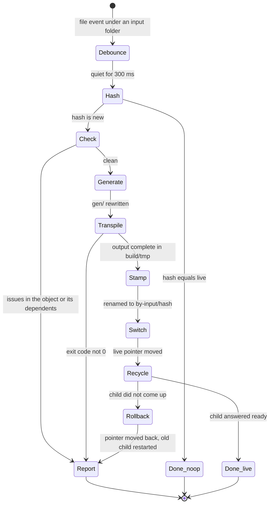
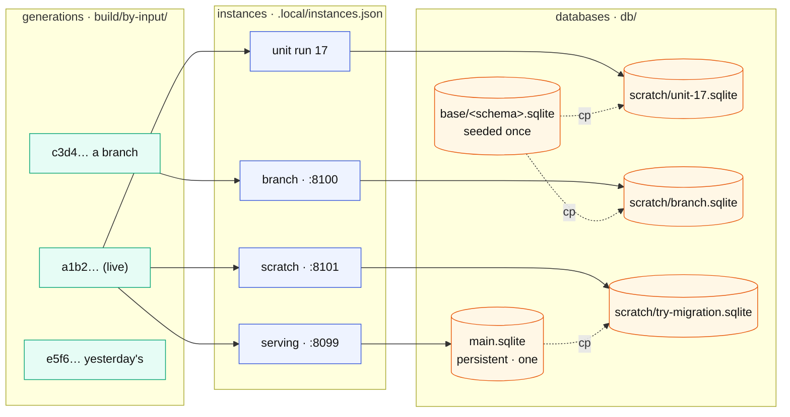

# Generations: one mechanism for the code and the rows

How OSD knows *which* system is running, keeps a broken build from ever
becoming the live one, lets twenty runtimes run beside each other over
their own data, and rolls back by moving a pointer. Designed 2026-09-16
from the code as it is; every fact it rests on is in the first table.

The short form: **immutable artefacts named by their content, and
pointers to them.** The code gets that in one coordinate (a *generation*),
the database in another (a *base image* and its forks), and an *instance*
is a point in that plane. Everything else — build to the side, switch,
roll back, pin, list, clean — is the same handful of operations on both.

---

## What it rests on

| fact | where | consequence |
| --- | --- | --- |
| the transpiler CLI takes a config path as its first argument: `TranspilerConfig.find(process.argv[2])` | transpiler `packages/cli/build/index.js:182` | a build can be aimed at any output folder by writing a config for it; **no copy of the tree** |
| `output_folder` is a plain config key, default `"output"` | `config.js:63` | same |
| the runtime child finds its build at `join(OSD_ROOT, "output", …)` and nowhere else | `tools/osd-serve.mjs:27` | one symlink, `output → build/<hash>/output`, switches the child with no change to it; the L0 entry (`test/start.mjs`, static import) follows it too |
| `npm run transpile` does `rm -rf output` before it builds | `package.json` | **the hazard**: a failed build leaves an empty `output/`; the running process survives (its modules are loaded) but the next recycle or restart dies. This is what "build to the side" exists to remove |
| a generation is 1,708 objects, 1,625 files, 44 MB, plus 2.7 MB of `gen/`; about ten seconds | `du`, the store's own comment | keeping the last five is ~250 MB; a build is short enough to be a debounce, not a task |
| `osd-persist.mjs` stamps a database with `fingerprintOf(schema)` — sha256 of the DDL, 16 hex — in table `osd_schema`, and refuses a file made for another schema | `tools/osd-persist.mjs` | the **schema hash exists**, and so does the rule for a mismatch |
| seeding is `seedStatements()`: pure INSERTs from `data/*.tabu.json` into a fresh database | `test/seed.mjs` | a base image is "seed once, save"; nothing about seeding assumes a process |
| the supervisor already passes `OSD_ROOT`, `STG_DB_PATH` and `OSD_GENERATION` (a counter) to the child, and takes `{root, port, database}` per instance | `tools/osd-runtime.mjs` | the instance API exists; the counter becomes the hash |
| `osd-inputs.report()` knows the input folders and their clashes | `tools/osd-inputs.mjs` | the inventory for the content hash is already computed |
| the façade's `/core/http/build` hashes the **façade's own five files** | `adt-facade.mjs`, `facadeBuildStamp` | that is the façade's identity, not the system's; the system needs its own |
| `build/`, `output/`, `gen/` and `.local/` are ignored | `.gitignore` | the layout below needs no ignore changes |
| unit runs already spawn a process of their own with a database of their own | `tools/osd-unit.mjs`, `runDetached` | the "twenty runtimes" case **already works this way** for tests; this generalises it |

---

## Concepts, and the invariants that make them worth having

**Generation** — one transpiled system: everything the child imports.
Named by the hash of its *inputs*: every file in the input folders,
`abap_transpile.json`, the transpiler's version, the library clones'
content. Same inputs, same name, so a rebuild with nothing changed is a
no-op; a transpiler upgrade is a new generation, as it should be.

**Base image** — a database with the schema of one generation and the
mandatory rows seeded, and nothing else. Named by the schema hash the
stamp already computes. Seeded once per schema, then only ever copied.

**Persistent database** — the one file whose rows are yours and cannot be
rebuilt from inputs. There is exactly one, and it is the only thing in the
whole design with a single copy.

**Instance** — (generation, database, port). The serving one; a unit run;
a branch on another port; a scratch copy to try a migration on. The pair
is the identity; the port is where it answers.

| invariant | why it holds | what it buys |
| --- | --- | --- |
| a generation and a base image are **immutable** once named | written to a temporary path, renamed into place on success | nobody can be half-way through one |
| **content-named**, never time-named | hash of inputs, hash of schema | reproducible; a no-op is free; two identical builds are one |
| **one writer per file** | a serving instance owns its database file; a fork is a copy | twenty instances, zero contention |
| the **live pointer** changes atomically, only to a complete generation | `rename` of a symlink | there is no moment at which `output/` is empty |
| a **failed build touches nothing live** | it fails in its own directory | the system that was running keeps running, and the next restart still works |
| **every answer names its generation** | header on OData and ADT, field in the unit result | "which code answered" is never a guess |
| **exactly one serving instance per persistent database** | one writer per file | forced, not chosen |

---

## On disk

```
build/
  by-input/<gen-hash>/          a generation, immutable
    abap_transpile.json         the config that built it (output_folder points here)
    output/                     what the child imports
    manifest.json               inputs hash, schema hash, transpiler version, built at, ms
  live -> by-input/<gen-hash>   the pointer; `output` at the root is a symlink to live/output
db/
  base/<schema-hash>.sqlite     a base image: schema + mandatory rows, stamped
  main.sqlite                   the persistent database (today: STG_DB_PATH)
  scratch/<instance>.sqlite     forks; die with their instance
.local/instances.json           the registry: id, generation, database, port, pid, forked-from, since
```

`gen/` stays at the root as the generators' scratch: it is derived, it is
rewritten by every build, and the child does not read it. That makes two
builds at once a race over `gen/`, which the build lock below prevents.

---

## The build, as a machine



Three things the machine says that a script would not:

- **Check comes first.** The registry sees the whole system, so "three
  changed files broke against an unchanged fourth" is caught here, in
  seconds, with abaplint's message — before a ten-second transpile that
  would have failed with a worse one. This is `store.activate()`'s
  definition of activation, applied to a save.
- **Switch is one rename.** `build/live` is replaced by renaming a
  temporary symlink over it. Between the two states there is nothing.
- **Recycle can fail after the build succeeded**, and that is the one
  place a rollback is needed: move the pointer back and restart the old
  child. The build that did not come up stays on disk, named, for reading.

What kind of file changed decides how much of the machine runs:

| changed | runs | you wait |
| --- | --- | --- |
| `webapp/**` — UI5, Fiori | nothing; express serves files as they are | a browser reload |
| `src/**.abap`, DDIC XML, `_MPC_EXT`/`_DPC_EXT` | the whole machine | ~10 s |
| `src/cds/*.asddls`, `*.stg.yaml`, SEGW XML | the whole machine; Generate is the step that matters | ~10 s |
| `data/*.tabu.json` — mandatory rows | **nothing, on purpose**: a reseed replaces rows you may have made by hand. It is an explicit command, and it makes a new base image, not a new generation | on demand |
| `abap_transpile.json`, a library clone | the whole machine (they are inputs); the watcher does not see the clones, which is what the explicit rebuild is for | ~10 s |

---

## The plane, and who lives where



- The **serving** instance is the only one on `main.sqlite`, and there is
  one of it. Everything else forks.
- A **unit run** pins the generation it started with and forks the base
  image; an edit during the run changes nothing it sees. Today's behaviour,
  now named.
- A **branch** is another generation on another port over its own fork —
  what `osd-runtime.mjs` already describes as two runtimes over two
  worktrees.
- A **scratch** instance forks *main* to try something against your real
  rows without touching them.
- **Pinning the serving instance** is a debugging mode, `--pin`: the
  watcher keeps building and switching `build/live`, but the child is not
  recycled until you say so. Not the default, because "I saved and nothing
  changed" is the worse surprise.

---

## Operations

| operation | code | rows |
| --- | --- | --- |
| build to the side | `osd build` → `build/by-input/<hash>` | `osd db seed` → `db/base/<schema>.sqlite` |
| switch | `osd switch <hash>` — rename the symlink, recycle | `osd db use <file>` |
| roll back | `osd switch <previous>` — a rename, a second | `osd db use <previous>` |
| fork for an isolated consumer | pin: the instance records its hash | `osd db fork main --as scratch/x` — a `cp` |
| list what exists | `osd builds` | `osd dbs` |
| what is running | `osd ps` — the registry: id, generation, database, port, pid, forked-from, since | |
| clean | `osd gc` — keep the last N generations and every one an instance points at; delete scratch files whose instance is gone | |

And the two a person types:

```
npm run dev              # watch → check → build → switch → recycle; failures are reported, never applied
npm run rebuild          # the whole machine, ignoring the hash; add --seed to make a new base image
```

Every OData and ADT answer carries `X-OSD-Generation: <hash>`; the unit
result names it; `/core/http/build` keeps naming the façade and gains a
`generation` field for the system.

---

## The seams: what changes where, and how little

| file | change |
| --- | --- |
| `tools/osd-build.mjs` (new) | the machine: hash, lock, temp dir, config, generators, transpile, stamp, rename, switch; ~250 lines |
| `tools/osd-store.mjs` `transpile()` | calls the builder instead of `spawn("npx abap_transpile")`; `publish()` gains the rollback branch |
| `tools/osd-runtime.mjs` | `generation` is the hash, not a counter; `recycle()` can be asked to restart the previous one |
| `tools/osd-serve.mjs` | none — it follows the symlink. (`OSD_OUTPUT` as an env override for a host without symlinks) |
| inside each generation | **found while building it:** the transpiled modules reach outside `output/` for the setup hook the config names as `../test/setup.mjs`, and Node resolves a relative import from the importing file's *real* path, not through the root symlink. So a generation carries a relative link per such root directory (`<gen>/test → ../../../test`), made on build and on switch, only for names that are directories at the root — a literal that merely looks like `../sap/…` names nothing |
| `tools/osd-persist.mjs` | `baseImage(schema)`: seed into `db/base/<hash>.sqlite` if absent; `fork(from, to)` |
| `package.json` | `transpile` stops doing `rm -rf output`; `dev` and `rebuild` scripts |
| `tools/adt-facade.mjs` | the header on every answer; `generation` in `/core/http/build` |
| `.local/instances.json` | written by the supervisor on start/stop; read by `osd ps` and `osd gc` |

---

## Edge cases, decided

- **A crash mid-build.** The build is in `build/tmp/<hash>.<pid>`; nothing
  is named until the rename. A leftover `tmp/` is garbage, not a
  generation, and `gc` removes it.
- **Two builds at once.** One lock file, `build/.lock`, held for the
  duration; a second watcher event during a build re-queues rather than
  races over `gen/`.
- **The hash is new but the output would be identical** (a comment
  changed). Still a new generation: the hash is over inputs, and "what
  would the output be" is exactly the question a build answers. Cheap,
  and it keeps the rule simple.
- **Schema drift.** A persistent database opened by a generation with a
  different DDIC: the stamp refuses today, and keeps refusing. Migration
  of rows between schemas is a separate design; this one does not pretend
  to include it. Forks of a base image never have the problem, because
  the image is per schema.
- **DuckDB.** The client owns its file and writes as it goes; a fork is
  still a copy of a closed file. Out of scope for now, as agreed.
- **No symlinks** (a host that cannot make them). `OSD_OUTPUT` names the
  generation directly; the switch is then an env change plus a recycle,
  which is what the recycle already does.
- **Windows paths.** This runs in WSL; the design assumes a POSIX
  filesystem for the rename-is-atomic guarantee, and says so rather than
  promising it everywhere.

---

## Status

- **Step 1 is built** (2026-09-16): `tools/osd-build.mjs`, `store.transpile()` on it, `npm run transpile` / `rebuild` / `builds`. First generation 10.4 s, 1,090 objects; a rebuild with nothing changed 0.44 s; a broken source fails in its own directory and leaves live untouched, proven by test. The store, supervisor and façade suites pass through the symlink.

- **Steps 2 and 3 are built** (2026-09-16): `npm run dev` (`tools/osd-dev.mjs`, mounted by `test/start.mjs` under `STG_DEV=1` over the child runtime) and the generation on every answer. Measured live: a comment appended to a class → `1 file changed: CLAS ZCL_ZOSD_TEST_DPC_EXT` → check clean in 4.5 s → built in 8.3 s → recycled in 1.2 s, and the `X-OSD-Generation` on OData went from `a6bcce…` to `382321…`. A change that breaks a dependent is reported with file and line and nothing is built (test). `/core/http/build` answers `system: {source, live, serving, synchronized}` — the three names, and whether they agree; `npm run ps` lists the registry (`.local/instances.json`, pruned of dead pids on every write). The supervisor's `generation` is the live build's hash; `epoch` counts its processes, so a recycle over unchanged code keeps its name, which is the truth.

- **N2 is done** (2026-09-16): the parent holds no ABAP in the workbench shape. `test/run.mjs` defaults to `STG_SERVE=child`; `test/start.mjs` loads the transpiled modules only in the inline shape, which the suites keep. The child (`tools/osd-serve.mjs`) serves OData, every ICF service, the push channels, and a door, `POST /osd/sql`, through which the façade's data preview reads — so a preview shows the rows the application serves, from one connection. The parent proxies the ICF paths and pipes websocket upgrades to the child (`upgradeProxy`), so an activated handler or channel goes live with the recycle. `/core/http/build` names the database beside the three generations: `database: {serving, preview}`, and `synchronized` requires the preview to read through the door. Proven end to end by `test/osd-child.mjs`: a server started the normal way, F8 through the door, OData and ICF answered by the child with its generation, ADT and OData naming the same one.
- The input hash counts only what the build reads (`NOT_AN_INPUT` in the builder): a mocha test or a note beside the ABAP does not rename a generation. Changing that rule renamed every existing generation once; the outputs are the same.

- **B4, the client, is done** (2026-09-16): `tools/sqlite-file-client.mjs`, the eleven methods over `node:sqlite` on a file in WAL mode, the reference client's rewrites and LUW to the letter. `STG_DB=file` selects it in `test/setup.mjs`, and `test/run.mjs` defaults to it, at `.local/db/osd.sqlite`. The whole ABAP Unit suite passes on it (`npm run unit:file`); its own tests prove a committed row survives a SIGKILL, an open LUW does not, a second connection sees only what is committed, and the stamp names the DDIC. Found on the way, and the reason a first run lost a row: the in-memory client's export at exit committed whatever was open, so nobody had written the AS ABAP rule that a dialog step ends in an implicit commit (or a rollback on an uncaught exception). The child says it once now, `dialogStep`, and disconnects before it exits. Base images and forks are the remaining half of B4.

- **B4, base images and forks, is done** (2026-09-16). A base image is `.local/db/base/<schema-hash>.sqlite`: the first runtime over a new DDIC seeds and leaves it behind (`db.fork(base)` after the stamp), and a database that does not exist yet is a copy of it — two boots in `test/osd-db.mjs`, the second one a copy, the image untouched. A fork is `VACUUM INTO` on one connection (`forkDatabase`, `db.fork`): a consistent single file with the last commit and nothing of an open LUW, proven with a writer mid-LUW. `node tools/osd-db.mjs list | fork | base` (`npm run dbs`). Found on the way, and fixed the same hour: a detached unit run inherits the server's environment, and with the server on a file by default it would have written into the rows the application serves — the isolation Astra asked to keep. Every detached run now gets a file of its own (a copy of the base image, by its own setup) and the file goes with the run. The remaining piece of the plane is the instance registry naming forks' origins, which is bookkeeping.

- **E.1, layers, is done** (2026-09-16). The order is the `input_folder` list of `abap_transpile.json` and the later folder wins, in the store and in the build alike (`tools/osd-inputs.mjs` `layers`, `tools/osd-store.mjs` `rootsOf`); a library is not a layer and fills only what no root has. Measured before deciding: the transpiler on its own writes the later folder's module last, while abaplint's registry files the first and calls the second "already defined", so the builder hands the transpiler the winner only (the hidden files go into the build's `exclude_filter`, the manifest lists `overridden`), proven with the real transpiler over a two-layer tree. The same file name twice inside one folder is refused before a lock is taken, both files named. `local/` is no longer one root: only listed folders are the system, so what ADT shows is what runs, and an import appends its folder to the list. The generation hash already covered a new root, so E.2 starts from here.

## The order of work

1. **Build to the side, with the hash and the pointer.** The builder, the
   symlink, the lock, `rebuild`. This removes the `rm -rf output` hazard
   on its own and is the piece everything else stands on. One session.
2. **`npm run dev`.** The watcher wired to the builder with the debounce
   and the check-first rule; failure reported, never applied. Half a
   session — the pieces exist.
3. **The header and the registry.** Every answer names its generation;
   `osd ps` says what is running. Half a session.
4. **Base images and forks.** Seed once per schema; `fork`; unit runs and
   branches take a fork instead of reseeding. Rides on N1, the real
   file-backed SQLite, because a fork of an in-memory database is an
   export. One session after N1.

Then the plan's sprint 1 reads: 1, 2, 3 here, then N1, then 4. The
"activation ordering" item (N4) is not separate any more — it is step 2's
check-first rule and step 1's rename.

## See also

- [`plan-spikes-and-sprints.md`](plan-spikes-and-sprints.md) — where this slots in
- [`architecture-split.md`](architecture-split.md) — "driven separately", now with the mechanism
- [`db-backends.md`](db-backends.md) — the eleven-method seam a base image is seeded through
- [`adt-facade-shift-left.md`](adt-facade-shift-left.md) — the door, whose results will carry the generation
