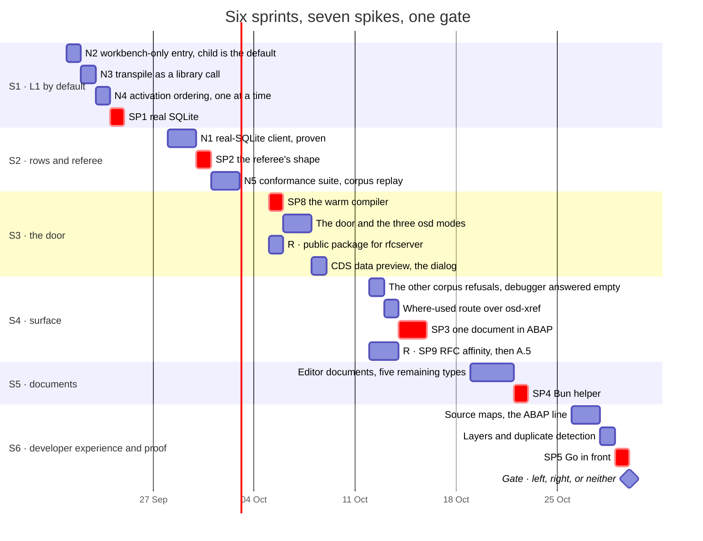
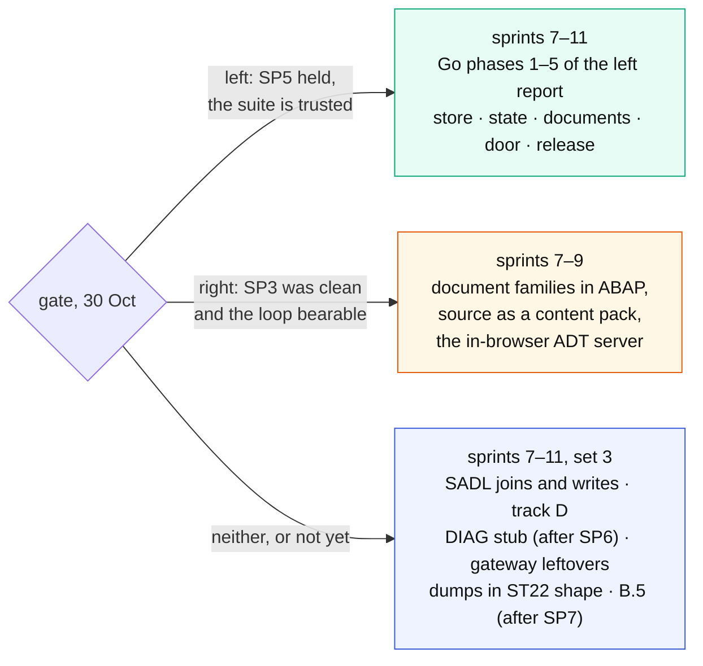

# The plan: spikes and sprints

The four sets of [`shift-right-and-quick-wins.md`](shift-right-and-quick-wins.md),
laid out in time. Six one-week sprints, seven spikes inside them, one
decision gate at the end, and what follows the gate in either case.

**Conventions.** A **sprint** is one calendar week and **four session-days
of the S lane**; the T, V, R and A lanes run beside it, as in
[`backlog.md`](backlog.md) (S open-steamgate, T the transpiler session,
V vsp, R open-rfc-go, A Alice). A **spike** is a time-boxed question whose
output is a *measurement and a written answer* — a note in `docs/` or an
entry in `ANORMALIES.md` — never a feature; when the box runs out, the
answer is "not in a day", which is also an answer. Sizes are session-days
at the pace measured in this repository; a session-day here has run at
three to four conventional person-days on comparable work (the two reports
give the ratio), and the plan is in session-days because that is the unit
that gets scheduled. Each sprint has a **definition
of done** that a test or a screen can show, not a list of things touched.

The sets, for reference:

| set | in one line | where |
| --- | --- | --- |
| 1 · borderlines and wiring | L1 the default, rows that survive a crash, honest activation, the referee, the door, the public RFC package | sprints 1–3 |
| 2 · ADT surface | the five corpus refusals, editor documents, where-used, dumps, affinity | sprints 3–5 |
| 3 · everything else, no shift | source maps, layers, Bun packaging, then SADL joins, track D, DIAG | sprints 5–6, and after the gate |
| 4 · shift left | the Go port, phases 1–5 | after the gate, if go |

---

## The spikes

| spike | the question | the measurement | box | lane | it decides |
| --- | --- | --- | ---: | --- | --- |
| **SP1** real SQLite | does a `node:sqlite` client over the eleven-method seam pass the unit suite, the persistence tests, and one cross-process read? | suite results; ms per LUW against sql.js | 1 | S | the shape of N1, and whether Go can ever read the rows directly |
| **SP2** the referee's shape | can the 47 in-process requests run unchanged against a base URL, and does a corpus replay produce a readable diff? | count of requests ported; first diff report | 1 | S | how N5 is built |
| **SP3** one document in ABAP | one editor document family (A.1) written as an `if_http_extension` handler: byte-identical to the JS generator under the suite? which anomalies did it hit? how long is the edit loop? | diff count; anomalies filed; seconds per iteration | 1.5 | S (+T for anomalies) | whether the right shift has legs (R2) |
| **SP4** Bun helper | does a compiled helper load a namespaced module generated *after* it was built, on a machine without the checkout or Node? | yes/no per platform; the failure if no | 1 | S | whether a self-contained release can be promised; gated on decision 0.1 |
| **SP5** Go in front | one route (discovery) answered by a Go reverse proxy in front of the JS façade, Eclipse logging on through it, the RFC bridge calling it in-process through a public package | Eclipse logon yes/no; lines of Go | 1 | S + R | whether the strangler order works before phase 1 is paid for |
| **SP6** the field item | one measured `DYNT_ATOM` layout from a DIAG capture, or the writer lifted from the private sibling | the byte layout, written into `diag-notes.md` | 0.5 | S, needs A | whether C.4 is a day or a week |
| **SP7** the long answer | one RFC answer longer than one record from A4H, to settle the continued-record length (B.5) | the header bytes, written down | 0.5 | R, needs A | multi-record framing, shared by the bridge and track D |
| **SP8** the warm compiler | does a `compile` process kept alive across recycles give the same diagnostics as the in-process registry, and what happens when two checks with different unsaved text for one file arrive at once? Today `#withSource` swaps the file synchronously and nothing can interleave; over a boundary something can | issue lists diffed over every object in the tree; the race reproduced, or shown impossible by the API's shape | 1 | S | the door's shape, before the door is built |
| **SP9** RFC affinity | a lock on one connection and the write on another, under `sap-adt-connection-id`; two clients side by side, isolated | the lock landing or not; what the bridge must map | 1 | R | how A.5 is implemented, or whether the mapping is enough |

SP8 was Astra's addition and SP9 its consequence for A.5: both go before
the work they shape, not after. SP6 and SP7 need a capture from the sandbox and start whenever Alice
makes one; they are not on the critical path.

---

## The sprints

### Sprint 1 · L1 by default (21–25 Sep)

*Goal: the shape both reports assume becomes the shape that runs, and an
activation's verdict is bound to the revision it was computed on.*

| item | lane | size |
| --- | --- | ---: |
| day 0: reproduce the corpus refusals against the current tree, and check every backlog claim this plan leans on against the code — the two reports found six stale claims between them, and a plan built on a seventh is a plan for the wrong tree | S | 0.5 |
| N2 the workbench-only entry point: `STG_SERVE=child` is the default, `test/start.mjs` has no top-level ABAP initialisation, the preview's data path takes its connection from the child | S | 1 |
| N3 `store.transpile` calls `@abaplint/transpiler` as a library; no `npx` | S | 0.5 |
| N4 activation — the handler already awaits publication; what is left is the inactive mark clearing only after the transpile succeeds, activations serialised per tree, and a save during a build never becoming active because the older build finished | S | 1.5 |
| SP1 real SQLite | S | 1 |
| unpin: the transpiler releases that let CI stop building from an unmerged branch (DEBT-2026-09-14) | T | — |

**Done when:** `npm start` serves through the child with no flag; an
activation whose transpile fails leaves the object inactive (a test);
two concurrent activations produce one build (a test); SP1's note is in
`docs/` with the suite's numbers.

### Sprint 2 · rows and referee (28 Sep – 2 Oct)

*Goal: rows survive a crash; two implementations can be compared.*

| item | lane | size |
| --- | --- | ---: |
| N1 the real-SQLite client, shaped by SP1: the default when supervised, `journal_mode=WAL`, the persistence tests moved onto it. Its reason is durability — rows are written at exit today — not the split, which reads rows through the door either way | S | 2 |
| SP2 the referee's shape | S | 1 |
| N5 the conformance suite: the 47 requests against a base URL; corpus replay with a diff report; runs in CI against the JS façade | S | 2 |

**Done when:** a runtime killed with SIGKILL loses no committed row, a
rolled-back LUW leaves none, and an application write is visible to the
next data preview (three tests); the suite is green against the JS façade over the real listener;
`npm run conformance -- --base <url>` exists and the corpus replay prints
its diff.

### Sprint 3 · the door (5–9 Oct)

*Goal: the toolchain is a service anyone can call; the preview dialog is gone.*

| item | lane | size |
| --- | --- | ---: |
| SP8 the warm compiler, first | S | 1 |
| the door, shaped by SP8: `check`, `activate`, `transpile`, `structure` on an `osd compile` mode that outlives recycles; `sql` on `osd serve`; `unit` as `osd unit`, one process per run; the façade calls them and boots nothing in-process | S | 2 |
| a public package for the RFC server, so anything but `open-rfc-go`'s own `main` can mount it | R | 1 |
| CDS data preview: `POST datapreview/cds` and its metadata, through the door's `sql`, over the generated views and SADL | S | 1 |

**Done when:** vsp checks and unit-tests a tree with no façade running
(one command, documented); Eclipse opens Data Preview on the CDS view that
showed the dialog on 2026-09-15; SP8's note is in `docs/` with the parity
diff and the race's verdict.

### Sprint 4 · surface (12–16 Oct)

*Goal: nothing the real system answers is refused; the right shift is measured.*

| item | lane | size |
| --- | --- | ---: |
| the remaining corpus refusals: `virtualfolders` on the bare path, the two `checkruns` 400s, the unknown-session DELETE; and `debugger/listeners` and `breakpoints` answered empty (A.6) — a deliberate untruth that stops the client's retry loop, allowed only while the compatibility graph does not advertise debugging, so nothing answered empty was ever promised | S | 1.5 |
| where-used: `usageReferences` over `osd-xref.mjs` | S | 1 |
| SP3 one document in ABAP, inside A.1 | S + T | 1.5 |
| SP9 first, then A.5: honour `sap-adt-connection-id` so a lock-write-activate lands in one context — it touches sessions and locks, which is why the spike goes first | R | 1 + 1 |

**Done when:** the corpus comparison lists zero operations refused by OSD
and answered by A4H — the corpus is what recorded sessions asked for, not
the whole surface, and every new session extends it; where-used works from Eclipse on a class; SP3's note
answers the three questions with numbers; a write over RFC from Eclipse
lands in the same session as its lock.

### Sprint 5 · documents (19–23 Oct)

*Goal: everything in the tree opens.*

| item | lane | size |
| --- | --- | ---: |
| editor documents for the five types SP3 did not cover, in whichever language SP3 chose | S | 3 |
| SP4 Bun helper — **gated on decision 0.1** (Bun packaging yes/no); if no, the day goes to track D's first step | S | 1 |

**Done when:** every object type `test/zosd-test.mjs` lists opens in
Eclipse without a 404; SP4's note says yes or no per platform.

### Sprint 6 · developer experience and proof (26–30 Oct)

*Goal: writing ABAP on OSD names the right line; the strangler is proven or not.*

| item | lane | size |
| --- | --- | ---: |
| source maps: a failing unit test and a dump name the ABAP file and line (8.6) | S | 2 |
| layers: an ordered list of source roots; a duplicate object across roots is reported (1.5) | S | 1 |
| SP5 Go in front, through the public package from sprint 3 | S + R | 1 |

**Done when:** a deliberately failing test names `zcl_…clas.abap:NN`; two
roots holding the same class produce a warning naming both; Eclipse logs
on through the Go proxy for discovery.

---

## The gate (30 Oct)

One decision, taken on evidence that exists by then:

| evidence | from | what it says |
| --- | --- | --- |
| the suite, green on the JS façade | N5 | there is a referee |
| the rows in a real file, measured | N1, SP1 | whether Go could ever read them directly |
| the door in use by vsp, its diagnostics at parity | sprint 3, SP8 | the semantics are a service, and the same service |
| one document family in ABAP, measured | SP3 | whether the right shift is worth a second family |
| the helper loading a later build | SP4 | whether a self-contained release can be promised |
| Eclipse through the Go proxy | SP5 | whether the strangler order holds |

Three outcomes, each with its next five sprints:

Whatever the outcome, set 3's leftovers are not lost: they are the
"neither" column, and they run in parallel with a shift in the T and R
lanes if a shift is chosen.

---

## What the A lane owes, and when

| decision | needed by | gates |
| --- | --- | --- |
| 0.1 Bun packaging: yes / no | end of sprint 4 | SP4, and the shape of sprint 5's fourth day |
| a DIAG capture with a painted screen, from the sandbox | any time | SP6, then C.4 |
| one long RFC answer from the sandbox | any time | SP7, then B.5 |
| the gate | 30 Oct | sprints 7–11 |

Nothing else in the six weeks waits on a decision.

## See also

- [`shift-right-and-quick-wins.md`](shift-right-and-quick-wins.md) — the four sets this schedules
- [`adt-facade-shift-left.md`](adt-facade-shift-left.md) — the left report; its phase 0 is sprints 1–3 here
- [`backlog.md`](backlog.md) — the standing list and the lanes
