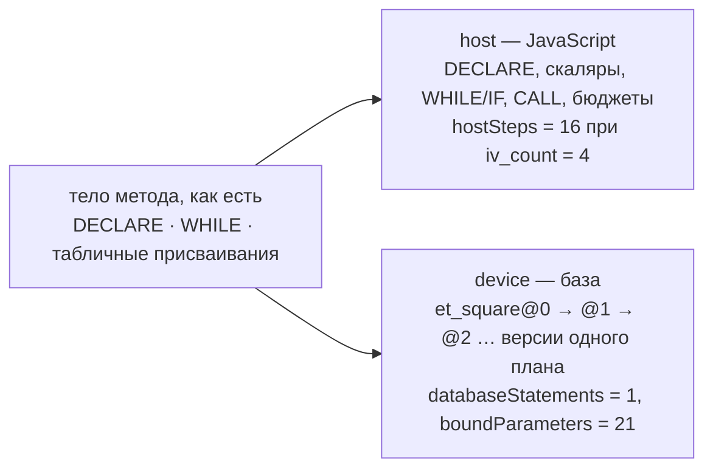
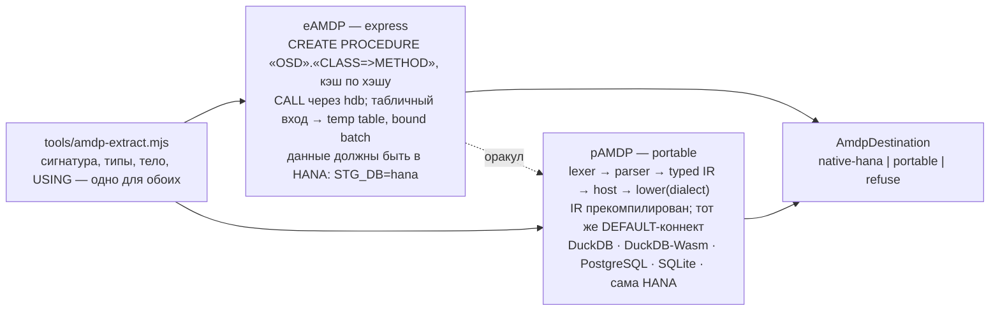

# Portable AMDP — состояние на 2026-09-22

*Как неизменённое тело `FOR HDB LANGUAGE SQLSCRIPT` исполняется там, где HANA нет: устройство компилятора, что в нём сделано красиво, примеры трансляции на четыре диалекта и оценка расширения на SQLite, PostgreSQL, MariaDB, MSSQL и ClickHouse.*

Читалось из `main` (PR #18, merge `85fd5a5`) и ветки `feat/pages-duckdb-wasm` (`3887bd1`, PR #21, смёржен в `main` как `937631c`). Все SQL-примеры и трассы ниже получены прогоном реальных модулей репозитория, не написаны от руки. HTML-версия с диаграммами и heatmap — [portable-amdp-2026-09-22.html](portable-amdp-2026-09-22.html).

Обозначения: **факт** — измерено кодом или оракулом; **предп.** — предположение, надо измерить; *host* — JavaScript, управление и скаляры; *device* — база, отношения.

| | |
| --- | --- |
| **11 / 0 / 0** | executed / partial / refused — live-ledger демо (SQUARES + 10 clean-room методов) |
| **4** | диалекта в `sqlscript-lower.mjs`: hana, duckdb, postgres, sqlite |
| **380** | тестов в `test/sqlscript-*` + `test/amdp-*` (по `it(`) |
| **9 364** | строк в `tools/sqlscript*` + `tools/amdp*` |
| **40** | строк таблицы конформанса, колонка HANA измерена 2026-09-19 |
| **405** | рабочих тел AMDP в корпусе A4H; потолок покрытия 95 % |

## 1. Идея в одну строку

**Управление уходит в host, данные — нет.** Ни DuckDB, ни SQLite, ни ClickHouse не имеют процедурного языка, так что портировать SQLScript *во что-то* некуда. Вместо этого тело *расщепляется*: скаляры, `DECLARE`, `WHILE`, `IF`, `CALL` интерпретируются в JavaScript рядом с транспилированным ABAP, а каждая табличная переменная остаётся *реляционным планом*, который в самом конце опускается в SQL выбранной базы. Табличная переменная никогда не становится массивом JavaScript.



Что это покупает, сказано честно в `docs/sqlscript-splitter.md`: AMDP и так работает на HANA. Расщепитель покупает AMDP *там, где HANA нет* — прежде всего в браузерном превью — и покупает *оракул*: одно тело выполняется нативно на HANA и расщеплённым на другой базе, а ответы сравниваются. Это инструмент, а не «переносимость» как обещание.

## 2. Как это организовано

Две стадии: **build** (`npm run transpile`) и **runtime** (`CALL FUNCTION … DESTINATION 'AMDP'`). Исходник в `src/` не трогается — он остаётся тем AMDP, которым является, и компилируется на реальной системе.

```mermaid
flowchart TB
  subgraph BUILD["BUILD — npm run transpile"]
    A["ABAP-класс с AMDP<br/>src/amdp/zcl_osd_amdp_demo.clas.abap"] --> E["extract<br/>tools/amdp-extract.mjs<br/>сигнатура + типы + тело + USING"]
    E --> L["lexer → parser<br/>sqlscript/lexer.mjs · combi.mjs · expressions/index.mjs"]
    L --> BI["binder → typed relational IR<br/>sqlscript/to-ir.mjs → sqlscript-ir.mjs<br/>тип HANA на каждом узле"]
    BI --> P["procedure IR<br/>sqlscript-to-procedure-ir.mjs → sqlscript-procedure-ir.mjs<br/>declare/assign scalar · assign-relation · while · if · call"]
    C["DDIC catalogue по USING<br/>sqlscript-ddic-catalogue.mjs"] --> G
    P --> G["amdp-gen → gen/amdp/<br/>clas.abap: тело → CALL FUNCTION 'Z_AMDP_…'<br/>fugr-заглушки · procedures.json (IR + outputSchema + catalogue)"]
  end
  subgraph RUNTIME["RUNTIME — транспилированный ABAP вызывает метод"]
    CF["CALL FUNCTION 'Z_AMDP_…' DESTINATION 'AMDP'<br/>тот же контракт, что rfc-replay.mjs"] --> AD["AmdpDestination — явная политика<br/>native-hana | portable | refuse, без fallback"]
    AD --> NH["native HANA: deploy процедуры, CALL<br/>amdp-run.mjs · hdb — оракул, не зависимость"]
    AD --> PR["portable: runProcedure(IR из манифеста)<br/>парсер в рантайме не грузится; тот же DEFAULT-коннект"]
    PR --> I["интерпретация: скаляры в host, отношения замораживаются<br/>freezeRelation: :var → инлайн предыдущей версии, :scalar → param<br/>бюджеты steps/plan/depth/params/calls; NO_INLINE → refuse"]
    I --> LO["lower(plan, dialect)<br/>sqlscript-lower.mjs — единственное место, где известен диалект"]
    LO --> N["client.native({sql, params, expect})<br/>DuckDB · DuckDB-Wasm · PG · SQLite"]
    N --> R["fromJson() → типизированные значения ABAP<br/>trace: engine · fallback=false · hostSteps · databaseStatements · boundParameters"]
  end
  G -. procedures.json .-> AD
```

Отказ — это `CX_SY_DYN_CALL_ILLEGAL_FUNC`, который ABAP вокруг умеет ловить, а не JavaScript-исключение мимо `CATCH cx_root`.

**Что лежит в `gen/amdp/procedures.json`.** Шесть записей на сегодняшнем `main`: пять методов демо-класса и `ZCL_VDB_100_HANA=>SEARCH_DB` из Vector Workbench. Для каждой — оригинальное тело, HANA-типы сигнатуры, хэш и `portable`: готовый procedure IR с `outputSchema` и компактным DDIC-каталогом по `USING`. Табличная функция `squares_tf` (`BY DATABASE FUNCTION`, `SERIES_GENERATE_INTEGER`) записи `portable` не имеет — честное «не в подмножестве», а не пустая заглушка.

## 3. eAMDP и pAMDP — две половины одной идеи

Имена — Алисины, и они точнее, чем «native» и «portable», потому что называют *механизм*, а не свойство. **eAMDP — express AMDP**: тело метода уже является валидным SQLScript, так что его вырезают из класса и отдают HANA Express выполнить *как есть*; интерпретатора второго языка не пишется вовсе (B.19, решено 2026-09-18: «HANA Express — не backend для OSD, а движок для одного узкого случая»). **pAMDP — portable AMDP**: то же тело расщепляется на host-половину и реляционный план и исполняется на базе, которая под рукой. Первое было готово 18-го и стало оракулом для второго; второе появилось 21–22-го и не могло бы быть доказано без первого.



| что даёт eAMDP | что даёт pAMDP |
| --- | --- |
| Семантика верна по определению: исполняет HANA. Единственный оракул SQLScript, который у нас есть или будет. | AMDP там, где HANA нет: браузерное превью (PR #21 — одна DuckDB-Wasm под Open SQL, OData и AMDP), ноутбук без HXE, CI. |
| Песочница `/sap/bc/osd/amdp/`: тело с экрана разворачивается под одноразовым именем, выполняется и сносится; ошибка HANA возвращается её словами, с позицией в строках автора. | Общий LUW с вызывающим ABAP (§4.7) — eAMDP этого дать не может по построению: данные надо сначала довезти в HANA. |
| Наш `ZCL_Z80_00_CPU_AMDP` — 18 `DECLARE`, 36 `SELECT`, три цикла — работает только так. Это и был аргумент «транспилировать AMDP не на столе». | Отказ до I/O по имени конструкции, с бюджетами шагов и параметров. |
| Вложенные вызовы: destination разворачивает нативные зависимости раньше вызывающих, по манифесту. | Второе независимое исполнение того же тела: расхождение между e и p — находка, а не шум. |

Почему имя удачное: «express» читается двояко и оба смысла верны — HANA *Express* как движок и «экспресс» как самый короткий путь (ничего не переводится). А пара e/p делает видимым, что `native-hana | portable` в `AmdpDestination` — это выбор между двумя *исполнителями* одного экстракта, а не «настоящий и запасной». Vector Workbench показывает это буквально: у сервиса три значения `Engine` — `ANYDB`, `HANA` (нативная, eAMDP) и `AMDP` (portable, в UI «Portable AMDP (DuckDB)»), и нативный остаётся отдельным выбором, а не тем, куда молча падают.

## 4. Что здесь сделано красиво

### 4.1 Присваивание табличной переменной — не барьер. Измерено, а не решено

Это измерение определило форму всего IR, поэтому его сделали первым. На HANA Express: проекция, которая *может* упасть (`TO_INTEGER` над колонкой с одной нечисловой строкой), затем присваивание, затем фильтр, убирающий плохую строку, затем чтение. HANA вернула строки и ничего не подняла. Тот же код с `WITH HINT(NO_INLINE)` — падает. Значит, цепочка присваиваний — это *один* план, а «материализовать каждое присваивание, чтобы быть верным HANA» было бы ошибкой в дорогую сторону. Следствие, которое неудобно: **исключение — свойство плана, а не программы**. Поэтому таблица конформанса сравнивает *значения*, а не «упало или нет». (`docs/sqlscript-hana-observed.md`)

### 4.2 Неизменяемые версии отношения и захват скаляров

```text
et_square@0 = typed empty relation (схема из сигнатуры ET_SQUARE)
lv_i = 1
et_square@1 = UNION ALL(et_square@0, row(lv_i = 1))   ← значение зафиксировано
lv_i = 2
et_square@2 = UNION ALL(et_square@1, row(lv_i = 2))
```

Каждое присваивание захватывает значение скаляра *в этот момент*. Никакого замыкания, которое потом прочитает итоговый счётчик. Схема пустого отношения берётся из извлечённой сигнатуры `ET_SQUARE`, а не выводится из `0, '', 0` — иначе получился бы `C(0)`. База видит один statement, в котором `:lv_i` встречается **21** раз как связанный параметр при `iv_count = 4`.

Живая трасса на DuckDB: `engine=duckdb fallback=false hostSteps=16 databaseStatements=1`, rows `[[1,"square of 1",1],[2,"square of 2",4],[3,"square of 3",9],[4,"square of 4",16]]`.

### 4.3 Значения связываются, идентификаторы генерируются — ничего не интерполируется

Параметр становится плейсхолдером и едет в `params`; отношение, уже известное seam-у, — тем, что дал `relationRef()`. Измеренная причина, зачем это ещё и быстро (`amdp-run.mjs`): 10 000 строк литералами — 21 745 мс, связанным батчем — 59 мс; 99,8 % цены литеральной формы — парсинг, потому что текст со значениями никогда не попадает в plan cache. И один класс дефектов исчезает целиком: кавычка, JSON-документ или слово `true` в значении ничего не ломают.

### 4.4 На каждом узле выражения — тип, который дала бы HANA

Без него lowering не может выбрать форму. `1/2` — это `0.5` в DuckDB и `0` в SQLite, и узел деления, не знающий, целочисленное оно или нет, не имеет правильного рендеринга ни в одном из них. Измеренные расхождения, каждое — тихо неверный ответ, а не ошибка:

| выражение | HANA | DuckDB | sql.js / SQLite | что делает lowering |
| --- | --- | --- | --- | --- |
| `1 / 2` | 0.500000 | 0.5 | 0 | sqlite: `((a) * 1.0 / (b))`; для целочисленного деления в источнике — `DIV` / `//` / `TRUNC` |
| `CAST(1.7 AS INTEGER)` | 1 | **2** | 1 | duckdb: `CAST(TRUNC(CAST(x AS DOUBLE)) AS INTEGER)` — «это была наша ошибка, и она shipped» |
| `CAST('x' AS INTEGER)` | raise | raise | **0** | sqlite: **refuse** — движок не умеет поднять исключение, а «0» — другая программа |
| `CAST('abcdef' AS NVARCHAR(3))` | abc | abcdef | abcdef | `SUBSTR(CAST(x AS VARCHAR), 1, 3)` |
| `'ABC' LIKE 'abc'` | нет | нет | **да** | на соединении: `PRAGMA case_sensitive_like = ON` |
| `x / 0` | raise | Infinity / NULL | NULL | duckdb: `CASE WHEN divisor = 0 THEN error(…)`; sqlite: *намеренно* не отвечено и записано почему |
| `0.10 + 0.20` (DECIMAL) | 0.30 | 0.30 | 0.30000000000000004 | sqlite: `ROUND(e, scale)` из типа результата; только для `+`/`-`, `*` оставлено |

### 4.5 Отказ по имени вместо приближения

У backend-а три честных исхода: нативный эквивалент с измеренной семантикой; явный compat-рендеринг с тестами; `UNSUPPORTED_SQLSCRIPT` *до* выполнения. Best-effort режима в ABAP Unit нет. Список `PORTABLE`-функций короток намеренно: членство — утверждение «одни аргументы дают один ответ на всех трёх», а не «на всех трёх есть функция с таким именем». `ROUND` попал туда только после измерения tie-rule (`ROUND(2.5) = 3`, `ROUND(-2.5) = -3` везде).

### 4.6 Идентичность сессии — данные контекста, не свойство соединения

`CURRENT_USER`, `CURRENT_SCHEMA`, `SESSION_CONTEXT('…')` — типизированные узлы IR, захватываемые в связанные параметры из явной AMDP-сессии до lowering. DuckDB никогда не подставит своего пользователя только потому, что финальный statement выполняет он. Нет факта — отказ до I/O. Часы остаются неподдержанными, пока не измерен детерминированный контракт.

### 4.7 Один LUW: AMDP читает то, что ABAP только что записал и не закоммитил

ABAP Unit вставляет в `ZSTG_DEMO` через Open SQL, *не* делает `COMMIT`, вызывает неизменённый `read_travel`. Portable-исполнение читает строку через `abap.context.databaseConnections.DEFAULT` — то же соединение, та же транзакция. Ни копии фикстуры, ни второго соединения, ни JavaScript-адаптера строк.

### 4.8 Оракул из трёх колонок

Одно тело, три пути: native SQLScript на HANA; portable host + plain HANA SQL (изолирует парсер/интерпретатор от диалекта); portable host + DuckDB (HANA физически недоступна, `fallback=false`). Сравнение значений как bag с кратностями, схема отдельно, без ORDER BY. Прохождение обеих пар не утверждает, что портируема каждая функция: каждый следующий backend обязан реализовать или явно отказать по каждой строке конформанса.

### 4.9 Clean-room корпус

Наблюдатель видел ограниченные исходники и выдал только абстрактный список категорий; независимый реализатор видел только список и написал новые идентификаторы, литералы, строки, методы. Провенанс — `test/fixtures/amdp-cleanroom/provenance.json`, leak-scan — ноль. Метод переходит в «executed» только когда тело выполнилось напрямую, без переписывания, на уровне значений — и совпало native-vs-portable на HANA и на DuckDB.

## 5. Примеры трансляции

Каждый пример — вывод реального `compileProcedure` + `runProcedure` над клиентом-перехватчиком, по разу на диалект. `?` и `$n::type` — связанные параметры; после statement перечислено, что связано (`имя=значение:тип`). Переносы строк добавлены для чтения, текст statement не менялся.

### 5.1 `ZCL_OSD_AMDP_DEMO=>SQUARES`, `iv_count = 3`

Тело IR: `declare-scalar · assign-relation · assign-scalar · while`. Три итерации `WHILE` в host дали один `UNION ALL` из четырёх ветвей. HANA-плейсхолдеры — `CAST(? AS INTEGER)`: HANA выводит тип голого `?` из контекста, и в `? || ?` тот же INTEGER стал бы строкой, а в `? * ?` — числом.

**hana**

```sql
SELECT 0 AS "ID", ? AS "LABEL", 0 AS "SQUARE"
FROM DUMMY
WHERE (1 = 0)
UNION ALL SELECT CAST(? AS INTEGER) AS "ID", (? || CAST(? AS INTEGER)) AS "LABEL", (CAST(? AS INTEGER) * CAST(? AS INTEGER)) AS "SQUARE"
FROM DUMMY
UNION ALL SELECT CAST(? AS INTEGER) AS "ID", (? || CAST(? AS INTEGER)) AS "LABEL", (CAST(? AS INTEGER) * CAST(? AS INTEGER)) AS "SQUARE"
FROM DUMMY
UNION ALL SELECT CAST(? AS INTEGER) AS "ID", (? || CAST(? AS INTEGER)) AS "LABEL", (CAST(? AS INTEGER) * CAST(? AS INTEGER)) AS "SQUARE"
FROM DUMMY
```

bound: `p0="":C(0)` `LV_I=1:I` `p2="square of ":C(10)` `LV_I=1:I` `LV_I=1:I` `LV_I=1:I` `LV_I=2:I` `p7="square of ":C(10)` `LV_I=2:I` `LV_I=2:I` `LV_I=2:I` `LV_I=3:I` `p12="square of ":C(10)` `LV_I=3:I` `LV_I=3:I` `LV_I=3:I`

**duckdb**

```sql
SELECT 0 AS "ID", ? AS "LABEL", 0 AS "SQUARE"
FROM (SELECT 1) AS dummy
WHERE (1 = 0)
UNION ALL SELECT ? AS "ID", (? || ?) AS "LABEL", (? * ?) AS "SQUARE"
FROM (SELECT 1) AS dummy
UNION ALL SELECT ? AS "ID", (? || ?) AS "LABEL", (? * ?) AS "SQUARE"
FROM (SELECT 1) AS dummy
UNION ALL SELECT ? AS "ID", (? || ?) AS "LABEL", (? * ?) AS "SQUARE"
FROM (SELECT 1) AS dummy
```

bound: `p0="":C(0)` `LV_I=1:I` `p2="square of ":C(10)` `LV_I=1:I` `LV_I=1:I` `LV_I=1:I` `LV_I=2:I` `p7="square of ":C(10)` `LV_I=2:I` `LV_I=2:I` `LV_I=2:I` `LV_I=3:I` `p12="square of ":C(10)` `LV_I=3:I` `LV_I=3:I` `LV_I=3:I`

**postgres**

```sql
SELECT 0 AS "ID", $1::varchar(0) AS "LABEL", 0 AS "SQUARE"
FROM (SELECT 1) AS dummy
WHERE (1 = 0)
UNION ALL SELECT $2::integer AS "ID", ($3::varchar(10) || $4::integer) AS "LABEL", ($5::integer * $6::integer) AS "SQUARE"
FROM (SELECT 1) AS dummy
UNION ALL SELECT $7::integer AS "ID", ($8::varchar(10) || $9::integer) AS "LABEL", ($10::integer * $11::integer) AS "SQUARE"
FROM (SELECT 1) AS dummy
UNION ALL SELECT $12::integer AS "ID", ($13::varchar(10) || $14::integer) AS "LABEL", ($15::integer * $16::integer) AS "SQUARE"
FROM (SELECT 1) AS dummy
```

bound: `p0="":C(0)` `LV_I=1:I` `p2="square of ":C(10)` `LV_I=1:I` `LV_I=1:I` `LV_I=1:I` `LV_I=2:I` `p7="square of ":C(10)` `LV_I=2:I` `LV_I=2:I` `LV_I=2:I` `LV_I=3:I` `p12="square of ":C(10)` `LV_I=3:I` `LV_I=3:I` `LV_I=3:I`

**sqlite**

```sql
SELECT 0 AS "ID", ? AS "LABEL", 0 AS "SQUARE"
FROM (SELECT 1) AS dummy
WHERE (1 = 0)
UNION ALL SELECT ? AS "ID", (? || ?) AS "LABEL", (? * ?) AS "SQUARE"
FROM (SELECT 1) AS dummy
UNION ALL SELECT ? AS "ID", (? || ?) AS "LABEL", (? * ?) AS "SQUARE"
FROM (SELECT 1) AS dummy
UNION ALL SELECT ? AS "ID", (? || ?) AS "LABEL", (? * ?) AS "SQUARE"
FROM (SELECT 1) AS dummy
```

bound: `p0="":C(0)` `LV_I=1:I` `p2="square of ":C(10)` `LV_I=1:I` `LV_I=1:I` `LV_I=1:I` `LV_I=2:I` `p7="square of ":C(10)` `LV_I=2:I` `LV_I=2:I` `LV_I=2:I` `LV_I=3:I` `p12="square of ":C(10)` `LV_I=3:I` `LV_I=3:I` `LV_I=3:I`

### 5.2 `READ_TRAVEL` — чтение таблицы из `USING zstg_demo`

Каталог для `ZSTG_DEMO` (MANDT C(3), TRAVEL_ID C(8), …) лежит рядом с IR. HANA усекает при `CAST … AS NVARCHAR(3)`, остальные — нет, поэтому у них появляется `SUBSTR`.

**hana**

```sql
SELECT "TRAVEL_ID" AS "TRAVEL_ID", "DESCRIPTION" AS "DESCRIPTION", "STATUS" AS "STATUS", "SEATS" AS "SEATS"
FROM "ZSTG_DEMO"
WHERE (("MANDT" = CAST(? AS NVARCHAR(3))) AND ("TRAVEL_ID" = CAST(? AS NVARCHAR(8))))
```

bound: `IV_CLIENT="100":STRING` `IV_TRAVEL_ID="00000042":STRING`

**duckdb**

```sql
SELECT "TRAVEL_ID" AS "TRAVEL_ID", "DESCRIPTION" AS "DESCRIPTION", "STATUS" AS "STATUS", "SEATS" AS "SEATS"
FROM "ZSTG_DEMO"
WHERE (("MANDT" = SUBSTR(CAST(? AS VARCHAR), 1, 3)) AND ("TRAVEL_ID" = SUBSTR(CAST(? AS VARCHAR), 1, 8)))
```

bound: `IV_CLIENT="100":STRING` `IV_TRAVEL_ID="00000042":STRING`

**postgres**

```sql
SELECT "TRAVEL_ID" AS "TRAVEL_ID", "DESCRIPTION" AS "DESCRIPTION", "STATUS" AS "STATUS", "SEATS" AS "SEATS"
FROM "ZSTG_DEMO"
WHERE (("MANDT" = SUBSTRING(CAST($1::text AS VARCHAR)
FROM 1 FOR 3)) AND ("TRAVEL_ID" = SUBSTRING(CAST($2::text AS VARCHAR)
FROM 1 FOR 8)))
```

bound: `IV_CLIENT="100":STRING` `IV_TRAVEL_ID="00000042":STRING`

**sqlite**

```sql
SELECT "TRAVEL_ID" AS "TRAVEL_ID", "DESCRIPTION" AS "DESCRIPTION", "STATUS" AS "STATUS", "SEATS" AS "SEATS"
FROM "ZSTG_DEMO"
WHERE (("MANDT" = SUBSTR(CAST(? AS VARCHAR), 1, 3)) AND ("TRAVEL_ID" = SUBSTR(CAST(? AS VARCHAR), 1, 8)))
```

bound: `IV_CLIENT="100":STRING` `IV_TRAVEL_ID="00000042":STRING`

### 5.3 `MIX_ROWS` (clean-room) — два табличных входа, DISTINCT, INNER + LEFT JOIN, derived table, коррелированный EXISTS, `LIMIT :lv_limit`

Тело IR: `declare-scalar · assign-relation · assign-relation`. Табличные входы уже материализованы seam-ом — это `ref`-узлы со схемой, проверенной против сигнатуры AMDP до выполнения. Алиасы `L`, `R`, `Q` автора сохранены до рендеринга, поэтому коррелированное `"KEY_ID" = "L"."KEY_ID"` не схлопывается. На HANA измерено: `LIMIT ?` принимается, `LIMIT CAST(? AS INTEGER)` — нет.

**hana**

```sql
SELECT "KEY_ID" AS "KEY_ID", "GROUP_ID" AS "GROUP_ID", "AMOUNT" AS "AMOUNT", "DAY_VALUE" AS "DAY_VALUE", "NOTE_TEXT" AS "NOTE_TEXT", "CODE_TEXT" AS "CODE_TEXT", "FACTOR" AS "FACTOR"
FROM (SELECT DISTINCT "L"."KEY_ID" AS "KEY_ID", "L"."GROUP_ID" AS "GROUP_ID", "L"."AMOUNT" AS "AMOUNT", "L"."DAY_VALUE" AS "DAY_VALUE", "L"."NOTE_TEXT" AS "NOTE_TEXT", "R"."CODE_TEXT" AS "CODE_TEXT", "R"."FACTOR" AS "FACTOR"
FROM (SELECT *
FROM "IT_LEFT_ROWS") AS "L"
INNER JOIN (SELECT *
FROM "IT_RIGHT_ROWS") AS "R" ON ("L"."KEY_ID" = "R"."KEY_ID")
LEFT JOIN (SELECT "KEY_ID" AS "KEY_ID"
FROM "IT_RIGHT_ROWS"
WHERE ("CODE_TEXT" IN (?, ?))) AS "Q" ON ("L"."KEY_ID" = "Q"."KEY_ID")
WHERE (((("L"."AMOUNT" >= 0) AND ("L"."AMOUNT" <= CAST(? AS INTEGER))) AND (EXISTS (SELECT "KEY_ID" AS "KEY_ID"
FROM "IT_RIGHT_ROWS"
WHERE ("KEY_ID" = "L"."KEY_ID")))) AND ("L"."NOTE_TEXT" NOT IN (?, ?)))) AS "t0"
ORDER BY "KEY_ID" ASC
LIMIT ?
```

bound: `p0="Q":C(1)` `p1="q":C(1)` `LV_LIMIT=10:I` `p3="":C(0)` `p4=" ":C(1)` `LV_LIMIT=10:I`

**postgres**

```sql
SELECT "KEY_ID" AS "KEY_ID", "GROUP_ID" AS "GROUP_ID", "AMOUNT" AS "AMOUNT", "DAY_VALUE" AS "DAY_VALUE", "NOTE_TEXT" AS "NOTE_TEXT", "CODE_TEXT" AS "CODE_TEXT", "FACTOR" AS "FACTOR"
FROM (SELECT DISTINCT "L"."KEY_ID" AS "KEY_ID", "L"."GROUP_ID" AS "GROUP_ID", "L"."AMOUNT" AS "AMOUNT", "L"."DAY_VALUE" AS "DAY_VALUE", "L"."NOTE_TEXT" AS "NOTE_TEXT", "R"."CODE_TEXT" AS "CODE_TEXT", "R"."FACTOR" AS "FACTOR"
FROM (SELECT *
FROM "IT_LEFT_ROWS") AS "L"
INNER JOIN (SELECT *
FROM "IT_RIGHT_ROWS") AS "R" ON ("L"."KEY_ID" = "R"."KEY_ID")
LEFT JOIN (SELECT "KEY_ID" AS "KEY_ID"
FROM "IT_RIGHT_ROWS"
WHERE ("CODE_TEXT" IN ($1::varchar(1), $2::varchar(1)))) AS "Q" ON ("L"."KEY_ID" = "Q"."KEY_ID")
WHERE (((("L"."AMOUNT" >= 0) AND ("L"."AMOUNT" <= $3::integer)) AND (EXISTS (SELECT "KEY_ID" AS "KEY_ID"
FROM "IT_RIGHT_ROWS"
WHERE ("KEY_ID" = "L"."KEY_ID")))) AND ("L"."NOTE_TEXT" NOT IN ($4::varchar(0), $5::varchar(1))))) AS "t0"
ORDER BY "KEY_ID" ASC
LIMIT $6::integer
```

bound: `p0="Q":C(1)` `p1="q":C(1)` `LV_LIMIT=10:I` `p3="":C(0)` `p4=" ":C(1)` `LV_LIMIT=10:I`

### 5.4 `RANK_ROWS` (clean-room) — GROUP BY / HAVING, три оконные функции, IN-подзапрос, UNION DISTINCT

DuckDB получает план целиком; ранги приводятся к INTEGER через `TRUNC` (в DuckDB `CAST` округляет). PostgreSQL и SQLite **отказывают до I/O** — по имени, с причиной.

**duckdb**

```sql
SELECT "KEY_ID" AS "KEY_ID", "GROUP_ID" AS "GROUP_ID", "AMOUNT" AS "AMOUNT", CAST(TRUNC(CAST("RANK_VALUE" AS DOUBLE)) AS INTEGER) AS "RANK_VALUE", CAST(TRUNC(CAST("DENSE_VALUE" AS DOUBLE)) AS INTEGER) AS "DENSE_VALUE", CAST(TRUNC(CAST("ROW_VALUE" AS DOUBLE)) AS INTEGER) AS "ROW_VALUE", "NOTE_TEXT" AS "NOTE_TEXT"
FROM (SELECT "KEY_ID" AS "KEY_ID", "GROUP_ID" AS "GROUP_ID", "AMOUNT" AS "AMOUNT", "RANK_VALUE" AS "RANK_VALUE", "DENSE_VALUE" AS "DENSE_VALUE", "ROW_VALUE" AS "ROW_VALUE", "NOTE_TEXT" AS "NOTE_TEXT"
FROM (SELECT *
FROM (SELECT "KEY_ID", "GROUP_ID", "AMOUNT", "NOTE_TEXT", ROW_NUMBER() OVER (PARTITION BY "GROUP_ID"
ORDER BY "AMOUNT" DESC, "KEY_ID" ASC, "NOTE_TEXT" ASC) AS "ROW_VALUE", RANK() OVER (PARTITION BY "GROUP_ID"
ORDER BY "AMOUNT" DESC) AS "RANK_VALUE", DENSE_RANK() OVER (PARTITION BY "GROUP_ID"
ORDER BY "AMOUNT" DESC) AS "DENSE_VALUE"
FROM (SELECT *
FROM "IT_LEFT_ROWS"
WHERE ("KEY_ID" IN (SELECT "KEY_ID" AS "KEY_ID"
FROM "IT_RIGHT_ROWS"
WHERE ("CODE_TEXT" = ?)))) AS "t0"
GROUP BY "KEY_ID", "GROUP_ID", "AMOUNT", "NOTE_TEXT"
HAVING (COUNT(*) > 0)) AS "t1"
ORDER BY "GROUP_ID" ASC, "AMOUNT" DESC) AS "t2"
UNION SELECT "KEY_ID" AS "KEY_ID", "GROUP_ID" AS "GROUP_ID", "AMOUNT" AS "AMOUNT", "RANK_VALUE" AS "RANK_VALUE", "DENSE_VALUE" AS "DENSE_VALUE", "ROW_VALUE" AS "ROW_VALUE", "NOTE_TEXT" AS "NOTE_TEXT"
FROM (SELECT *
FROM (SELECT "KEY_ID", "GROUP_ID", "AMOUNT", "NOTE_TEXT", ROW_NUMBER() OVER (PARTITION BY "GROUP_ID"
ORDER BY "AMOUNT" DESC, "KEY_ID" ASC, "NOTE_TEXT" ASC) AS "ROW_VALUE", RANK() OVER (PARTITION BY "GROUP_ID"
ORDER BY "AMOUNT" DESC) AS "RANK_VALUE", DENSE_RANK() OVER (PARTITION BY "GROUP_ID"
ORDER BY "AMOUNT" DESC) AS "DENSE_VALUE"
FROM (SELECT *
FROM "IT_LEFT_ROWS"
WHERE ("KEY_ID" IN (SELECT "KEY_ID" AS "KEY_ID"
FROM "IT_RIGHT_ROWS"
WHERE ("CODE_TEXT" = ?)))) AS "t3"
GROUP BY "KEY_ID", "GROUP_ID", "AMOUNT", "NOTE_TEXT"
HAVING (COUNT(*) > 0)) AS "t4"
ORDER BY "GROUP_ID" ASC, "AMOUNT" DESC) AS "t5") AS "t6"
```

bound: `p0="Q":C(1)` `p1="Q":C(1)`

**postgres** — `UNSUPPORTED_SQLSCRIPT`: the function ROW_NUMBER has not been measured on postgres

**sqlite** — `UNSUPPORTED_SQLSCRIPT`: CAST to INTEGER cannot raise in SQLite: it returns 0 where HANA and DuckDB raise

Живой результат на DuckDB для tie-фикстуры (`engine=duckdb fallback=false hostSteps=2 databaseStatements=1 boundParameters=2`):

| KEY_ID | GROUP_ID | AMOUNT | RANK | DENSE | ROW | NOTE |
| --- | --- | --- | --- | --- | --- | --- |
| 2 | 9 | 5.00 | 1 | 1 | 2 | B |
| 1 | 9 | 5.00 | 1 | 1 | 1 | A |
| 3 | 9 | 3.00 | 3 | 2 | 3 | C |
| 4 | 10 | 8.00 | 1 | 1 | 1 | D |

RANK 1, 1, 3 — с пропуском; DENSE_RANK 1, 1, 2 — без; дубликат группы 10 схлопнут `GROUP BY` до окна; `AMOUNT` пришёл как `"8.00"` — DECIMAL не превращён в float.

### 5.5 `ZCL_VDB_100_HANA=>SEARCH_DB` — продуктовый потребитель: Vector Workbench

Тело неизменное: два скана `zvdb_100_vec`, `RAW(192)`-колонки, `v.dims - 2 * BITCOUNT(BITXOR(v.qbits, q.qbits))`, `ORDER BY rank DESC LIMIT :iv_top_k`. DuckDB получает точный xor равной длины над `BIT` после декодирования канонического hex RAW из seam-а.

**hana**

```sql
SELECT "V"."ID" AS "RESULT_ID", "V"."BID" AS "BID", "V"."PAYLOAD" AS "PAYLOAD", "V"."DIMS" AS "DIMS", ("V"."DIMS" - (2 * BITCOUNT(BITXOR("V"."QBITS", "Q"."QBITS")))) AS "RANK"
FROM (SELECT *
FROM "ZVDB_100_VEC") AS "V"
INNER JOIN (SELECT *
FROM "ZVDB_100_VEC") AS "Q" ON ((("Q"."MANDT" = CAST(? AS NVARCHAR(3))) AND ("Q"."BID" = CAST(? AS NVARCHAR(32)))) AND ("Q"."ID" = CAST(? AS NVARCHAR(32))))
WHERE (((("V"."MANDT" = CAST(? AS NVARCHAR(3))) AND ("V"."BID" = CAST(? AS NVARCHAR(32)))) AND ("V"."DIMS" = "Q"."DIMS")) AND ("V"."MODEL" = "Q"."MODEL"))
ORDER BY "RANK" DESC, "RESULT_ID" ASC
LIMIT ?
```

bound: `IV_CLIENT="100":STRING` `IV_BUCKET="docs":STRING` `IV_QUERY_ID="q1":STRING` `IV_CLIENT="100":STRING` `IV_BUCKET="docs":STRING` `IV_TOP_K=7:I`

**duckdb**

```sql
SELECT "V"."ID" AS "RESULT_ID", "V"."BID" AS "BID", "V"."PAYLOAD" AS "PAYLOAD", "V"."DIMS" AS "DIMS", ("V"."DIMS" - (2 * bit_count(CAST(xor(CAST(from_hex("V"."QBITS") AS BIT), CAST(from_hex("Q"."QBITS") AS BIT)) AS BIT)))) AS "RANK"
FROM (SELECT *
FROM "ZVDB_100_VEC") AS "V"
INNER JOIN (SELECT *
FROM "ZVDB_100_VEC") AS "Q" ON ((("Q"."MANDT" = SUBSTR(CAST(? AS VARCHAR), 1, 3)) AND ("Q"."BID" = SUBSTR(CAST(? AS VARCHAR), 1, 32))) AND ("Q"."ID" = SUBSTR(CAST(? AS VARCHAR), 1, 32)))
WHERE (((("V"."MANDT" = SUBSTR(CAST(? AS VARCHAR), 1, 3)) AND ("V"."BID" = SUBSTR(CAST(? AS VARCHAR), 1, 32))) AND ("V"."DIMS" = "Q"."DIMS")) AND ("V"."MODEL" = "Q"."MODEL"))
ORDER BY "RANK" DESC, "RESULT_ID" ASC
LIMIT ?
```

bound: `IV_CLIENT="100":STRING` `IV_BUCKET="docs":STRING` `IV_QUERY_ID="q1":STRING` `IV_CLIENT="100":STRING` `IV_BUCKET="docs":STRING` `IV_TOP_K=7:I`

**postgres** — `UNSUPPORTED_SQLSCRIPT`: BITCOUNT has no measured rendering on postgres

**sqlite** — `UNSUPPORTED_SQLSCRIPT`: BITCOUNT has no measured rendering on sqlite

## 6. Таблица конформанса: 40 строк, четыре движка

Каждая строка читает *колонку* таблицы с DDIC-подобными типами, а не литерал. Колонка HANA измерена 2026-09-19 (`test/sqlscript-hana-oracle.json`); остальные три — `tools/sqlscript-conformance.mjs --json` сейчас. ✗ — не совпало с HANA. Совпадения: duckdb 35/39, sqlite_node 31/39, sqljs 31/39. Красные клетки — ровно то, что §4.4 закрывает рендерингом или отказом; таблица измеряет *движок*, а не наш lowering.

| case | HANA (оракул) | duckdb | sqlite_node | sqljs |
| --- | --- | --- | --- | --- |
| `int_div` | 0.5 | 0.5 | **0** ✗ | **0** ✗ |
| `int_div_neg` | -3.5 | -3.5 | **-3** ✗ | **-3** ✗ |
| `dec_arith` | 0.3 | 0.3 | **0.30000000000000004** ✗ | **0.30000000000000004** ✗ |
| `cast_ok` | 42 | 42 | 42 | 42 |
| `cast_bad` | ERR | ERR | **0** ✗ | **0** ✗ |
| `concat_padded` | abc| | abc| | abc| | abc| |
| `substr_padded` | abc | abc | abc | abc |
| `length_padded` | 3 | 3 | 3 | 3 |
| `char_equals` | 1 | 1 | 1 | 1 |
| `ifnull` | -1 | -1 | -1 | -1 |
| `null_arith` | NULL | NULL | NULL | NULL |
| `null_order` | 5 | 5 | 5 | 5 |
| `empty_scalar` | NULL | NULL | NULL | NULL |
| `div_zero` | ERR | **Infinity** ✗ | **NULL** ✗ | **NULL** ✗ |
| `like_case` | 0 | 0 | **1** ✗ | **1** ✗ |
| `cast_char_narrow` | abc | **abcdef** ✗ | **abcdef** ✗ | **abcdef** ✗ |
| `cast_round` | 1 | **2** ✗ | 1 | 1 |
| `fn_lower` | abc | abc | abc | abc |
| `fn_upper` | ABC | ABC | ABC | ABC |
| `fn_trim` | abc | abc | abc | abc |
| `fn_ltrim` | abc | abc | abc | abc |
| `fn_rtrim` | abc | abc | abc | abc |
| `fn_abs` | 7 | 7 | 7 | 7 |
| `fn_coalesce` | -1 | -1 | -1 | -1 |
| `fn_sum` | 3 | 3 | 3 | 3 |
| `fn_min` | abc | abc | abc | abc |
| `fn_max` | -7 | -7 | -7 | -7 |
| `fn_count` | 1 | 1 | 1 | 1 |
| `agg_concat_ordered` | zz,cc,abc | zz,cc,abc | zz,cc,abc | zz,cc,abc |
| `agg_concat_unordered` | abc,zz,cc | abc,zz,cc | abc,zz,cc | abc,zz,cc |
| `win_row_number` | 1 | 1 | 1 | 1 |
| `win_rank` | 1 | 1 | 1 | 1 |
| `win_dense_rank` | 1 | 1 | 1 | 1 |
| `win_count_over` | 1 | 1 | 1 | 1 |
| `fn_round_half` | 3 | 3 | 3 | 3 |
| `fn_round_half_negative` | -3 | -3 | -3 | -3 |
| `fn_round_scale` | 2.35 | 2.35 | 2.35 | 2.35 |
| `fn_avg` | 1 | 1 | 1 | 1 |
| `fn_log` | ERR | **1** ✗ | **1** ✗ | **2.302585092994046** ✗ |

## 7. Где расщепитель стоит относительно реального корпуса

Отсчёт по **целым телам**: телу нужны все его конструкции сразу. Кривая — по 405 рабочим телам A4H (`docs/sqlscript-corpus.md`), жадно добавляя конструкцию, которая закрывает больше всего тел. Статус — в сегодняшнем portable-подмножестве по tracked-корпусу.

| после добавления | тел покрыто | статус |
| --- | ---: | --- |
| plain SELECT | 26 (7 %) | ✓ |
| WHERE | 46 (12 %) | ✓ |
| table var ← SELECT | 68 (18 %) | ✓ |
| UNION | 83 (22 %) | ✓ |
| INNER JOIN | 98 (26 %) | ✓ |
| DECLARE scalar | 112 (29 %) | ✓ |
| ORDER BY | 127 (33 %) | ✓ |
| CALL | 141 (37 %) | ✓ |
| IF / ELSE | 168 (44 %) | ✓ |
| CROSS JOIN | 184 (48 %) | не измерено |
| GROUP BY | 201 (52 %) | ✓ |
| outer join | 222 (58 %) | ✓ |
| dynamic SQL | 237 (62 %) | отказ по проекту |
| scalar subquery | 249 (65 %) | частично: EXISTS/IN — да; `= (SELECT)` — узел есть, в корпусе нет |
| session variable | 261 (68 %) | ✓ |
| *потолок* | 21 (5 %) | XMLTABLE / HIERARCHY — не покрываемы |

Десять конструкций дают 52 % тел, а не 90 %. После четырнадцати самая дешёвая работа — тела, которым не хватает ровно одной конструкции: `FOR` открывает 12, `UPDATE` 10, `UPSERT` 8, CTE 8, `DECLARE TABLE` 7, `INTERSECT`/`EXCEPT` 6. Настоящее препятствие — не императивная оболочка (IF 32 %, WHILE 5 %, курсоры 0), а **типы и встроенные функции**: `CONCAT` 38 тел, `RECORD_COUNT` 33, `SUBSTR` 33, `IS_EMPTY` 29, `TO_NVARCHAR` 27 — класс, где перевод тихо возвращает другое число.

## 8. Оценка расширения: SQLite · PostgreSQL · MariaDB · MSSQL · ClickHouse

Что значит «добавить backend». Диалект — объект в `DIALECTS` с ~18 хуками: `quote` · `placeholder(n, type)` · `divide` · `intDiv` · `guardZero` · `decArith` · `concat` · `ifnull` · `substr` · `castInt` · `castChar` · `castDec` · `substrBefore`/`After` · `toChar` · `locate` · `like` · `aggName` · `dummy` · `functions` (allowlist) — и точечные: `BITXOR`, `BITCOUNT`, `REGEXP_REPLACE_ALL`, `EXCEPT`, оконные. Seam-клиент: `supportsNative` + `native({sql, params, expect})` с типизированной привязкой; `relationRef(handle)` и жизненный цикл материализованных отношений; ограждение savepoint-ом на соединении вызывающего; типизированные пустые результаты. Процедурная половина диалекта не знает — её трогать не нужно.

| критерий | SQLite / sql.js | PostgreSQL | MariaDB | MSSQL | ClickHouse |
| --- | --- | --- | --- | --- | --- |
| диалект в `sqlscript-lower.mjs` | есть (факт) | есть, `functions` пуст (факт) | нет | нет | нет |
| seam `native()` + savepoint | `sqljs-native`, `sqlite-file-client` | `postgres-client.mjs`, 14 live-тестов | нет | нет | нет транзакций вовсе |
| колонка конформанса (40) | измерена | не измерена | — | — | — |
| точные DECIMAL | нет типа; `ROUND` на +/− (факт) | NUMERIC (факт) | DECIMAL (предп.) | DECIMAL (предп.) | Decimal(P,S) (предп.) |
| `CAST('x' AS INTEGER)` поднимает | 0 → отказ (факт) | да (факт) | 0 + warning вне STRICT (предп.) | да (предп.) | да, accurateCast (предп.) |
| INT / INT | усекает → `*1.0` | усекает → `CAST NUMERIC` (факт) | DECIMAL, как HANA; `DIV` то же слово (предп.) | усекает (предп.) | Float64 всегда; `intDiv()` (предп.) |
| `\|\|` конкатенация | да | да | это OR без `PIPES_AS_CONCAT` → `CONCAT()` (предп.) | нет; `+` с NULL-пропагацией или `CONCAT()` (предп.) | да (предп.) |
| `LIMIT ?` | да | да | да (предп.) | `OFFSET … FETCH` требует ORDER BY (предп.) | да (предп.) |
| LIKE чувствителен к регистру | PRAGMA на соединении (факт) | да (факт) | коллация; `COLLATE …_bin` (предп.) | коллация БД, чаще CI (предп.) | да (предп.) |
| оконные / EXCEPT / коррел. подзапросы | измерено / — / да | есть, не измерено | 10.2+ / 10.3+ / да (предп.) | да / да / да (предп.) | да / да / **ограничены** (предп.) |
| `BITXOR`/`BITCOUNT` (Vector Workbench) | отказ | `bit_count`, xor над `bit` (предп.) | нет над бинарными (предп.) | нет над varbinary (предп.) | `bitXor`, `bitCount` нативно (предп.) |
| общий LUW с Open SQL (§4.7) | да | да (факт) | да (предп.) | да, `SAVE TRANSACTION` (предп.) | **невозможен**: нет транзакций |
| класс «тихо другое число» | float DECIMAL, CAST→0 | низкий | CAST→0, `\|\|`=OR, коллации | коллации, `+` с NULL | Float64-деление, Nullable |
| где окупается | браузер (уже: sql.js в превью) | серверный prod без HANA | дешёвый LAMP-хостинг | заказчики на MS-стеке | аналитические AMDP над большими фактами |
| **усилия** | малые — уже есть; потолок задокументирован | малые: в основном измерение | средние | средне-высокие | средние диалект, но *другой продукт* (read-only) |

### Рекомендуемый порядок

1. **PostgreSQL.** Все детали существуют: строгий диалект с нумерованными типизированными плейсхолдерами, `native()` с savepoint-ограждением, 14 живых тестов. Не хватает только измерений: 40 строк конформанса, оконные функции, `EXCEPT`, битовые операции. Пустой `functions: new Set()` — сознательная честность, и наполняется он так же, как для DuckDB: по строке за измерение. Единственный из пяти, где после работы можно сказать «AMDP на PostgreSQL» без оговорок про типы.
2. **SQLite.** Уже в браузере (sql.js). Расширять — значит принять потолок: нет типа DECIMAL, CAST не поднимает, деление на ноль отвечает NULL. Цена потолка видна в §5.4: `rank_rows` отказывает на SQLite не из-за окон, а потому что binder приводит ранги к INTEGER. Поэтому PR #21 привёл в превью DuckDB-Wasm.
3. **ClickHouse — как отдельный продукт, не как пятый backend того же контракта.** Окна, `bitXor`/`bitCount` нативно, колоночные сканы — есть; транзакций — нет. Свойство §4.7 не реализуемо в принципе. Честная форма: `OPTIONS READ-ONLY` AMDP над снапшотом, без общего LUW, с явной политикой в `AmdpDestination`. Корпус это поддерживает: DML редок (UPDATE 10, UPSERT 8 тел из 405). Коррелированные подзапросы — измерить первыми.
4. **MariaDB и MSSQL — по запросу заказчика.** Обе несут класс дефектов, за который проект уже платил дважды: MariaDB вне STRICT отвечает `0` на плохой CAST и читает `||` как OR; MSSQL требует ORDER BY для любого LIMIT и делает `+` NULL-пропагирующим. Всё решаемо — часть на соединении, как с `PRAGMA case_sensitive_like`, — но каждое решение нужно измерить, а измерять без потребителя значит копить непроверенные утверждения.

Общее правило: **сначала колонка конформанса, потом диалект**. Диалект, написанный до измерения, — это DuckDB-`CAST`, который округлял с первого дня.

## 9. Открытые края, честно

- Подмножество узкое и заявлено таким: `DECLARE` только INTEGER; скалярные входы только INTEGER/STRING; ровно одна табличная OUT/RETURNING; INOUT, дополнительные выходы, trailing result set, неразрешённые типы — отказ. Скалярный RETURNING — только INTEGER.
- Не поддержаны по проекту первой вертикали: динамический SQL, DML в AMDP, автономные транзакции, курсоры, массивы, обработчики исключений, `NO_INLINE`, часы.
- Нечёткий поиск — capability с двумя профилями (ADR 0002), не подстановка написания; `search_cells` сейчас — `simple-search-v0`.
- Следующий шаг по каталогу: замыкание за пределами прямо объявленных `USING`; следующая конструкция — `FOR` или табличные функции в `FROM`.
- Потолок 5 % (`XMLTABLE`, `HIERARCHY`) — потолок, а не пункт бэклога.
- PR #21: база в памяти, снапшот не восстанавливается — «intentionally volatile»; OPFS и политика миграции — отдельные ворота перед сменой дефолта Pages.

---

**Источники** (в репозитории; читалось на `main`/`3887bd1`, 2026-09-22): docs/amdp-portable-milestone-report.md · docs/amdp-portable-runtime.md · docs/sqlscript-splitter.md · docs/sqlscript-hana-observed.md · docs/sqlscript-surface.md · docs/sqlscript-corpus.md · docs/amdp-oracle.md · docs/adr/0002-portable-and-native-fuzzy-text-profiles.md · tools/amdp-extract.mjs · tools/amdp-gen.mjs · tools/amdp-destination.mjs · tools/amdp-run.mjs · tools/sqlscript/lexer.mjs · tools/sqlscript/to-ir.mjs · tools/sqlscript-ir.mjs · tools/sqlscript-to-procedure-ir.mjs · tools/sqlscript-procedure-ir.mjs · tools/sqlscript-lower.mjs · tools/sqlscript-conformance.mjs · tools/postgres-client.mjs · tools/duckdb-wasm-client.mjs · test/sqlscript-hana-oracle.json · test/fixtures/amdp-cleanroom/neutral_matrix.clas.abap.txt · gen/amdp/procedures.json

SQL в §5 и трассы получены скриптом вне дерева, импортирующим перечисленные модули; таблица §6 — прогон `tools/sqlscript-conformance.mjs --json`. Ячейки «предп.» в §8 — знания о движках, которые в репозитории не измерены; они помечены, чтобы не быть прочитанными как факты.
