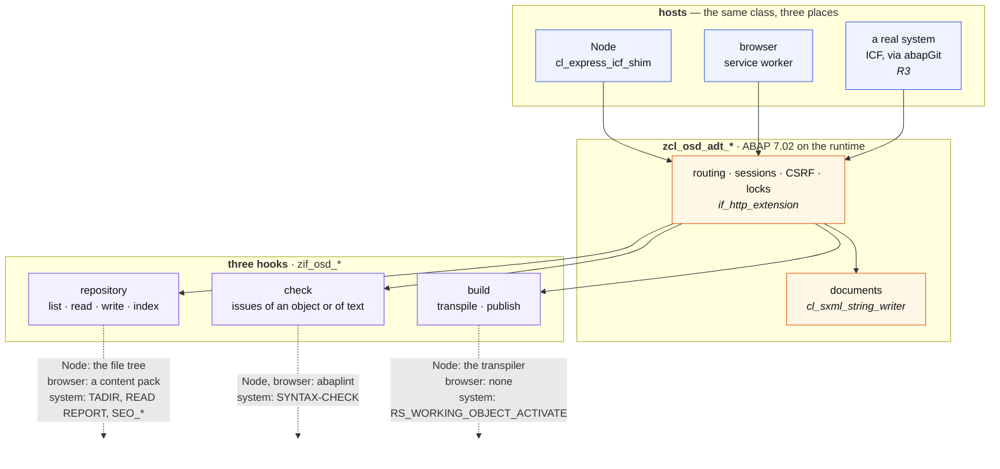
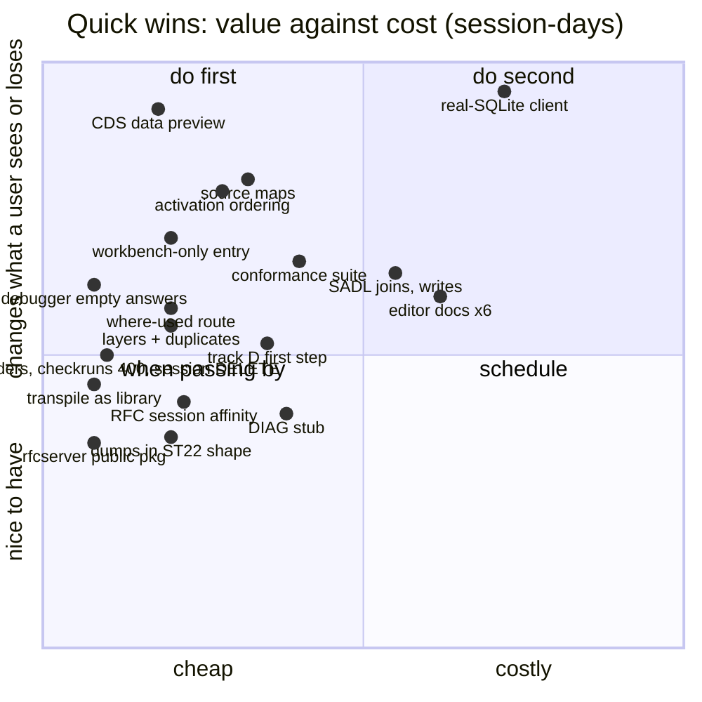
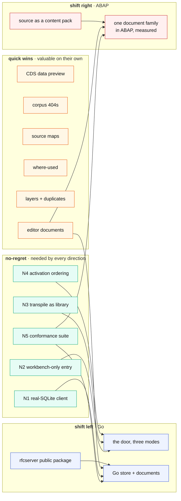

# Shift right, and no shift at all: the other two directions

[`adt-facade-shift-left.md`](adt-facade-shift-left.md) asks what moving the
ADT façade *left*, into Go, would gain. This report asks the two remaining
questions: what moving it *right* — deeper into the JavaScript binary, or
all the way into ABAP running on the runtime itself — could gain, and how
far right is sane; and what is worth doing with **no shift at all**, module
by module, out of what the repository already records as pending.

The two are connected, and the connection is the point: a small set of
changes is needed by *every* direction, and the rest of this document
ranks what to do after those. Measurements are from the tree at
`b75990d`, 2026-09-16.

---

## The axis

```mermaid
flowchart LR
  L2["<b>L2 · Go</b><br/>façade as a Go library<br/>and developer binary<br/><i>shift-left report</i>"]
  L1["<b>L1 · JS, its own process</b><br/>façade supervises the runtime<br/><i>osd-serve child, today's</i><br/><i>STG_SERVE=child</i>"]
  L0["<b>L0 · JS, one process</b><br/>façade and runtime together<br/><i>test/start.mjs, today's default</i>"]
  R1["<b>R1 · JS, one binary</b><br/>façade inside the osd<br/>Bun executable<br/><i>architecture-split's B-in-osd</i>"]
  R2["<b>R2 · ABAP on OSD</b><br/>if_http_extension handler,<br/>host hooks for files,<br/>check and transpile"]
  R3["<b>R3 · ABAP on a system</b><br/>the same handler, hooks<br/>mapped to RS_* APIs"]
  R4["<b>R4 · the repository as tables</b><br/>TADIR / REPOSRC in SQLite,<br/>abapGit-in-ABAP as the sync"]
  L2 --- L1 --- L0 --- R1 --- R2 --- R3 --- R4
  classDef go fill:#e6fcf5,stroke:#0ca678,color:#111
  classDef js fill:#eef3ff,stroke:#3b5bdb,color:#111
  classDef abap fill:#fff7e6,stroke:#e8590c,color:#111
  classDef far fill:#f8f9fa,stroke:#adb5bd,color:#495057,stroke-dasharray: 4 3
  class L2 go
  class L1,L0,R1 js
  class R2,R3 abap
  class R4 far
```

Two positions exist today and one is a packaging step:

- **L0** is what `test/start.mjs` runs: ABAP initialised at top level, the
  router in the same process, the parent's database connection injected.
- **L1** is `STG_SERVE=child`: the runtime in `osd-serve.mjs`, replaced on
  activation by `osd-runtime.mjs`. It is the shape both other reports build
  on, and it is not yet the default.
- **R1** is L0 compiled with `Bun.build({compile})` — the split document's
  "B, optional, same process". Nothing architectural changes; the question
  it answers is distribution, and it is backlog 1.3.

The interesting part of the right side begins at **R2**.

---

## Shift right: what is already there for it

The instinct to write the façade in ABAP is not eccentric in this
repository. It is the repository's founding rule: *the wire layer had to be
ABAP to run in a system's ICF*, so `$filter`, `$batch`, `$metadata`, the
JSON, the SEGW application, SADL and now a git client are ABAP classes
running on the transpiled runtime, behind `cl_express_icf_shim` on Node and
behind the service worker in the browser. Measured, the ingredients an ABAP
ADT façade would need are mostly on the shelf:

| ingredient | status |
| --- | --- |
| an HTTP handler contract | `if_http_extension`; `src/http/zcl_stg_http_handler` and `src/icf/zcl_stg_icf_demo` implement it; the same class serves under Node and under the service worker |
| an XML writer | `cl_sxml_string_writer` and `cl_ixml` in open-abap-core, with tests |
| git, in ABAP | `src/osd/git/zcl_osd_git` over abapGit's transpiled pack, delta and zlib classes: a clone happens inside OSD today with no git binary |
| ABAP written here, and how fast | 15,413 lines in 53 files; the SEGW application alone is 5,874 lines, written 2026-09-12 → 15 — about the pace the JS façade was written at |
| a precedent for ABAP on the system side | vsp's `ZADT_VSP`: an installed handler that gives vsp what ADT does not serve; `vsp install zadt-vsp` |
| a host-hook convention | `abap.W3MI_LOADER`: the runtime asks the host for what it has no file system for; `web/preview-backend.mjs` installs it |

What is **not** on the shelf is the same thing that stopped the left shift:
the object store is a file tree and the check is abaplint. An ABAP façade
does not read files and does not parse ABAP; it asks the host. So R2 is an
ABAP program with three hooks.

### R2: the façade as an ABAP handler with three hooks

The hooks are the whole design. Behind them, the program is routing and
XML — which, in the JS façade, is also most of the lines.

### What each level to the right would gain

| level | the gain | who wants it | the cost that is specific to it |
| --- | --- | --- | --- |
| **R1** JS in one binary | one file to ship; the split document already chose it | anyone installing OSD | none new; the recycle-versus-sessions question is L1's and is solved there |
| **R2** ABAP on OSD | **an ADT server inside a web page.** The preview already runs ICF handlers in a service worker; an ABAP façade there is a same-origin ADT endpoint with no server at all — the thing a browser-hosted editor would talk to. **Dogfooding**: the façade is a large XML-and-HTTP ABAP program, and every such program here has found runtime gaps (most of the 26 open anomalies were found by writing the gateway, SADL, the SEGW app and the git client). **One document library**: the XML classes are ABAP, so `ZADT_VSP` on a real system could carry the same documents for what a system's ADT does not serve. | the browser preview; the runtime's own test corpus; vsp's system-side handler | **7.02 syntax** for a protocol whose fidelity was won in 84 commits of byte-level iteration — with a 10-second transpile per iteration where JS reloads instantly. The repository hook in the browser means shipping the *source* as a content pack, which the preview does not do today. abaplint stays a host hook, so nothing is gained on the semantics side. |
| **R3** the same ABAP on a real system | **ADT where there is none.** The transpiler's input is ABAP 7.02, which is exactly the release band that has no ADT services; a 7.02 handler is deployable by abapGit to a system that Eclipse cannot otherwise open. Also: a custom ADT surface on any system, for objects or operations SAP's ADT does not expose. | owners of old systems; vsp, as a richer `ZADT_VSP` | the repository hook becomes the real thing — TADIR, `READ REPORT`, `SEO_CLASS_*`, locks in ENQUEUE, activation through the workbench APIs — which is a project of its own and has **no oracle here**: A4H is a modern release with ADT, and a 7.02 system to measure against would have to be found. |
| **R4** the repository as tables | OSD becomes system-shaped: where-used from tables, versions like REPOSRC's, SE80's model; the file tree becomes an export | a purist | it inverts the decision that makes OSD a git-native tool — [`adt-surface.md`](adt-surface.md), "the disk is the other editor". A file tree is what abapGit, git, an editor and a reviewer all already understand. |

### Verdict on the right

- **R1 is packaging, not architecture.** Do it when the binary is built
  (backlog 1.3); nothing here changes.
- **R2 has exactly two things worth wanting** — the in-browser ADT server
  and the shared document library — and both are had by moving the
  *documents* to ABAP, not the façade. So the honest experiment is small:
  **one document family in ABAP**, behind `if_http_extension`, served under
  Node and under the service worker, compared byte for byte with the JS
  generator by the same conformance suite the left shift needs. One or two
  sessions. If the runtime handles it without a new anomaly and the
  transpile loop is bearable, the second family follows; if not, the
  answer is measured rather than argued.
- **R3 is a research track with a real but niche payoff and no oracle.**
  Park it under the same rule as RAP and drafts: it starts when a system
  to measure against exists.
- **R4: no.** The file tree stays the truth.

Neither shift is where the next fortnight should go. What is, is below.

---

## No shift: the no-regret set

Five changes are prerequisites of the left shift, of the right shift, and
of nothing in particular — they fix things that are wrong or fragile
today. They are phase 0 of the left report, restated as their own list
because they should happen regardless of which direction is chosen, or
whether one is.

| # | change | why regardless of direction | size |
| --- | --- | --- | ---: |
| N1 | **a real file-backed SQLite client** over the eleven-method seam (`node:sqlite`, and `bun:sqlite` for the binary) | today the rows are sql.js in memory and the file is written **at exit**; a crash loses everything since boot, and a recycle is the only save. The DuckDB client (205 lines) is the template. Backlog 1.1 and B.7. | 3–5 |
| N2 | **the workbench-only entry point**: `STG_SERVE=child` becomes the default and `test/start.mjs` stops initialising ABAP at top level | it is the L1 shape both reports assume, and today it is opt-in; the preview's data path still boots the system inside the façade | 1 |
| N3 | **transpile as a library call**, not `npx abap_transpile` | the Bun binary has no `npx`; also removes a shell-out from the activation path | 0.5 |
| N4 | **activation ordering**: the inactive mark cleared only after the transpile succeeds; one activation at a time per tree | Astra's review named it; it is a correctness bug in today's code, not a design question | 1–2 |
| N5 | **the black-box conformance suite**: the 47 in-process requests re-expressed against a base URL, plus replay of the corpus | it is the only test that can compare two implementations, and it is also the only test that exercises the real listener, TLS and all | 2 |

Nine to eleven session-days. After them, L1 is the default, the rows
survive a crash, activation cannot lie, and any reimplementation — Go,
ABAP, or a refactor — has a referee.

---

## No shift: quick wins per module

The modules are the split document's. The sources are the repository's
own records: `docs/backlog.md` (tracks A–D and the standing list),
`ANORMALIES.md` (26 open), `docs/adt-surface.md` ("what it does not answer
yet"), and the oracle corpus (`.local/adt-corpus`, 2,180 exchanges, three
sides: `a4h`, `osd`, `vscode`). Size is in session-days at the pace
measured in this repository.

### B · the ADT façade

The corpus is the worklist, as track A says it should be. Across 2,180
recorded exchanges there are **exactly five operations the real system
answers and OSD refuses**:

| operation | A4H | OSD | fix | size |
| --- | ---: | ---: | --- | ---: |
| `POST datapreview/cds` and `GET datapreview/cds/<name>/metadata` | 200 | 404 | **the "Data Preview is not supported" dialog seen live on 2026-09-15** (A.3). The rows exist: 22 projections have generated SQL views, the SADL runtime has the rest. A wrapper. | 1 |
| `POST debugger/breakpoints`, with `debugger/listeners` | 200 | 404 | answer emptily (A.6): it stops the client retrying the second most frequent call of a session; debugging itself stays unimplemented | 0.5 |
| `POST repository/informationsystem/virtualfolders` (without `/contents`) | 200 | 404 | the same document as the served `/contents` route under the bare path | 0.25 |
| `POST checkruns`, 2 of 17 | 200 | 400 | read the two rejected requests; either a shape the parser refuses or a genuinely bad request from a cached client | 0.5 |
| `DELETE core/http/sessions/{id}`, 1 of 12 | 200 | 404 | a session the client thinks it has and the façade has dropped; answer 200 for an unknown id, as the real system does | 0.25 |

And the rest of track A, sized:

| item | what | size |
| --- | --- | ---: |
| A.1 | editor documents for **FUGR, MSAG, DOMA, TTYP, VIEW, SHLP** — in the tree and the search today, 404 when opened; `test/zosd-test.mjs` lists them; order by what a client opens first | 0.5–1 each |
| A.7 | **where-used**: `tools/osd-xref.mjs` already derives the cross-reference from the parse; the route (`usageReferences`) is the missing wire | 1 |
| A.5 | **session affinity over RFC**: the real client sends `sap-adt-connection-id`; the bridge gives every parallel connection its own token, which is right for reads and wrong for a lock-write-activate that must land in one context. Needed before writes over RFC are trusted | 1 (Go) |
| 2.6 | **dumps**: `runtime/dumps` is served; make it carry the runtime's actual errors in ST22 shape, so `vsp dumps --explain` works with no system | 1 |
| — | **the 86 observed differences** in the corpus comparison of the last review: most will be identities and timestamps; a session reading them finds the cheap ones | 1 |
| 2.10 | **a UI5/BSP object type** in the store, so a Fiori app is an object a client can deploy rather than files on disk | 1–2 |

### A · the runtime

| item | what | size |
| --- | --- | ---: |
| N1 | the real-SQLite client, above — the largest reliability gain on the list | 3–5 |
| B.1 | **SADL beyond one table**: associations in a projection, and `cds2ddic.mjs` says "joins are not supported yet" in its own code; a write path that is not the single-table case | 2–3 |
| B.6 | **MANDT**: fixed client 123 and no implicit `MANDT` remain first-order; the fix is an implicit-client option in the transpiler and is upstream work. Keep `T0009` visible in the demo until then | T |
| 8.6 | **source maps**, so a failure names the ABAP line and not the `.mjs` one — the single biggest quality-of-life item for anyone writing ABAP on OSD | 1–2 |
| 6.1–6.4 | gateway leftovers: `CREATE_STREAM` with a slug and deleting a media resource; deep insert through a projection; ETags on a projection; `@ObjectModel.readOnly` per element | 0.5 each |
| B.5 | multi-record framing: the continued-record length is inferred from single-record captures; one long answer from A4H settles it | 0.5 (A4H) |
| DEBT | three debts on the transpiler: the tree builds with a linked, unpublished transpiler; CI is pinned to an unmerged branch. Getting the releases out unpins both | T |

### C · the SEGW toolchain

| item | what | size |
| --- | --- | ---: |
| 5.4 | **generate into `src/` and register without a restart** — the recycle now exists (`store.publish()`), so this became cheap | 0.5 |
| 5.1 | the wizards SEGW has (import from DDIC structure, from RFC, redefine) — the editor's biggest usability gap | 1–2 |
| 5.2, 5.3 | node order by drag and drop (`STG_SEQ`); a text row created when none exists | 0.5 |
| 7.x | Include-of-another-model and a function import mapped to a module — blocked on an oracle project from A4H | (A4H) |

### D · the transports (open-rfc-go)

| item | what | size |
| --- | --- | ---: |
| — | **a public package for the RFC server** (`internal/rfcserver` today): half a day, and the precondition of mounting the bridge from anything else — the left shift, or a `vsp-osd` `main` | 0.5 |
| D.1 | **track D, first step**: the dispatcher already answers `STFC_CONNECTION` with typed parameters; make the function-module table generic, fed from the `*.fugr.xml` signatures the SEGW importer already reads | 1–2 |
| A.4b | `rfc call` uses the classic structure codec and stops at a recursive parameter; the client has the BASXML codec and the call path does not use it. Makes the bridge scriptable | 1 |
| C.4 | **the DIAG stub screen** ("Guru Meditation"): everything but the field item's byte layout is settled (`diag-notes.md`); one measured `DYNT_ATOM`, or the writer from the private sibling, and SAP GUI paints a screen | 1–2 (+ a capture) |
| B.5 | the long-answer capture, shared with the runtime row above | 0.5 |

### E · content packs, F · front, G · dev and ops

| module | item | what | size |
| --- | --- | --- | ---: |
| E | 1.5 | **layers**: an ordered list of source roots, and a duplicate object across roots is reported, not silently first-wins (the trap `CLAUDE.md` records for `local/o4d` and `local/vivid-vibes`) | 1 |
| E | 2.8a | AFF (`SAP/abap-file-formats`) as the metadata source for created objects — agreed, waiting for create, ~2 hours, with the abaplint-reads-XML-only caveat already known | 0.25 |
| F | 8.1 | e2e data isolation so the suites run in parallel again | 0.5 |
| F | 8.2 | the value-help spec that flaked once and was not reproduced | 0.25 |
| G | — | the **Bun packaging spike done properly**: the helper must load a namespaced module generated *after* it was built, on a machine without the checkout; Astra's gate, and the split document's open 1.6 | 1 |
| G | 1.2 | a `Bun.serve` adapter beside `express-icf-shim`, so the binary needs no express | 1 |
| G | — | **`refs/pull/*` purge** on GitHub after the history rewrite: only Support can do it; a ticket, not code | 0.1 |
| G | 8.4 | verification discipline: a built artefact is checked by content — a rule already written, worth a hook that enforces it on the preview build | 0.5 |

---

## The connected picture

And how the wins feed the shifts — what is shared, and what belongs to one
direction only:

Two things the map makes visible:

- **The conformance suite is the hinge.** It is what a Go port is checked
  against, what an ABAP document family is checked against, and what
  catches a regression in the JS façade with no port at all. It is the one
  item that every arrow leaves from.
- **The editor documents (A.1) are the natural place to run the R2
  experiment.** Six document families have to be written anyway; writing
  one of them in ABAP instead of JS costs the experiment nothing extra and
  answers the shift-right question with a measurement.

---

## Recommendation

1. **The no-regret set first**, N1–N5, about two weeks at the measured
   pace. It makes L1 the default, keeps rows through a crash, makes
   activation honest, and installs the referee.
2. **The corpus-driven façade fixes alongside** — the five refused
   operations are two session-days for a visibly better Eclipse, the CDS
   preview dialog first.
3. **Source maps and where-used** next: the two items that most change the
   experience of writing ABAP on OSD, three sessions between them.
4. **The R2 experiment inside A.1**: one editor document family in ABAP,
   measured by the suite. One or two sessions, and the right-shift question
   is closed by evidence either way.
5. **Then decide on the left shift**, with the suite in hand and the two
   estimates in [`adt-facade-shift-left.md`](adt-facade-shift-left.md) and
   [`architecture-split-astra.md`](architecture-split-astra.md) revised by
   what phase 0 measured.

What this order does not do is start a port. Both shifts are real options
with real gains — a static binary any ADT tool can run against, an ADT
server in a web page — and both are better decided after the two weeks
that improve the system whichever way it goes.

## See also

- [`adt-facade-shift-left.md`](adt-facade-shift-left.md) — the left direction, estimated
- [`architecture-split-astra.md`](architecture-split-astra.md) — its independent review
- [`architecture-split.md`](architecture-split.md) — the modules this ranks by
- [`backlog.md`](backlog.md) — tracks A–D and the standing list, the source of most rows above
- [`adt-surface.md`](adt-surface.md) — what the façade answers and refuses, and why the disk is the other editor
- [`diag-notes.md`](diag-notes.md) — what the DIAG stub still needs
