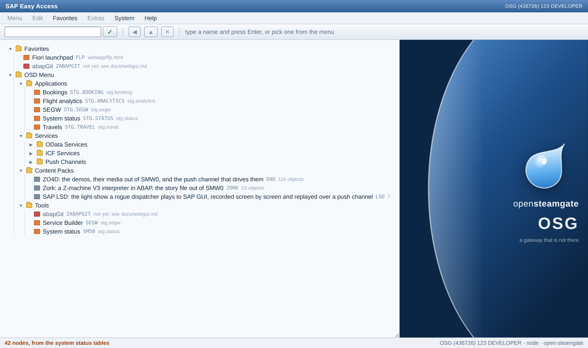

# SAP Easy Access, served by ABAP

`/sap/bc/gui/sap/its/webgui/` — the classic entry screen of a SAP system, on
this one, drawn by `ZCL_OSD_WEBGUI` (`src/webgui/`) out of what the system
actually serves. Launchpad tile "SAP Easy Access"; `test/webgui.mjs` and
`test/e2e/webgui.spec.mjs` are the tests.




*(The capture above is `docs/images/webgui.png`. The screenshot run that made it
also writes `.local/webgui/easy-access.png` and `easy-access-open.png`, the
second with every folder unfolded; those stay untracked.)*

## The path is the point

`/sap/bc/gui/sap/its/webgui/` is where the real ITS webgui answers on a real
system: SAP GUI in a browser. Mounting our entry screen there is a deliberate
nod and not an accident of naming, and the class says so in a comment. It costs
nothing, because nothing of SAP's is mounted anywhere near it: the node is one
`*.sicf.xml` of ours (`src/webgui/zosd_webgui.sicf.xml`) pointing at one class
of ours, served by `cl_express_icf_shim` like every other ICF service in this
tree (`tools/osd-icf.mjs`, `packs/lsd` is the other worked example).

The screen is the classic one, and is meant to be recognised as such: the blue
title bar with the system on the right, the menu bar, the command field with
its green tick and the standard buttons beside it, the folder tree with the
disclosure triangles, the tall image panel down the right-hand side with the
bulge in its left edge and the drop on it, the splitter between the two, and
the status bar at the bottom carrying the message.

Nothing on the page is scripted, and that survived G.1b. The folders are
`<details>`/`<summary>`, so they fold without JavaScript; the command field is
a GET form; a node is an anchor; the menu bar folds out on `:hover` and
`:focus-within`; the splitter is `resize: horizontal` on the tree pane. The one
trap this tree has paid for twice — a page written from ABAP in backtick
literals gets no escapes — does not apply, because there is nothing to escape.

## The drop, and the splitter, and the menu bar (G.1b)

**The drop** is drawn in the page as SVG and is deliberately *not* the SAP one:
the same idea — a glossy bead of water, tip and bulb, lit from the near side —
set on a diagonal (`rotate(38 60 60)`) instead of standing upright, so it reads
as a nod rather than as a copy of somebody's trademark. It sits on the deep
blue gradient field the panel already had. It is drawn in an SVG of its own
inside the wordmark block rather than in the stretched background, because the
background is `preserveAspectRatio="none"` and would squash a circle into an
egg the moment the splitter moved; the browser test asserts the drawing is
square and that the page fetched no image.

The shape's class is `bead`, and that is not cosmetic: it was `drop` for one
build, `.drop` is the menu bar's fold-out, `display:none`, and the filled path
was invisible while the outline beside it was not. It looked like a gradient
that had not applied. Verify a drawing by looking at it.

**The menu bar** works, as anchors, with no script: `System > Status` opens the
status app, `System > Log off` goes to the launchpad, `Favorites` lists what
the Favorites folder of the tree holds, and `Help > About` is a page of the
same class at `/sap/bc/gui/sap/its/webgui/about`. The two System targets are
**read off the node list** (`ZCL_OSD_WEBGUI=>TARGET`, by the node's name —
`SM50`, `FLP`), never written a second time, so the bar and the tree cannot
send you to two different places, and a test asserts the menu's `href` equals
the tree's own. Everything else is greyed and says so (`aria-disabled`, a
`title` saying it is not wired to anything), top-level entries included: a menu
that swallows a click silently is worse than one that admits what it cannot do.

**The splitter** is CSS. `resize: horizontal` on the tree pane, which does not
grow or shrink on its own (`flex: 0 0 auto`), so the width the drag writes is
the width that is used, and the image panel takes what is left
(`flex: 1 1 auto`). The handle is the browser's own grip in the pane's
bottom-right corner; there is no drawn splitter bar, because a bar that looked
draggable and was not would be exactly the pretending the menu was cured of.
The browser test drags the grip and asserts the tree lost what the panel
gained.

## What is on it, and where it comes from

Nothing in the menu is typed out. Everything below the four fixed folders is
read, in ABAP, out of the five status tables of `src/status/`:

| folder | table | filled from |
| --- | --- | --- |
| Applications | `ZOSD_SVC` where `KIND = 'APP'` | each app's own `manifest.json` |
| Services / OData Services | `ZOSD_SVC` where `KIND = 'ODATA'` | the `*.iwsv.xml` / `*.iwmo.xml` registration objects |
| Services / ICF Services | `ZOSD_SVC` where `KIND = 'ICF'` | the `*.sicf.xml` nodes |
| Services / Push Channels | `ZOSD_SVC` where `KIND = 'APC'` | the `*.sapc.xml` applications |
| Content Packs | `ZOSD_PACK` | `osd-pack.json` in every pack |
| the title and status bars | `ZOSD_SYS` + `sy` | the façade, and the boot |

Those tables are the system-status inventory, and the façade fills them from
one snapshot (`tools/osd-status.mjs`, `ZCL_OSD_STATUS=>REFRESH`). Reading them
rather than walking the tree a second time is the whole design: a menu that can
disagree with the system status is a menu that is wrong somewhere, and there is
only one list to be wrong. A service added anywhere in the tree appears on the
screen with no change to `src/webgui/`, and `test/webgui.mjs` asserts exactly
that by calling `servicesOf()` and `packsInfo()` and looking for every row.

Two things were added to that inventory for this, and they belong to it rather
than to the menu:

- **`ZOSD_SVC-TEXT`**, the name a human calls a service. Every source already
  carried it — `<DESCRIPTION>` in an IWSV, `<ICF_DOCU>` in a SICF node,
  `<DESCRIPTION>` in a SAPC application — and `servicesOf()` was dropping it.
  It shows up as a "Name" column in the system status app too.
- **`KIND = 'APP'` rows**, one per UI5 application. An app is a folder with a
  `manifest.json` in it: `webapp/` itself, every folder below it, and any pack
  that brings a webapp. `sap.app.id` is the component that answers, `title` is
  what it is called, and the path is the launchpad with the app's **own**
  inbound intent from `crossNavigation.inbounds` — not the folder, because
  `webapp/booking` has no page of its own at all and is only ever reached
  through the launchpad.

Because the screen reads the status tables, it needs them to be fresh, and only
the façade can make them so. The refresh that `ZOSD_STATUS_SRV` already paid for
is registered for this path as well (`test/start.mjs`, and `STATUS_SERVICE` in
`web/preview-backend.mjs` for the browser deployment). It has to be registered
*before* the SICF mount, because that mount answers the request instead of
passing it on.

## The status bar tells the truth, and the system has one identity

The bar used to print `OSG (1) 100 node`. The `(1)` and the `100` were literals
of the class, and underneath them this system had **four identities that
disagreed** (backlog G.1b):

| who | said | filled from |
| --- | --- | --- |
| the ABAP runtime | `sy-sysid ABC`, `sy-mandt 123`, `sy-uname USERNAME` | `@abaplint/runtime`, `builtin/sy.ts`, never set by us |
| the status table | `ZOSD_SYS-SID` = `OSG` | `STG_ADT_SID` or a default (`tools/osd-status.mjs`) |
| the ADT façade | `systemID OS2`, `client 001`, user `DEVELOPER` | `tools/adt-facade.mjs` |
| this screen | a session and a client | two literals |

There is one source now: **`tools/osd-identity.mjs`**. The boot sets `sy-sysid`,
`sy-mandt` and `sy-uname` from it — `test/setup.mjs`, which is the setup hook
every host of this tree boots the ABAP through (node, the binary, and the
service worker; in the browser there is no environment, so the build writes the
id into the bundle and `web/preview-backend.mjs` hands it over). The status
snapshot takes `ZOSD_SYS-SID` from the same function, and so does the ADT
façade. The screen then reads `sy` and prints what it finds:

```
OSG (436726) 123 DEVELOPER · node · open-steamgate
 |    |       |   |          |      root_hint
 |    |       |   |          host kind
 |    |       |   sy-uname
 |    |       sy-mandt
 |    the work process (ZOSD_SYS-PID)
 sy-sysid
```

**Two names, and why they differ.** `OSD_SID` is the runtime-facing id: what
the ABAP sees as `sy-sysid` and what the status service reports. `STG_ADT_SID`
is the ADT-facing one, what Eclipse sees, and it defaults to `OS2` rather than
to the runtime's `OSG`. That is not an oversight: an ABAP project stores the id
it was created against and refuses a logon to a system reporting another one
("Logon was not performed to the service instance of the project OS2, but to
service instance: OSD"), so renaming it locks the owner of a working project
out — which happened twice, and is why `tools/adt-facade.mjs` made the id a
constant in the first place. The same holds for the façade's client `001`,
which is also part of what a project was created against and of the session
cookie's name (`SAP_SESSIONID_OS2_001`), while the runtime's client is `123`
because that is the client the seed rows in `data/` are in. `STG_ADT_SID` still
renames both, exactly as it did before. `OSD_CLIENT` and `OSD_USER` are the
other two knobs, and `OSD_CLIENT` moves `sy-mandt` away from the seeded rows,
so it is for experiments rather than for a working tree.

**The session number is a work process.** This system has no sessions; it has
work processes, so the work process is what goes where SAP GUI prints the
session. `ZOSD_SYS-PID` is new, and it is the process the status tables were
*written in* — the façade itself when it holds the ABAP inline, and otherwise
the child the snapshot is posted to, which is the one the proxy forwards the
request to. A deployment with no process number (the browser one: a service
worker is not a process anybody can number) prints the system without the
parentheses rather than printing a zero that looks like a session.

The tests assert the bar against the *other* source rather than against a
string: `test/webgui.mjs` and `test/e2e/webgui.spec.mjs` read `SystemSet`
through `ZOSD_STATUS_SRV` and require the bar to carry that `Sid` and that
`Pid`, and the ABAP unit test asserts `identity( )` equals `sy` and that `sy`
is no longer the runtime's `ABC` / `USERNAME` — a bar compared with a literal
would only prove that two literals match.

## A node has a kind

```
FOLDER       a branch, no target of its own
APP          a UI5 application, opened at the intent its manifest declares
SERVICE      an OData service, an ICF node, a push channel, a pack
TRANSACTION  something the system runs rather than something it links to
```

The kind is part of the model (`ZCL_OSD_WEBGUI=>GC_KIND`, carried into the HTML
as `data-kind`), not something the renderer guesses. `TRANSACTION` nodes come
from the `*.tran.xml` objects of the layers since G.3 (below), and a runnable
one is entered rather than linked to: the Tools folder has one per transaction
the tree declares, and `ZABAPGIT` is the single node this class still types out.

That is where this is going. abapGit should arrive as a transaction — you type
its name and the system runs it — rather than as a bespoke page with a URL of
its own, because that is how a system works; G.3 built the seat and G.4 is the
closure.

## The command field

The command field is the second way in, beside the tree, and it is resolved on
the **server**, against the same node list the tree is built from
(`ZCL_OSD_WEBGUI=>RESOLVE`), so the field and the tree can never send you to two
different places.

- `/n` and `/o` in front of a code are stripped the way SAP strips them, and the
  code is upper-cased and condensed.
- A node is matched first by its technical name (`ZSTG_DEMO_SRV`, `ZORK`,
  `STG.TRAVEL`), then by the name it is called by (`Travels`, `System status`),
  so both work.
- A match with a target answers `302` to that target. A match without one (a
  push channel has no page) comes back with the reason in the status bar.
- An unknown code comes back as `Transaction ZNOPE does not exist`, which is
  the message SAP puts in the status bar.
- A `TRANSACTION` node is **entered**: the screen comes back with what the
  transaction drew where the tree was, and one that cannot be entered here
  comes back with the reason (below).

The form is a GET, so the shim hands the query string on as it arrived and the
field is decoded in the handler: a browser sends a space as `+` and the rest
percent-encoded, and "System status" has a space in it.

## A transaction node runs (G.3)

`ZOSD_NOTE` on the screen, or typed into the command field, starts a
transaction: the tree pane is replaced by what the transaction drew through
the GUI substitutes, a click in it comes back as `sapevent`, and what was
typed in the first request is still there in the second. Three pieces do it,
and only the third had no precedent in this tree.

### 1. The registry: a transaction is a `*.tran.xml`, and it names a class

A transaction code is an object of the tree like every other route here, and
abapGit already serialises it, so nothing is invented:
`tools/osd-tran-registry.mjs` reads `*.tran.xml` out of the input layers the
way `tools/osd-icf.mjs` reads `*.sicf.xml` and `tools/segw-registry.mjs`
reads `*.iwsv.xml`, and writes `gen/tran/zcl_osd_tran_registry`. The layer
order applies (backlog E.1): the later folder wins a transaction code, and a
pack that brings a transaction brings it with no change here.

**What "runnable" means, and why.** SE93 has one form that names something
this system can actually enter, and it is the one SAP calls a *transaction
with class method*: `TSTCP-PARAM` = `\PROGRAM=…\CLASS=…\METHOD=…`, which
`zcl_abapgit_object_tran` writes and reads (`split_parameters`,
`c_oo_class` / `c_oo_method`). So the rule is:

> A transaction is runnable here when its `TSTCP-PARAM` names a class, the
> class is in the tree, and the class implements `ZIF_OSD_TRANSACTION`. The
> `METHOD` of the entry is the interface's, so the tran object names the
> class and the contract names the method.

Everything else is listed with the reason it cannot run, and the reasons are
measured rather than assumed:

| form | what it names | verdict |
| --- | --- | --- |
| `\CLASS=ZCL_X\METHOD=…` + the class implements the interface | a class of this tree | **runs** |
| `\CLASS=ZCL_X\METHOD=…`, class absent or not implementing it | a class this tree does not have | refused, named |
| `TSTC-PGMNA` = a report, no `TSTCP` | a report | refused: *the transpiler's `SUBMIT` throws* |
| a dynpro number in `TSTC-DYPNO` | a screen | refused: there is no dynpro processor here |

The `SUBMIT` line is not an opinion: `packages/transpiler/src/statements/
submit.ts` is one `throw new Error("Submit, transpiler todo")`, and
`call_transaction.ts` is a no-op. A report transaction that "ran" would
either die or silently do nothing, so it is refused with that sentence in
the status bar, which is more than "not runnable yet" ever said.

`ZABAPGIT` stays the one typed-out transaction node of `menu( )` — the seat
G.4 will sit in — and it is now honest about what it is: this tree carries
no `zabapgit.tran.xml`, and both the node and the status bar say so. That
last part is a bug the browser test caught and the wire test did not: typing
`ZABAPGIT` answered *"Transaction ZABAPGIT does not exist"* about a node
visibly in the menu, because the registry is what `start( )` asks and the
registry has nothing for it. `ty_step-known` tells "no tran object" from "no
such code", and the screen prints the node's own detail for the first. The
wire test had asserted the string against the **page**, where the node's
detail sits in the tree either way, so it passed over a status bar saying
the opposite — the false-green shape this tree has a rule about. Both tests
read the bar now. Every other transaction on the screen comes from the
registry.

**The dispatcher is generated**, one `WHEN` per runnable transaction doing a
static `CREATE OBJECT`, for the same reason `zcl_osd_fm_call` is generated
(`docs/rfc-channel.md`): nothing dynamic reaches a report here anyway, and a
generated `CREATE OBJECT` is a name abaplint checks. A transaction whose
class the generator cannot see gets no `WHEN` at all — the door is not
locked, it is not built.

### 2. Running it: `page( iv_body )`, and the screen around it

`page( )` used to hard-wire the left pane to `branch( )`. It now takes
`iv_body`, and the tree is what it renders when nobody passed one, so a
running transaction has somewhere to put its markup and the screen keeps its
title bar, its menu, its command field and its status bar around it.

One dialog step, in `zcl_osd_tran`, is the dynpro cycle and is written as
one:

```
roll in    the state string of the session row (empty on the first step)
PBO        zif_osd_transaction~pbo( ) builds the controls: a container, a
           cl_gui_html_viewer, the document, SET HANDLER for sapevent
PAI        cl_gui_html_viewer=>dispatch_sapevent( query, body, transport )
           raises the event on that viewer; the transaction's own handler
           changes its own state.  (Not on the first step: nothing was
           clicked yet)
PBO        cl_gui_control=>clear( ) and pbo( ) again, so what is rendered is
           the state after the click rather than before it
render     cl_gui_control=>render_html( iv_document = abap_false
                                        is_sapevent = transport( sid ) )
roll out   zif_osd_transaction~roll_out( ) back into the session row
```

The transport is `cl_gui_control=>ty_sapevent` with one field of its own:
`osdsid`, the session id. `render_html` writes it as a hidden input into
every rewritten form and `dispatch_sapevent` strips it back out before the
event is raised, which is exactly what `ty_sapevent-fields` is for — so the
session travels in the document and the transaction never sees it.

### 3. The state between two requests: a row, not a process

**The decision: a row in `ZOSD_TSES`, keyed by a session id, holding the
string the transaction rolled out.** Not a pinned work process.

Both designs were weighed against four things that actually happen here:

| | a pinned process | a row keyed by a session id |
| --- | --- | --- |
| the browser preview | there is no pool: one service worker, one thread. A pin is a no-op, so the design would exist only on Node and the preview would need a second one | the table is in the same sql.js database as every other table, and the code is the same code |
| a recycle mid-conversation | the supervisor replaces a runtime after a build, and class data goes with it. The next click lands in a process that never saw the first, and nothing says so — it just starts over | the row is in the database file the processes share (WAL: readers do not block). A new process resumes the session |
| two browsers at once | needs the pin to be *correct*, i.e. a cookie or a sticky route through the proxy, and `RuntimePool.next( )` is round-robin: HTTP goes to the primary today, so the pin does not exist yet and would have to be built | two ids, two rows. They cannot see each other because the id is the key |
| nobody comes back | a process cannot expire anything; it forgets when it dies and holds the memory until then | `TOUCHED` is a column, so expiry is `cl_abap_tstmp=>subtract( )` against a TTL, and a sweep on every start clears what nobody came back to |

`ZOSD_SYS-PID` is what makes "which process answered you last time"
answerable, and the session row records it (`ZOSD_TSES-PID`) — not to route
by it, but so that a session that moved between work processes is a visible
fact rather than a mystery. That is the use the pin argument had left once
the row won.

**What this gives up, and it is not nothing:**

- **No live object graph between steps.** The state has to survive
  `/ui2/cl_json=>serialize`, so a transaction cannot hold a reference to
  anything across a dialog step — no open cursor, no handle, no lock. A real
  system's roll area keeps the objects; this keeps a string. A transaction
  that needs more than a string will need a different answer, and that is a
  real limit rather than a rough edge.
- **A serialize and a deserialize per dialog step**, plus one SELECT and one
  UPDATE. Nothing measurable at this size, and it is work a pin would not do.
- **No affinity.** Nothing may rely on a process-local cache surviving the
  step, which is true of everything else on the HTTP path here anyway.
- **The controls are rebuilt every step**, because `cl_gui_control`'s
  snapshots are class data that `clear( )` wipes. That is closer to a real
  PBO than keeping them would be, but it means a control's own internal
  state (a scroll position, a selection) lives only as long as the request
  unless the transaction rolls it out itself.

The session id is `cl_system_uuid=>if_system_uuid_static~create_uuid_c32( )`,
the TTL is 30 minutes of idle (`zcl_osd_tran_session=>gc_ttl_seconds`), and
an expired or unknown id does not half-work: the step is refused, the screen
comes back with the tree in it, and the status bar says the session is gone.
`start( )` sweeps whatever is older than the TTL, so a system nobody visits
does not accumulate rows.

### The demonstration transaction

`ZOSD_NOTE`, "Session notepad" (`src/webgui/zcl_osd_note`,
`src/webgui/zosd_note.tran.xml`): a field, an Add button and the list of
what was added, drawn as HTML into a `cl_gui_html_viewer` and clicked back
through `sapevent`. It is deliberately the smallest thing that proves the
loop rather than a useful tool: the value typed in request one is in the
list in request two, the dialog-step counter it prints is the session's, and
a second browser gets its own id and its own empty list. It is not abapGit
— that is G.4, and it is a build decision rather than a screen.

## Where the GUI substitutes come from

[`open-abap-gui`](https://github.com/open-abap/open-abap-gui), wired in as a
**library** and not as a pack, because it is SAP-namespace shim code exactly
like `open-abap-core` and the pack/delta half of abapGit: it is the substrate a
program compiles against, not content this system serves.

- URL: our fork, `https://github.com/oisee/open-abap-gui`; folder
  `.local/lars/open-abap-gui`. Upstream `main` is at **`ed96e89`** ("update",
  #162); the folder is on the fork branch **`html-viewer-sapevent`** at
  **`0324e1c`** (two commits on top of `ed96e89`: the `sapevent` raise, and
  `show_url` showing what `load_data` loaded), which is what the preview
  workflow pins (`OSD_GUI_REF`) and what "How close" below describes.
- Declared in `abap_transpile.json` (libs) and `abaplint.jsonc` (dependencies).
- **Only `/src` comes in.** The repository also carries `/scaffold` — 162
  example programs and a dynpro host of its own — and `/test`, and neither
  belongs in this build.
- **Three files under `/scaffold` are the exception**, named one by one:
  `zcl_gg_context_menu_state`, `zcl_gg_host_html`, `host/zcl_gg_host_surface`.
  `/src` refers to them by name — `cl_ctmenu` and `cl_gui_toolbar` keep their
  items in the first, the tree and grid controls render through the third,
  which asks the second for a CSS class — so they are closure and not example.
  They would be library files upstream; naming them costs three lines and keeps
  the other 159 out.

**What it cost, measured before and after:** 1173 objects → 1474, so **+301**.
That is exactly `/src` plus the three: 117 classes, 16 interfaces, 11 type
pools, 73 structures, 50 table types, 31 data elements. Nothing from the
examples, nothing from the test tree. (`ZCL_OSD_WEBGUI` and its two test classes
took it to 1476.)

The screen uses the library for real rather than only compiling against it:
every piece of text on the page is escaped by `cl_gui_control=>escape_html`, so
the class that will escape abapGit's HTML escapes this screen today. A library
nothing calls is a library nobody notices has stopped building.

## How close the substitutes are to carrying abapGit

**Both halves are there now** (2026-09-18, backlog G.2). What follows is what
each half is, and where the seam between them runs.

`cl_gui_html_viewer` is a real substitute, not a stub. It has `load_data`,
`show_data`, `show_url`, `close_document`, a document history behind
`go_back`/`go_forward`/`do_refresh`, and it declares `sapevent` with the full
five-parameter signature abapGit's handler is written against (`action`,
`frame`, `getdata`, `postdata`, `query_table`), the last two on the `CNHT`
types SAP declares them with. `cl_gui_control` renders a registered viewer
into a sandboxed `<iframe srcdoc=...>` and rewrites what the document would
send to SAP GUI into forms that post to a transport the caller names
(`ty_sapevent`: a url, the name of the field that carries the action, hidden
fields of the caller's own):

- `<a href="sapevent:ACTION">` becomes a form whose submit button carries
  `ACTION` under the action field, as before;
- `<form action="sapevent:ACTION">` and a submit button's
  `formaction="sapevent:ACTION"` — which is how abapGit's forms are written
  (`zcl_abapgit_html_form=>render`) — are pointed at the transport with the
  action in the url's query string, so the body stays exactly the document's
  own fields;
- every rewritten form carries a hidden `gg_control` naming the viewer it
  belongs to, and forms posting somewhere else are left alone.

The return leg is `cl_gui_html_viewer=>dispatch_sapevent`: whoever answers the
transport's url hands it the query string, the body and the same transport; it
finds the viewer by `gg_control`, strips the transport's fields, and raises
`sapevent` on that viewer, so `SET HANDLER ... FOR EVENT sapevent OF
cl_gui_html_viewer` runs. The parameters are filled the way the frontend
fills them, **measured against the consumer rather than the frontend**,
because the frontend was not available and the consumer is strict
(`zcl_abapgit_gui_event`, which is the only reader abapGit has):

- `action` is the url before `?`, as written (abapGit lower-cases it);
- `getdata` is the text after `?`, untouched — abapGit undoes the escapes it
  expects there itself (`%3A %3F %3D %2F %23 %25 %26`);
- `postdata` is the form's `name=value` pairs joined with `&`, in lines of
  256 characters filled to the end, the last line carrying the rest, the
  text as typed with only `%`, `&` and `=` escaped. abapGit redeclares the
  table with 256-character lines and converts line by line
  (`zcl_abapgit_html_viewer_gui=>on_event`), joins the lines `RESPECTING
  BLANKS` except the last, and undoes exactly those escapes; a wider fill
  would lose the tail of every long form in abapGit, and it does not lose it
  on real systems. The line width SAP GUI itself fills is the one number
  nobody has measured; it is one constant (`c_post_data_chunk`);
- `query_table` is the same parsed, unless the viewer was constructed with
  `query_table_disabled`, which abapGit does.

The library's own tests drive both halves on a synthetic page
(`cl_gui_html_viewer.clas.testclasses.abap`, `ltcl_sapevent`, five tests:
an anchor with a query, abapGit's form shape with a side action, the line
fill, an unknown viewer, a foreign form), and its browser spec of the HTML
viewer example (`zcl_gg_ex_151`) still passes through the scaffold host,
which keeps folding the click into its own `gg_action` dispatch and ignores
the extra hidden field. `src/webgui/zcl_osd_webgui.clas.testclasses.abap`
keeps the original synthetic-anchor probe as part of `npm run unit`.

One more thing the real flow found: abapGit shows a page by `load_data`
without a url, which assigns one, then `show_url` of the assigned url
(`zcl_abapgit_gui=>cache_asset`, `render`). The substitute overwrote the
document with the url's text at that second step, so the frame read
`abapgit.html`. It now keeps what `load_data` loaded under the url it got
and resolves `show_url` and `show_data` from that
(`ANOMALY-2026-09-18-html-viewer-show-url`).

The rest of what abapGit touches looks better than I expected. There are 31
`todo, implement method` stubs in `/src` and no `ASSERT 1 = 'todo'` at all, and
the stubs cluster almost entirely in the SALV form-layout classes
(`cl_salv_form_*`, 20 of the 31) — not in the container, viewer or
frontend-services path abapGit's UI actually walks. `cl_gui_custom_container`,
`cl_gui_dialogbox_container`, `cl_gui_docking_container`,
`cl_gui_splitter_container` and `cl_gui_frontend_services` are all implemented
rather than declared. Whether abapGit *runs* is of course a different and much
larger question than whether its screen draws — it wants DDIC serializers, a
transport layer and a hundred SAP APIs this tree does not have — but the GUI
layer is not the thing that will stop it.

## The click comes back: proven, and against what

The round trip was proven 2026-09-18 at
`/sap/bc/gui/sap/its/webgui/sapevent/` (`src/webgui/zcl_osd_sapevent`, a
proof harness that says so in its header, and the seed of what a transaction
node needs: controls drawn into a page, the click coming back as an event).
`test/sapevent.mjs` plays the browser by hand and `test/e2e/sapevent.spec.mjs`
lets Chromium click inside the sandboxed frame; both end in the JSON the
harness answers a POST with, which is what abapGit's event class made of the
click.

What is real on that path, and what is not, because the distinction is the
proof:

| piece | status |
| --- | --- |
| `zcl_abapgit_html_viewer_gui`, abapGit's wrapper of `cl_gui_html_viewer`, constructed as abapGit constructs it, re-raising `zif_abapgit_html_viewer~sapevent` | real, from abapGit |
| `zcl_abapgit_html`, which writes every sapevent anchor abapGit has (`href="sapevent:select?key=…"` plus its `data-sapevent` marker) | real, from abapGit |
| `zcl_abapgit_gui_event`, the object `zcl_abapgit_gui=>handle_action` builds first, and its `query( )` / `form_data( )` | real, from abapGit |
| `cl_gui_html_viewer=>dispatch_sapevent` and the raise | real, the fork branch |
| `zcl_abapgit_gui=>on_event` | absent: three lines calling `handle_action`, whose first act is the `CREATE OBJECT` the harness repeats; the rest is the router and the pages |
| the "New Online Repository" form | **copied**: `zcl_abapgit_html_form` reaches `zcl_abapgit_ui_factory` and with it all of abapGit, so the harness writes the markup that class writes (the `<form>` with the main command as its action and a hidden submit, side actions as submits with a `formaction`) with the field ids and events of `zcl_abapgit_gui_page_addonline`, and says so |

Measured on the way: `zcl_abapgit_gui` reaches **371 of abapGit's 592
objects by name** (`node tools/osd-closure.mjs .local/lars/abapgit/src
zcl_abapgit_gui`), through `zcl_abapgit_exit` and the UI factory, and so does
any page class; the three real pieces above reach 17, 6 and 7. abapGit's own
CI transpiles the whole tree against open-abap-core, **open-abap-gui**,
open-abap-seo, express-icf-shim and `abapGit-web-classic` with
`unknownTypes: runtimeError` (`test/abap_transpile.json` there), and serves
it through `zcl_abapgit_web_sicf` (`test/express.mjs`), which passes the raw
POST body into `postdata` with a `todo, parse and pass data` beside it. So
"abapGit renders" is not blocked by the GUI layer or by the closure as such;
it is blocked by this tree building with `compileError` and layering only
the pack/delta half of abapGit. That is G.4's lift, and now a measured one.

What the proof asserts, concretely: a repository's anchor comes back as
`action = select`, `getdata = key=000000000002`, `query( ) = {KEY: …}`; the
form comes back as `action = add-repo-online` with `postdata` holding the
document's fields only (`url=…&package=$OSD&…&display_name=open steamgate
%26 friends, 100%25 offline&folder_logic=PREFIX`, none of the transport's),
and `form_data( )` holding the typed values under abapGit's upper-cased keys;
a side action's `formaction` is its own event; a 700-character value fills
256-character lines and abapGit joins them back; a POST naming no viewer is
not dispatched. State between the GET and the POST is class data of the
harness — one document per process, which is enough for a proof and is
exactly step 3 above.

## Tests

```
npx mocha test/webgui.mjs                          # the path, the tree, the command field, the bar, the menu
npx playwright test test/e2e/webgui.spec.mjs       # it renders, a node navigates, the field works, the splitter moves
npm run unit                                       # ZCL_OSD_WEBGUI: the ok-codes and the sapevent rewrite;
                                                   # ZCL_OSD_TRAN_SESSION: the session store and its expiry
npx mocha test/sapevent.mjs                        # the round trip against abapGit's markup, browser played by hand
npx playwright test test/e2e/sapevent.spec.mjs     # the same, Chromium clicking inside the frame
npx mocha test/transaction.mjs                     # the transaction runs and keeps its session, browser by hand
npx playwright test test/e2e/transaction.spec.mjs  # the same in Chromium, and two browsers at once
node tools/osd-tran-registry.mjs --list            # what the *.tran.xml objects of the layers declare
```

`ltcl_session` is where expiry is tested and that is not an accident: only
ABAP inside the system can write a row that was last touched thirty-one
minutes ago, and waiting for the real timeout is not a test. The wire test
covers the half a browser can reach — an id this system does not have — and
the two are the same message, because a swept row and a made-up id look the
same from outside.

`test/sapevent.mjs` is in `npm run integration`. The fork's own tests of the
two halves run with `npm run unit` in `.local/lars/open-abap-gui`.

`test/webgui.mjs` is in `npm run integration`. The browser test does not assert
a status code: it opens folders, reads a node, clicks it and follows where it
goes, types names into the command field, folds the menu bar out with the mouse
and with the keyboard and follows `Help > About` and `System > Status`, drags
the splitter, and reads the status bar back against the status service.
